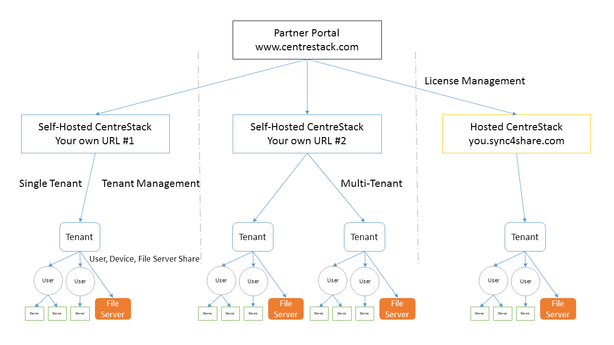

##############################
3 Administration Scope
##############################

**********************
3.1 Management Scope
**********************

In the |prodname|, objects that can be managed are defined in the following picture.
You can manage objects at different levels from one single management portal. 

********************
3.2 Partner Portal
********************

The Partner Portal is used primarily for managing licenses and licenses distribution among all your Servers. 

The partner portal is located at http://www.centrestack.com. From the Partner Portal you can download the |prodname| software as well manage the licensing of your Servers.

.. tip::

    Typically you will download the |prodname| software, set it up and leverage the built-in 30 day trial time to finish the setup. Towards
    the end of the trial, you assign licenses from the partner portal to your
    Server and activate it into production.

Both Self-Hosted Servers and Hosted CentreStack Tenants (sync4share) can be managed via the Partner Portal.

*******************************************
3.3 Self-Hosted |prodname|
*******************************************

In the User Interface, the Self-Hosted |prodname| instance is referred to as a Cluster. A Cluster can be as small as a single Server or scaled out to include multiple Servers in a server farm.

**Hosted CentreStack**

In the Partner Portal, you can also manage tenants which are hosted by CentreStack (sync4share).
This document doesn't cover Hosted CentreStack. Please refer to the Hosted
CentreStack Administration Guide for more information on hosted options.

**Tenants**

In a |prodname| management interface, most of the time you are managing tenants. 
It can be a single tenant when deployed for a single company. Or it can be
multiple tenants. A tenant is a management and billing scope that includes a number of users
and a specific amount of storage. It normally maps to a company or a client of yours.

**Users, Devices, File Server Shares**

In each tenant, the objects you manage include Users and Devices as well as File Server
Network Shares for Team Folder collaboration (Team Shares).

This document is focused on the management scope for a Self-Hosted |prodname|
In the server management interface, there are two administration scopes. Cluster Administrator and Tenant Administrator.

***************************
3.4 Cluster Administrator
***************************

The Cluster Administrator can manage cluster-wide functionalities, such as email SMTP server setup and worker node
properties etc. 

In the Deployment Guide, the Cluster Administrator is often referred to as the Master
Admin, Root Admin or just Server Administrator. Even though the Cluster Server Farm can have multiple Servers, 
most of the time, a one-server-farm is sufficient for your use case and your user base.

**************************
3.5 Tenant Administrator
**************************

Tenant Administrator can manage Tenant-Wide functionalities, such as Group Policies. 
The Cluster Admin is 
also a Tenant Admin for the very first Tenant (Default Tenant) so the Cluster Administrator manages both Cluster Administration and Tenant Administration. 
In the multiple-tenant case, each Tenant Administrator will be responsible
for the Tenant’s own administration scope.

The Cluster Administrator by default can help each Tenant Administrator manage at the tenant level.

In real world scenarios, the tenant is often mapped to an organization; a client of an MSP or a customer that has many employees.

There are two icons related to cluster administration and tenant administration:

* Cluster Manager icon               

    .. image:: _static/image_s3_4_0.png

* Tenant Manager icon    

    .. image:: _static/image_s3_4_1.png
    
.. hint::

    Tenant(s) usually map to your organization or client.
    
    If you are logged in as the Default Cluster Admin, you will manage the 
    tenant level scope from the "Tenant Manager" instead of using the 
    "Tenant Manager icon".

.. note::

  1: All the administration work is performed via the web portal inside a web browser. Recommended browsers include Google Chrome first, followed by Firefox, Internet Explorer, Safari and Opera. (Internet Explorer requires version 9 and above and includes Microsoft Edge Browser)

  2: The very first user who installed the Cluster Server is also the Cluster Admin and Tenant Admin for the Default Tenant. In order for the Cluster Admin to be familiar with the tenant functionality, the Cluster Admin
  is provided a small 3-user default account (Tenant Account).
  
  3: You can start the administration work at any time by pointing your
  web browser to the Cluster Server's IP Address or DNS name. If you are on the 
  Cluster Server console, you can even use http://localhost to get started.
