########################
4 Cluster Administration
########################

******************************
**4.1 The Basics**
******************************

To access your Cluster Administration features, log in to the Web Portal on the server. **The description in this guide presumes that you are signed in as the Master Administrator** (aka., Cluster Administrator, Server Administrator). Some of the options listed may not be available if you are logged in with different permissions (e.g. Delegated Administrator). In this document the |prodname| will also be referred to as simply, Cluster Server. 

.. tip::

    The Web Portal URL is the server’s DNS name, the IP Address or local host if you are on the server console. 

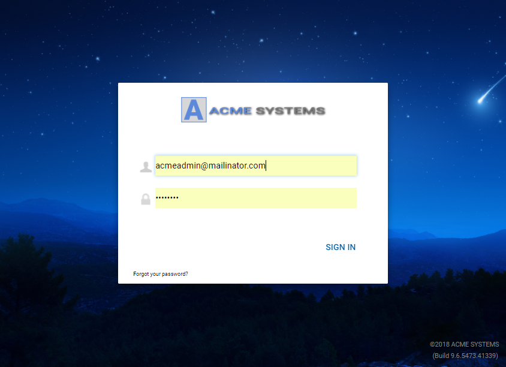

**LOGIN SCREEN**

.. note::

    At the bottom of the Login screen, there is version information, which will be useful to see which version you have installed. 

    
The following graphic describes the various icons and components of the Administrator Dashboard and its sub sections. Please refer to it as you read this guide to determine how to access various features.

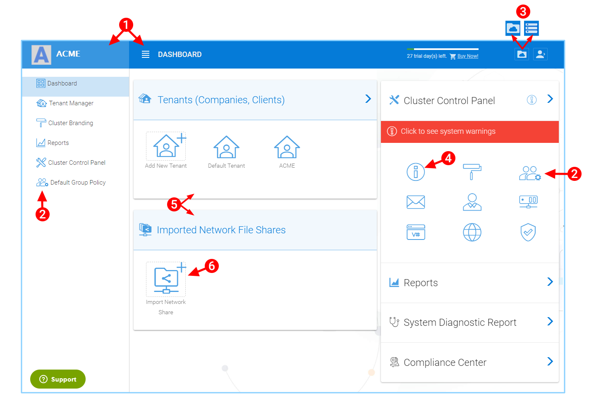
    
**CLUSTER MANAGER DASHBOARD**

After logging in, you will see the Cluster Manager Dashboard. The small “hamburger” ☰ menu icon **(1)** in the top left corner of this portal page will toggle the reveal of the left-side menu. 

Some of the features can be accessed several ways; for instance, you can see the **Default Group Policy** icon **(2)** in both the left-side menu and the Cluster Control Panel on the right side (or top side) of the Dashboard. 

By clicking the folder icon **(3)** In the top right of the interface you can toggle between the File Browser and Cluster Manager views.  The **File Browser** (My Files) view of the interface gives you access to your shared and unshared folders. This is also where you can create folders and upload files and folders for access. When the cluster administrator clicks the folder icon to get into the files and folder's view, the files and folders belong to the 
default tenant. 

.. note::

    the cluster administrator will not be able to access files and folders that are not in the scope of the default tenant. In order to access files and folders that belong to a specific tenant, the web portal login has to be 
    that of the tenant. So basically the cluster administrator can do administration work for a tenant that is under management. However, it is not easy for the cluster administrator to see the files and folders for that 
    specific tenant until he/she gets the permission and the login credentials.

The Cluster Manager (aka., Dashboard) allows you to manage Tenants, Cluster Branding, Reports, Cluster Control Panel and Group Policies. 
If you need to know the version and cluster ID information for your Cluster Manager installation, this can be accessed by clicking the “i” **(4)**. The following image represents the Cluster Info pop-up window. 

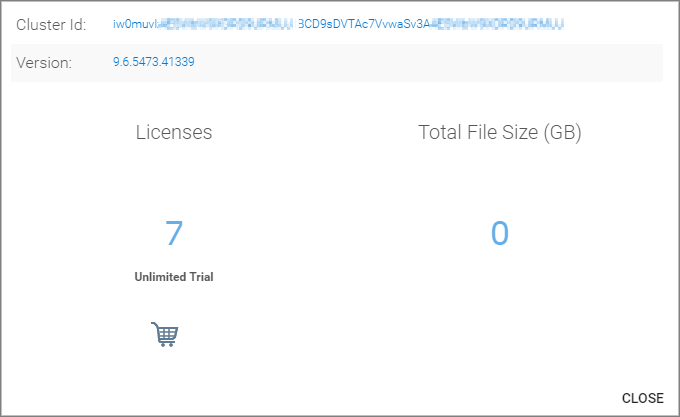
    
**CLUSTER INFO**

In the center of the Dashboard screen, you can access your Tenants (Companies, Clients) and system reports.

.. note::

    At a high level, the |prodname| web browser management interface allows you to manage clients (Tenants) and the overall
    system performance and statistics reports.

        
**EXTERNAL DNS WARNING**

At the top left corner of the cluster dashboard (5), if you see a warning icon, it is the external dns warning indicating the external dns name is not 
setup yet.

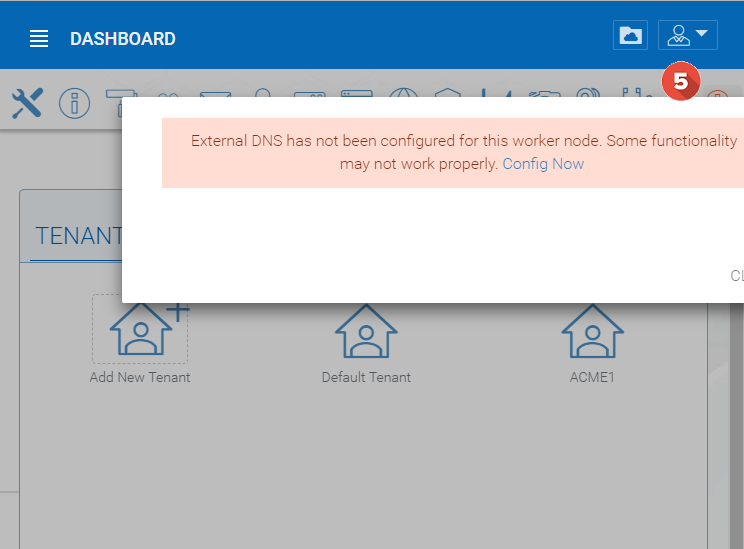
    
External DNS (External URL) is a very important property. It is used in directing how outside remote clients connect to the Cluster Server. It is also used in various email templates. If this property is not properly configured, the email template may be using IP address or NETBIOS name as the URL link.
    
To configure this setting, you must have a DNS name and SSL certificate setup; therefore, you can postpone the configuration of your DNS until you are ready.

**Related tasks**
     
    *  Configure the DNS registration to point a DNS name to the public static IP address of the Cluster Server.
    *  Configure the IIS “Default Web Site” to bind to an SSL certificate.

******************
4.3 Tenant Manager
******************

``Cluster Manager`` > ``Tenant Manager``

.. note::

    A tenant is usually mapped to a client of yours, a company, or a division of a company.

The Cluster Server is multi-tenant capable, but can also be used for a single Tenant. To add or manage your tenants, choose Tenant Manager **(1)** in your Dashboard. 

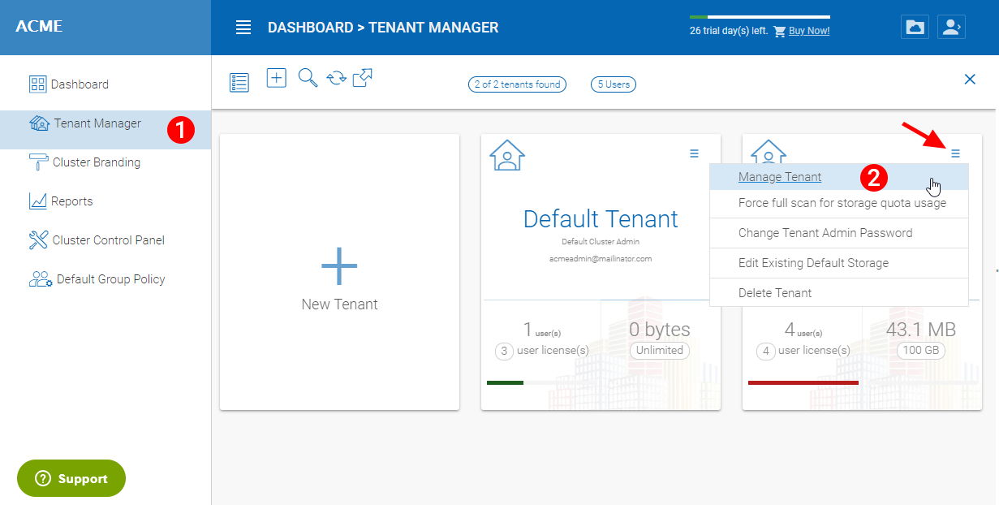
    
    TENANT MANAGER

You can also access other important settings from this context menu **(2)** (Each tenant block has a tenant specific context menu): 

 - Manage Tenant
 - Force full scan for storage quota usage, 
 - Change Tenant Admin Password, 
 - Edit Existing Default Storage 
 - Delete Tenant

**Manage Tenant**

This will drill deeper into the per-tenant management page view. By clicking the “Manage Tenant” **(2)** option (see above image), the Cluster Admin sees the Tenant Dashboard as well as additional options to configure the Tenant settings.

**Force full scan for storage quota usage**

This will start a full scan of storage usage for the Tenant. As files are uploaded, modified or deleted during daily operation, the Tenant Quota is calculated. To ensure that the quota value shown for the tenant is accurate, it is important that you occasionally force a full scan of the tenant’s quota usage.

**Change Tenant Admin Password**

Provides a method for the Cluster Administrator to assist the Tenant Administrator with resetting passwords.

**Edit Existing default storage**

When a Tenant outgrows their allocation of storage space or needs to move to a different storage location, this setting allows the Cluster Administrator to change the storage location.
    
.. tip:: 
    
    When changing a storage location for a Tenant; you typically manually copy the folder to the new location then re-configure the default storage location.
    
.. warning:: 
    
    If you want to change the tenant's default storage location, make sure you copy tenant's file AS-IS from the source folder to its destination folder before you change the storage location here.

**Delete Tenant** 
    
Deletes the tenant.

4.3.1 Tenant Management within Cluster Administration
^^^^^^^^^^^^^^^^^^^^^^^^^^^^^^^^^^^^^^^^^^^^^^^^^^^^^^

.. note::

     At a high level, the Cluster Administrator and Tenant Manager have almost identical controls for the Tenants within their scope; however, the Tenant Manager settings will always take precedence and override Cluster Administrator settings. Tenant Managers can give permission for Cluster Administrator to manage their tenants by enabling this option in ``Group Policy`` > ``Common Settings`` > ``Security``. "The Allow Cluster Admin to manage my tenant" is by default checked. 
     
     .. figure:: _static/image_s4_3_15.png
        :align: center
        
        TENANT GROUP POLICY > SECURITY

**Navigation Menu**

``Cluster Manager`` > ``Tenant Manager`` > ``Manage Tenant`` > ``View/Actions``

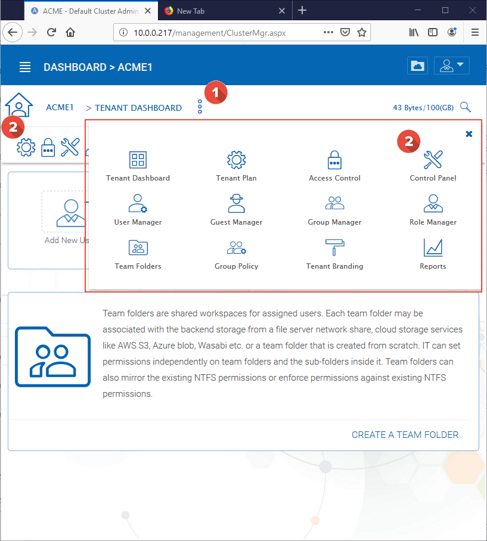
    
    TENANT DASHBOARD MENUS

You can navigate to different sections of Tenant Administration using the navigation menu at the top **(1)**. 

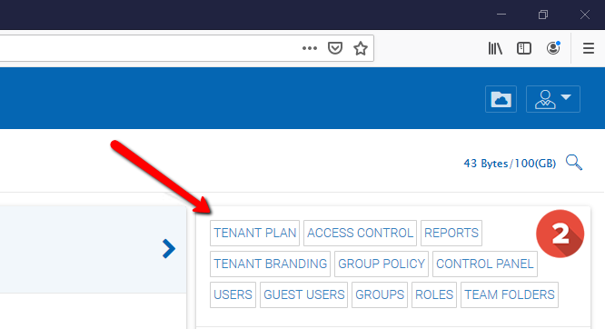
    
    TENANT DASHBOARD QUICK LINKS

When the computer screen is wide enough, the right side quick links panel will also be available for quick navigation **(2)**.

**Tenant Dashboard**

``Cluster Manager`` > ``Tenant Manager`` > ``Manage Tenant`` 

The Tenant Dashboard link directs the web page back to the Tenant Dashboard page.

**User Manager**

``Tenant Dashboard`` > ``Users``

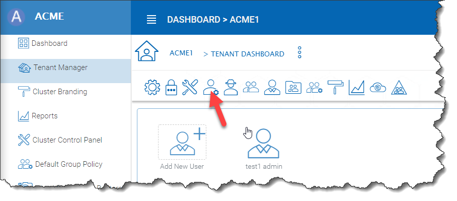
    
    TENANT USER MANAGER

The Users section can manage Users in the Tenant.

**Team Folders (Shared Work Space)**

``Tenant Dashboard`` > ``Team Folders``

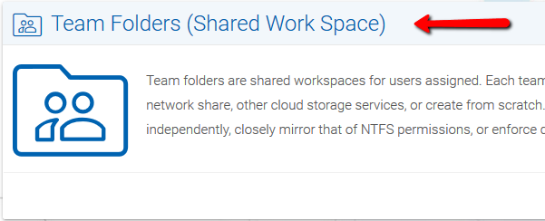
    
    TEAM FOLDER

Team Folders are used for team-share collaborations. Generally, Team Folders are converted from File Server Network shares. Other Team Folder sources can be Google Storage, Amazon S3 (or S3 Compatible), Amazon Cloud, Windows Azure Blob, WebDav, SharePoint, Rackspace (US or UK) and OpenStack or you can create new folders under the Tenant’s root storage.

On the right side of the tenant manager web interface, if the screen is wide enough, there is a right side panel that has 4 items, Cloud Backup, Local Active Directory, Remote Active Directory and Backend Storage. Otherwise 

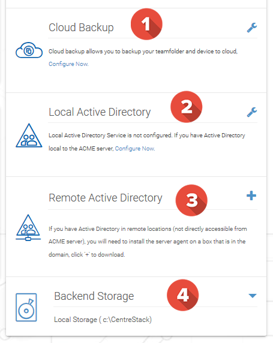
    
    RIGHT PANEL

**Cloud Backup (1)**

``Tenant Dashboard`` > ``Cloud Backup`` 

Cloud backup allows you to backup team folders in the tenant and also folders on devices attached to the tenant.

**Local Active Directory (2)**

``Tenant Dashboard`` > ``Local Active Directory`` 

The connection to local active directory is via LDAP over Local Area Network. If the active directory infrastructure is in the same network as the Cluster Server, this is a convenient way to connect to the active directory.

**Remote Active Directory (3)**

``Tenant Dashboard`` > ``Remote Active Directory`` 

If the active directory is away from the Cluster Server, (for example, the active directory is on-premise inside a client's building, while the Cluster Server is in a data center) it is recommended to use Server Agent to connect the remote active directory.

.. note::

    If the client/customer’s Active Directory is in a remote location, you can use “Server Agent” to connect the Active Directory (and replicate remote File Server Network Share to the Cluster Server. You don’t need to configure LDAP in the remote Active Directory case.

**Backend Storage (4)**

``Tenant Dashboard`` > ``Backend Storage``

Each tenant has a default backend storage. Tenant user (team user)'s home storage and other shared storage
space can be allocated from the default backend storage.

.. tip::

    You can think of the Tenant Backend Storage as a "Black Box" managed by the Cluster Server and you shall always use the Cluster Server interface to interact with the content inside the storage. If you can't take this "Black Box" approach for the tenant's root backend storage, you can use the following other methods via the team folders, such as import file server network share.

However, if you already have a file server that will provide the storage, it is recommended to use "Import Network File Shares" to mount the file server network share to the tenant's storage space. In this case,you can leave the "Default Storage" as is, or point it to an empty location and treat it as a black box storage managed at the Cluster Server level.

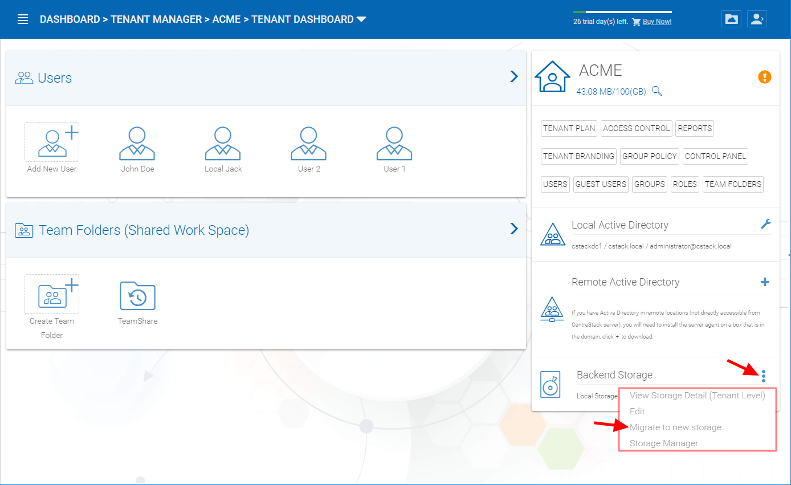
    
    CLOUD STORAGE SETTINGS

**Migrate to New Storage**

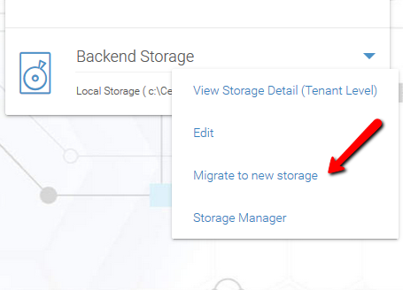
    
    CLOUD STORAGE MIGRATE

Once the tenant backend storage is set, we don't recommend changing it until it has to be changed (e.g., migrate to other location). However when you are just setting up the tenant, you can decide where your tenant's storage location is and can change between local file server storage or remote cloud storage service.

**Tenant Plan**

``Tenant Manager`` > ``[Tenant]`` > ``Tenant Plan``

.. figure:: _static/image_s4_3_17b.png
    :align: center
    
    TENANT PLAN SETTINGS

Here in the Tenant Plan section, you can change the tenant's user plan and storage plan, and also control 
the bandwidth usage for the tenant.

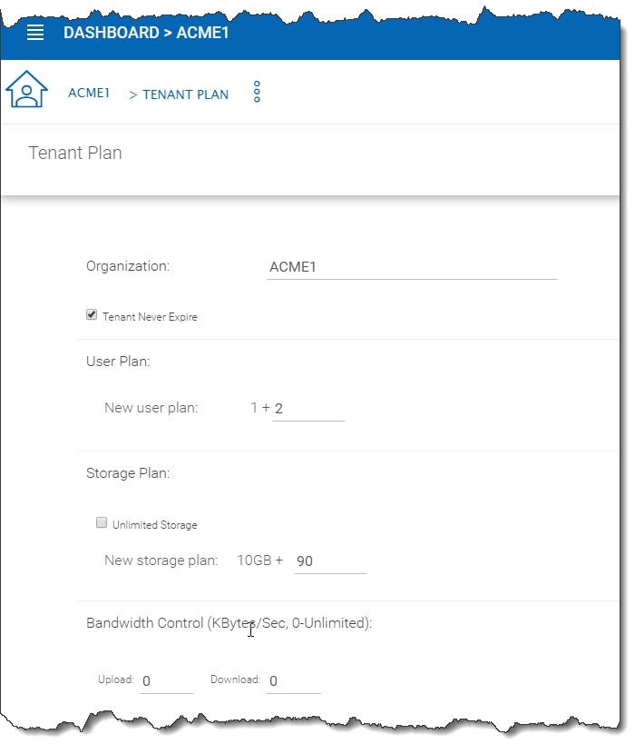
    
    TENANT PLAN SETTINGS

**Admin Access Control**

``Tenant Manager`` > ``[Tenant]`` > ``Access Control``

In the Admin Access Control, the cluster administrator can decide the division of work between cluster administrators and the specific tenant administrator. A lot of times, the cluster administrator will help with setting things up. In this case, the cluster administrator can take away some of the administrative work from the tenant administrator. 

.. note::

    For example, if the cluster administrator is a Managed Service Provider (MSP), the tenant admin can be an admin user from a specific client (customer).
    
    Or, if the cluster administrator is an enterprise IT directory, the tenant admin can be a specific division of the enterprise.

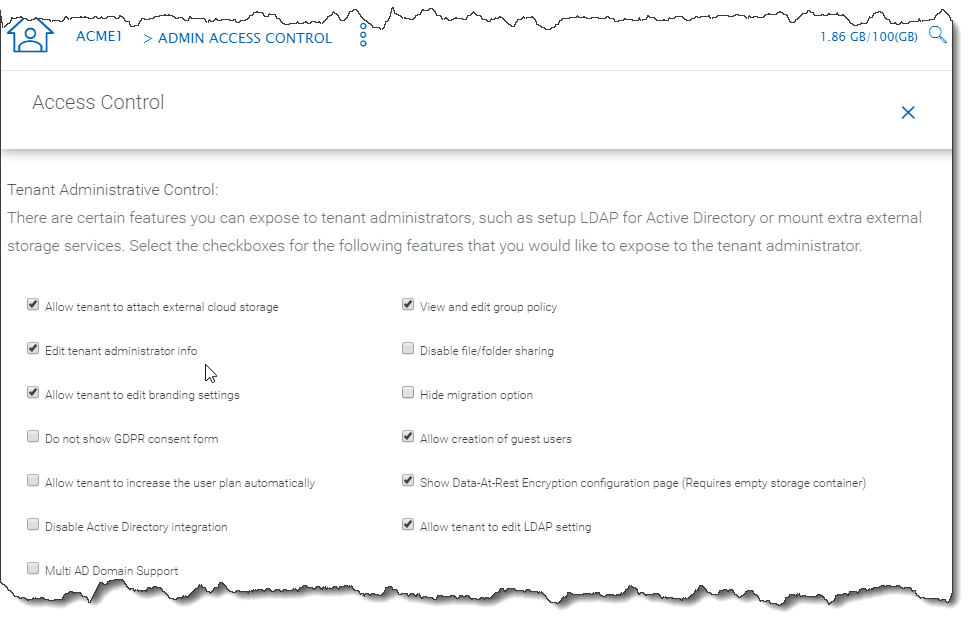
    
    ACCESS CONTROL SETTINGS

**Allow tenant to attach external cloud storage**

    If checked, in the tenant administrator's management console, the "Storage Manager" will show and allow tenant administrator to mount (attach) external storage.
    
    If the cluster administrator is setting it up for the tenant, the cluster administrator can take away this privilege. 
    

**Edit tenant administrator info**

   The Cluster administrator can decide whether to allow the tenant administrator to edit its own information, such as change email.
   
 
 
**Allow tenant to edit branding settings**

   The Cluster administrator can decide whether to allow tenant administrator to have its own branding.
   
   
**Do not show GDPR consent form**

    The EU General Data Protection Regulation (GDPR) is the most important change in data privacy regulation in 20 years.  There are regulations about collecting user information and software needs to provide consent form. 
    If you have customers in the EU, it is recommended to show the consent form.

**Allow tenant to increase user plan automatically**

    The Cluster administrator can decide whether to allow the tenant to grow the user count automatically. 

**Disable Active Directory integration**

    If checked, this will remove AD integration for this tenant. 

**Multi AD Domain Support**

    Support multiple Active Directories in a single tenant (current tenant).
    
    Multiple Active Directory forests support. This is not a common option because most of the time, the tenant has one forest (which can have multiple sub domains). In the case when the tenant has several Active Directory domains that are not related, multiple LDAP connection can be set up this way.
    
.. tip::
    
        If you have single AD forest but contains multiple sub-domain AD domain controller, you don't need to turn on Multi-AD support. Instead, you just point the LDAP to the root forest domain controller and the root forest domain controller will find and identify the sub-domains.

    
**View and edit group policy**

    The Cluster administrator can decide whether to show the group policy section to this tenant.
    

    

**Disable file/folder sharing**

    Disable file and folder sharing from tenant level.
    

**Hide migration option**

    Migration option refers to migrating remote file server(s) from remote customer location(s) to the Cluster Server. Not all clients (customers) have remote file servers, so this tenant level option may not apply all the time.

   
**Allow tenant to edit LDAP setting**

    In the case the tenant's infrastructure is in the same LAN (Local Area Network) as the Cluster Manager, the tenant's Active Directory can be directly connected via LDAP to the Cluster Server. 
    
    If the cluster administrator is setting it up for the tenant, cluster administrator can take away this privilege. 
    

**Show Data-At-Rest Encryption (DARE) configuration page (Requires empty storage container)**

    If the tenant has the required encryption of the data
    in the cloud (Cluster Server side), a DARE configuration
    page can be shown upon the first usage to set it up.
    

**Allow creation of guest users**

    The Cluster administrator can control whether to allow the specific tenant to have guest users.  

    

**Administrator Information**

``Tenant Manager`` > ``[Tenant]`` > ``Control Panel`` > ``Tenant Administrators``

In the administrator information page, the cluster administrator can help the tenant manager change their email and user name if they need to, and to also setup delegated administrators.

The delegated administrators that are setup at the cluster level are users who are already in the Cluster Server and will be helping out the management of this specific tenant. Access these settings by clicking "Control Panel" (1) and choose the "Tenant Administrators" icon. 

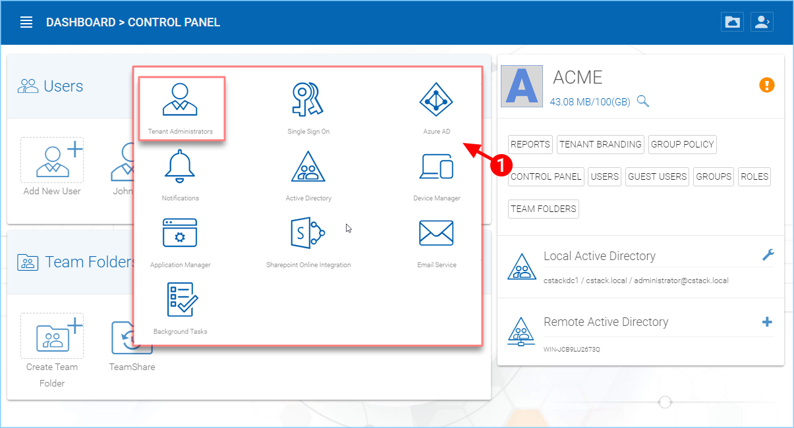
    
    TENANT ADMINISTRATORS

.. note ::

    Delegated administrators have two different roles. First of all, they are not the 
    default administrator in the tenant so normally they are just normal team users
    in the tenant.
    
    However, they can elevate themselves into the admin role by clicking the elevation icon that
    is available to delegated administrators.
    
    .. figure:: _static/image_s4_3_18b.png
        :align: center
        
        MANAGE TEAM CLOUD SETTINGS
    

**More about Active Directory Settings**

``Tenant Manager`` > ``[Tenant]`` > ``Local Active Directory``

If the tenant's infrastructure is in the same local area network as the Cluster Server, the Active Directory can be directly accessed and integrated from the "Local Active Directory" page. The integration is done over LDAP protocol.

However, if the tenant's infrastructure is away from the Cluster Server, it is recommended using "Server Agent" to connect both the tenant's file server and Active Directory to the Cluster Server.

.. tip::

    If your Active Directory is away from the Cluster Server over the Internet, skip the "Local Active Directory" section but use the "Remote Active Directory" instead.
    
    Use LDAP AD Setting only if the AD is in the same Local Area Network.
    
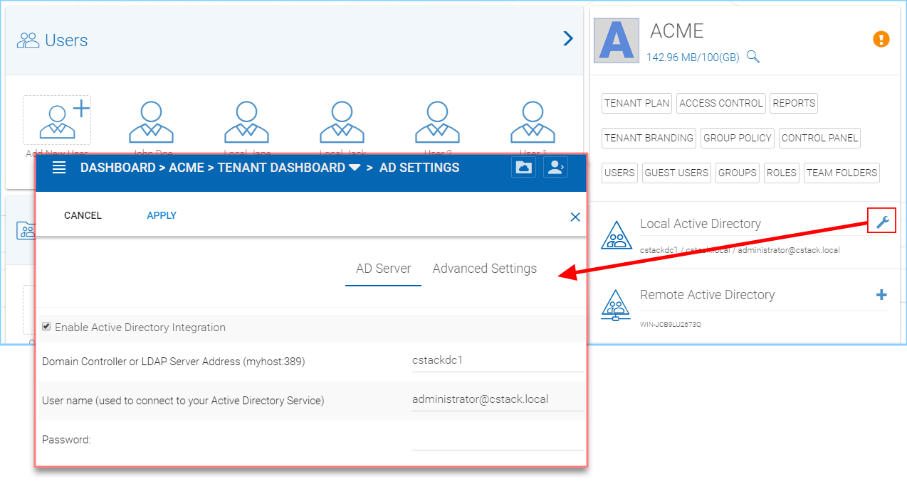
    
    ACTIVE DIRECTORY SETTINGS

.. note::

    The difference between using LDAP to connect Active Directory and using "Server Agent" to connect Active Directory:
    
    By using LDAP to connect Active Directory, the assumption is that the LDAP is local in the local area network so the speed is very fast and also very reliable. So a lot of the calls and queries are directly passing through to Active Directory.
    
    By Using Server Agent to connect Active Directory, the assumption is that the Active Directory is in a remote location and over the Internet so the access speed may not be fast and the Internet may not be 100 percent up and reliable. So the server agent replicates Active Directory related information over to the Cluster Server.

**User Manager**

``Tenant Manager`` > ``[Tenant]`` > ``User Manager``

Please reference the   :ref:`Tenant Admin's User Manager section <tenant_admin_usermgr>`

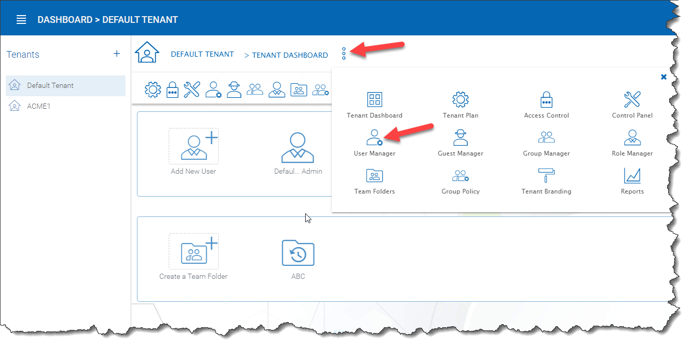
    
    TENANT ADMIN > USER MANAGER

**Team Folders**

``Tenant Manager`` > ``[Tenant]`` > ``Team Folders``

Please reference the   :ref:`Tenant Admin's Collaboration section <tenant_admin_collaboration>`

In the team folders page, you can manage team shares, folder permissions and the underlying storage
configuration.

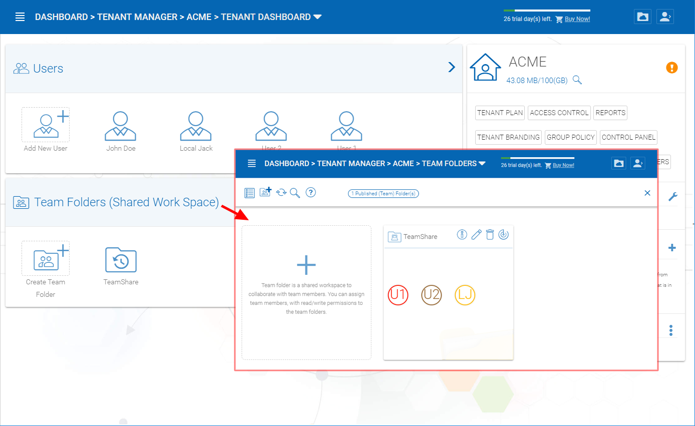
    
    MANAGING TEAM SHARES

**Group Policy**

``Tenant Manager`` > ``[Tenant]`` > ``Group Policy``

The group policy settings are 100% the same as those documented in the "Tenant administration" scope part later in this guide. 

Please reference the   :ref:`"Tenant Admin's Group Policy section <tenant_admin_grouppolicy>`

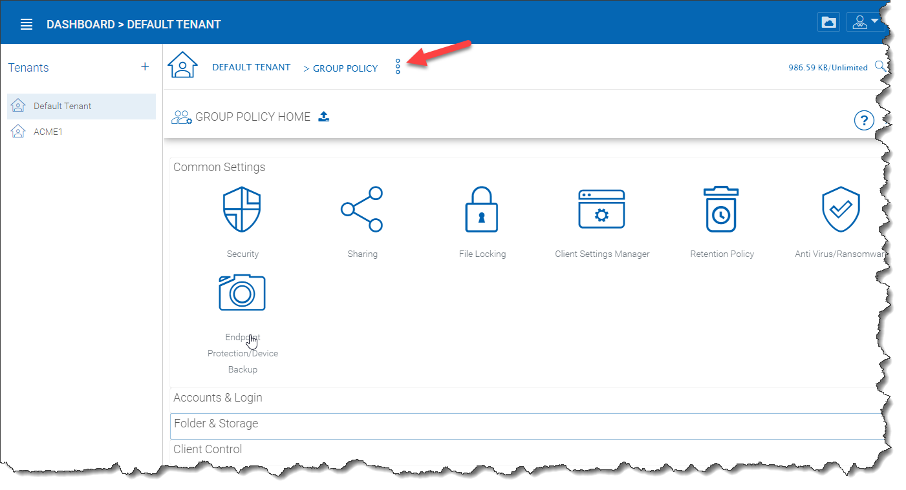
    
    GROUP POLICY SETTINGS

**Tenant Branding**

``Tenant Manager`` > ``[Tenant]`` > ``Tenant Branding``

The cluster administrator can help the tenant do the tenant-specific branding in the partner portal.

The branding is applied by the customized URL.
You can think of the customized URL 
as a primary key to retrieve all tenant related 
branding information.

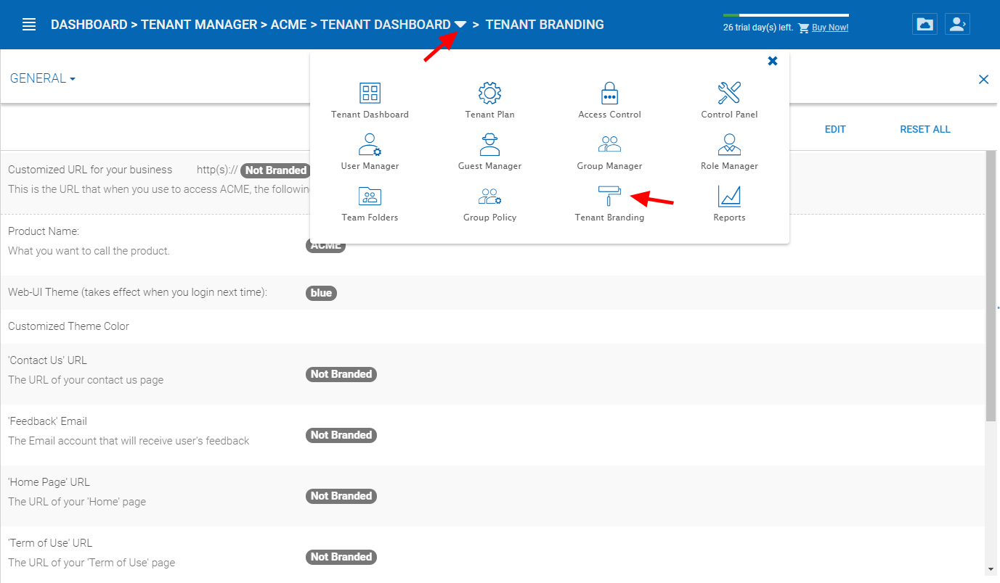
    
    TENANT BRANDING

.. warning::

    If you set up per-tenant branding, make sure the customized URL is specific to each tenant and also the URL is different from the default URL. 
    
    If you don't want to setup per-tenant branding, disable it in cluster settings and setup cluster-wide branding instead.

**Reports**

``Tenant Manager`` > ``[Tenant]`` > ``Reports``

The cluster administrator can look at the tenant specific reports for the tenant.

The Reports section has the following sub categories

    - Upload Report
    - Storage Statistics
    - Bandwidth Usage
    - Team Folders
    - Shared Objects
    - Audit Trace
    - File Change Logging
    - Folder Permissions
    - Distributed Locks
    - Pending Purged Folders
    

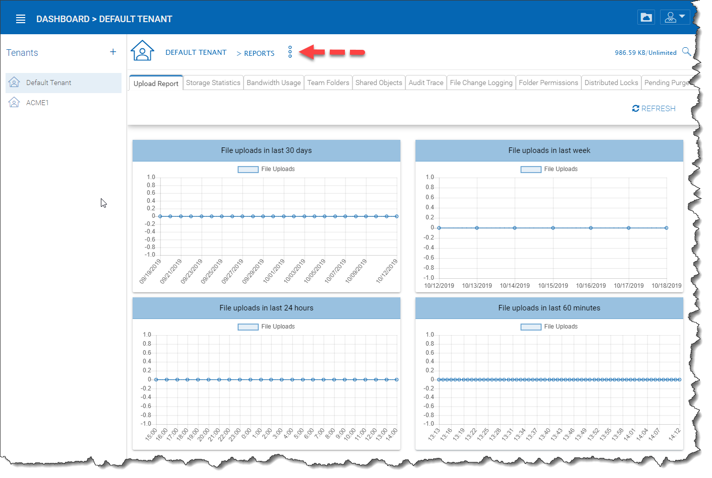
    
    TENANT MANAGER REPORTS

**Client Device Manager**

``Tenant Manager`` > ``[Tenant]`` > ``Control Panel`` > ``Device Manager``

The cluster administrator can look at the devices that have the client agent software installed and connected in the specific tenant.

.. figure:: _static/image_s4_3_21.png
    :align: center
    
    DEVICE MANAGER SETTINGS

**Application Manager**

``Tenant Manager`` > ``[Tenant]`` > ``Control Panel`` >  ``Application Manager``

The cluster administrator can look at the application manager for the specific tenant. 

Here are the 4 different applications that can be 
setup on a per-tenant basis.

    - Microsoft Office Web App
    - Pixlr Web App
    - Zoho Web App

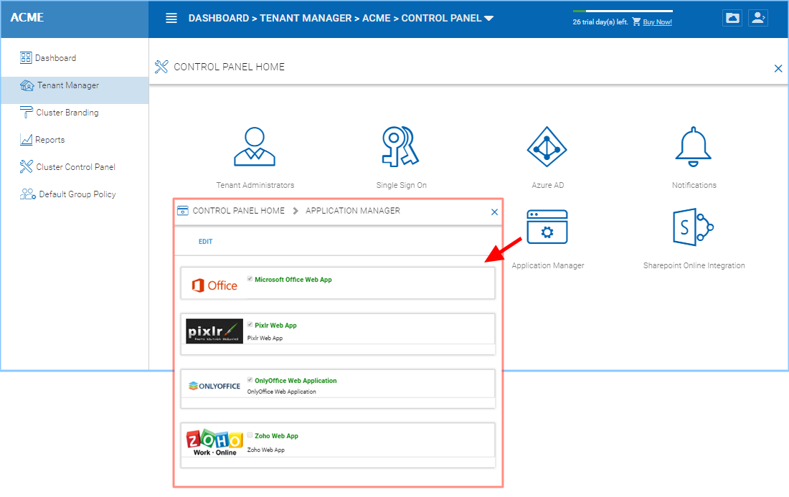
    
    APPLICATION MANAGER

**Notification Manager**

``Tenant Manager`` > ``[Tenant]`` > ``Control Panel`` > ``Notifications``

The cluster administrator can use the notification manager to help the tenant setup notification events. The tenant administrator will receive email notifications
for the events subscribed.

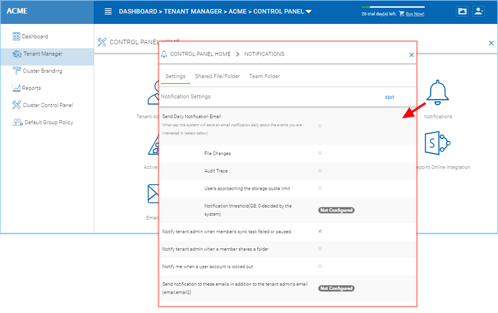
    
    NOTIFICATIONS SETTINGS

**Background Tasks**

``Tenant Manager`` > ``[Tenant]`` > ``Control Panel`` > ``Background Tasks``

There are three different kind of background tasks:

    1. Data Seeding
    2. Storage Scan
    3. Tenant Storage Migration

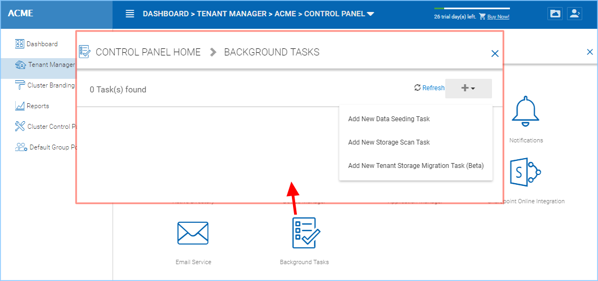
    
    BACKGROUND TASKS

The cluster administrator can help the tenant seed the data. For example take data into a USB drive and take it to the same local area network as the Cluster Server and see the data into the tenant storage.

**Add New Data Seeding Task**

``Tenant Manager`` > ``[Tenant]`` > ``Background Tasks`` > ``Add New Data Seeding Task``

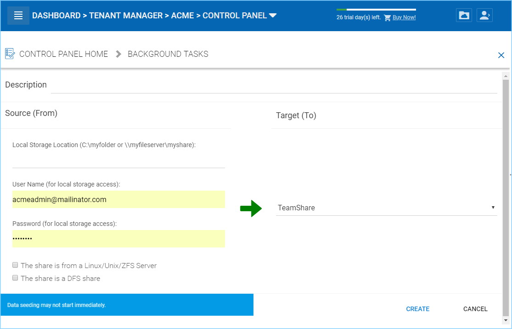
    
    DATA SEEDING

Data Seeding is to take a folder from a source location and seed it into a team folder. 

On the left of the dialog, it is the source folder path information.

On the right side of the dialog, it is the target team folder information. 

If you are seeding the data into a brand new team folder, you will first go into the team folder area and create a new team folder with empty content inside, and then come back to data seeding page and select it from the team folder drop down.

4.3.2 Create a New Tenant
^^^^^^^^^^^^^^^^^^^^^^^^^^^^

``Cluster Manager`` > ``Tenant Manager``

Click on the "Plus" sign in the ``New Tenant`` to start the creation of a new tenant.

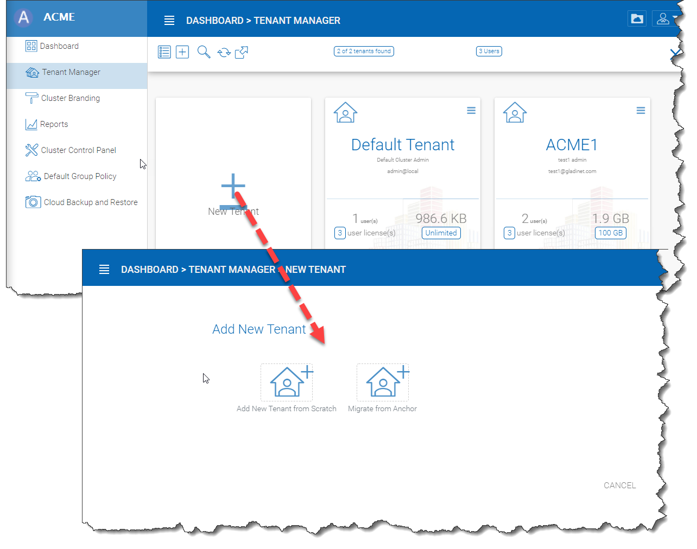
    
    CREATING A NEW TENANT

The first screen under "New Tenant" is asking for a 
few parameters related to who the tenant is.

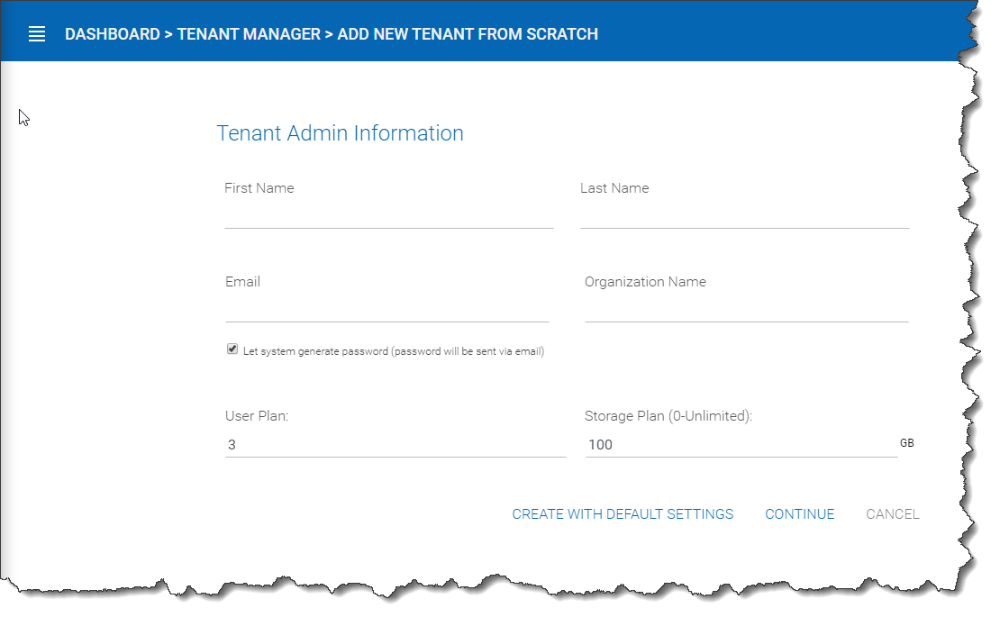
    
    TENANT MANAGER SETTINGS 1

"Create with Default Settings" will get it done and the tenant will be granted all default settings, including the storage location allocation.

"Continue" allows you to customize the settings and storage location.

If you pick "Continue",

The second screen under "Add Tenant" is asking for the division of work between the cluster administrator and the tenant administrator.

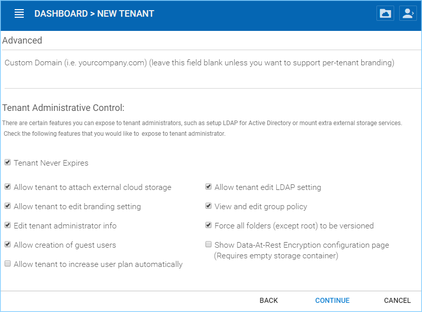
    
    TENANT MANAGER SETTINGS 2

The third screen under "Add Tenant" is asking where
the root storage for the tenant will be at.

**Automatically assign a sub-folder from cluster default tenant**

When selected, the tenant's default storage will be a sub-folder inside the cluster default tenant's storage folder. It is easier to manage when you don't need per-tenant storage access credentials. This is the easiest option because if every tenant is allocated a sub-folder from the default tenant, then the default tenant storage location is a single place to take care of all of your storage needs.
    
**Use existing file server or local disk as default storage**

Using this option, you can connect the tenant's root folder to a file server network share. If you want the tenant users to continue to share file server network share from the Cluster Server, it is recommended you use the "Import Network Share" feature instead of pointing the default storage to the file server share, because the Cluster Server will assume it has 100% of the control of the storage location. 

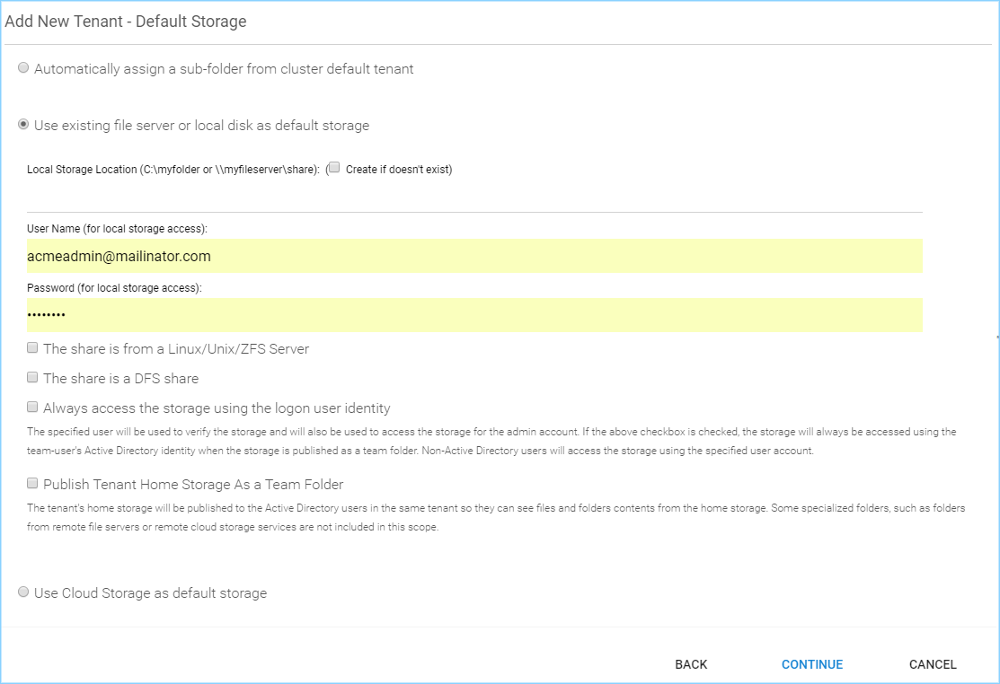
    
    DEFAULT STORAGE SETTINGS

**Use Cloud Storage as default storage**

when using this option, you can connect the tenant's root folder to Amazon S3, Windows Azure Blob, OpenStack storage as well as others.
    
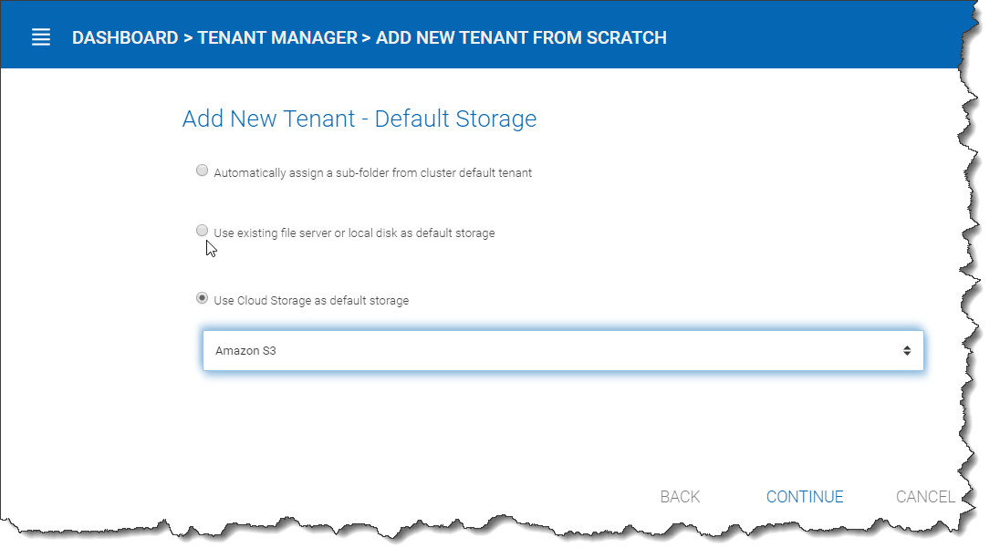
    
    CLOUD STORAGE SETTINGS

**Using Amazon S3 bucket for tenant storage**

``Tenant Manager`` > ``{Create New Tenant}`` > ``Use Cloud Storage as Default Storage`` > ``Amazon S3``

You can pick Amazon S3 as the target storage for the tenant if you want to.

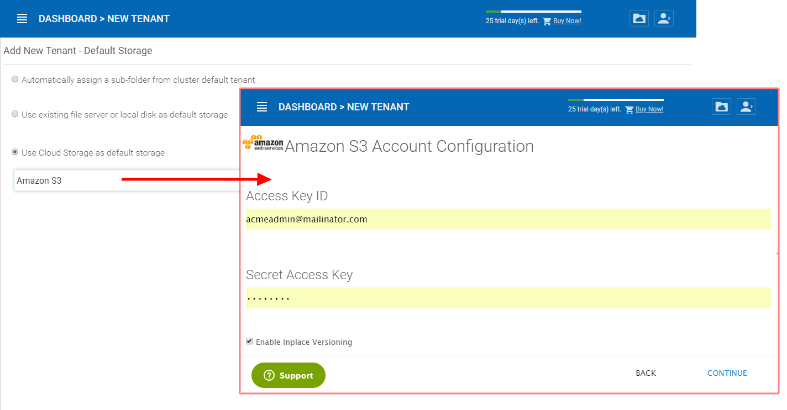
    
    AMAZON S3

After you pick the Amazon S3, the first screen will be asking for ``Access Key`` and ``Secret Key``.

You will need to log into your AWS console to get the access key and secret key. You can use master access key and secret key, by default the master key has default access to all buckets. You can also create an IAM user and use the key from a specific IAM user. However, by default, the IAM user is locked out of access to any bucket until bucket access policy is created and attached to the IAM user.

If you use IAM user, here is a sample S3 Bucket access policy to grant an IAM user to a specific bucket. As shown below, the policy gives an IAM user the ability to use bucket "user3onlybucket"

.. code-block:: json

    {
        "Version": "2012-10-17",
        "Statement": [
            {
                "Effect": "Allow",
                "Action": [
                    "s3:GetBucketLocation",
                    "s3:ListAllMyBuckets"
                ],
                "Resource": "arn:aws:s3:::*"
            },
            {
                "Effect": "Allow",
                "Action": [
                    "s3:ListBucket"
                ],
                "Resource": [
                    "arn:aws:s3:::*"
                ]
            },
            {
                "Effect": "Allow",
                "Action": [
                    "s3:AbortMultipartUpload",
                    "s3:DeleteObject",
                    "s3:DeleteObjectVersion",
                    "s3:GetObject",
                    "s3:GetObjectAcl",
                    "s3:GetObjectTagging",
                    "s3:GetObjectTorrent",
                    "s3:GetObjectVersion",
                    "s3:GetObjectVersionAcl",
                    "s3:GetObjectVersionTagging",
                    "s3:GetObjectVersionTorrent",
                    "s3:PutObject",
                    "s3:PutObjectAcl",
                    "s3:PutObjectTagging",
                    "s3:PutObjectVersionAcl",
                    "s3:PutObjectVersionTagging",
                    "s3:ReplicateDelete",
                    "s3:ReplicateObject",
                    "s3:RestoreObject"
                ],
                "Resource": [
                    "arn:aws:s3:::user3onlybucket/*"
                ]
            }
        ]
    }

After it is all setup properly, you can use the IAM user's access key id and secret access key to connect to the Amazon S3 bucket.

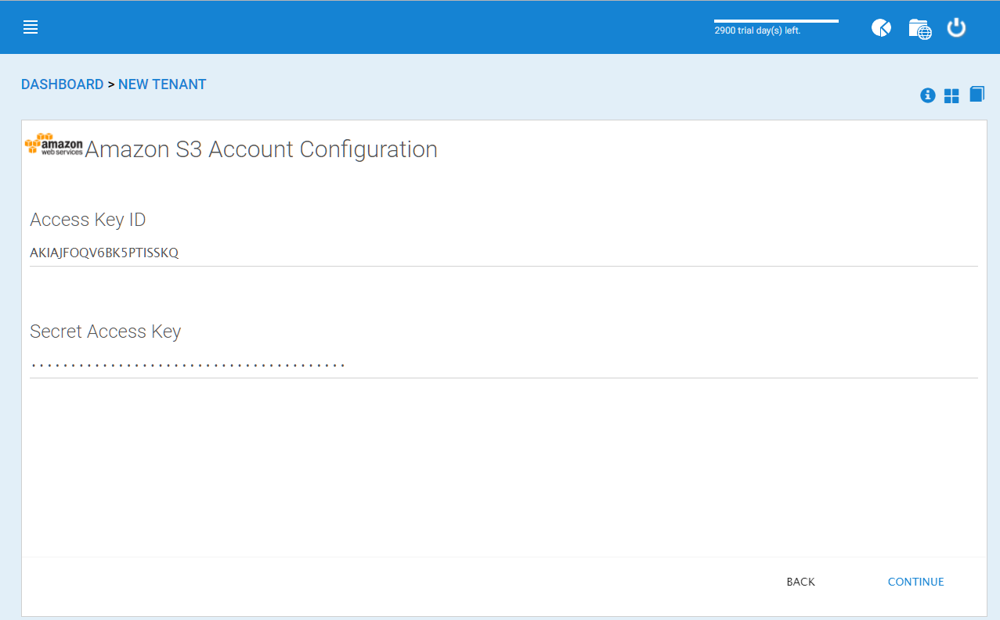
    
    AMAZON S3 USER'S ACCESS KEY

When the correct access credentials are given, the next screen is to select a bucket from Amazon S3.

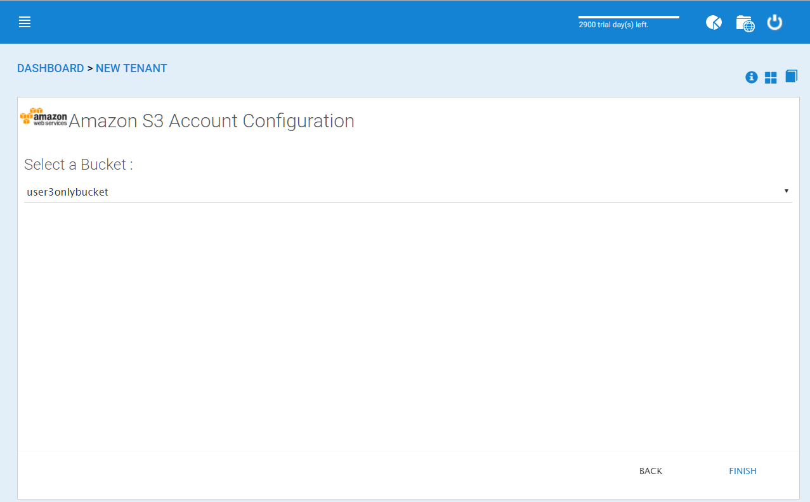
    
    AMAZON S3 SLECTING A BUCKET

You can pre-create a bucket in Amazon S3 and then pick the bucket in the current page. After that, it will take a short while for the system to be ready for the new tenant created.

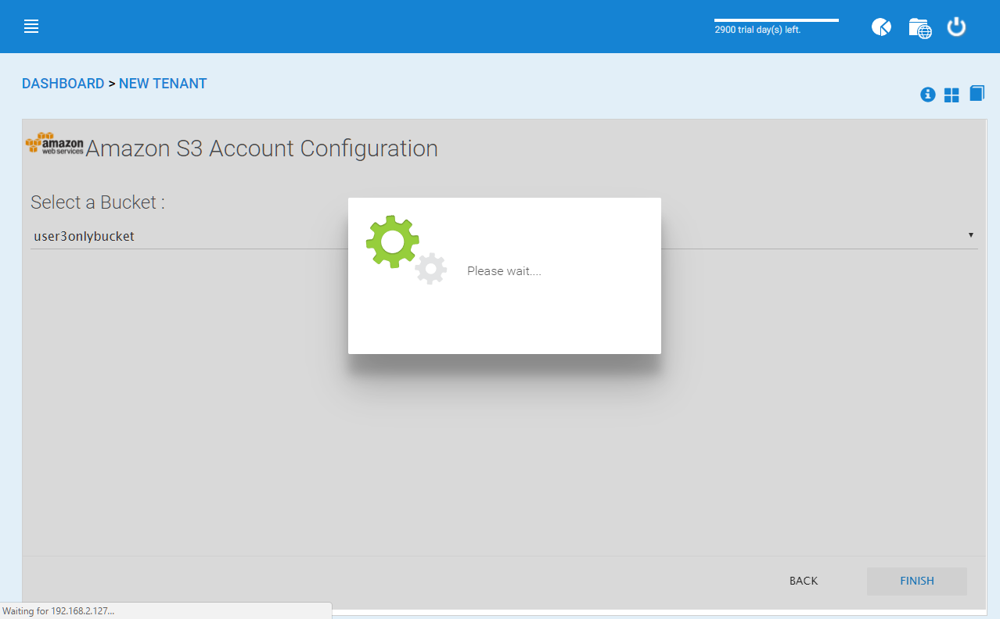
    
    FINISHING AMAZON S3 CONFIGURATION

After the tenant is created, you will be looking at the dashboard of the tenant. 

**Using Windows Azure Blob Storage for tenant storage**

In addition to Amazon S3 bucket, you can also use Windows Azure Blob Storage as the tenant's back end storage.

Similar to the above Amazon S3 setup process, you can pick "Windows Azure Blob" as the option during the tenant creation process.

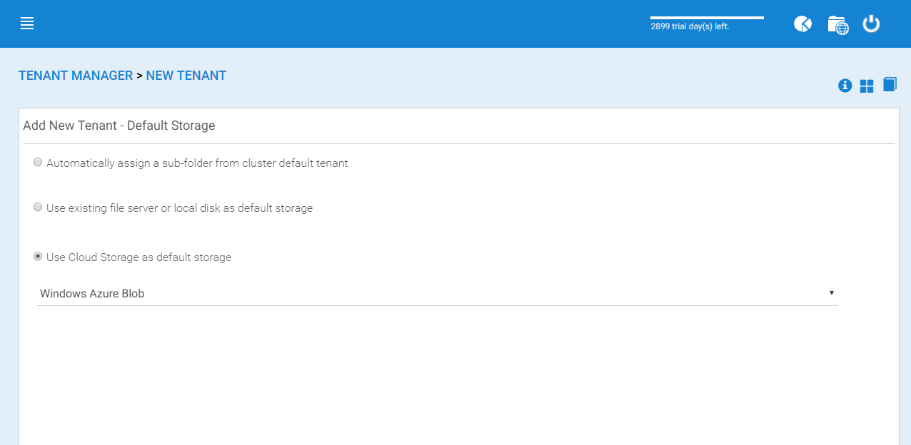
    
    WINDOWS AZURE BLOB SETUP

The next screen will be asking for ``Blob URL`` and the ``Primary key``. 

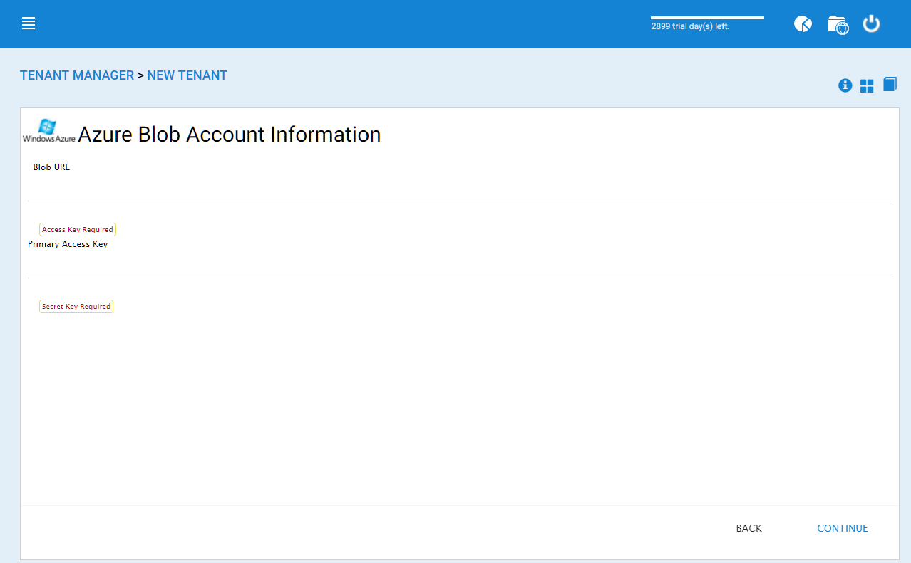
    
    AZURE BLOB URL AND PRIMARY KEY

You can get this information from the Azure Portal.

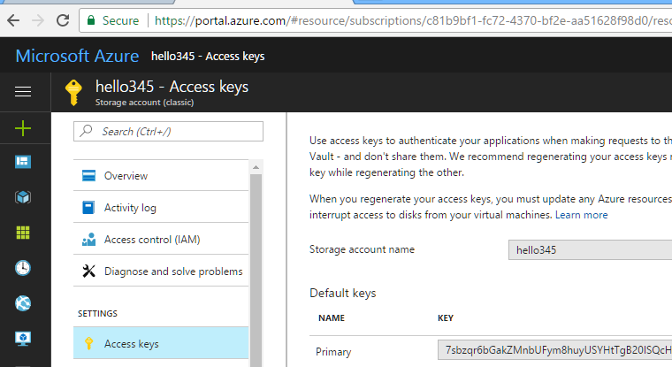
    
    AZURE BLOB ACCESS KEYS

Here is a simple mapping between azure portal and the parameters it ask for.

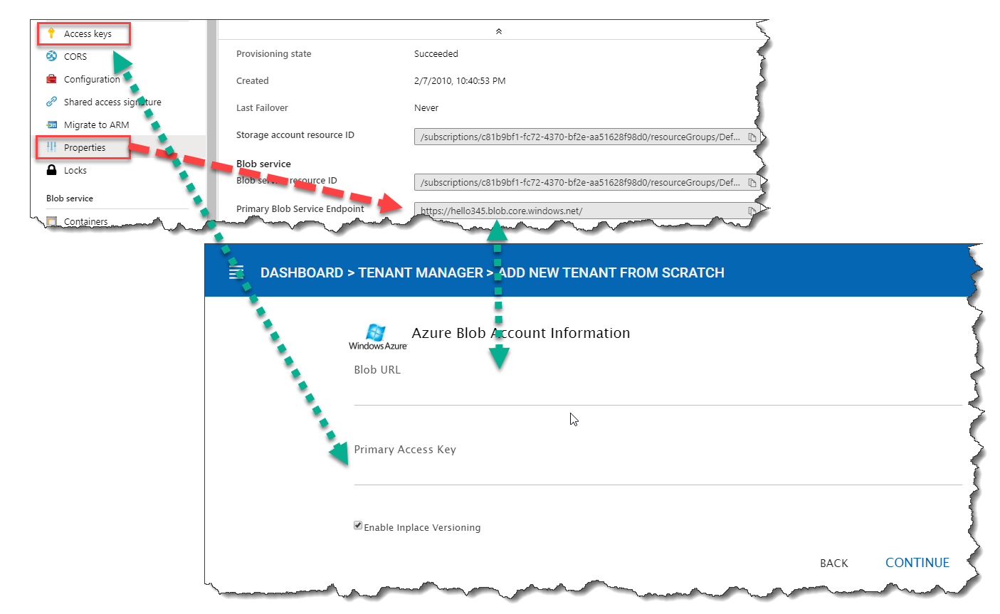
    
    AZURE BLOB ACCOUNT SETTINGS

After you put in the account information, the next screen asks to pick a container to use.

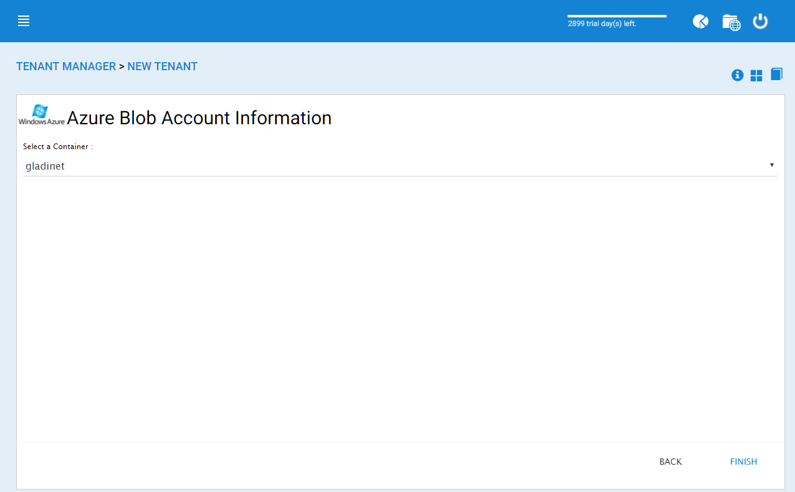
    
    AZURE BLOB ACCOUNT INFORMATION

After the container information is all set, the tenant account will be created.

*****************
4.4 Cluster Admin
*****************

``Cluster Manager`` > ``Cluster Admin``

Cluster Admin section is to change the properties of the default administrator and also to add additional people to be the cluster administrators. Access the Cluster Admin in the panel on the right of your Tenant Dashboard or from the Cluster Control Panel view.  

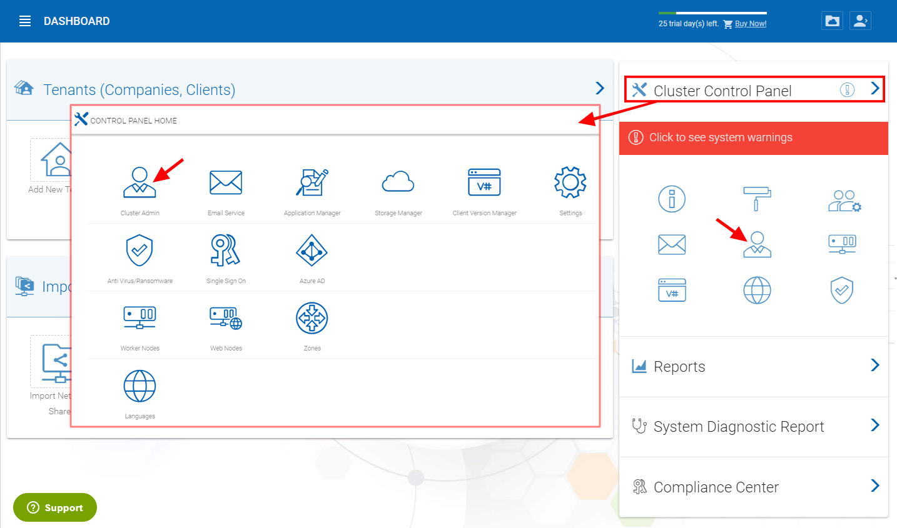
    
    CLUSTER ADMIN SETTINGS

********************
4.5 Cluster Branding
********************

``Cluster Manager`` > ``Cluster Branding``

Cluster Branding is for changing the logo, bitmaps and other branding related information. There are two branding supports. One is self-service built-in branding, which is completely controlled by the “Cluster Branding” settings on the “Cluster Manager”. The other is full-branding service. 
Both rely on the “Cluster Branding” to change the look-and-feel of the web portal. 

Built-in branding will work with white-label clients, which upon the first connection to the cluster, will download the branding related information and  use the branding related information. As compared to full-branding service, the full branding clients will have artworks, logo bitmaps and related information burned into the client binaries.

4.5.1 General
^^^^^^^^^^^^^^^

``Cluster Manager`` > ``Cluster Branding`` > ``General``

Under the general tab you can specify the name and other settings as specified below.

**Product Name**

This is where you will specify what you would like to call the product. This is the name that users will see when they login either in web portal or the client applications. To access branding settings click the branding icon **(1)** then "EDIT" **(2)** and then change the setting you want **(3)**. Don't forget to save your settings. You can also choose a color theme which you would like your users to see when they login to the portal. You can choose a color theme that is close to your company colors.

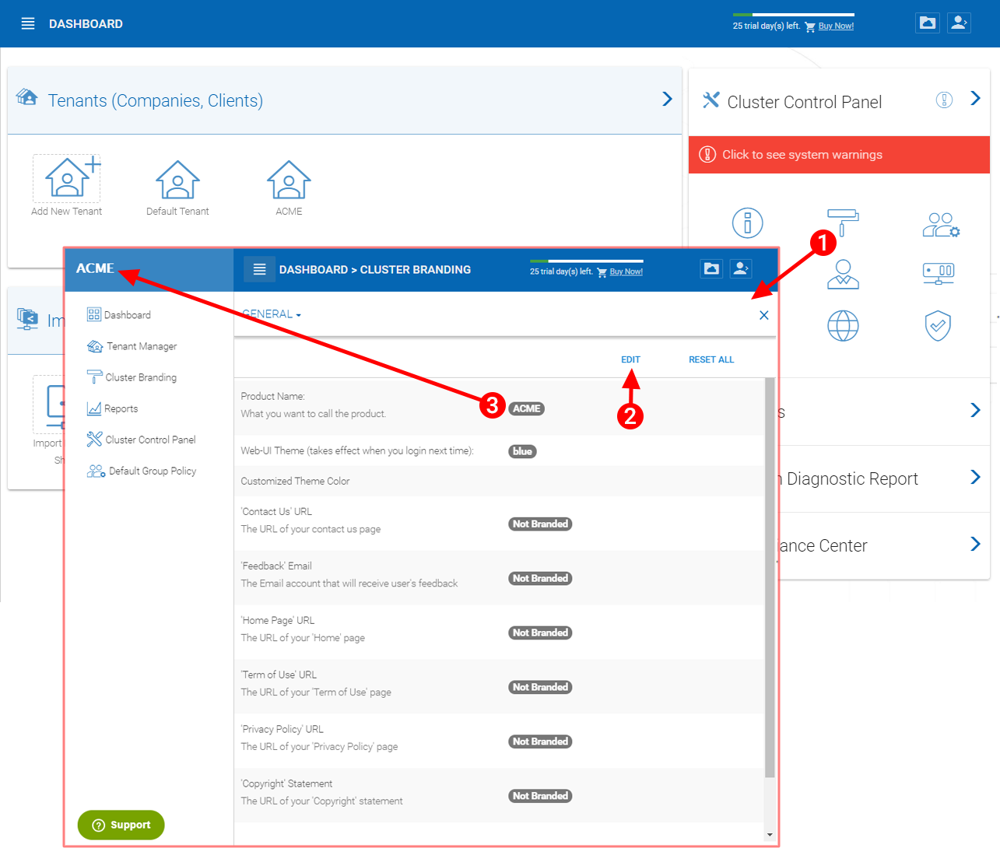
    
    CLUSTER BRANDING

**Feedback Email**

Users’ feedback will be delivered to this email address.

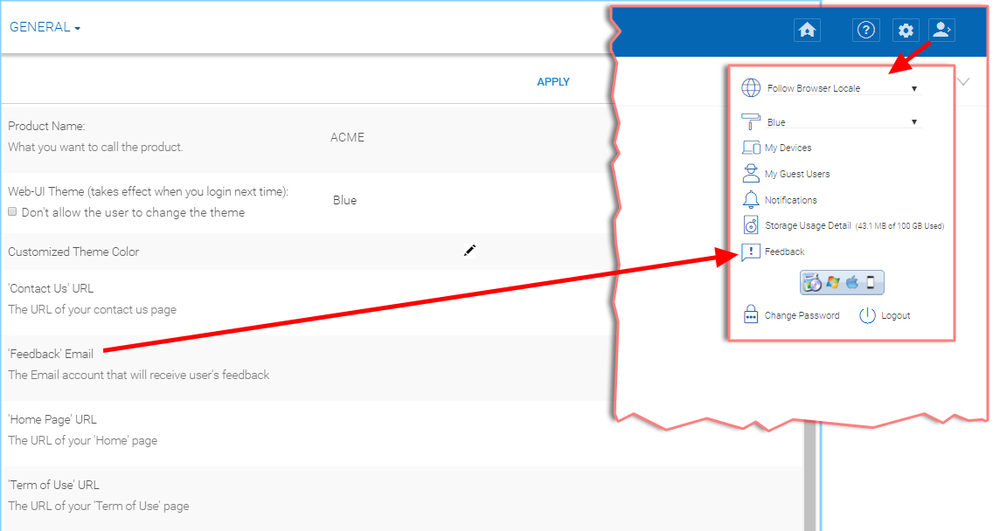
    
    FEEDBACK EMAIL

**Home Page URL**

This is the URL of your ‘Home Page’ page **(1)**.

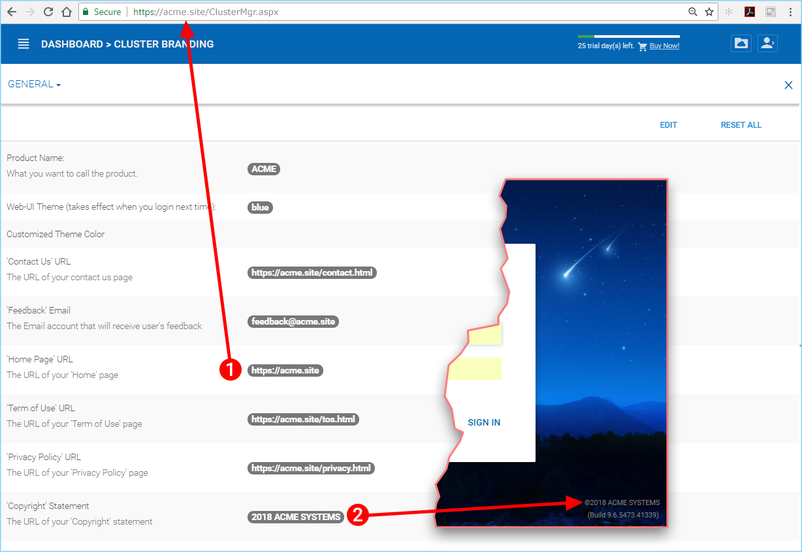
    
    HOME PAGE URL AND COPYRIGHT STATEMENT

**'Copyright' Statement**

This is the contents of your ‘Copyright’ statement **(2)**.

4.5.2 Web Portal
^^^^^^^^^^^^^^^^^^^

``Cluster Manager`` > ``Cluster Branding`` > ``Web Portal``

.. note::

    In previous builds, the best way to get icons to work is by putting the icon files on the same server and reference the icons via a relative link.

    For example, you can create a sub folder under the Install Folder of the Cluster Server, such as under root/imagetest folder. The dimensions for all icons for each setting under web portal should match what is displayed for each setting. The branding of the icons and images require the icons and images with the same width/height as specified or same aspect ratio if the resolution is higher.

In later builds, the icons used are what-you-see-is-what-you-get and you can upload those icon sets.

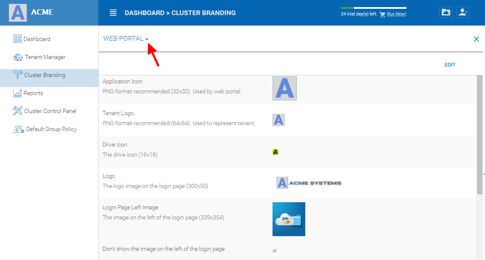
    
    WEB PORTAL SETTINGS

**Application Icon**

From the Web portal **(1)** section of cluster branding, you can change the application icon **(2)**. This is the image that is displayed next to the product name in the web portal.

.. figure:: _static/image_s4_5_21.png
    :align: center
    
    WEB PORTAL BRANDING

**Tenant Logo (3)**

This is where the logo that represents each tenant should be uploaded.

**Drive Icon (4)**

This is the icon that will be used for the cloud drive. For example in the web portal tree view.

**Logo Url & Login Page Left Image (5)**

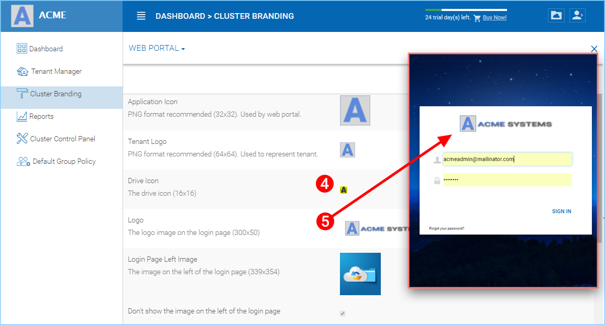
    
    LOGIN PAGE ICON

Please follow the same steps for branding settings for ‘Login Background Image’, ‘File Share Stamp Icon’, ‘IOS Client App ID’, ‘Login Page Note’, ‘Change Password URL’, ‘Tutorial Page URL’.

**Client Download**

``Cluster Manager`` > ``Cluster Branding`` > ``Client Download``

You can choose not to show the download link for some clients here.

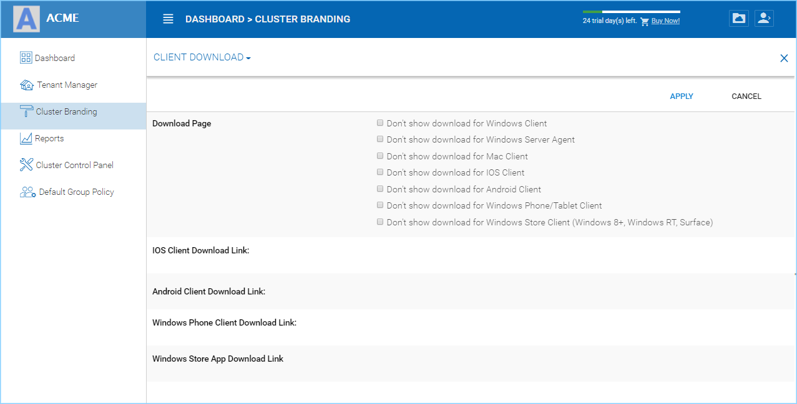
    
    CLIENT DOWNLOAD SETTINGS

**Mobile Clients Download Links**

Once you brand your own iOS client, Android client, Windows Phone and Windows Store application, you can point the download link to your own AppStore and Google Play locations.

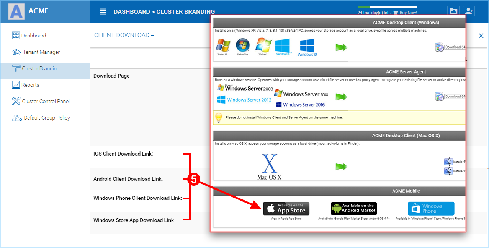
    
    CLIENT DOWNLOAD LINKS SETTINGS

4.5.3 Windows Client
^^^^^^^^^^^^^^^^^^^^^^

``Cluster Manager`` > ``Cluster Branding`` > ``Windows Client``

The application icon and drive icon URLs can be specified here. Also, you can put in your company name under ‘Manufacturer Name’ along with the ‘Contact Info’ email. You also have the option here to create your own branded MSI Windows client. You can also use your own code signing certificate in order to digitally sign the MSI package. The advantage of creating your own MSI client package is that when users download and install the Windows Client you provide, they will see your company name along with your branding during the client installation.

Windows client supports multiple languages. Some language packs are included and shipped with CentreStack. If you need to run the Windows client under a different language, you can set the UI Language there.

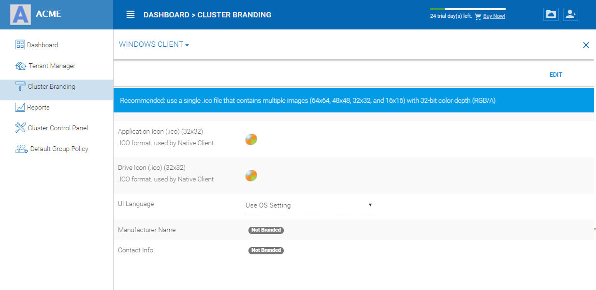
    
    WINDOWS CLIENT BRANDING

Once you clicked the "Edit" button to edit the Windows Client branding information, you will be able to provide EULA (End User License Agreement) and Code Signing Certificate.

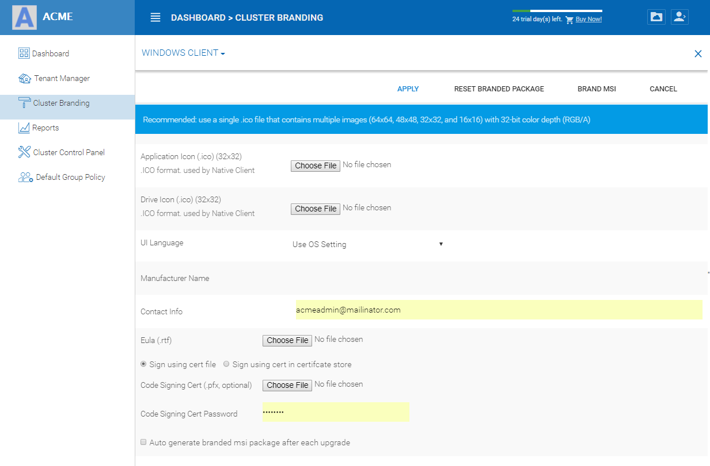
    
    WINDOWS CLIENT BRANDING SETTINGS

**EULA**

   This will be a RTF file format as input.

**Code Signing Certificate**

    You can acquire a code signing certificate from your code signing certificate vendor. Most SSL vendor also provide code signing certificate. Make sure you use SHA 256 (SHA2) as your digital signing certificate hash algorithm.
    
    If your Code Signing certificate is already installed you can also use the option - ``Sign using cert in certificate store``

4.5.4 MAC Client
^^^^^^^^^^^^^^^^^^

You can configure the MAC client and MAC client installation package branding under here.

**Client Branding**

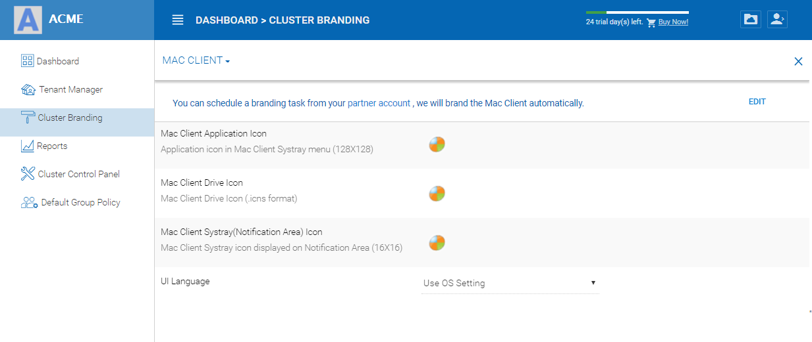
    
    MAC CLIENT BRANDING

**Installation Package Branding**

There is some preparation work required in order to create the MAC client branded installation package. Please read the description and follow all the steps listed under this setting.

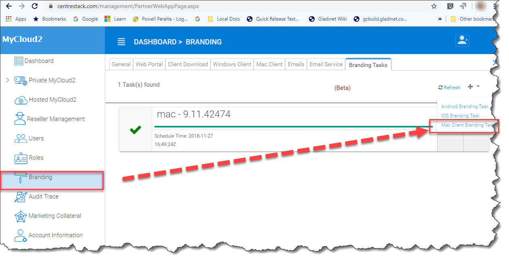
    
    MAC INSTALLATION USING BASH TRANSFORM SCRIPT

The transformation of the Mac installation package is done by a bash transform script (transform.sh). Prior to the transform, there are some preparation work.

Step 1 - Acquire Apple Mac Developer Account:

The Mac Installer (PKG) file will need to be signed by the Apple Mac Developer Account. Otherwise the pkg will be blocked by the later Mac OS such as 10.9 or 10.10.

After you acquire the Mac Developer account, you can download the signing certificates, one for signing application files and
one for signing the installer packages.

You can find the name of your certificates from the KeyChain Access application.

For example, the signing certificate names may look like these:

.. note::

      “Developer ID Application: Gladinet, Inc. (CX8U2YJ96P)”

      “Developer ID Installer: Gladinet, Inc.”

You can modify the transform script to use these certificates.

Step 2 - Prepare your branding information:

All the branding information such as product name and branding artworks are contained in one single directory. You can use the test branding folder as an example and replace all the information contained inside to have all the branding information ready.

The folder will be an input command line parameter to the transform script.

Step 3 - Prepare the PKG files:

In the standard Gladinet Mac binaries, there are a couple DMG files. DMG files are Mac image files. When you mount the DMG files, you will see a PKG file in each of the DMG files. The PKG file will be the input to the transform script.

Once you have the PKG file, the signing certificate and the branding folder, you are ready to do the transformation.

Step 4 - Change the transform script to use your certificate:

Locate the two lines inside the transform script and replace these two lines to use your own certificates.

.. code-block:: bash

    readonly SIGN_APP_STR=”Developer ID Application: Gladinet, Inc. (CX8U2YJ96P)” 
    readonly SIGN_PKG_STR=”Developer ID Installer: Gladinet, Inc.”

Step 5 - Apply the transform:

The syntax for the transform is  transform.sh branding_dir mac_pkg_file

.. code-block:: bash

   
The generated branding installer will be called output.pkg in the same folder

You can read the ``transform.sh`` shell script for more details.

4.5.5 Android Client
^^^^^^^^^^^^^^^^^^^^^

.. note::

    Branding the android client can now be automated from your partner portal (http://www.centrestack.com). 
    The information here in this section is preserved for legacy reference. Please goto http://www.centrestack.com to brand the Android client.

The branding of Android client and iOS client is done from www.centrestack.com, instead 
of from your own  server. 

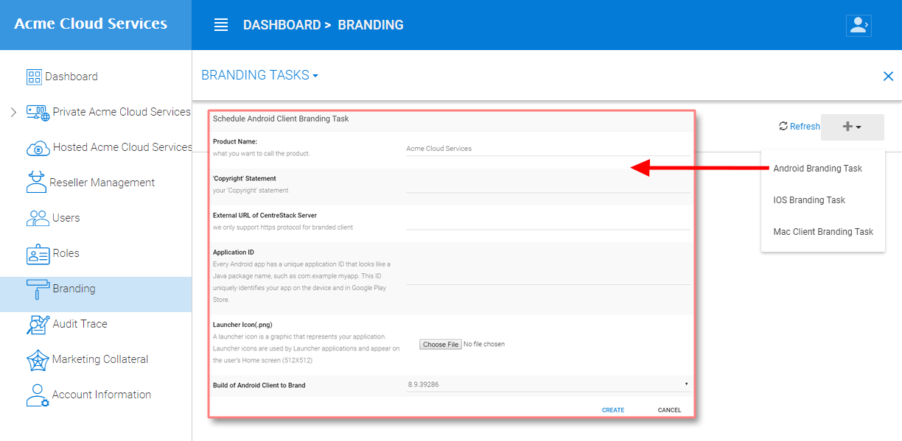
    
    ANDROID CLIENT BRANDING

4.5.6 iOS Client
^^^^^^^^^^^^^^^^^^

.. note::

    Branding of iOS client can now be automated from partner portal (http://www.centrestack.com).

    The information here in this section is preserved for legacy reference. Please goto http://www.centrestack.com to brand iOS client.

As shown in the above picture, you can generate branding task and request for Android branding
and iOS branding.

4.5.7 Emails
^^^^^^^^^^^^^^^

There are many places in the Cluster Manager that need to contact the users via email. So the “Emails” tab is used to set up the email templates used for contacting users via email.

**Welcome Email for New Tenant**

    This is the email sent to the new tenant when the tenant is created. The email is sent to the tenant administrator.

**Welcome Email for New Team User**

    The team user is a regular user in a tenant. This is the email template that is sent to the user when the user account is created.

**Welcome Email for New Guest User**

    Guest user is a regular user in a tenant that doesn't have a home directory associated. So the guest user can only operate within shared files and folders from other regular users. This is the email template that is sent to the guest user when the guest user's account was provisioned.

**Email for File/Folder Share**

    This is the email sent to a user when the user is about to receive file/folder shares.

**Request a File**

    This is the email sent to a user when the user is about to receive an invitation to upload a file.

**Notify external user that shared file changed**

    When a shared file/folder changed, this is the email that is sent to the user who receives file/folder shares.

**Admin Reset User Password Email**

    This is the email that sent to a user when the user's password is reset.
    

**User Reset Password Email**

    This is the email that sent to a user when the user resets the password for himself/herself.

**New Sign-in Action Email**

    This is the email notification sent to the user when the user logins from a specific machine.

**Settings**

    This is to set the reply email address. Typically the email is sent with the SMTP service set. However, if the reply address is different, you can set it here.

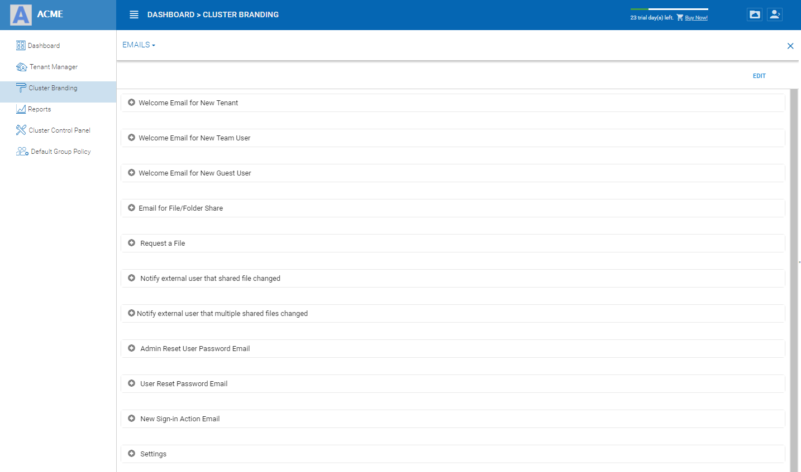
    
    EMAIL SETTINGS

4.5.8 Export/Import
^^^^^^^^^^^^^^^^^^^^^^

You can either export the branding settings to another cluster or you can import branding settings from another cluster in this cluster under this setting.

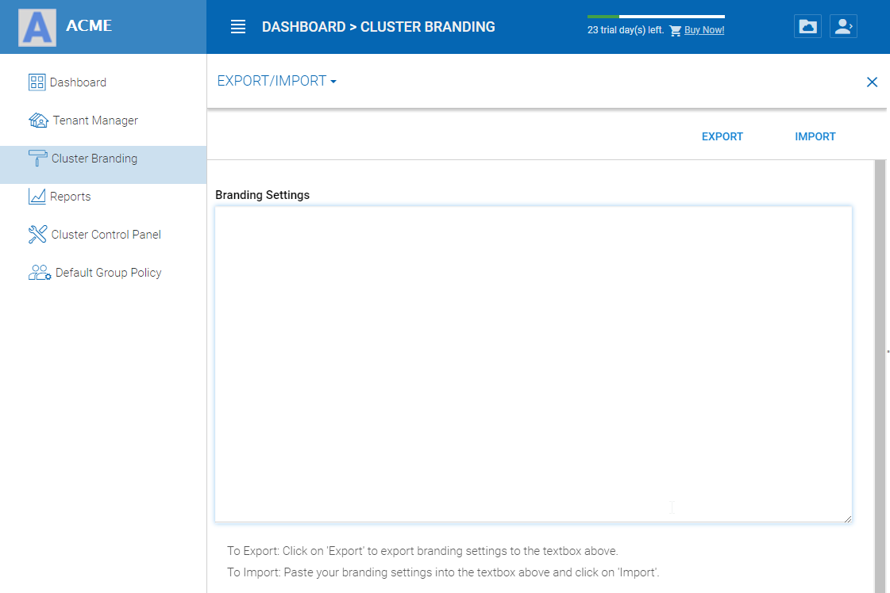
    
    EXPORT/IMPORT SETTINGS

*****************
4.6 Email Service
*****************

``Cluster Manager`` > ``Email Service``

There are many places in the Cluster Server solution that the user needs to be contacted by Email. The Email service is used to set up the SMTP email service to send out the emails.

By default, it works out of box using the default email service with the Cluster Server's customer support email address as the sender.

It is recommended that the SMTP service be setup to use your own SMTP service to send out emails.

In the Authenticate User field, if your SMTP service doesn't require authentication, you can put dummy email in the field.

.. note::

    For example, if your email service is on
    Office 365, 
    
    :SMTP Server Address 
        ``smtp.office365.com``
    
    :Use SSL  
        ``True``
    
    :SMTP Server Port
        ``587``

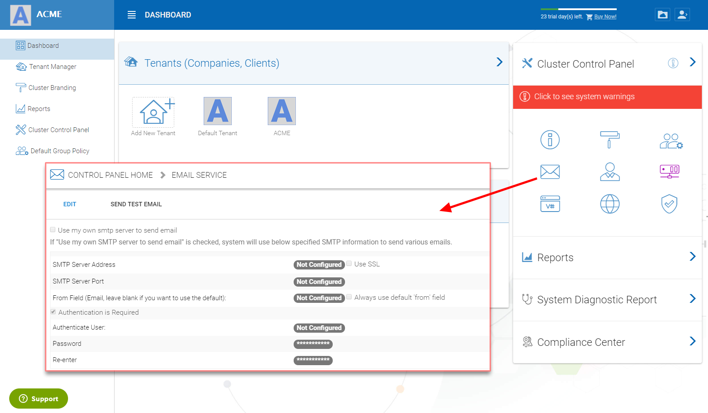
    
    EMAIL SERVICE SETTINGS

***********************
4.7 Cluster Server Farm
***********************

``Cluster Manager`` > ``Cluster Server Farm``

Cluster Server Farm has two types of nodes, one is “Worker Node” and the other is “Web Nodes”.

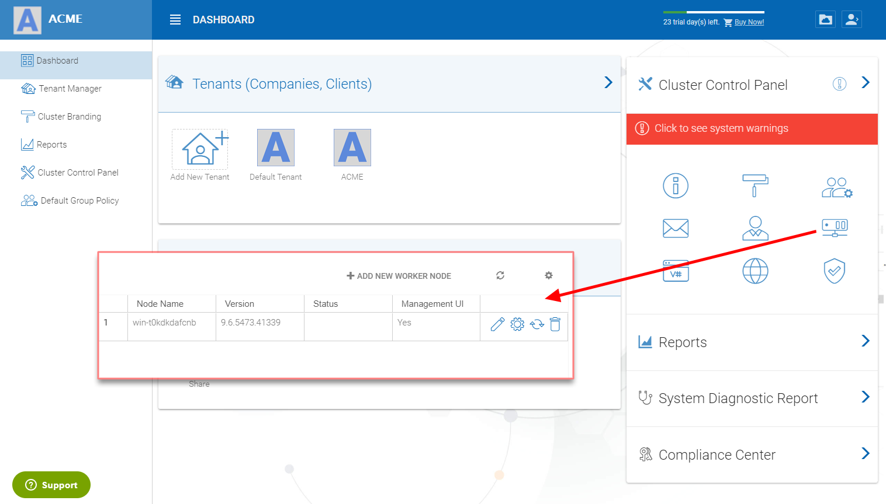
    
    CLUSTER SERVER FARM NODES

**Web Node**

.. note::
    In a small deployment, there is no need to have web nodes. You can go straight to worker nodes
    since worker nodes by defaults are web nodes too.

The Account Management, Sign-in and Load-balancing services will be installed on this physical machine (or virtual machine). Depending on the load, you may need 1 to N such nodes. Normally, we recommend for every web front node, you can have 10+ worker nodes. When you have small deployments, you can skip web front nodes and combine them into worker nodes. All the installation work is the same. If you do not need web front node, you do not need to assign them in the cluster manager.

**Example:**

* ACME Corporation deploys two web front nodes node1.acme.com and node2.acme.com. Each node is running a copy of the Cluster Server connecting to the same SQL database.

* ACME Corporation acquires a domain name (DNS) of cloud.acme.com which is load balanced to node1.acme.com and node2.acme.com.

When Users point their browsers to https://cloud.acme.com it is directed to one of the nodes login page.

.. note::

    NOTE 1: If you have hardware load balancing available, you do not need to use web nodes at all.

    NOTE 2: Windows 2012/R2 comes with Network Load Balancing (NLB). If you use NLB, you do not need web nodes at all.

    Basically, if you have any existing load balancer, you can omit web nodes.

**Worker Node**

``Cluster Manager`` > ``Cluster Server Farm`` > ``Worker Node``

This type of node will contain services like Web Browser Based File Manager, Storage Service Connectors, and etc.
Again, additional nodes can be added as the load increases. Because there is cache information located on each node, users will have an affinity to a single node once it is assigned. If the load balancer distributes users evenly to all worker nodes, the cache information may exist on all worker nodes.

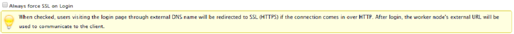
    
    SSL NOTICE

**Worker Node Settings**

There are some settings that apply to all worker nodes. After you click on the "Settings" icon, the Advanced Setttings panel will show.

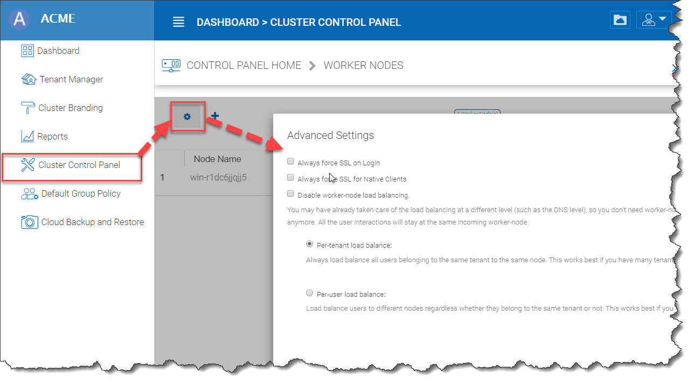
    
    WORKER NODE SETTINGS

**Always force SSL on Login**

    In a production environment, almost 100% of the time you will need to check “Always force SSL on Login”. When this is checked and when the Cluster Server detects that the incoming connection is HTTP, it will do a redirect to HTTPS. If you turn on SSL, you will need to setup SSL certificate first.

    However, if you have SSL-offload, such that SSL is offloaded to a hardware appliance, and after that, the incoming connection is HTTP between the hardware appliance and the Cluster Server. In this SSL-offload case, you will NOT check “Always force SSL on Login” because it will create an infinite redirect loop because the incoming connection is always HTTP as far as the Cluster Server is concerned.

**Always force SSL for Native Clients**

    In a production environment, almost 100% of the time you will need to check “Always force SSL for Native Clients”.

    Especially, in the case of SSL-Offload, you MUST check “Always force SSL for Native Clients”. Otherwise, the Cluster Server may think that the incoming connection is HTTP so it will continue to encourage the native clients (such as Windows client) to use HTTP instead of using HTTPS.
    
    .. note::
    
        In iOS devices, the Application Transport Security may be enforced by the operating system and HTTPS must be used for an iOS Application to connect to the Cluster Server.

**Disable worker-node load balance**

    When you have your own load balancer, you will disable worker-node load balancing. The Cluster Server has built-in node-affinity load balancing, which can be per-tenant or per-user. When you have your own load balancer, you may have session-affinity or just simple round-robin, either one is fine.

.. note::

    How to add a worker node? 
    
    You just go ahead to install the Cluster Server during the installation and point the Cluster Server to the same database. Once the installation of the Cluster Server worker node is completed, reboot. The web portal page will pop up, asking you to add the worker node to the server farm.
    
.. warning::

    What if you changed the Cluster Server's Host Name?
    
    For Windows server 2012 and later Server OS, when a server is newly provisioned, it is typically named in hostname format similar (WIN-ABCDEFG). Sometimes, it is desired to change the name in the Control Panel -> Systems. If the Cluster Server is already installed, changing the name will make the Cluster Server add itself again with the new name. So next time when you visit http://localhost on the Cluster Server after the server has been renamed, you will see the worker node section has both the node with the old name (which no longer exists) and the node with the new name (Which is current and good). In this case, you just need to simply remove the worker node with the old name.
    

**Worker Node Properties**

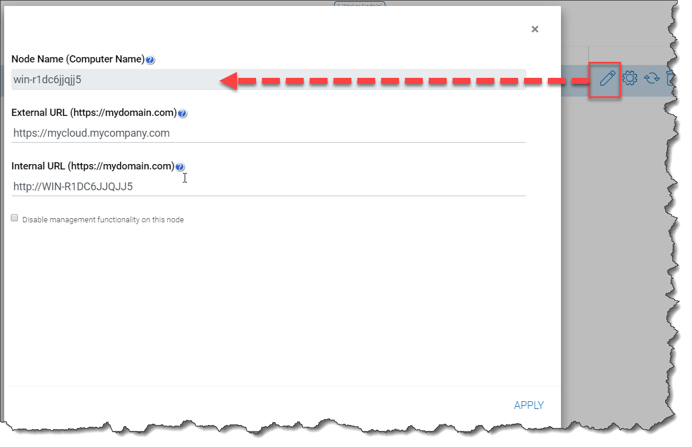
    
    WORKER NODE PROPERTIES

You may need to modify the worker node properties when you setup SSL and the DNS name for the cluster.

**Node Name**

    The **Node Name** needs to match the worker node’s hostname. Sometimes, if you rename a worker node's Windows hostname (NETBIOS name) after the Cluster Server installation, upon reboot, the Cluster Server will pop up a web page, asking you to add the new worker node. In that case, you can go ahead and add the new worker node and then delete the old worker node.

**External URL**

    The **External URL** needs to match the worker node’s external URL. In a production environment, this typically is in an https:// format with the node’s DNS name. 

    External URL is a critical property for Email templates. Once the Cluster Server installation is finished, the dashboard will have a warning message, 'External DNS has not been configured for this worker node. Some functionality may not work properly. Config Now'

    The moment that you have finalized on the External DNS name of the Cluster Server, you must come here and configure the ExternalURL property for the Cluster Server.

**Internal URL**

    The **Internal URL** is the node’s internal URL, typically in the form of http://local-ip-address format. In later Cluster Server builds, this property is hidden and there is no need to set it any more.

**Disable management functionality**

    You can create an internal facing worker node (that doesn’t have an externalURL) and only allow management functionality on this worker node. This is a security feature.

**Worker Node - Edit Cloud Monitor Setting**

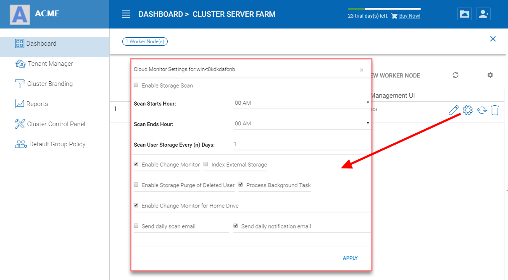
    
    CLOUD MONITOR SETTINGS

**Enable Storage Scan**

    Enables or disables storage scan on the worker node. On the worker node, there is a cloud monitor service. The service will be doing background monitoring and make scan storage from time to time to correct quota calculation and perform other maintenance tasks.

**Scan Starts Hour**

    Typically you will set the scan start time to sometime in the early morning like 1AM.

**Scan End Hour**

    Typically you will set the scan end time to sometime in the morning like 8AM before everyone comes to work. The main idea is to leverage idle time (when people are not at work) to do the scanning.

**Scan User Storage Every (n) Days**

    Typically you can set it to every week or every other week. so a number between 7 to 15 is reasonable.

**Enable Change Monitor**

    Enable change monitor monitors the attached local storage such as storage from file server network share and report file change notification to remotely connected clients. This usually is required if your users are both modifying documents directly from the backend attached network share and also from the front end Cluster access clients.

**Index External Storage**

    This setting will index storage services added via the "Storage Manager". The index will be written to the files table in the database.
    

**Enable Storage Purge of Deleted User**

    When a user is deleted from the system, the user's home directory is not immediately removed. And a lot of times, you don't want to delete it at all. For example, a user is deleted from the Cluster Server, but the user may still continue to use the files and folder directly from the network.

**Process Background Task**

    Whether this specific node will process background task. 

**Enable Change Monitor for Home Drive**

    If Active Directory Home Drive integration is on, this will allow the Cluster Server to monitor the changes on the home drive and notify remote client agents that the files/folders have changed.

**Send daily scan email**

    If the storage scan is enabled, a daily scan email will be sent to the cluster administrator about the result of the scan.

**Zone**

``Cluster Manager`` > ``Cluster Server Farm`` > ``Zone``

The concept of zone is to associate your worker nodes with the location of the storage. When you think about zones,
you will think about your storage location first.

For example, I have storage in LA so I have an LA zone. I also have storage in NY so I have a NY Zone.

You can have worker nodes from different zones as well and assign users to specific zone. If user’s home directory
is coming from LA zone, the user will need to be assigned to LA zone.

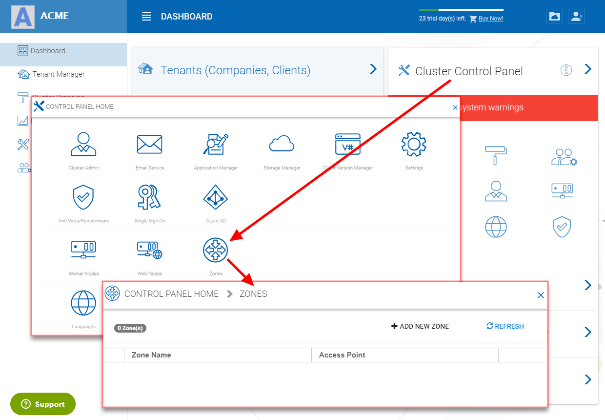
    
    CONTROL PANEL STORAGE ZONES EDITOR

***********
4.8 Reports
***********

``Cluster Manager`` > ``Reports``

4.8.1 Active Users
^^^^^^^^^^^^^^^^^^^^^

Active users reports the activity of users on the web portal. The active users report doesn't include users from windows client or other native clients because those users are more persistent (always there). To access this report, in the left-side menu, click ``Reports`` **(1)** then click the drop-down menu **(2)** and choose "Active Users" **(3)** from the menu. 

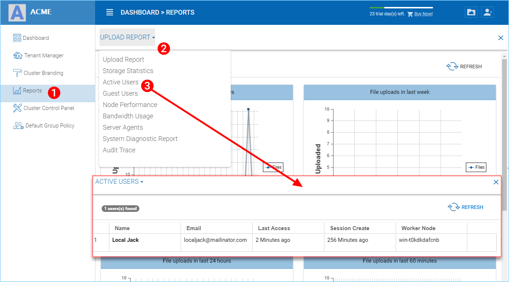
    
    
    ACTIVE USERS REPORT

4.8.2 Guest Users
^^^^^^^^^^^^^^^^^^^^

Other reports are also available such as Guest Users **(3)**, which are users that don't have a home directory but are invited to participate on some shared folders and shared files.

4.8.3 Node Performance
^^^^^^^^^^^^^^^^^^^^^^^^

You can use the Node Performance to check out the worker node health and the database health.

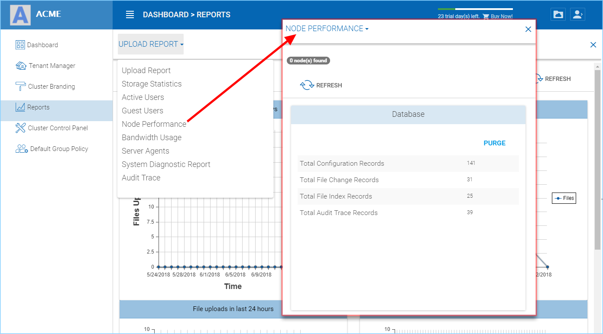
    
    
    NODE PERFORMANCE REPORT

**Last Reported**

    You want to see this field has small numbers such as 6 seconds, 10 seconds. If you see sometime like 3 hours ago, that means the node is not reporting the health.

**Total Requests Processed**

    You want to see this number as big as possible. This number is cumulative since the service was last re-started. So the bigger the number, the more stable the service is. Also when you have multiple worker nodes, you want to see the Total Requests distributed evenly among the worker nodes.

**Request Executing**

    You want to see this number as small as possible. This means the number of requests that are concurrently executing on the server. In general a number smaller than 100 is normal. Bigger than 100 is abnormal. Anything bigger than 20 will require investigation.

**Last Request Time**

    You want to see this number as small as possible. This means the number of milliseconds for the last request. In general, numbers smaller than 3000 or 5000 are normal, which translates to below 3-5 seconds.

**Pending Change Notification**

    For the files and folders that are changed, there is change notification written to the database. In general, you want to see the pending queue as short as possible.

**Active Node Request**

    These are the clients out there contacting the server. Usually it is just for reporting purposes.

**Pending Change Polling**

    These are the clients out there polling to see whether there are files and folders that have been changed. Usually the smaller the better.

**Active Clients**

    For reporting purpose.

**Pending Dir Request(H)**

    The pending directory listing calls from the 
    remote clients to the Cluster Server. This is the high priority queue.

**Pending Dir Request(L)**

    The pending directory listing calls from the remote clients to the Cluster Server. This is the low priority queue.

 .. note::
    If you don’t see the node performance report, check the **Internal URL** setting of each worker node.

Under reports you can look at the upload graphs and storage statistics.

4.8.4 Upload Report
^^^^^^^^^^^^^^^^^^^^^

Upload report tab shows you graphs for all the uploads that have taken place in the last sixty minutes, 24 hours,
30 days and a whole week.

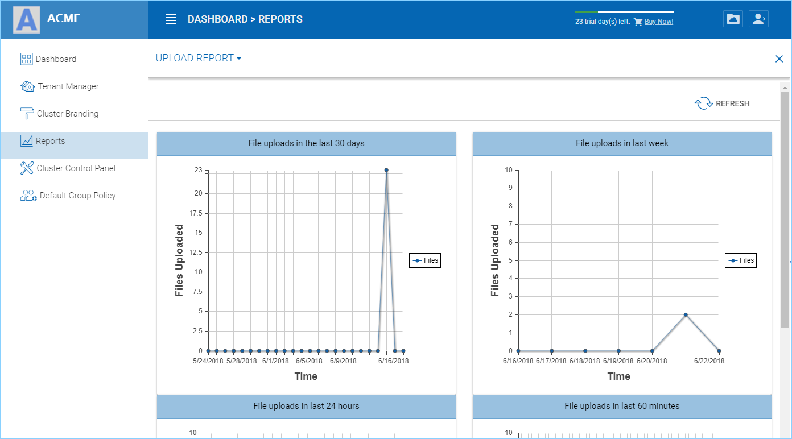
    
    UPLOAD REPORT

4.8.5 Storage Statistics
^^^^^^^^^^^^^^^^^^^^^^^^^^^

Under storage statistics, you can see a quick overview of the overall storage statistics, size distribution
file type distribution pie charts, and users who have used the most storage so far.

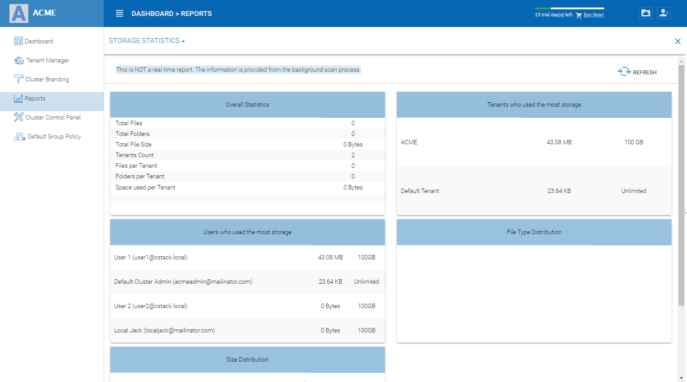
    
    STORAGE STATISTICS REPORT

4.8.6 Bandwidth Usage
^^^^^^^^^^^^^^^^^^^^^^^^

This shows the overall bandwidth usage statistics as well as more granular tenant and user level statistics.

.. figure:: _static/image_s4_8_60.png
    :align: center
    
    BANDWIDTH USAGE REPORT

**Cluster Settings**

``Cluster Manager`` > ``Cluster Settings``

Under cluster settings, you can configure auto-client update, web applications, and other settings like 2-Step
Verification, multiple domain support, etc..

4.8.7 Google Drive and OneDrive Integration (Storage Manager)
^^^^^^^^^^^^^^^^^^^^^^^^^^^^^^^^^^^^^^^^^^^^^^^^^^^^^^^^^^^^^^^^

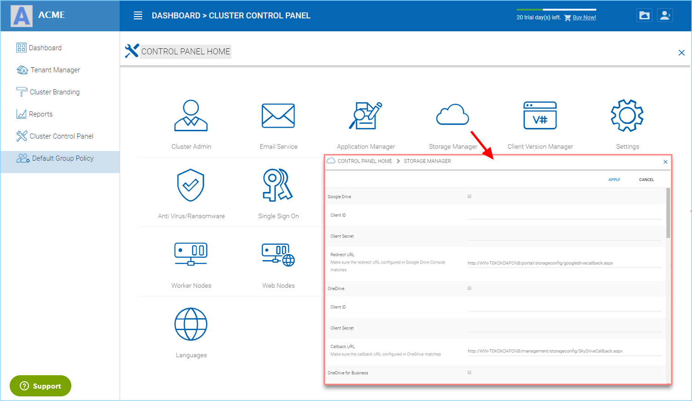
    
    CLOUD STORAGE MANAGER

4.8.9 OneDrive for Business Integration
^^^^^^^^^^^^^^^^^^^^^^^^^^^^^^^^^^^^^^^^^^

In order to complete the OneDrive for Business Integration, you will first need to login to your
company's Office 365 portal.

.. figure:: _static/image237.png
    :align: center
    
    MICROSOFT ONEDRIVE BUSINESS INTEGRATION

After that, click on the Admin tile and then on to the "Azure AD" section.

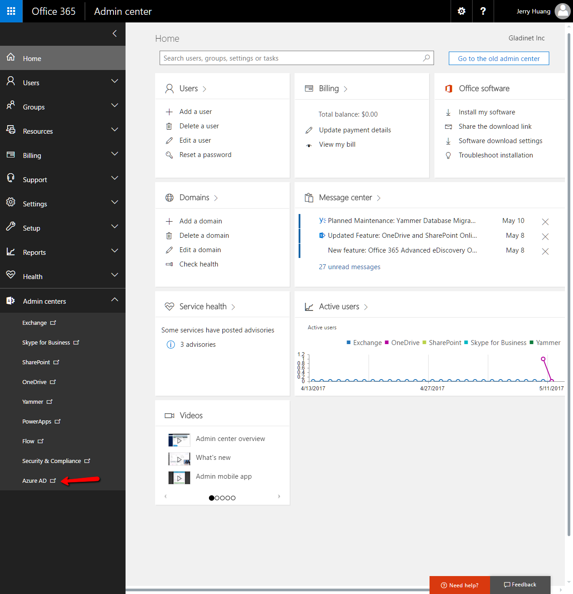
    
    AZURE AD SETTINGS

After that go to the Applications section of the company Azure AD web portal.

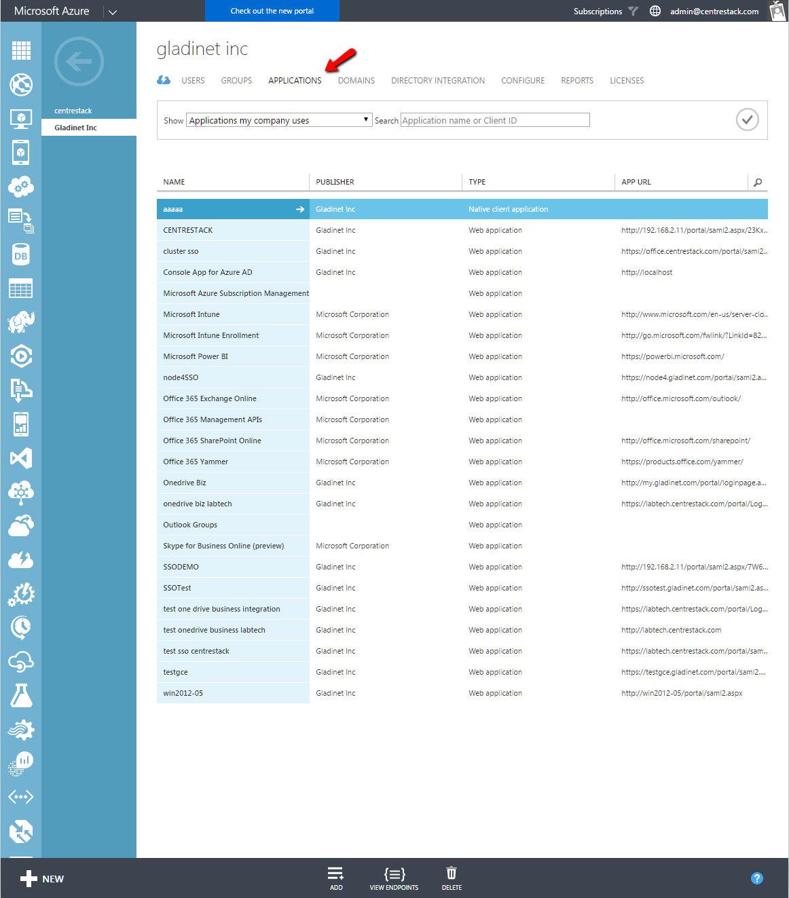
    
    AZURE APPLICATIONS SETTINGS

Add a "Web Application"

Sign On URL: 

  This can be set to the LoginPage.aspx for your Cluster Server.

Client ID: 
  
  This will be generated by Azure AD and you will need to copy it back 
  to the configuration page of the Cluster Server.
  
App ID URI:

  This can be the same as the Sign On URL
  
Reply URL:

  This field can be 
  https://your-centrestack-server/management/storageconfig/SkyDriveCallback.aspx

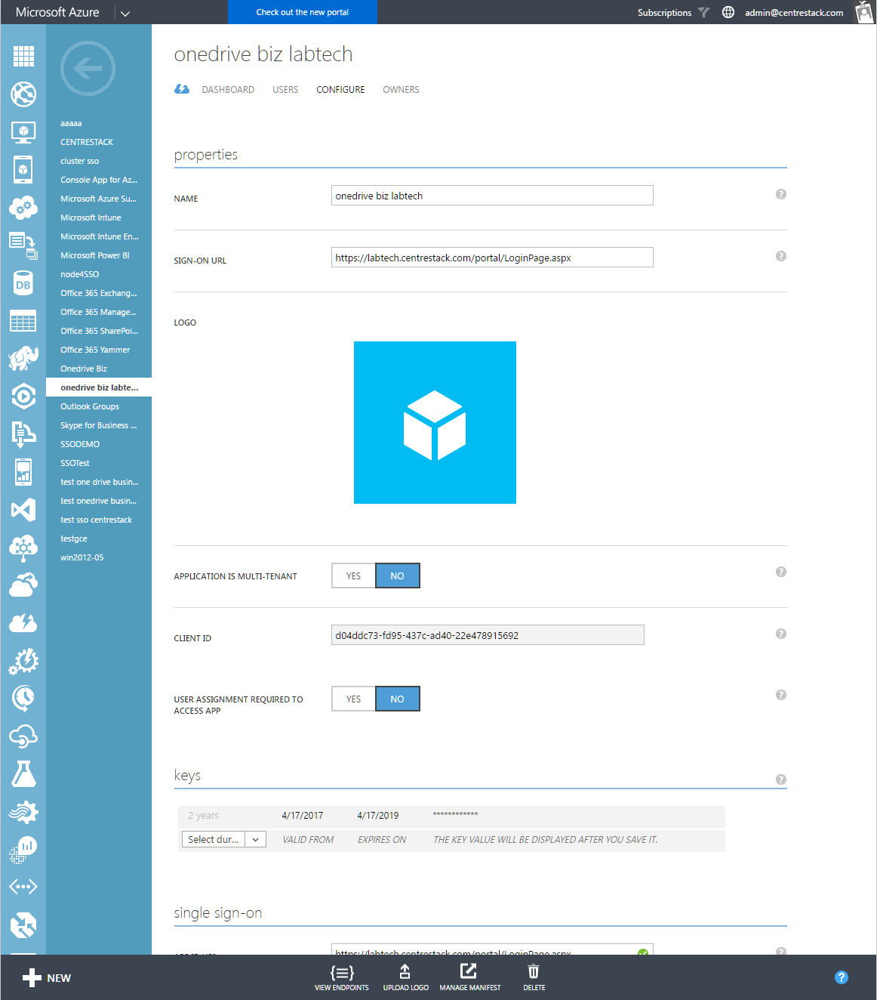
    
    ONEDRIVE BIZ LABTECH SETTINGS

You will need to grant permissions according to the following pictures.

Office 365 SharePoint Online:

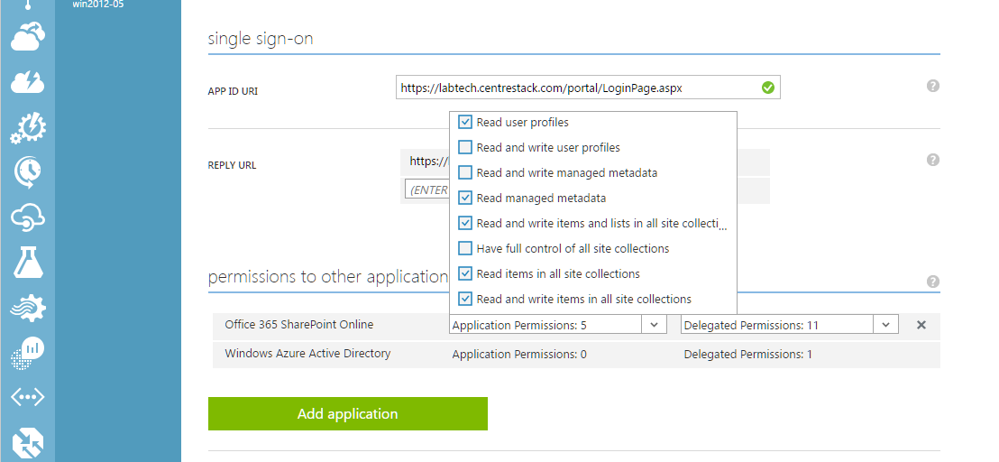
    
    OFFICE 365 SHAREPOINT PERMISSIONS 1

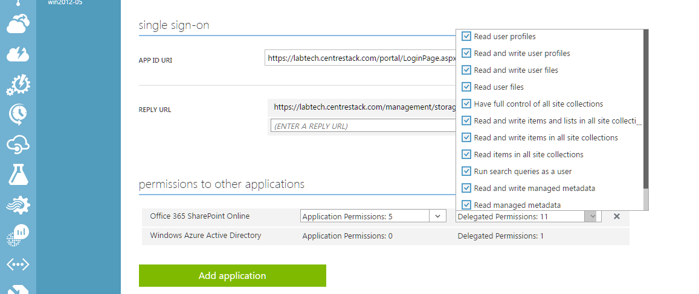
    
    OFFICE 365 SHAREPOINT PERMISSIONS 2

Windows Azure Active Directory:

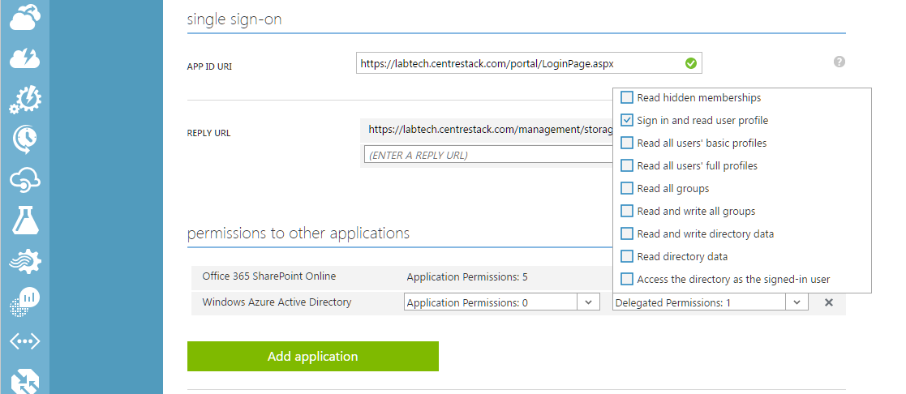
    
    AZURE ACTIVE DIRECTORY SETTINGS

4.8.10 (Client Version Manager) Client Auto Update
^^^^^^^^^^^^^^^^^^^^^^^^^^^^^^^^^^^^^^^^^^^^^^^^^^^^

``Cluster Manager`` > ``Cluster Settings`` > ``Client Version Manager``

For Windows Client, Mac Client and Windows Server Agent, there is an auto client update feature. Each upgrade package contains
the updated clients. By clicking on the ``Publish`` button [see **(1)** below], the newer package can be published to clients out there.

Every new Cluster Server upgrade contains the newer Windows client, Windows Server Agent and Mac Client. The Cluster users via manual download can get the clients that are included in the Cluster Server. However, for existing users with previously installed clients, those older clients will not auto upgrade until the newer client packages are published.

**(2) Daily Upgrade Limit** 

    This is a per-worker node setting. For example, if you have 2 worker nodes, and set the daily upgrade limit to 100, maximum 200 clients will be upgraded per day.

**(3) Apply to Users** 

    This typically is used for testing prior to pushing the client out.

**(4) Do Not Apply to Users** 

    This typically is used for testing prior to pushing the client out and to exclude certain users.

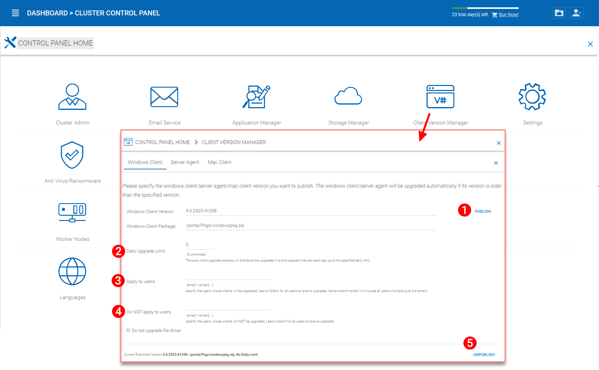
    
    WINDOWS CLIENT VERSION SETTINGS

.. note::

    The windows client out there has a process running as a background windows service. The service will periodically check for a newer upgrade in about 1-2 hour intervals. Once a newer client package is published and discovered, the newer package will be downloaded. However, if the client is still actively running, the replacement and upgrade will not happen until the client application is stopped and restarted. This usually happens when the user logs off their Windows or restarts their desktop altogether.
    
    If the Windows client software is actively running, the user may be seeing a message popup from the system tray area asking the user if they want to restart the client software and to receive the newer version.
    
Once a client is published for client auto upgrade, you can use ``Unpublish`` **(5)** to stop the client auto upgrade.

    
**Server Agent**

    Windows Server Agent can be separately published for auto upgrade.

**Mac Client**

    Mac client can be separately published for auto upgrade.

4.8.11 Application Manager
^^^^^^^^^^^^^^^^^^^^^^^^^^^^^

``Cluster Manager`` > ``Cluster Settings`` > ``Application Manager``

You can also configure Web Apps under ‘Application Manager’ tab in Cluster Settings. This will enable the users to edit documents using the web apps. The applications here only apply to web portal based editing.

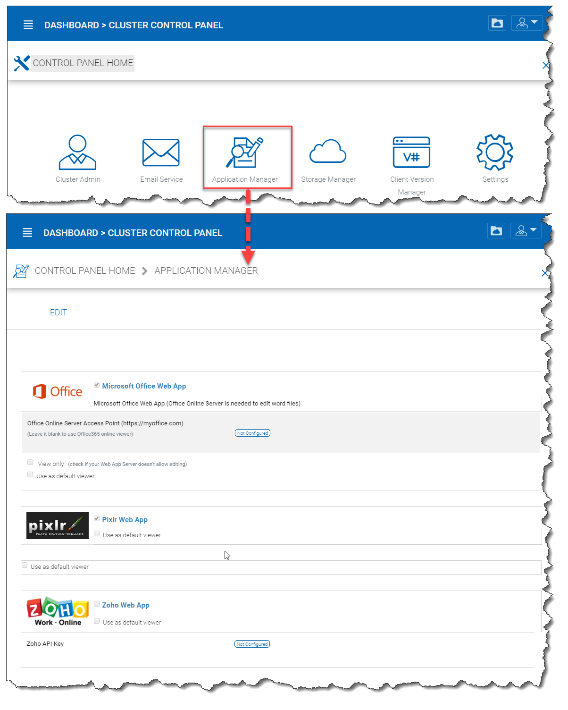
    
    APPLICATION MANAGER SETTINGS

Once an application is enabled, you will be able to see the context menu entry from the web based file and folder manager view.

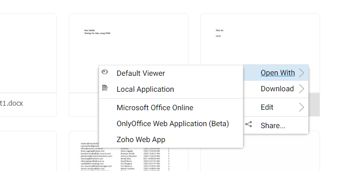
    
    APPLICATION CONTEXT MENU

4.8.12 Settings
^^^^^^^^^^^^^^^^^

``Cluster Manager`` > ``Cluster Settings`` > ``Settings``

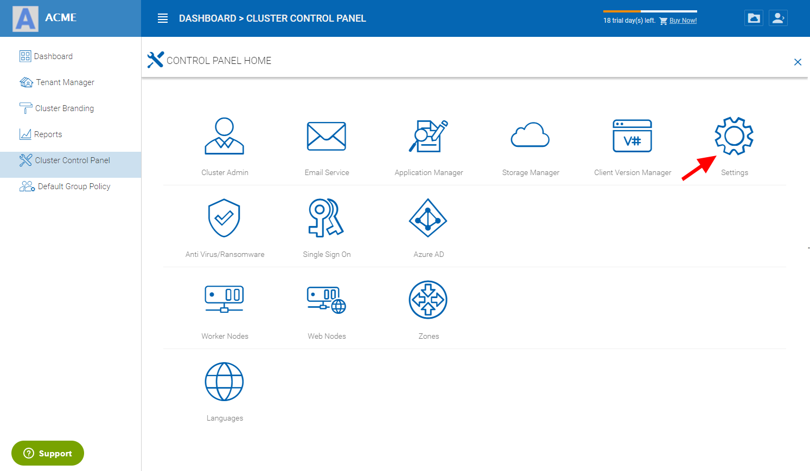
    
    CLUSTER SETTINGS

********************
4.9 Cluster Settings
********************

``Cluster Manager`` > ``Cluster Settings`` > ``Settings`` > ``Cluster Settings``

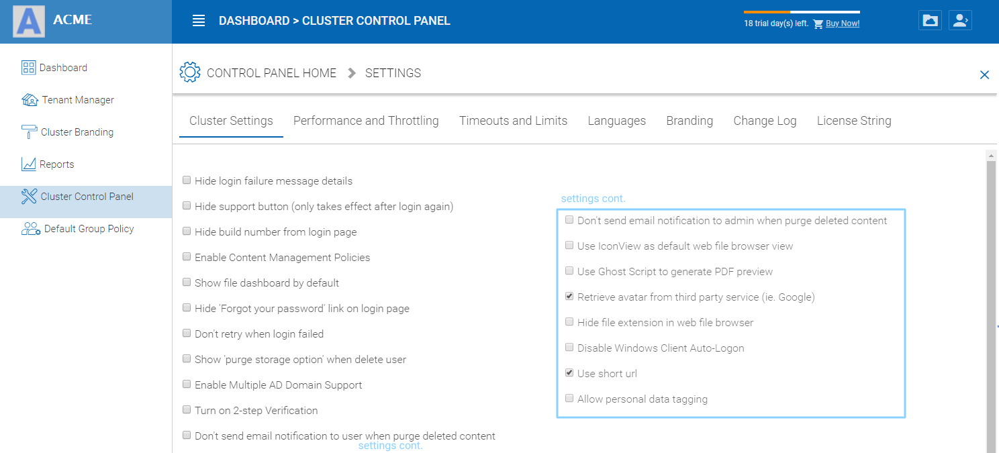
    
    CLUSTER SETTINGS PERMISSIONS

**Hide Login Failure Message**

    When checked, the login failed message will be replaced by a very generic “Login Failed” message. When un-checked, it may return a more meaningful login error, such as user-not-found, authentication-error and so on. This is a security feature if you don't want to give out too much information for hackers to guess a reason for authentication failure.

**Hide support button**

    This hides the floating support icon.

**Hide build number from login page**

    This controls the build number on the web portal login page.

**Enable Content Management Policies** – Reserved

**Hide ‘Forgot your password’ link on login**

    Most often it is used when Active Directory integration is set. The user will need to do a forget-and-change password the normal Active Directory way instead of the way CentreStack provides. In this case, it is recommend to hide the "Forgot your password" link.

**Don’t retry when login failed**

    Most often it is used when the Active Directory user has low failed-count on lock-out policy. When the user’s password is wrong, a few retries can lock out the user’s Active Directory account. The retry feature can be used when there is no Active Directory lock out or when the lock out count is high.

**Show ‘purge storage option’ when delete user**

    By default, when a user is deleted, the user’s home directory storage content is not touched for later use or review. If it is desired to delete the user’s content when the user is deleted, this can show the purge option.

**Enable Multiple AD Domain Support**

    In the multi-tenant environment, you can always link one Active Directory to a tenant. However, in some cases, a single tenant may have multiple un-related Active Directories. In this case, Enable Multiple AD Domain support will be useful. 
    
    When you have multiple Active Directory from multiple forests in a specific tenant, you can turn on this option. The Cluster Server software is capable of automatically searching for domains in one single forest.

    However, for multiple forests, the software will allow you to manually enter the root of each domain when this option is enabled.

    .. note::
    
        The AD support here is related to using LDAP for Active Directory connectivity.

        If you are using "Server Agent" to connect to multiple Active Directories in proxy modes, you don't need to turn it on here. 
        
    .. note::
    
        If I turned it on, where to see the change?
        
        You will see the difference in the per-tenant Active Directory setting page. Instead of a single AD setup, you will see a table that allows you to add multiple rows, with each row represents a single Active Directory LDAP connection.

**Turn on 2-step Verification**

    The Cluster Server supports Google Authenticator, Amazon Virtual MFA soft token for 2-step verification. When this setting is turned on, users will see the option to configure 2-step verification in their web portal.

**Don’t send email notification to user when purge deleted content**

    When the user delete files, they are not actually deleted immediately. The purge is asynchronous and scheduled at a later time. This setting controls the notification.

**Don’t send email notification to admin when purge deleted content**

    When the user deletes files, They are not actually deleted immediately. The purge is asynchronous and scheduled at a later time. This setting controls the notification to the administrator.

**Use 'Icon View' as default web file browser view**

    Icon view is set when this setting is enabled. (The opposite is ListView)

**Use Ghost Script to generate PDF preview**

    There are two ways in the system to generate PDF preview. This setting will force the system to use one way or the other. For example, force it to use Ghostscript to generate PDF preview.

**Retrieve avatar from third party service (i.e. Google)**

    This is a usability feature that users's picture can be queried from Google.

**Hide file extension in web file browser**

    This setting will hide the file extension.

**Disable Windows Client Auto-Logon**

    This is a security feature. The result is every time the windows client is done running, the next time the user tries to login, it will not remember the login token and the user will have to re-type the credential to get in.

**Web Browser Session Timeout (minutes, 0 - never timeout)**

    This is the web browser session time out value. Default is set to 15 minutes. For default cluster administrator, we recommend increase this value to a bigger number so it is easier for web based management work not to time-out too soon.

**Native Client Token Timeout (days)**

    For Windows client and Mac client, this defines the token time to live. 

**Distributed Lock Idle Timeout (minutes, 0 - never timeout)**

    This setting is related to automatic file locking. When a file is automatically locked, the machine that has the file locked will need to maintain a healthy heart beat with the Cluster Server. If the machine is offline (idle) and can't report back to the Cluster Server for a period of time, the lock that was automatically grabbed will need to be released.

    If this is not desired, the user can always use manual "Check Out" to lock a file and that will not be subject to the timeout.

**Open third party web application in new window when the height of the web browser is less than**

    This is a usability feature. When using third party web application to edit documents in Cluster Server web browser file and folder view, if the web browser height is too short, the third party web application may not function properly. 

**Max Device Count(Concurrent Device Count) for Each User (0-Unlimited)** 

    This is the number of concurrent devices connected to the Cluster Server for each user. The default is not limited.

4.9.1 Performance and Throttling
^^^^^^^^^^^^^^^^^^^^^^^^^^^^^^^^^^^

``Cluster Manager`` > ``Cluster Settings`` > ``Settings`` > ``Performance and Throttling``

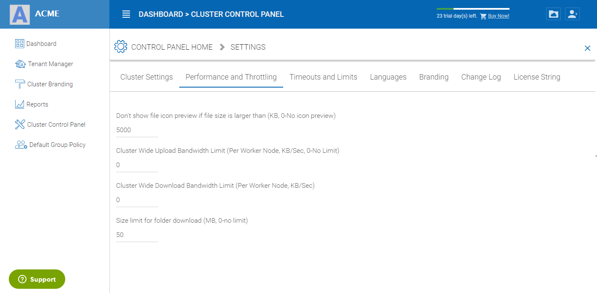
    
    PERFORMANCE THROTTLING

**Don't show file icon preview if file size is larger than(KB, 0-No icon preview)**

    This is used to control iconview thumbnail generation in the web browser files and folders view. The generation of thumbnail takes CPU power from the Cluster Server. For big files, the generation of thumbnail may negatively affect the system performance. So it is recommended to cap the feature to a certain image size.

**Cluster Wide Upload Bandwidth Limit(Per Worker Node, KB/Sec, 0-No Limit)**

    This is to limit upload bandwidth.

**Cluster Wide Download Bandwidth Limit(Per Worker Node, KB/Sec)**

    This is to limit download bandwidth.

**Size limit for folder download (MB, 0-no limit)**

    This is to prevent user downloading a very big folder and using up all the Cluster Server resources.

4.9.2 Languages
^^^^^^^^^^^^^^^^^

``Cluster Manager`` > ``Cluster Settings`` > ``Settings`` > ``Languages``

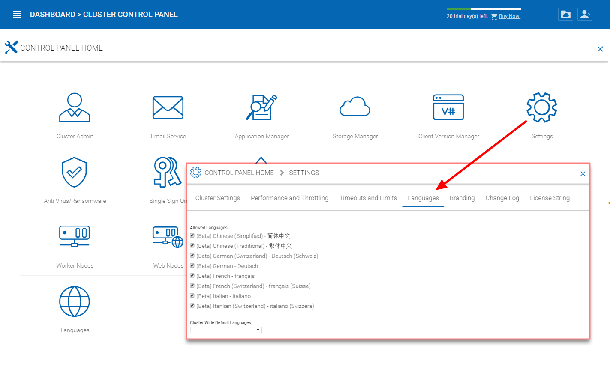
    
    LANGUAGE SETTINGS

This section sets up the web portal languages and also the client application languages
for Windows client.

4.9.3 Branding
^^^^^^^^^^^^^^^^

``Cluster Manager`` > ``Cluster Settings`` > ``Settings`` > ``Branding``

.. figure:: _static/image_s4_9_30.png
    :align: center
    
    ENABLE TENANT BRANDING

**Don't Show Tutorial Videos**

    At different places in the web portal, there are tutorial videos. This setting is to hide those videos, which may have CentreStack references inside.

**Enable Tenant Branding**
    
    Allow tenants in the system to have their own co-branding on a tenant-by-tenant basis. The branding can override the default Cluster wide branding when the solution is accessed via a specific URL. Most of the time, a wild card SSL certificate is used so the Cluster Server solution can be binded to different URL's within a common suffix.

    For example \*.mycompany.com , while tenant1.mycompany.com is for tenant 1's access.

**Only allow branded client to access**

    This can lock out the generic client and only allow the branded client to connect.

**Branding Id**

    This setting only applies to full-branding clients. For the full-branding client, it is possible to lock the full-branding clients to only connect to the branded Cluster Server. When set, it will lock out the white-label clients or other non-branding clients and will not allow them to connect.

4.9.4 Change Log
^^^^^^^^^^^^^^^^^^^

``Cluster Manager`` > ``Cluster Settings`` > ``Settings`` > ``Change Log``

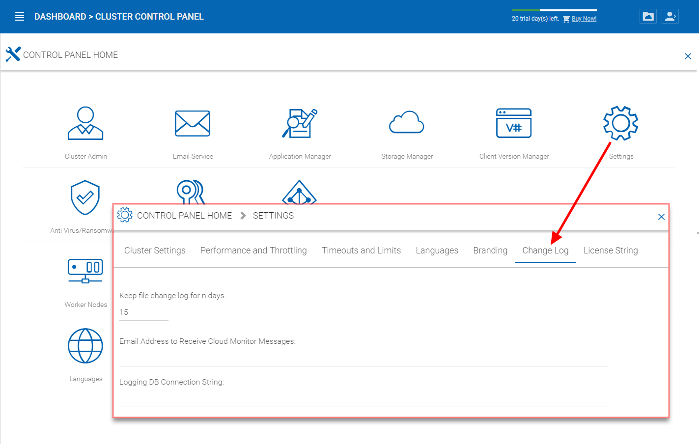
    
    CHANGE LOG SETTINGS

**Keep file change log for n days**

    This is a cluster wide retention policy for the file change log.

    The file change log is in the SQL database, for deployments that are using SQL Express, it has size limitation for the database. In the deployment guide, there is option to split the file change log into MySQL database or split it to a different SQL database. This option typically is used to keep the size of SQL small.
    
    .. note::
    
        After the Cluster Server is running in production mode for a while, we recommend reviewing the file change log database table and the file index table to see how big those tables are.

**Email Address to Receive Cloud Monitor Messages**

    From time to time, the cluster monitor service may send an email about the status and alerts.

**Logging DB Connection String**

    This is to split the file change log, device table, file index table and audit trace table out of the main database into a secondary database. The secondary database can be a Microsoft SQL Server or a MySQL Community server.
    
    The Cluster Server database is split into the core part and the logging part. The core part can store the DB connection string that connects to the secondary database. This setting used to be in the web.config file.

**License String** – Reserved.

    This is for Cluster Servers that are isolated from the Internet, can't be activated online and has to use a license string for offline activation.

4.9.5 Anti Virus
^^^^^^^^^^^^^^^^^^^

``Cluster Manager`` > ``Cluster Settings`` > ``Anti Virus``

You can enable anti-virus protection which will ensure that the files being uploaded via the Cluster Server are scanned by the selected anti-virus software.

You will first need to obtain the anti-virus service that is independent from the Cluster Server, and get it directly from the anti-virus vendor. After that, you can integrate the anti-virus service into the Cluster Server.

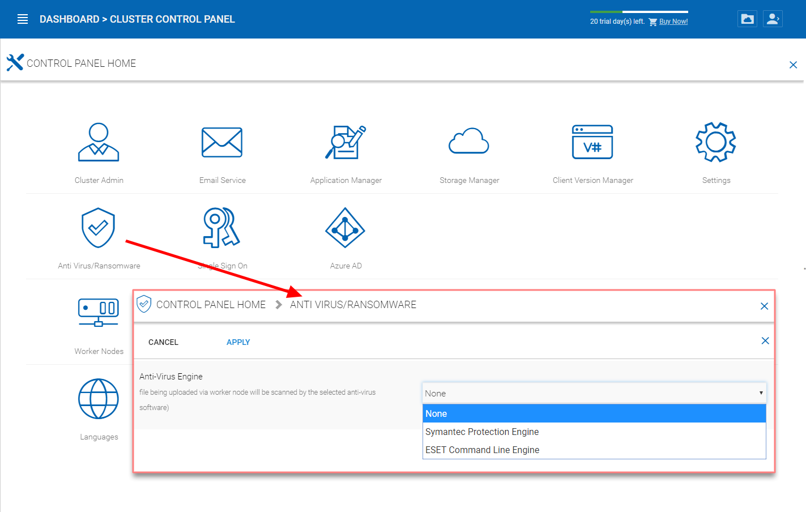
    
    ANTI-VIRUS SETTINGS

*************************
4.10 Default Group Policy
*************************

Default group policy can be applied to all tenants in the cluster. However, if the tenant also defines its own group policy, the tenant policy can over ride cluster wide default group policy.

Please reference the ``Group Policy`` in the tenant administrator section for full list of policy items.

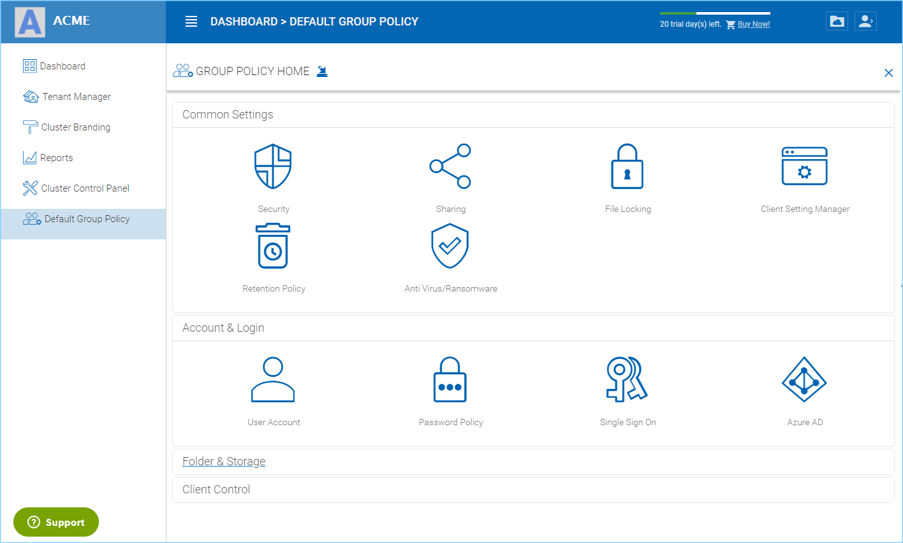
    
    GROUP POLICY SETTINGS

*******************************
4.11 Language Settings
*******************************

We have automated translation and provided the resource files that you can use to localize the web portal and clients in the language  of your choice. If there are strings that not translated yet in the language you want, just go ahead and select the string and put in the translated string in the window for the language selected.

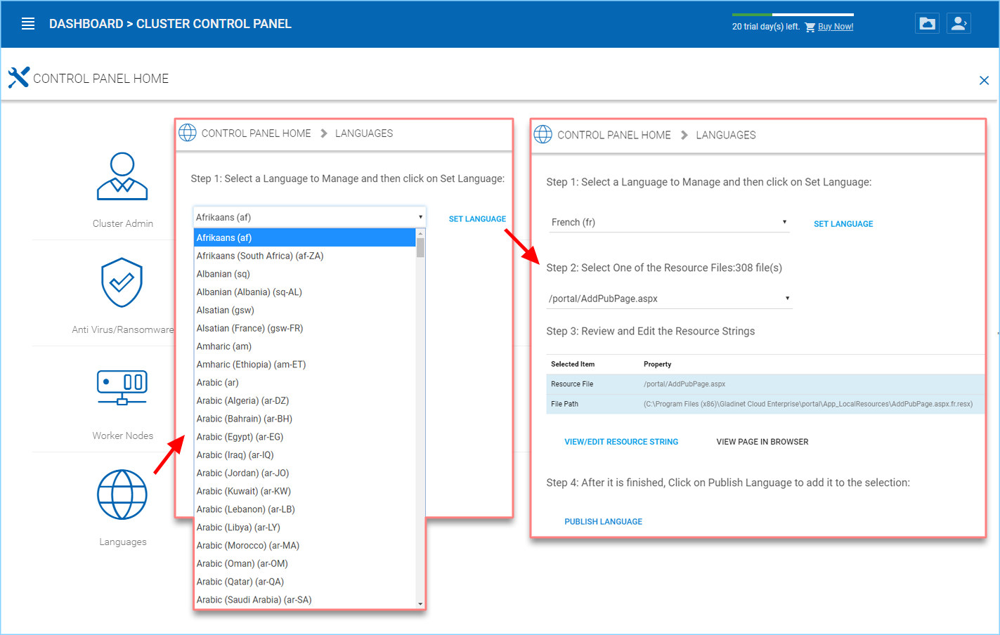

