##############################
5 Tenant Administration
##############################


.. note::
    A tenant is usually mapped to an organization or in the case of MSP managed organization, a service provider would call them clients. Basically, a tenant is a management scope that represents an organization.

Tenant manager scope is defined for tenant administrators. For a multi-tenant Cluster Server system, each tenant has an administrator. For a single-tenant Cluster Server system, the default cluster administrator is also the tenant administrator.

Tenant Manager is completely web-based.

From the Cluster Manager Dashboard, you can access the Tenant Manager by choosing it in the left-side menu **(1)**. This menu can be toggled on and off by clicking the "hamburger" menu **(2)** in the top left corner of the Dashboard. 

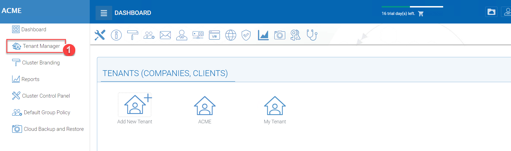

    CLUSTER SERVER DASHBOARD

.. note::

    Once you have selected the Tenant Manager in the left-side menu, you can access the management console directly by clicking the "Default Tenant" icon.
    
    Now the following guide will assume you are a tenant administrator, which is not the default cluster administrator.

You can also log in directly to the web portal as the tenant administrator instead of the default cluster administrator to get to the tenant administrator management web interface.


**********************
5.1 Tenant Dashboard
**********************

``Tenant Manager`` > ``[Tenant]`` > ``Tenant Dashboard``

This is the Tenant Dashboard.

.. figure:: _static/2021newimage079.png
    :align: center

    TENANT DASHBOARD


*********************
5.2 Storage Manager
*********************

The Storage Manager is at the right panel of the tenant dashboard when the screen is wide enough to show the right panel. It will be shown normally on a desktop screen.

.. figure:: _static/image_s5_2_00.png
    :align: center

    STORAGE MANAGER ACCESS
    
To access the Tenant Storage Manager, click the 3-dot menu on the bottom right of the Tenant Dashboard (Backend Storage section).

.. note::

    You can mount different storage services into a single namespace (folder structure). For example, if you have multiple Amazon S3 buckets, you can mount them all in. If you have multiple OpenStack Swift accounts, you can mount them all in as well. If you have multiple file server network shares, you can add them to the storage manager.

.. note::
  
    The cluster manager can define whether or not the Storage Manager is exposed to the tenant administrator.

.. figure:: _static/image_s5_2_20.png
    :align: center

    STORAGE MANAGER SETTINGS


5.2.1 Home Storage
^^^^^^^^^^^^^^^^^^^^

.. figure:: _static/image_s5_2_10.png
    :align: center

    EDITING HOME STORAGE SETTINGS

Home storage is the most important property in the tenant manager. It is used in many ways. For example, the users' home directory can be set up under the home storage (if the user's active directory home directory property is not used). 

.. note::

    In the field, one of the common mistakes is that a tenant's root network share is mapped directly to the home directory of the tenant. The home directory can not be shared from the root, so if your end goal is to turn the network share directly into a team folder, you are better off mapping the home directory to another location, and later attach the network share as a secondary folder and turn that secondary folder into a team folder.


5.2.2 Attach Storage
^^^^^^^^^^^^^^^^^^^^^^

Storage is an important component in the Cluster Server. you can connect the tenant to a specific storage service. For example, you can connect it to local file server storage; you can also connect the tenant to cloud storage services such as Amazon S3, Windows Azure, and OpenStack Swift.

.. figure:: _static/image_s5_2_21.png
    :align: center

    ATTACH STORAGE

After clicking the "Attach Storage" button, the Cluster Server will take some time to discover file servers in the local area network and also provide a section to add cloud storage.


    TYPES OF ATTACHED STORAGE


5.2.3 File Servers in Local Area Network
^^^^^^^^^^^^^^^^^^^^^^^^^^^^^^^^^^^^^^^^^^

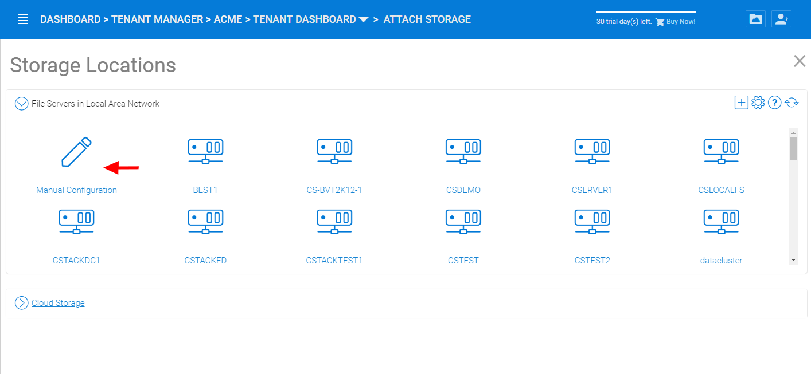

    LOCAL AREA NETWORK (LAN) STORAGE

In the File Servers in Local Area Network section, the Cluster Server will contact Active Directory or contact network browser in the local area network to try to find file servers in the local area network. Most of the time, if firewalls and network connections are properly configured, the file server can be easily added to the system. 

However, sometimes, there are some situations such as the DNS system or the NETBIOS system not being ready. In that case, the file server may be discovered but it may not be connected, you can use the Manual Configuration to manually connect to the file server.

.. figure:: _static/image_s5_2_32.png
    :align: center

    LAN ACCESS CREDENTIALS


5.2.4 Root Folder Name
^^^^^^^^^^^^^^^^^^^^^^^^

The Root folder name is the top-level folder name that will show up in the tenant administrator's folder structure. We recommend the folder name being descriptive and follow the normal Windows path recommendations (For example, certain characters that are not allowed).  

.. note::

    Remember this folder is only showing to the tenant administrator, it is not published to the team user yet. When it is time to publish the folder to the tenant users, the name that the tenant user will see can also be defined. It is recommended that if later on, the folder is to be published as a team folder, then the name for the team folder should be the same as the folder name here. It is recommended but not necessary to have the root folder name the same as your published team folder name.


5.2.5 Local Storage Location
^^^^^^^^^^^^^^^^^^^^^^^^^^^^^^

This is the file server UNC path or local windows folder path that you will connect into the tenant administrator's root folder structure. The idea here is you will take this folder and mount the folder to the tenant administrator's root folder structure with the name described in the "Root Folder name".


**User Name**

The user name is the Windows username, either it being local Windows user or global Active Directory user, this is a Windows account that is capable of accessing the "Local Storage Location".


**Password**

This is the password for the Windows user above.

.. note::

    We recommend this Windows user and their credential be set up as a service account, meaning the password isn't subject to the maximum password days via local security policy. The reason being, that, when it is time to rotate or change the user password, the connection here may be broken until the password is updated to match.


**“Always access the storage using logon user identity”**

    When you have Active Directory Integration, and mount an existing file server network share in, you can select “Always access the storage using logon user identity” so the ACL (NTFS Permission) on the file server share will be used natively. The access permission will be checked natively against the user’s Active Directory identity that is defined by the NTFS permission.

    This option only applies to the "Local Storage" such as network share, DFS share, local folder, and etc.

**“The share is from a Linux/Unix/ZFS server”**

    Most of the time, you don’t want to check this flag because your file server share shall behave like a normal Windows Server share, even if it doesn’t come from a Windows Server. 

    In some small SOHO network storage devices, it may only allow one connection from one IP address, so if that is the case, you want to check this flag. Most of the time, you just don’t need to check this when the network share is capable of taking multiple connections/sessions from one single machine.

**“This share is a DFS share”**

    If the share is a DFS share, you will check this checkbox, because DFS share has an extra layer of translation to translate back down to normal file server shares. This flag tells the Cluster Server to do an extra DFS translation back to SMB share before connecting to the share.

**“Enable Inplace Versioning”**

    The underlying file server network share may not have explicit version control (it may have volume shadow copy for other purposes). This will add Cluster Server version control to the file server network share. It is independent of and not related to the volume shadow copy.

.. note::
    
    In place versioning will put the older version of the file into a __ver__ subfolder in the same folder structure making the name for In-Place Versioning so the folder structure is maintained as-is, while extra old copies of the file will be stored in a specific subfolder. 

.. figure:: _static/image_s5_2_50.png
    :align: center

    IN-PLACE VERSIONING

Here is a demo video showing the result of "Enable Inplace Versioning" when the root folder ('forward slash') is mounted with the "Inplace versioning" enabled.

.. raw:: html

  <iframe width="560" height="315" src="https://www.youtube.com/embed/SLSG10jK7hU" frameborder="0" allowfullscreen></iframe>


**********************************************
5.3 Storage Manager – Cloud Storage Property
**********************************************

Besides local storage, you can also mount cloud storage into the system. If you have Amazon S3, or Amazon S3 compatible storage service, or if you have OpenStack Swift or OpenStack Swift compatible storage, you can connect it into the system. You can see the full list of storage services supported, including SoftLayer Object Storage, Google Cloud Storage, Microsoft Azure storage, and more. 

.. figure:: _static/image_s5_3_00.png
    :align: center

    CLOUD STORAGE OPTIONS


.. _tenant_admin_collaboration:


5.3.1 Team Folders (Team Shares)
^^^^^^^^^^^^^^^^^^^^^^^^^^^^^^^^^^

``Tenant Management Console`` > ``Team Folder``

.. figure:: _static/2021newimage080.png
    :align: center

    ENTER TEAM FOLDER SECTION
    

The team folder concept is like a network share, meaning you can define a folder and then add users and groups to the folder and thus turn it into a team shared folder. The team folder will show up in the user’s folder list when the user is added to the team folder. 

When the server agent is in use, the team folder can be mapped directly to a network share from the server where the server agent is installed. 

When a directly connected network share is used, a team folder can be mapped to an SMB/CIFS network share directly. 

You can also turn any existing folder into a team folder. 

A Team folder has a tenant administrator scope so the team folder related sharing is limited to the users inside the tenant.

.. note::

    By default, the files and folders that the administrator can see is hidden away from the regular team user until those folders are published to the team users. 

.. figure:: _static/2021newimage081.png
    :align: center

    TEAM FOLDER SETTINGS


Create Team Folder
--------------------

``Tenant Management Console`` > ``Team Folder`` > ``Add New Team Folder``

You can click on the "+" sign to create a new team folder.

.. figure:: _static/2021newimage082.png
    :align: center

    ADDING A TEAM FOLDER

Once it is clicked, it shows four main sources of team folder, among other options:

    - Existing Tenant Storage (default location)
    - File Servers in Local Area Network
    - Remote File Servers
    - Cloud Storage

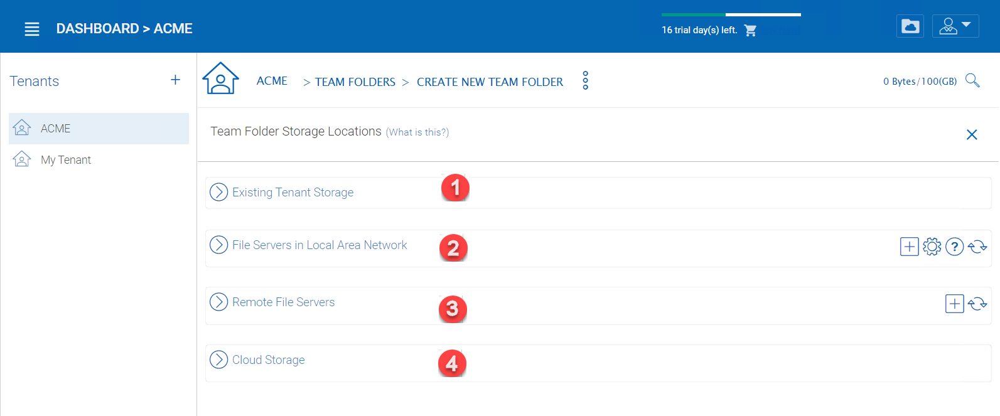

    TEAM FOLDER LOCATIONS

**Existing Tenant Storage (default location)**

    When you pick this option to create a team folder, the team folder will be created from the default storage from scratch with an empty team folder. Usually when you want to have a team folder that is brand new and empty, you can pick this option.
    
    Another use case is "Existing Folder(s)", in which you can pick several existing folders, which physically may not be in the same folder, but you can logically arrange them into the same team folder. For example, you may want to have a short term project that put "Building A", "Blue Print A", "Budget A", three different folders from three different places into one logical

.. figure:: _static/image_s5_3_13.png
    :align: center

    EXISTING TENANT STORAGE

    
**File Servers in Local Area Network**

    When you have files and folders from the local area network (LAN), you can convert the network share directly into a team folder in the Cluster Server. It is a one-to-one relationship between a team folder and a network share. When you pick this option, most of the time, the Active Directory server for this tenant is also in the same Local Area Network.
    
**Publish Tenant Home Storage As a Team Folder**

    By default, the tenant's root storage folder is not published to any team user. To use an analogy, it is like a C: drive on a Windows File Server, by default it is not published as a network share to users. However, if you want to make it available to users, you can pick this option. 

    .. figure:: _static/image_s5_3_13a.png
        :align: center

        LAN-BASED TEAM FOLDER

**Remote File Server**

    When you have server agents installed on remote file servers, those file servers will be visible and the network shares from remote file servers will be imported to the Cluster Server.
    
    .. figure:: _static/2021newimage084.png
        :align: center

        REMOTE TEAM FOLDER

**Cloud Storage**

    You can also pick Cloud Storage as this team folder's underlying storage. As shown in the following picture, you can pick Amazon S3, Windows Azure Blob, OpenStack Swift, and other cloud storage services.
    
    .. figure:: _static/image_s5_3_13c.png
        :align: center

        CLOUD-BASED TEAM FOLDER

**Team Folder Properties**


Team Folder Information
-------------------------

``Team Folder`` > ``{Pick a Team Folder}`` > ``info button``

.. figure:: _static/image_s5_3_14.png
    :align: center

    TEAM FOLDER INFORMATION ACCESS


Team Folder Permission Setting
--------------------------------

``Team Folder`` > ``{Pick a Team Folder}`` > ``edit button``

.. figure:: _static/2021newimage085.png
.. figure:: _static/2021newimage086.png
    :align: center

    EDITING FOLDER PERMISSIONS

**Collaborators**

``Team Folder`` > ``{Pick a Team Folder}`` > ``edit button`` > ``Collaborators Tab``

In the Collaborators section, you can define:

    
User List:

    The users and groups that are assigned to the team folder. The users with the owner flag will be able to manage the users. 

**External Sharing**

``Team Folder`` > ``{Pick a Team Folder}`` > ``edit button`` > ``External Sharing Tab``

You can see what folders and files have been shared and control access to those files from this setting.

.. figure:: _static/2021newimage086.png


    TEAM FOLDER PERMISSION SETTINGS

 **Access Policy**

``Team Folder`` > ``{Pick a Team Folder}`` > ``edit button`` > ``Access Policy Tab``

You can enable an access policy through this tab.

.. figure:: _static/2021newimage088.png
.. figure:: _static/2021newimage089.png


 **Client Access Policies**

 Define customized access policies to restrict and allow access based on the device location. For example, a company can enable access from the internet to only Windows clients and web clients. IT can configure allow or deny client access policies from the following locations:

Access from the internet, access from local network, access from Anywhere, access from customer-defined networks, deny access from customer defined networks.

The above allow and deny client access policies can be configured for the following clients:

web client, web management, windows client, mac client, mobile client.

.. figure:: _static/2021newimage090.png
.. figure:: _static/2021newimage091.png
.. figure:: _static/2021newimage092.png


 **Share Access Policy**   

    ACCESS POLICY SETTINGS

IT can also prevent data loss and data leakage of important company confidential shares by configuring ‘Share Access Policies’ for external users who are not company employees. Again, IT can configure allow or deny shares access policies from the following locations:

-Access from the internet
-Access from local network
-Access from Anywhere
-Access from customer-defined networks
-Deny access from customer defined networks   

The above allow and deny share access policies can be configured with the following conditions:

-Visible
-Permissions to list files
-Permissions to read files
-Permissions to create or update files and folders
-Permissions to delete files and folders
-Secure data room

**Folder Permissions**

``Team Folder`` > ``{Pick a Team Folder}`` > ``edit button`` > ``Folder Permissions Tab``

You can browse to different sub-folders and define the folder permission. The folder permissions defined here represent the Cluster Server side of the permission.

If you are leveraging native Active Directory/NTFS permission from a file server, you don't need to define any permissions here. 

.. note::

    You can think of the permissions as two different gates controlling the access to files and folders. The first gate is defined here as the ``Cluster Server Folder Permission``. After this permission check, there is still a check at the file server level (which is the NTFS permission). 
    
    In practice, usually it is done one way or the other. If you have decided to use NTFS natively, you can leave the permission settings here empty and not defined.

.. figure:: _static/2021newimage093.png
    :align: center

    TEAM FOLDER PERMISSION SETTINGS

**Settings**

``Team Folder`` > ``{Pick a Team Folder}`` > ``edit button`` > ``Settings Tab``

.. figure:: _static/2021newimage094.png
    :align: center

    TEAM FOLDER SETTINGS OVERVIEW

Here is a look at the details of the Team Folder Settings:

.. figure:: _static/2021newimage095.png
    :align: center

    TEAM FOLDER SETTINGS DETAIL

**Disable further sharing**

    Don't allow users to share out team folder contents.
    
**Create CIFS Share**

    If there are server agents connected to the tenant, create a CIFS share on the file server agent server as a standard Windows network share.
    
**Disable Offline Access**

    Don't allow Windows clients or Mac clients to mark their folders as offline from within the team folder.

.. figure:: _static/2021newimage096.png
    :align: center

    TEAM FOLDER SETTINGS - PERMISSIONS
    
**Synchronize folder permission automatically**

    If the folder is coming from a file server agent, sync the NTFS permission over to the cloud side. This is emulating NTFS permission with the |prodname| Server is away from the file server across the Internet.

    
**Don't show folder users doesn't have permissions to access**

    Hide the folder instead of showing users folders that they will receive "Access Denied".
    

**Quota and Retention Policy**

    Team folder can have a per-team folder retention policy.

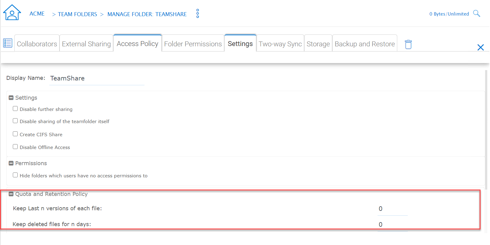

    QUOTA AND RETENTION POLICY

.. _tenant_admin_usermgr:


*********************
5.4 User Management
*********************


5.4.1 Regular User
^^^^^^^^^^^^^^^^^^^^

``Tenant Management Console`` > ``User Manager`` > ``User Manager``

In the Documentation, the regular user is often referenced as "Team User".

The first tab is the Regular User Manager. These are the users that have full privilege of home directory, sharing and other features. 

.. figure:: _static/2021newimage098.png
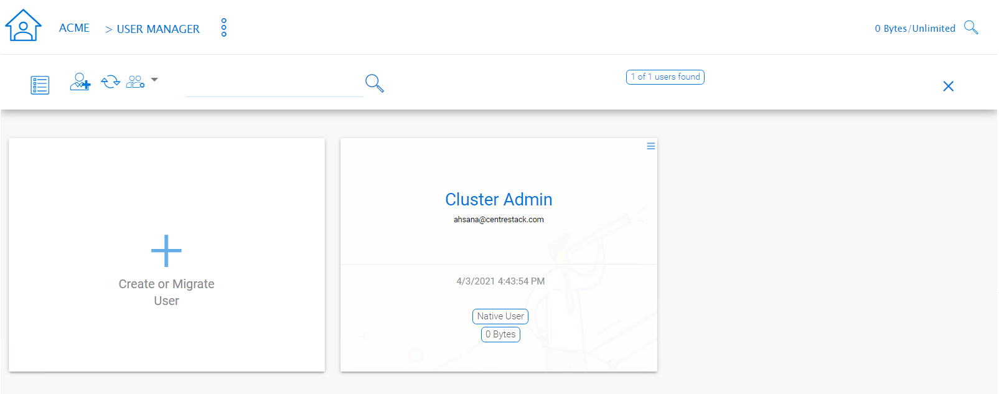

    USER MANAGER SETTINGS

User Manager also have a list view:


.. figure:: _static/2021newimage101.png
    :align: center

    USER MANAGER LIST/ICON VIEW TOGGLE

If you have Active Directory, normally these are the users in the Active Directory.

  - Native User
  
    These are the users that are created manually with an email.
    
  - AD User
  
    These are the users that are imported from Active Directory via LDAP.
    
  - Proxied AD User
  
    These are the users that are imported from Server Agent, where the file server agent is remote and away from the Cluster Server in the customer's site. The customer's Active Directory domain is also remote, and the file server itself (where server agent is installed) is in the
    remote Active Directory.


5.4.2 Guest User
^^^^^^^^^^^^^^^^^^

``Tenant Management Console`` > ``User Manager`` > ``Guest User Manager``

Guest users are users that don’t have a home directory. The only folder they have is “Files Shared with Me”. So they rely on other “Regular User” sharing files and folders with them before they can do anything. If nobody is sharing anything with a guest user, the guest user doesn’t have any read/write permission to any folder.

The primary reason for guest user to exist is to have a secure way for external user to collaborate and edit documents.


*******************
5.5 Group Manager
*******************

``Tenant Management Console`` > ``User Manager`` > ``Group Manager``

When you have Active Directory integration, you will leverage the Active Directory group instead of using Group Manager here. This group manager is to create a group of users in a simple way. It is not as complicated as Active Directory (such as supporting nested groups) but make it easy for non-Active Directory users. This is native Cluster group. In the product, you may also see AD group from the user selection user interface and Proxied AD group from the user related interface. The AD group and the proxied AD group are not the same as the group mentioned here.


5.5.1 Role Manager
^^^^^^^^^^^^^^^^^^^^

``Tenant Management Console`` > ``User Manager`` > ``Role Manager``

The Role Manager is to provide role based administration. For example, you may want to provide read-only permissions to some users. You can also assign some group policies to some groups of users. More and more policy items are added to the role manager so in addition to only use role manager for administration, it can be also used to define policy items for users.

.. figure:: _static/2021newimage102.png
    :align: center

    ROLE MANAGER ENTRY

When creating a role, there are 4 different sections

    - Sharing
    - Policies
    - Permissions
    - Assigned Users/Groups


Role Manager - Create New Role
--------------------------------

You can define areas in the tenant administrator's management console and assign it into a role. 

.. figure:: _static/2021newimage102.png
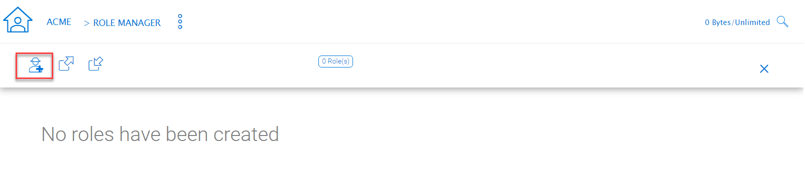
.. figure:: _static/2021newimage104.png
    :align: center

    ROLE MANAGER SHARING


Role Manager - Policies
------------------------

additional policies for the role.

.. figure:: _static/2021newimage105.png
    :align: center

    ROLE MANAGER POLICIES


Role Manager - Permissions
-------------------------

Additional Permissions that can be assigned to a role.

.. figure:: _static/2021newimage106.png
    :align: center

    ROLE MANAGER PERMISSIONS

Role Manager - Assigned Users/Groups
------------------------------------

After the content of the role is all set, users and groups can be assigned to a role.

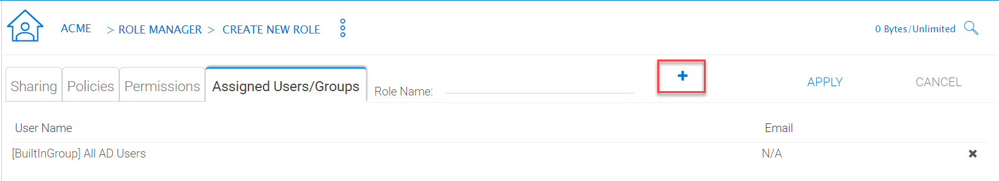

    ROLE MANAGER ASSIGNED USERS/GROUPS

.. _tenant_admin_grouppolicy:


******************
5.6 Group Policy
******************

``Tenant Management Console`` > ``Group Policy``

.. figure:: _static/2021newimage108.png
    :align: center

    GROUP POLICY SETTINGS


5.6.1 Common Settings
^^^^^^^^^^^^^^^^^^^^^^^

``Tenant Management Console`` > ``Group Policy`` > ``Common Settings`` 

.. figure:: _static/image_s5_6_10.png
    :align: center

    GROUP POLICY COMMON SETTINGS


Security
----------

``Tenant Management Console`` > ``Group Policy`` > ``Common Settings`` > ``Security``

.. figure:: _static/2021newimage109.png
    :align: center

    GROUP POLICY SETTINGS

**“Allow Cluster Admin to manage my tenant”**

    when enabled, the cluster-admin will be able to use the “Manage Tenant” link to manage the tenant in the tenant manager. This is very convenient for cluster administrators (typically system administrators from service providers) to provide management work to the tenant.


**“Enable Authenticating User with Google Apps Credentials”**

    when enabled, users can login using Google Apps credentials.


**"When delegate admin login via server agent, impersonate as tenant admin"**

    Server agents typically need to sync to the default tenant administrator. It is recommended when a delegate administrator setup a server agent, it needs to impersonate the default tenant administrator.


**“File upload and download must go through worker node”**

    (This setting may only be available from cluster administrator side)

    For Amazon S3 type of cloud storage/object storage, it is recommended NOT to force file upload and download going through worker nodes, because Amazon S3 is good for offload the upload/download between the access clients and the backend Amazon S3 storage. However, for OpenStack Swift storage, depending on how it is set up, you may want to turn this on to force File Upload/Download going through worker node for security reasons.

    This setting may be checked by default. However, based on your configuration, it may not need to be checked.

    For example, if you are using file server network share as the storage location, the upload and download has to go through worker node anyway, so there is no need to check this checkbox.

    There may be some situations  that this setting must be checked. For example, you may be using native object storage such as Amazon S3 for storage. However, your company policy may disable direct access to Amazon S3. So in this case, you will have to route traffic through the worker node.


Sharing Settings
------------------

``Tenant Management Console`` > ``Group Policy`` > ``Common Settings`` > ``Sharing``

.. figure:: _static/image_s5_6_12.png
    :align: center

    GROUP POLICY SHARING SETTINGS

**“Users must log in to access the content in 'Files shared with me' folder”**

    When sharing files and folders with users, you can force the sharing to create guest accounts for users that are not already in the system. It is more secure when asking the receiver of the share to sign in to receive shared items. This disables anonymous sharing.

    If this setting is not enabled, users can share files and folders to an outside email address without requiring outside users to create a guest user account.


**“Disable user's ability to share home directory content externally”**

    This feature disables the ability for a regular user to share home directory contents for security reasons.


**“Enable Internal Public Share URL”**

    If you have an internal public share you can use this setting to enable it.

    When this is enabled, it will use the Internal URL property to generate a web link for shared file/folder.


**Disable Public Link**

    This will disable the public web link feature in the sharing dialog.


**“Show guest user creation option”**

    When enabled this shows the guest user creation option which you will see when 'Sharing' a file or folder by email. This is how you can provide full edit capability to a guest user, as they must be logged in to modify a file or folder in the |prodname|. 


**“Enable distribution group detection in file/folder sharing's user interface”**

    With active directory integration, sometimes you want to share files and folders with a distribution group. This feature allows detection of distribution group and expands the group so the sharing will be done with the users in the group, instead of using the group as a single user.


**"Show user list in sharing dialog"**

    When enabled, the user list will be displayed in the recipient's dropdown list.


**"Show guest user list in sharing dialog"**

    When this option is enabled, the guest user list will be shown in the recipient dropdown list.


**"Show group list in sharing dialog"**

    When this option is enabled, the group list will be shown in the recipient dropdown list.


**"Allow user enter share name"**

    By default the file name or folder name is used for the share name. However, if user has many same name folders or files. Sharing them out sometimes many not know which is which. This setting allows user to change share name. For example, when sharing out a "Documents" folder, it can be named "Documents in top level folder".

**"Send a copy of file sharing invitation email to share owner"**
   
    When sending the file-sharing email, sending a copy (CC) to the owner of the share (usually the sender of the email)


**"Don't append email to shared object name under 'Files Shared With Me'"**

    When enabled, emails won't show next to object names in 'Files Shared With Me' view.


**"Disable folder sharing"**

    When enabled users will not be able to share folders. 


**"Enforce password protection"**

    When enabled all users (including guest users) will be required to use complex password protection. 


**“Expiration Time for Shared Folder/File (Days):”**

    When set, during the file/folder sharing wizard, the expiration time dropdown selection will not be shown, it will be pre-set to expiration set in here.


**“Maximum Share Expiration Time (Days):”**

    When set, this creates an upper limit to the time a share will be available, which forces all shares to expire when this limit is reached. 

**"Notify share owner n days before share expiring (0 - do not notify)"**

    Notify the sender (owner) of the share before share expiration.

**"Expiration Time for public links (Days):"**

    If left as zero, public link will never expires, otherwise the public link will be purged after expired.


**“Don’t create a guest user account if the recipient is from the following domains (i.e. company.com;company1.com)”**

    Blacklist guest emails from the domains listed here. Do not allow sharing to these domains. 


**“Only allow sending shares to the specified domain”**

    You can further limit the sharing to some domain instead of random email. For example, if your primary collaboration target is with ACME corporation and you can limit the sharing to your domain and also ACME domain.

**"Only allow sending shares to the specified domain(s) (i.e. company.com;company1.com)"**

    When it is set, the external sharing can only be shared to the white-list of email domains (which represent external partners, clients and etc)

**“Default folder to store attachments from Outlook plugin (/folder/subfolder)”**

    Allows you to designate where Outlook attachments are saved.


File Locking Settings
-----------------------

```Tenant Management Console`` > ``Group Policy`` > ``Common Settings`` > ``File Locking``
File Locking can be accessed from the following location in the Tenant Dashboard's Group Policy section. 

.. figure:: _static/2021newimage110.png
    :align: center

    GROUP POLICY FILE LOCKING
    
After you click the "File Locking" icon, here is the screen for the file locking settings details.

.. figure:: _static/image_s5_6_13a.png
    :align: center

    FILE LOCKING SETTINGS


Settings under file locking applies to all clients which include desktop clients as well as server agent clients.


**“Enable Distributed locking when accessing files”**

    In the Cluster Server, there are two ways to lock files, one is manually by right-clicking on a file and select “Check out”. The other way is automatic based on certain binary executables. For example, you can see Microsoft Office executable files like winword.exe and so on.


**“Lock file exclusively”**

    When enabled, the locked file will be locked exclusively. When disabled, the other user who is trying to open the locked file will be notified about the lock status, but will still be able to open the file.


**“Automatically open file in read only mode when file is locked and "Lock file exclusively" is not checked.”**

    When this setting is enabled (default), a second attempt to open a locked file will result in the file opening in read-only mode. If "Lock file exclusively" is checked, then second user will not be able to open a locked file. 


**“Delay sync until file is unlocked”**

    It is recommended to check this setting. Most users have the habit to save files in the middle of editing. You don’t want these edits to go every time to the cloud for these intermediate saves. You want to do a save to the cloud at the end like a grand finale. So you can delay sync until the file is
    unlocked.


**"Unlock file after file is uploaded"**

    After the file is uploaded, unlock the file.


**"Lock file natively on network shares"**

    When a file is locked in the |prodname|, if the file is from an attached network share, the |prodname| lock will be converted into a native file system lock on the network share. This provides locking interoperability between the |prodname| and the underlying file system network share.


**"Enable scheduled sync for files with following extensions (i.e.[.mdb][.qbw]) when the file is locked"**

    When files are locked, the client will consolidate multiple changes into one upload event and use Volume Shadow Copy to avoid interfering with applications that are using the files. Typically this applies to database files that are constantly in use and constantly actively writing (commit) to the database file. 


**"How often to sync the files with above extensions"**

    This setting allows you to control the interval of synchronization that takes place on the above file extensions. 


**"Apply lock only to the following processes (Lower case)"**

    You can specify the processes here for which locking should be applied. By default, locking is enabled for Microsoft Word, Excel, and PowerPoint.


**"Apply lock only to the following MAC processes"(Lower case)**

    You can specify the processes here for which locking should be applied. By default, locking
    is enabled for Microsoft Word, Excel, PowerPoint and MAC text editor.

**"Locking is disabled for files with the following extensions (i.e.[.xml][.exe])"**

    You can use this setting to specify which file types will be ignored with regard to the file-locking feature. 


Client Setting Manager
------------------------

``Tenant Management Console`` > ``Group Policy`` > ``Common Settings`` >  ``Client Setting Manager``

.. figure:: _static/2021newimage111.png
.. figure:: _static/2021newimage112.png
    :align: center

    GROUP POLICY CLIENT SETTING MANAGER


Sync Throttle
+++++++++++++++

.. figure:: _static/image_s5_6_14a.png
    :align: center

    SYNC THROTTLE SETTINGS


Enable Throttle Sync

    When disabled (default) all Sync Throttle settings in this section are disabled. Must be enabled to activate the following settings. 

Sync Throttled Upload Bandwidth (KB/s, 0-Unlimited):

    This setting controls the upload bandwidth from the client machine.

Sync Throttled Download Bandwidth (KB/s, 0-Unlimited):

    This setting controls the download bandwidth from the client machine.

Full Speed Sync Stop Hour (default 7:00):

    Full speed sync means multiple thread concurrent upload or download. This is typically good for after hour activity. We recommend default setting stop at 7am so when people return to work, the full speed sync stops so to give back more bandwidth to users who may be using the Internet for other purposes.

Full Speed Sync Start Hour (default 20:00)

    Similar to the above setting, we recommend start full speed sync after working hours.


Scheduled Sync
++++++++++++++++++++++

**Enable Scheduled Sync**

    On the client side, in addition to a mapped drive (or a mac mounted volume), there is also functionality about folder synchronization. This setting can
    control when to sync. For example, if the business has limited bandwidth to the Internet, avoid doing synchronization during the working hours 
    can save bandwidth.
    
.. figure:: _static/image_s5_6_14a1.png
    :align: center

    SCHEDULED SYNC SETTINGS    


Mapped Drive Control
++++++++++++++++++++++

.. figure:: _static/image_s5_6_14b.png
    :align: center

    MAPPED DRIVE CONTROL SETTINGS

Hide Large File Download Tracker (popup progress window on the bottom-right when downloading large files)

    This is usually good for usability but people may find it annoying if download is popping up a download progress dialog at the lower right corner.

Always Allow Picture Preview

    Windows Explorer may want to download pictures in the background to generate thumbnails. This consumes bandwidth and may slow system down until all the preview thumbnails are generated. By default the client program disables the preview. However you can re-enable it.

Allways Allow PDF Preview

    Windows Explorer may want to download PDFs in the background to generate thumbnails. This consumes bandwidth and may slow system down until all the preview thumbnails are generated. By default the client program disables the preview. However you can re-enable it.

Allow shortcuts

    Allow shortcuts (.lnk) files.
    
When starting the client, open the mounted drive automatically	

    Enabling this opens the mounted drive in Windows Explorer when the client starts. 

Do not show file change notifications

    This is another feature that shows file change notification at the lower right-hand corner of the Windows desktop. People may find it annoying if the change notification comes in quite often.

Do not show file in-place editing/preview disabled notifications

    This feature also shows file change notifications at the lower right-hand corner of the Windows desktop. People may find it annoying if the change notification comes in quite often.

Enable Inplace Open Zip File

    Windows Explorer has a zip built-in extension that can open a zip file when double-clicked on. It may be good for the local drive but for cloud drive, that means the zip file is unzipped and re-upload back into the cloud. By default client application disables opening zip files directly in the cloud drive. 

Enable Single Sign On with login windows user identity

    Enable Single Sign-On with Login Windows User Identity - For a Windows client agent running on a Windows Desktop machine, the login windows user's identity will be used for single sign-on to the |prodname| account. 

Max Size of Zip File Allowed to Open In-place (MB)

    Limits the size of a Zip File that can be opened in-place.

Max Size of File Allowed to Generate Thumbnail (MB)

    Limits the size of Files that can be used in the generation of thumbnails.

Cloud Drive Label

    What do you want to call your windows client drive.

Drive Letter

    What do you want to give the drive letter to the client application.

Cache Size Limit (MB)

    The Windows client maintains a client-side cache of this size (0 - unlimited)	

Minimal free disk space (GB)

    This setting is used to establish a minimum amount of disk space used for the windows client drive. 

Purge logging db n days old (0 - don't purge)

    This limits how many days of logging are kept in the Windows client cache. 

Mount Drive in global space (Windows Client Only)

    A drive mounted in the global space will not be subject to UAC (User Account Control) limitations, such as when legacy applications are required to run with administrative privilege and cannot see the drive guarded by the UAC. On the other hand, drives that are mounted in the global space are visible to any other users who log in on the same Windows machine at the same time.

In offline mode, only show files that are chached and available locally

    Typically there will be place-holder files and representative icons created for all of the files in the client drive. If this setting is enabled, only locally stored files will be shown. 

Disable "Check Out"

    Turn off the "Check Out" feature and remove it from the right-click context menu. 

Encrypt Local Cache

    Once enabled, when a file is downloaded to cache, it is encrypted in place. When an authorized user then accesses the file from the (M:) Mapped Cloud Drive, CentreStack automatically decrypts it on the fly and then returns it to the user. 

Disable AutoCad Optimization

    By default, there is an AutoCAD optimization that delays the synchronization of the updated .dwg file and schedules it to sync upwards to the cloud at a later time. Use this setting to disable this AutoCad optimization and make saving AutoCAD .dwg files act the same as saving other regular files and lets .dwg file behavior follow other policy settings. 

Large File Upload
+++++++++++++++++++

.. figure:: _static/image_s5_6_14c.png
    :align: center

    LARGE FILE UPLOAD SETTINGS

Enable chunk uploading when file size larger than (MB) 

    Uploading a single large file can be disrupted by an Internet glitch. This setting breaks large files into smaller chunks to increase the success rate.

Chunk file in the unit of (MB): 

    Works with the above setting to establish what size the chunks will be in as they are transferred.

Use Volume Shadow Copy to Upload Files being Opened	

    There is pro and con of using this flag. When file is open by other application, the file usually is locked and can't be uploaded until the file is closed. However using volume shadow copy can still upload the file. The down side is when the volume shadow copy happens, the file is not known to be in a consistent state.


Endpoint Protection
+++++++++++++++++++

.. figure:: _static/image_s5_6_14d.png
    :align: center

    ENDPOINT PROTECTION SETTINGS

Backup "My Documents" folder

    Forces files in "My Documents" to be backed-up to the cloud.

Backup to location (Leave empty for default location. e.g., myroot/{email} or {samAccountName} or {upn}/My Pictures)

    Allows you to set an alternative storage location for the above setting.

Backup "My Pictures" folder

    Forces files in "My Pictures" to be backed-up to the cloud.

Backup to location (Leave empty for default location. e.g., myroot/{email} or {samAccountName} or {upn}/My Pictures)

    Allows you to set an alternative storage location for the above setting.


Bandwidth Control
+++++++++++++++++++

.. figure:: _static/image_s5_6_14e.png
    :align: center

    BANDWIDTH CONTROL SETTINGS

Download Bandwidth Limit (KB/s, 0 - Unlimited):

    This is download bandwidth control.

Upload Bandwidth Limit (KB/s, 0 - Unlimited):

    This is upload bandwidth control.

Number of File Transfer Threads:

    This is the number of concurrent upload/download allowed (default is 5).


Outlook Plugin
++++++++++++++++

.. figure:: _static/image_s5_6_14f.png
    :align: center

    OUTLOOK PLUGIN SETTINGS

Prompt conversion only when file is larger than n KB (0 - unlimited) 

    For smaller files, it may be as well to just use the native outlook attachment.

Default folder to store attachments from Outlook plugin (/folder/subfolder) 

    Allows you to set a storage location for the above setting. 

Link expiration time 

    Allows Outlook share link to last indefinately or expire in a specified timeframe (e.g., never, one day, one week, one month, six months, one year). 


Client Startup Script
+++++++++++++++++++++++

After the Windows client is completely started and finished loading, a command line script can be run. You can be upload that script here. For example, a script to map an additional drive letter to a specific folder inside the cloud drive.


Client Shutdown Script
++++++++++++++++++++++++

Right before the Windows client is completely shutdown and finished running, a command line script can be run. You can upload that script here. For example, a script to clean up any reference to folders and files inside the cloud drive.


Mac Client Settings
++++++++++++++++++++++++

Do not show Mac Client sync status pop up dialog

    This is usually good for usability but people may find it annoying if the file status is popping up a progress dialog at the lower right corner.


Start Mac Client automatically

    (Enabled by default.) If this is disabled, the Mac Client must be started manually. 


Retention Policy
------------------

``Tenant Management Console`` > ``Group Policy`` > ``Common Settings`` >  ``Retention Policy``

.. figure:: _static/image_s5_6_15.png
    :align: center

    RETENTION POLICY SETTINGS

The cloud monitoring service on the Cluster Server will be responsible for the retention policy. The settings of the retention policy are described below. 

**“Keep last n version(s) of files in versioned folder.”**

    This setting lets you decide how many versions of files to keep in the version folder. (0 - let system decide, also apply to "attached local folder') 

**“Only purge versioned files that are more than n day(s) old:”**

    This is a security feature. For example, there is a virus modified the same file many times so it created many versions causing good old versions to be scheduled for deletion. However, with this set, the good old versions will be kept for at least the amount of days so give enough time to recover. (0 - purge old versions once they exceed the version limit, regardless of the version lifespan) 

**“Keep deleted files in versioned folder and/or Trash Can for n day(s).”**

    When a file is deleted in the version folder, it is not actually deleted. It will be kept for several days defined here. The same policy also apply to 

**“Keep file change log for n day(s).”**

    file change log is the biggest database table and could be growing without trimming. You can decide how often you want to trim the table.
    
    .. note::
    
        There is also a cluster setting about the file change log length. The cluster setting overrides the per-tenant setting.
        
**“Keep audit trace for n day(s).”**

    audit trace log is stored in a local device directory and keeps a record of high-level activity from a device (e.g., windows client, server agent). This setting limits the number of days that are stored in the local database file. 


**"Hide purge option from web file browser (not applicable to tenant administrator)"**

    Do not show the purge window to users when deleting content.

**"Don't send email notifications when purging deleted content"**

    There are times when an admin would not want to send or see delete email notifications for purged contents.


**"Include deleted but not yet purged items in storage quota"**

    Allows you to decide if you want to include not visible (purged) files in the storage quota that is used. 


Anti Virus
------------

``Tenant Management Console`` > ``Group Policy`` > ``Common Settings`` >  ``Anti Virus``

.. figure:: _static/image_s5_6_16.png
    :align: center

    ANTI VIRUS SETTINGS

Only allow the following processes to update files (empty: allow all, separate using semicolon (;), i.e. winword.exe;excel.exe)

    This is a white list of applications that are allowed to update files. The applications that are not in the list will not be able to upload files.

The following executables will not be allowed to open files directly from the cloud drive (i.e. qbw32.exe;excel.exe) 

    This is the opposite of the above policy. The applications in this list will be denied.

Disable a device if the device changes more than n files in 10 minutes

    When users are using the cloud drive in a normal way. Human speed will not be able to generate large amount of file upload.

Ignore the following processes when applying the above policy 

    This is a white list of files that will not be monitored for the activity described above. (e.g., qbw32.exe; excel.exe)

Disable uploading of files whose named contain the following text patterns 

    When file name text contains the following strings, the files will not be uploaded. (e.g., badfile1; badfile2)


Disable uploading of files whose names start with the following strings 

    When the starting text of files contain these strings, the files will not be uploaded. (e.g., bad1; bad2)

Disable uploading of files whose names end with the following strings

    When the ending text of files contain these strings, the files will not be uploaded. (e.g., bad1; bad2)


5.6.2 Account & Login
^^^^^^^^^^^^^^^^^^^^^^^

``Tenant Management Console`` > ``Group Policy`` > ``Account & Login``

.. figure:: _static/image_s5_6_20.png
    :align: center

    ACCOUNT AND LOGIN SETTINGS


User Account Settings
-----------------------

``Tenant Management Console`` > ``Group Policy`` > ``Account & Login`` > ``User Account``

This is how "User Account" settings looks when "2-Step Verification is not turned on by the Cluster Manager. 

.. figure:: _static/image_s5_6_21.png
    :align: center

    GROUP POLICY USER ACCOUNT SETTINGS


Guest User
+++++++++++++++

**“Allow creation of guest user”**

    When enabled (default), you will allow creating of guest user when team user share files or folders with external users. When disabled, the file/folder sharing is limited to regular users only or anonymous users only.

Account Info
+++++++++++++++

**“Allow user to edit account info”**

    When enabled (default), this setting allows users to edit their account information.
    
**“Allow proxied AD user to change native password (Non AD Password)”**

    Proxied AD user refers to Active Directory users from remote server agent machine. Normally the initial password and changed password are 
    synchronized from the server agent side periodically so the end user is always using the same Active Directory credentials to log in.
    However, there may be cases when you want the user to break away from the old Active Directory and setup credential natively on 
    |prodname|.
    

2-Step Verification 
++++++++++++++++++++++

.. figure:: _static/image_s5_6_21b.png
    :align: center

    GROUP POLICY USER ACCOUNT SETTINGS (Cont.)
    
    
**"Enforce 2-Step Verification on users"**

    Enforce 2-step verification will force the users to setup 2-step verification via Google Authenticator, Microsoft Authenticator, Amazon MFA or any app that supports the same 2-step verification algorithm.

**"Do not enforce 2-Step Verification on Windows client"**

    Tuning on windows client whether to enforce 2-step verification
    
**"Do not enforce 2-Step Verification on Mac client"**

    Tuning on mac client whether to enforce 2-step verification

**"Do not enforce 2-Step Verification on Mobile client"**

    Tuning on windows client whether to enforce 2-step verification

**"Disable 2-Step Verification"**

    Disable 2-step verification. One possible use case is when 2-step verification is no longer needed or 2-step verification needs
    to be disabled temporarily.
    
**"Do NOT enforce 2-Step Verification on guest users"**

    Guest users may have a set of credentials to login to receive shared files and folders. This policy define whether to enforce 2-step
    verification for them.
    
**"Disable option to request 2-step verification code by email"**

    If user doesn't have the 2-step verification app on the mobile device, the alternative is to send the code to user's email.
    
**"Do not send verification code in email subject"**

    If the code has to be sent over email, don't send the code in the subject line.


Login Control 
+++++++++++++++

    
.. figure:: _static/image_s5_6_21c.png
    :align: center

    GROUP POLICY USER ACCOUNT SETTINGS (Cont.)

**“Account Lockout Threshold (0 - never lockout):”**

    You can specify the Account lockout threshold limit here. The limit specified will be the number of invalid logon attempts that will be allowed before an account is locked out. Default is 0 (never lockout). 

**“Enforce progressively longer waiting times after invalid logon attempts”**

    Disabled by default. Under login control, you can also enforce progressively longer waiting times after invalid logon attempts.

**“Send email notification when logging in from a new location/device”**

    Disabled by default. Another setting under login control is the 'Send email notification when login from new location/device'. This setting will send an email to users whenever a different device or location is used to login.

**“Native Client Token Timeout (days, 0 - never timeout):”**

    Determines if and when the Native Client Token will timeout, in days. Default is 15 days. 

**“Web Browser Session Timeout (minutes, 0 - never timeout):”**

    Determines if and when the Web Browser Session timeout, in minutes, will occur. Default is 120 minutes. 


Password Policy Settings
--------------------------

``Tenant Management Console`` > ``Group Policy`` > ``Account & Login`` > ``Password Policy``

Here you can adjust your password policy settings. 

.. figure:: _static/image_s5_6_22.png
    :align: center

    PASSWORD POLICY SETTINGS

**Enforce password policy for non-AD users**

    By default, non-AD users are not enforced to use this policy when setting their passowrd. Enable this to enforce the following rules. 

**Minimum password length:**

    Require the password to contain a certain number of characters as a minimum. Default is 8. 

**Users must change password every n days (0 - never)**

    Force users to change their passwords every so many days. Default is 0 (never). 

**Must contain upper case characters**

    Enforce the use of upper-case characters in the password. Default is enabled. 

**Must contain lower case characters**

    Enforce the use of lower-case characters in the password. Default is enabled. 

**Must contain base10 digits (0-9)**

    Enforce the use of base10 digits in the password. Default is enabled. 

**Must contain non-alphanumeric characters: (e.g., ~ ! @ # $ % ^ &)** 

    Enforce the use of special non-alphanumeric characters when creating a password. Default is enabled. 


Single Sign-On Settings
-------------------------

``Tenant Management Console`` > ``Group Policy`` > ``Account & Login`` > ``Single Sign-On``

Single Sign on via SAML is a per-tenant setting. 

.. figure:: _static/2021newimage113.png
    :align: center
    
    ACCESSING TENANT GROUP POLICY SETTINGS
    


.. figure:: _static/image_s5_6_23.png
    :align: center

    SINGLE SIGN ON (SSO) SETTINGS


Single Sign-On is available using SAML authentication.

When it comes to Single Sign-On support via SAML, there are always two parties.

* One is the IdP (the identity provider)
* and the other is SP (service provider)

A user will be registered with the identity provider and use the service from service provider. 
The setup here is to allow service provider (the Cluster Server) to use an identity provider.

The SAML single sign on setup is mostly about matching parameters from the identity provider to the identity consumer (service provider).
As shown in the screen capture, There are three types of identity provider, "Azure AD" , "AD FS" , and "others (generic)" that 
pretty much covers the most used ones and the most generic ones.


Azure AD
----------

``Tenant Management Console`` > ``Group Policy`` > ``Account & Login`` > ``Azure AD``

Azure AD integration allows users to use their Azure AD credentials to login to the Cluster Server, including web portal and native clients.

You will still need to create Azure AD users as if they were local Cluster users first. After that, you can enable Azure AD integration.

To enable Azure AD integration, you will need to create 
an Azure AD native client application.

.. figure:: _static/image191.png
    :align: center

    ENABLE AZURE AD INTEGRATION

You will need the client id from the Azure Native Client Application

.. figure:: _static/image192.png
    :align: center

    AZURE CLIENT ID FIELD

You will give the Azure Native Client Application full read permission
to the following two items

    - Azure Active Directory
    - Microsoft Graph API
    
.. figure:: _static/image193.png
    :align: center

    AZURE PERMISSIONS TO OTHER APPLICATIONS

You will also need the domain name

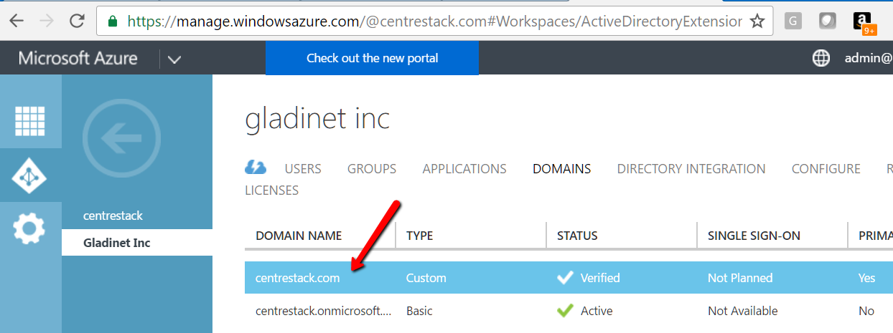

    AZURE DOMAIN SETTING
    
Others (Generic SAML)
---------------------------

Here, The IdP will be a public IdP such as SSOCircle and the SP will be the Cluster Server. The SSOCircle is used as an example to set up the IdP;
it can work with other IdP as well.

In a multi-tenant Cluster Server deployment each tenant may want to have its own SSO service. Therefore, the Single Sign On is a per-tenant setting.


**Step 1: Register the Cluster Server at IdP**

IdP will need to register the Cluster Server as a service provider (SP) by importing the SP's meta data. You will find the Cluster's metadata at the following location (per-tenant setting).

.. figure:: _static/image073.png
    :align: center

    SERVICE PROVIDER META DATA LINK

We can use the following xml to register the Cluster as an SP at SSOCircle:

.. figure:: _static/image074.png
    :align: center

    REGISTER CLUSTER SERVER AS AN SP AT SSOCIRCLE

Now at the SSOCircle, need to add a new service provider:


    ADD A SERVICE PROVIDER AT SSOCIRCLE

In the next screen we can paste in the xml from the Cluster side, set the FQDN to the URL contained within the XML, and check the 3 parameters,
the FirstName, LastName and Email.

.. figure:: _static/image076.png
    :align: center

    INSERT YOUR METADATA INFORMATION

Now the SSOCircle side of the registration is done.

**Step 2: Register SSOCircle at the Cluster Server side**

The IdP registration and SP registration is a two-way I trust you and now you trust me kind of manual setup.

.. figure:: _static/image077.png
    :align: center

    MUTUAL TRUST SP REGISTRATION

The meta data from the SSOCircle look like this and it can be imported to the Cluster Server.

.. figure:: _static/image078.png
    :align: center

    EXAMPLE OF SSOCIRCLE META DATA

Inside the meta data from SSOCircle, you will see there is a HTTP-Redirect URL, that will be the URL we use to register the IdP.
And also register the 3 paramaters (FirstName, LastName, EmailAddress) from the IdP.

.. figure:: _static/image_s5_6_25.png
    :align: center

    SINGLE SIGN ON SETTINGS

**Step 3: Login at the IdP, but use service at SP**

As the summary, the IdP and SP register each other's meta data, register each other's URL and parameters.
After that, it will be single signon at the IdP side. The login will be at the IdP side, and after login,
it will redirect back to the SP side.

.. figure:: _static/image080.png
    :align: center

    IDP SIDE SIGLE SIGNON


5.6.3 Folder & Storage
^^^^^^^^^^^^^^^^^^^^^^^^


``Tenant Management Console`` > ``Group Policy`` > ``Folder & Storage``

.. figure:: _static/2021newimage114.png
    :align: center

    FOLDER AND STORAGE PANEL
    

Home Directory
----------------

``Tenant Management Console`` > ``Group Policy`` > ``Folder & Storage`` >  ``Home Directory``

.. figure:: _static/image_s5_6_31.png
    :align: center

    HOME DIRECTORY SETTINGS

**“Default Storage quota”**

    This policy will not affect existing user and their quota. It can affect a newly created user for the default storage quota.

**“Create default folders”**

    When the new user account is provisioned, the default root folder is empty.
    
    “Create default folder (Documents, Pictures)” will make the root folder look less empty and more user-friendly. This hints at how to organize files and folders in the cloud.

**“Use user email to generate home directory name”**

    The home directory name will be created using user's email address.
    
    By default, it is user's GUID that is used to create user's home directory.

**“Use user's sAMAccountName to generate home directory names for Active Directory users”**

    This option supports clients and servers from previous versions of Windows that use Security Account Manager (SAM)type user accounts. 

**"Publish user's home drive"**

    When unchecked, the user home drive space will be allocated from enterprise storage. When checked, existing user home drives will be automatically published from Active Directory.

**"Mount user's home drive as a top level folder."**

    Without this option, the user's home drive from active directory mapping will become the root folder in |prodname|. However, if the user also have network shares mapped into |prodname|, those network shares
    will appear as top level folders. So in this use case, mapping user's home folder as a top folder
    is more in parallel to the other network shares.


Folder and Storage Settings
-----------------------------

``Tenant Management Console`` > ``Group Policy`` > ``Folder and Storage``

These are the settings available to the tenant manager in the Folder and Storage view.

.. figure:: _static/image_s5_6_30a.png
    :align: center

    FOLDER AND STORAGE SETTINGS


**“Allow users to attach external cloud storage”**

    when checked, you will allow users to see storage manager
    and allow them to attach external storage such as their own Amazon S3 bucket into the system.

**“Disable Versioned folder”**

    Normally you will NOT disable versioned folder. Because versioned folder is the
    supporting feature for “Two-way sync locally attached folder”. If you disable versioned folder, you will lose the
    two-way synchronization folder feature as well.

**Disable Trash Can**

    For folders that are not under version control, a deleted file
    will be moved into Trash Can. If this feature is not useful, 
    you can disable it.

**“Don't show folder that user doesn't have read permission”**

    With native Active Directory integration and
    with network share as backend storage, the user’s permission to the folders are checked natively. When this option
    is set, for those folders that users doesn’t have read permission, the folder will be hidden.

**"Don't show team folder that the user doesn't have read permission to the underlying folder"**

    In the folder listing, if the user don't have read permission, sometimes it is better off not to show 
    the folder to the user.
  
**Don't show Trash Can for non-admin user**

    Trash Can is a virtual folder that shows up 
    at the web browser portal only. This setting controls whether or not to show it for 
    regular team user.

**“Don’t append (Team Folder) to published folders”**

    A team folder by default, when showing up in a team user’s
    folder list, it will have “(Team Folder)” appended to the end of the folder name to signify it is a team folder.
    This feature allows a team folder showing up as it is without the (Team Folder) suffix. The use case is that when
    a network share is mounted and then turned into a team folder, since the users are already familiar with the
    network share in its original name, so it is not necessary to append (team folder) to the folder name. You
    shouldn’t change this setting in the middle of operation because if users have pending upload/download, changing
    the name could cause those tasks to fail.


Attached Folder Settings
--------------------------

``Tenant Management Console`` > ``Group Policy`` > ``Folder & Storage`` > ``Attached Folder``

.. figure:: _static/image_s5_6_32.png
    :align: center

    ATTACHED FOLDER SETTINGS


**“Disable backup/attach local folder from client device”**

    Attached Local Folders are two-way synchronization
    folders. In order to do version backup and two-way synchronization, there are multiple folder structures created
    in the backend storage. Some organization doesn’t need this feature and want the users to work exclusively with
    the cloud drive.

**"Enable Snapshot backup for server agent"**

    It is a feature related to server agent on Windows 2003-2012 servers.


**"Allow syncing empty files"**

    By default, empty file (0-byte) will be skipped for syncing in attached folder.
    when enabled, those files will be synchronized.
    
**"Allow syncing of hidden files"**

    Hidden files by default will not sync.

**"Allow executable files (.exe)"**

    Executable files by default will not sync.

**"Allow ISO files (.iso)"**

    Executable files by default will not sync.

**"Allow backup files(.bck, .bkf,.rbf, .tib)"**

**"Allow VMs (.hdd, .hds, .pvm, .pvs, .vdi, .vfd, .vhd, .vmc, .vmdk, .vmem, .vmsd, .vmsn, .vmss, .vmtm, .vmwarevm, .vmx, .vmxf, .vsv, .nvram, .vud, .xva)"**

**"Allow application folders"**

    Application folder by default will not sync.

**"Allow application data folders"**

    Application data folder by default will not sync.


**Enable scheduled sync for files with following extensions**

    this is to help sync/upload frequently changed file such as
    Microsoft access database or QuickBook files. These type of
    files typically are constantly open (thus prevent other application to hold on to them)
    and also changed frequently. So you can define the time
    period to check back on these type of files and use volume
    shadow copy to upload these files.
    
    
Filters Settings
------------------

``Tenant Management Console`` > ``Group Policy`` > ``Folder & Storage`` > ``Filters``

.. figure:: _static/image_s5_6_33.png
    :align: center

    GROUP POLICY FILTER SETTINGS

**“Files with the following extensions will be excluded from attached local folder”**

    You can stop certain file types from
    being uploaded. For example .pst files. These are local outlook email files, which is not necessary to upload into the
    cloud storage because usually it is backed up by an exchange server.


**"Files with following extensions will be excluded from directory listing (i.e.[.qbw]):"**

    You can specify the executables which should not be
    listed under a user's directory.

**“In-place editing/Preview is disabled for files with following extension”**

    Windows Explorer has a habit
    to peek into large files to generate thumbnail and present other information. It may not be a good fit for
    cloud drive files because each peek will generate a download from cloud.

**"Allow file without file name extension"**

    Allow files without extension suffix to synchronize.
    
    
**"Allow syncing empty file"**

    This is the same setting as in the "Attached Folder" section.


5.6.4 Client Control
^^^^^^^^^^^^^^^^^^^^^^

Web Portal Settings
---------------------

``Tenant Management Console`` > ``Group Policy`` > ``Client Control`` > ``Web Portal``

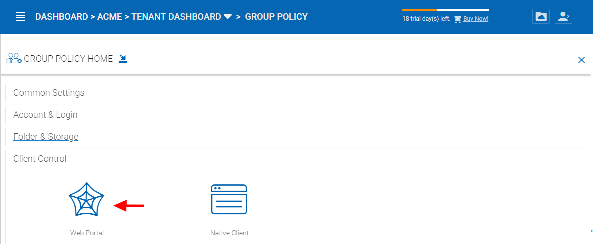

    WEB PORTAL PANEL


.. figure:: _static/image_s5_6_40b.png
    :align: center

    WEB PORTAL SETTINGS


**“Disable folder download from web client”**

    Disabled by default. The folder download from web client will zip up the folder and download it. It is CPU intensive so if you don’t want it to be consuming too much CPU, you can disable it using this setting.


**“Disable Search”**

    Disabled by default. If you don’t need the search by file name feature, you can check this setting to disable it.

**“Web Browser - Disable Java Uploader”**

    Some organization standardized on web browser, for example, all web browser are HTML5 compliant. In this case, Java Uploader is not necessary and could be confusing to support when different users have different Java version installed.

**“Web Browser - Disable Flash Uploader”**

    Some organization standardized on web browser, for example, all web browser are HTML5 compliant. In this case, Flash Uploader is not necessary and could be confusing to support when different users have different Flash version installed. Different kind of web browser may also have different levels of Flash support, causing different behavior.

**“Web Browser - Disable Local Uploader”**

    Admin can also disable local uploaded in which case the upload will happen using the browser directly.

**“Enable Tabbed-Browsing in User Manager”**

    When enabled, the user manager will order users by their last name so if you have many users, you have an easy to access way to find the users.

**“Only show search interface in User Manager”**

    When you have even more users, Tabbed-Browsing can’t handle it any more, you can enable search-only interface.

**"Show tutorial page for non-admin users"**

    Display tutorial page for regular users when they login to the web portal.

**“Show team folder level permissions in team folder publishing dialog”**

    The advanced setting refers to “Create CIFS Share”, “Disable further sharing”, and “Disable Offline Access” settings.


**"Disable 'Publish Tenant Home Storage As a Team Folder'"**

    This feature can be hidden in Tenant Management Console > Team Folder > Add New Team Folder 

**"Confirm before moving via drag-and-drop"**

    In web portal, sometimes there can be accidental drag and drop, in this case, having a confirmation dialog can help prevent accidental drag and drop.

**"Show left tree view by default"**

    Disabled by default. When enabled left-tree is displayed when you log in to the web portal. 


**"Do not show "recent activities"**

    Disabled by default. When enabled "recent activities" is not visible in the Show/Hide Info Panel on the right side of the Web Portal File Browser. 


**"Show 'link to local' option to non-admin user"**

    Disabled by default. When enabled, non-admin user will have access to the **"Link to Local"** option in the Sharing and Collaboration tab under the Show/Hide Info Panel on the right side of the Web Portal File Browser. 

**"Show max count of file/folder items"**

    Default files to show is 1,000. Some customers may have a very flat folder that has more than one thousand files. It is not recommended to have a cloud system have flat folder structure like this. But if customer has many files in a flat folder. This setting can be used to show all files by increasing this number as needed.


Native Client Settings
------------------------

``Tenant Management Console`` > ``Group Policy`` > ``Client Control`` > ``Native Client``

.. figure:: _static/image_s5_6_40.png
    :align: center

    NATIVE CLIENT SETTINGS

**“Create a shortcut in the documents library”**

    Enabled by default. This is a convenience feature to add a link to documents library to the cloud drive.

**“Create shortcut on desktop”**

    Enabled by default. Same as above but the shortcut is on the desktop.

**“Hide Settings in Windows Client Management Console”**

    Disabled by default. The Settings in the Windows client may be viewed as “too much information for normal user”. If that is the case, enabling this option will hide those settings.

**“Don't Allow Setting Changes in Windows Client Management Console”**

    Disabled by default. When disabled the Windows Client user can change the settings in the Windows Client Management Console. 

**“Disable Windows client in-place drag & drop uploading”**

    Unchecked by default. When enabled, dragging & dropping files (or folders) to the cloud drive will write files to the local cache first and then upload in the background. 

**“Disable Auto-Login next time”**

    Unchecked by default. When you want the user to type in username/password every time they login to the Windows client, you can check this to disable auto-login.

**“Disable drag & drop handler”**

    Unchecked by default. If you check this option, the Windows file drag and drop will take over, this typically means the files will be copied into cache before upload, thus resulting in two copies of files being uploaded.

**Requiring approval for device access**

    Disabled by default. When a user attempts to log in from a new device via native client applications, the connection will be rejected until the tenant admin approves the new device. The approval can be done from the "Client Device Manager" 

**“Enable auto-install of Outlook Plugin”**

    Disabled by default. The Cluster Server Windows Desktop client comes with an Outlook plug-in. If this option is enabled, the Outlook plugin will be enabled upon client startup.

**"Disable native client for guest users"**

    Unchecked by default. For guest users, don't allow them to use native client, so the guest users can only use web browser files and folder view.


5.6.5 Export/Import
^^^^^^^^^^^^^^^^^^^^^

.. figure:: _static/image_s5_6_50.png
    :align: center

    EXPORT/IMPORT ICON LOCATION

You can also export the group policy settings to other clusters in the environment or import existing settings from another cluster.


*********************
5.7 Tenant Branding
*********************

``Tenant Management Console`` > ``Tenant Branding``

If per-tenant branding is enabled, The tenant branding section will be available.

.. figure:: _static/2021newimage115.png
.. figure:: _static/2021newimage116.png
    :align: center

    PER-TENANT BRANDING OPTIONS

**Customized URL for your business**

    Typically the customize URL is a sub domain of the Cluster Server. For example, if the Cluster Server is at https://cloud.mycompany.com, the sub domain can be https://acme1.mycompany.com 

    In Windows 2012 and above (the server that has the Cluster Server running), it also allows SNI (Server name indicator) in the SSL certificate binding. So it is possible to bind multiple SSL certificates to the same IIS server. In this case, the Customized URL can be a fully qualified domain name. 


***************************
5.8 Tenant Administrators
***************************

``Tenant Management Console`` > ``Tenant Administrators``

You can define a group of administrators here.

.. figure:: _static/image_s5_8_00.png
    :align: center

    ADDING/EDITING TENANT ADMINISTRATORS


***************************
5.9 Reports
***************************

``Tenant Management Console`` > ``Reports``

You can see upload report, storage statistics, team folders, shared objects, audit trace, and file change logging.


5.9.1 Upload Report
^^^^^^^^^^^^^^^^^^^^^

.. figure:: _static/2021newimage117.png
    :align: center

    UPLOAD REPORT


5.9.2 Storage Statistics
^^^^^^^^^^^^^^^^^^^^^^^^^^

.. figure:: _static/2021newimage118.png
    :align: center

    STORAGE STATISTICS REPORT

5.9.2 Bandwidth Usage
^^^^^^^^^^^^^^^^^^^^^^^^^^

.. figure:: _static/2021newimage119.png


   BANDWITH USAGE REPORT
 

5.9.3 Team Folders
^^^^^^^^^^^^^^^^^^^^

.. figure:: _static/2021newimage120.png
    :align: center

    TEAM FOLDERS REPORT


5.9.4 Shared Objects
^^^^^^^^^^^^^^^^^^^^^^

.. figure:: _static/2021newimage121.png
    :align: center

    SHARED OBJECTS REPORT


5.9.5 Audit Trace
^^^^^^^^^^^^^^^^^^^

Audit trace contains the management events, such as login success, login fail , shared a folder and etc.

.. figure:: _static/2021newimage122.png
    :align: center

    AUDIT TRACE REPORT


5.9.6 File Change Log
^^^^^^^^^^^^^^^^^^^^^^^

File change log is capable of search for user’s file change history. It is most useful when helping user
troubleshoot issues. For example, you can point to the file change log and say, you deleted this file on this
day.


    FILE CHANGE LOGGING REPORT


5.9.7 Folder Permissions
^^^^^^^^^^^^^^^^^^^^^^^^^^

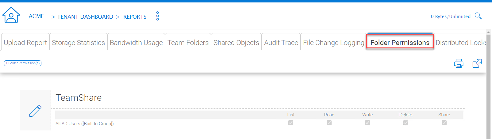

    FOLDER PERMISSIONS REPORT


5.9.8 Distributed Locks
^^^^^^^^^^^^^^^^^^^^^^^^^

.. figure:: _static/2021newimage125.png
    :align: center

    DISTRIBUTED LOCKS REPORT


5.9.9 Pending Purged Folder
^^^^^^^^^^^^^^^^^^^^^^^^^^^^^

.. figure:: _static/2021newimage126.png
    :align: center

    PENDING PURGED FOLDER REPORT


**************************
5.10 Advanced Information
**************************

``Tenant Management Console`` > ``Control Panel``

.. figure:: _static/image_s5_10_01.png
    :align: center

    TENANT MANAGEMENT CONTROL PANEL


5.10.1 Active Directory Settings
^^^^^^^^^^^^^^^^^^^^^^^^^^^^^^^^^

.. figure:: _static/image_s5_10_11.png
    :align: center

    CONTROL PANEL AD SERVER SETTINGS

AD Server Tab
---------------

**“Enable Active Directory Integration”**

    You will check this when you want to integration with Active
    Directory.
    
    .. note::
    
        There are two different ways to integrate with Active Directory. One way is here, using the Lightweight Directory Access Protocol (LDAP) connection. The other way is to leverage the server agent software. The server agent software is capable of connecting a remote Active Directory. 

**“Domain Controller Address”**

    The domain controller’s address, typically in the form of DNS name.

**“User Name”**

    This is recommended to be a service account (password never expire, account never disable” so the user will be able to query LDAP for users and authenticate users on the login user’s behave.

**“Password”**

    This is the password for the service account for the “User Name” field.

Advanced Settings Tab
-----------------------

.. figure:: _static/image_s5_10_11a.png
    :align: center

    CONTROL PANEL AD ADVANCED SETTINGS


**“Friendly Domain Name”**

     **(i.e. mydomain.com, the domain name you see in Active Directory tools)** This is typically the domain name you see in the Microsoft Domain and User tool. It needs to be exact match of the domain name. Otherwise, you will see error message about “referral is required” , which translates to the domain controller didn’t match the domain name and need to refer you to somewhere else for another domain name. 

.. figure:: _static/image038.jpg
    :align: center

    FRIENDLY DOMAIN NAME EXAMPLE

**“Enable LDAPS for secure access”**

    Disabled by default. Enable this if you are using SSL security on the domain. 

**“Only include users and groups from the following Organizational Units”**

    **(e.g. OU=ou1,OU=ou2. Leave this blank to include all OUs)** When you type in the organization unit, you don’t need to type the domain part any more. It just need the Organization Unit part of the string. This is allowed for only single Organization Unit specified in its distinguishedName format without the domain suffix. 

**“Allow Switching to Global Catalog If needed”**

    Disabled by default. For some organization that has multiple domain, sometimes there is a Global Catalog that stores everything inside. This may be required if you have such situation. 

**“Disable Nested Groups”**

    Not checked by default. **(Activating this checkbox may slow down your access to cloud)** Normally you will activate this option if you have many groups. 

**“This is the root of the AD Forest and contains multiple sub-domains”**

    The Cluster Server supports multiple domains in the same AD forest. You will need to point to the root of the AD and it is capable of finding all the sub-domains if you enable the **Discover domain controller IP at runtime** sub-opion. 

**“Don’t allow user auto-creation”**

    By default, the Enterprise package is capable of creating users upon first login into the web portal. However, for big enterprise, they may want to control the pace of adding users to the system so they will disable this feature.

**“Publish user’s home drive”**

    When unchecked (default), the user home drive space will be allocated from enterprise storage. When checked, existing user home drives will be automatically published from Active Directory. 

.. figure:: _static/image039.jpg
    :align: center

    USER'S PROFILE HOME FOLDER SETTING

.. raw:: html

  <iframe width="560" height="315" src="https://www.youtube.com/embed/LDyBrixnJw4" frameborder="0" allowfullscreen></iframe>


5.10.2 Client Device Manager
^^^^^^^^^^^^^^^^^^^^^^^^^^^^^

This feature is used to control BYOD (Bring your own device). For some organization, they want to control who can bring what device into the system. This is the tool to control that and allow/disallow on a device by device basis.

.. figure:: _static/image_s5_10_20.png
    :align: center

    CONTROL PANEL DEVICE MANAGER


5.10.3 Application Manager
^^^^^^^^^^^^^^^^^^^^^^^^^^^

.. figure:: _static/2021newimage127.png
.. figure:: _static/2021newimage128.png
    :align: center

    CONTROL PANEL APPLICATION MANAGER

This section configure several web applications to the web portal on a per-tenant basis.


****************************
5.11 Tenant Administrators
****************************

.. figure:: _static/image_s5_11_01.png
    :align: center

    ADDING/EDITING TENANT ADMINISTRATORS

This section allows you to delegate the administration of tenants to other users.  


*******************
5.12 Notification
*******************


5.12.1 Settings 
^^^^^^^^^^^^^^^^

.. figure:: _static/image_s5_12_10.png
    :align: center

    NOTIFICATION SETTINGS

Send Daily Notification Email -
When set, the system will send email notification daily about the events you are interested (Select below).


    - File Changes	
    - Audit Trace	
    - Users approaching the storage quota limit	
    
    
Notify tenant admin when member's sync task failed.	

Notify tenant admin when member shared a folder	

Notify me when user account is locked out	

Send notification to these emails in addition to tenant admin's email (email;email2) - This
is used for additional administrators to receive email notification.


5.12.2 Shared File/Folder
^^^^^^^^^^^^^^^^^^^^^^^^^^^

.. figure:: _static/image_s5_12_20.png
    :align: center

    TEAM FOLDER SUBSCRIPTION OPTION

Notification regarding the changed files and folders
Team Folder - notification regarding changed files and folders
Settings

  Send Daily Notification Email
  Notify tenant admin when member's sync task failed
  Notify tenant admin when member shares a folder
  Notify me when user account is locked out.

5.12.3 Team Folder Settings
^^^^^^^^^^^^^^^^^^^^^^^^^^^^^^^^^^^^


    NOTIFICATION SETTINGS

Administrators can use this setting to receive notifications when changes occur in team folders. 


***************************
5.13 Folder Admin Support
***************************


5.13.1 User’s File and Folder List
^^^^^^^^^^^^^^^^^^^^^^^^^^^^^^^^^^^^

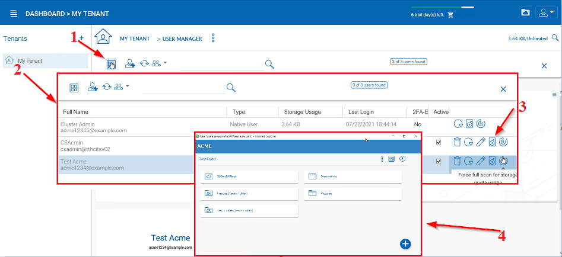

    VIEWING A USER'S FILE AND FOLDER LIST

An admin can view a user’s file and folder list using the drive icon **(3)** for the user in Management Console\User Manager. 

First switch the icon view **(1)** to detail view **(2)** and click the drive icon **(3)** next to the user you are examining. This will open a new window **(4)** where you can view the files. 


5.13.2 Storage Location Migration
^^^^^^^^^^^^^^^^^^^^^^^^^^^^^^^^^^^

There are two types of storage migrations.

**1.** Migrate data to a different location in the same type of storage using the steps below:
  a. Identify the location of the current storage
  b. Copy the content to the new location (for example, you can use xcopy *.* from the old location to the new location
  c. Login to web portal as master admin.
  d. Launch Management Console -> Collaboration -> Storage Manager and click on edit to point to the new location

**2.**	Migrate data to a different type of storage using the steps below:
  a. Go to the registry using regedit
  b. Go to HKLM\\SOFTWARE\\Gladinet\\Enterprise\\ and add a new string value called ‘CanChangeDefaultStorage’ and set the value to ‘True’ and reboot
  c. Edit the storage type using new icon to edit storage under Cluster Manager\Tenant Manager

.. Note::

  It is not recommended that you modify registry settings. Create a backup of the registry before modifying any registry settings.

