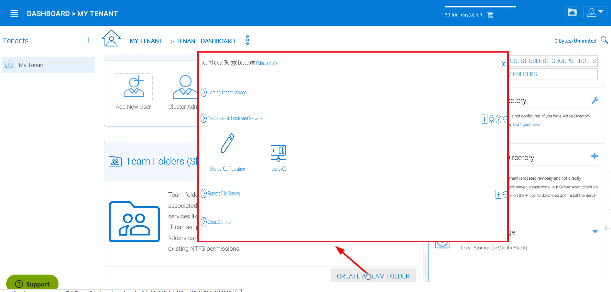

##############################
6 Advanced Topics
##############################

******************************
6.1 Connect Your File Server
******************************

The way to connect the file servers are different, depending on where the file server is.

The file server can be sitting in the same Local Area Network (LAN) as the CentreStack Server. In this case,
the direct network share connection is the best. Usually this is combined with setting up direct LDAP connection
to the Active Directory.

.. figure:: _static/image102.png
    :align: center

    FILE SERVER CONNECTION

The file server can also be remote, away from the CentreStack server, at the customer's premise. In this case, the best is to use file server agent. File server agent will be installed on the file server, and it is capable of connecting the customer's Active Directory and sync both folder content and active directory over HTTPS. In this case, in the user interface, you will see "Proxied AD User" to indicate that the Active Directory user or group is coming from the file server agent.

.. figure:: _static/image103.png
    :align: center

    SERVER AGENT CONNECTION

The best way to start using file server agent to connect to remote file server is to start with the migration wizard from the web portal.

    TEAM FOLDER STORAGE LOCATIONS

*********************************
6.2 Files and Folder Permission
*********************************

If your files and folders are on a file server in the same Local Area Network (LAN) as the CentreStack server, the best way to manage file and folder permission is to delegate it 100% to the NTFS permission. In the "Storage Manager", when attach local storage, there is an option "Always access the storage using logon user identity", This option can be used to delegate file/folder permission check directly to NTFS.

.. figure:: _static/image105.png
    :align: center

    FILE AND FOLDER PERMISSIONS SETTINGS

If you are not using native NTFS permission. For example, you are on cloud storage services such as Amazon S3 or OpenStack Swift, you can use CentreStack folder permission.

.. figure:: _static/image_s6_2_02.png
    :align: center

    MANAGE FOLDER SETTINGS

*********************************
6.3 Setting up Active Directory
*********************************

When the Active Directory is in the Local Area Network (LAN), LDAP can be used to connect to the Active Directory.
There are several cases here, 

  * Sometimes you want the user account be automatically provisioned so it is easy for the administrator.
  * Sometimes you want the user account be limited to a specific AD group, but still automatically provision the user's account when the users are in the AD group.
  * Sometimes you want the user account be limited to a specific Organization Unit.

AD account auto provision
---------------------------

This is the default setting in the Advanced -> Active Directory Settings

As long as the "Don't allow user auto-creation" is not checked, Active Directory users will be allowed to go to the web portal and login. The first time the user logs in, its CentreStack account will be automatically provisioned.

.. figure:: _static/image_s6_3_00.png
    :align: center

    USER AUTO-CREATION SETTING

AD account auto provision, limiting to Organization Unit
----------------------------------------------------------

The organization unit field can be used to further limit the Active Directory user account that can be automatically provisioned.

.. figure:: _static/image_s6_3_01.png
    :align: center

    LIMIT TO ORGANIZATION UNIT SETTING

The format of the organization unit is the OU's distinguishedName minus the DC suffix.

For example, the following OU's property is:
distinguishedName	=>	OU=tenant11,DC=tsys,DC=gladinet,DC=com

when it is put into the OU field, the DC suffix can be removed so only OU=tenant11 is required

.. note::
  OU=tenant11

.. figure:: _static/image109.png
    :align: center

    OU PROPERTY LOCATION

AD account auto provision, limiting to a specific AD group
------------------------------------------------------------

From the user manager, you can import AD group and the users in the AD group will be able to get account automatically provisioned.

.. figure:: _static/image_s6_3_03.png
    :align: center

    MIGRATING USERS FROM ACTIVE DIRECTORY

Here is a demo video for Import AD group

.. raw:: html

  <iframe width="560" height="315" src="https://www.youtube.com/embed/TwyRhlPOxMY" frameborder="0" allowfullscreen></iframe>
  
  
*******************************
6.4 Setting up Offline Folder
*******************************

In a team collaboration environment, there are several best practices related to offline folder management.

Here are  several parameters for consideration:

Team Folder Offline Settings
------------------------------

If you have a big team folder or several team folders that are quite big in size, it is not a good practice to enable team folder offline from the root. Instead you can choose not to enable offline or just enable a subset of sub-folders that are relatively small and at the same time, used more often. If you want to enable a subset of sub-folders within team folders for offline access, you can start by going to the folder permission section. You can access this by selecting the folder (1), in the pulldown menu (2) select "Folder Permissions", then select the edit settings icon (3) and finally select "Enable offline access for native Client" (4), and Apply the change. 

.. figure:: _static/image_s6_4_00.png
    :align: center

    ENABLING OFFLINE ACCESS FOR NATIVE CLIENT

If you want to disable offline access for the team folder completely, you can change the setting from the Team Folder section by choosing the "Settings" option below (1) in the drop-down menu and selecting the "Disable Offline Access" option (2). Don't forget to save your changes (3). 

.. figure:: _static/image_s6_4_01.png
    :align: center

    DISABLING OFFLINE ACCESS FOR TEAMSHARE

User Offline Settings
-----------------------

Upon creating users in the CentreStack system (including users imported from Active Directory), there is an offline flag upon user creation.

Normally, we don't recommend check the "Enable offline access for all folders" flag, because it will try to download every single file for the user when the user is connected, which can use a lot of bandwidth and slow things down.

.. figure:: _static/image_s6_4_02.png
    :align: center

    ENABLING PER-USER OFFLINE ACCESS

.. note::

    This will automatically download ALL folders and files to the user’s device and automatically update them whenever they are changed anywhere in the network. This will cause a significant increase in network traffic, especially during the initial download of all folders.

Without it, user can still pick and choose which folder to mark as offline.

User Manual Offline Settings
------------------------------

During regular usage of the files and folders, users can mark folders as offline.

.. figure:: _static/image262.png
    :align: center

    ENABLE OFFLINE ACCESS AT THE CLIENT LEVEL

Summary
---------

Administrators can manage the tenant wide offline policy related to team folders and users. In the case where team folder size is small and user size is small, administrator can enable the offline flag to push files and folders to user's devices.

However, in the case where team folder size is big and user number is not small, we recommend the administrator enables as less offline flags/settings as possible on the administration side, users can still do offline management themselves within their working folder on a case-by-case basis.
