##############################
7 Cloud Backup
##############################

.. note::
    CentreStack's Cloud Backup allows you to turn your CentreStack server into a backup appliance or create a self-hosted backup solution with the ability to backup endpoints and restore folder permissions. 

In this section, we'll review how to enable backup for file shares and endpoint devices and review how the files in the backup can be accessed and restored. 

**Enabling Cloud Backup**

    Cloud Backup is enabled on a cluster-wide basis. Instead of purchasing an expensive backup appliance, your CentreStack server will assume the role of the virtual appliance, allowing you to create your self-hosted backup service or leverage CentreStack's hosted environment to secure the offsite copies of your data.

**Backing Up File Shares**

    You can backup file shares from the local file server using your CentreStack server as a conduit to CentreStack's backup cloud, or you can define your cloud backup target if you'd like to some other storage service.

**Backing Up Endpoint Devices**

    Folders and file shares on remote PCs and servers will be backed up using the existing CentreStack agents to take advantage of existing HTTPS/SSL connections that have been rigorously architected to maintain connectivity and reliability.

**Cloud Backup Access and Restore**

    Easily restore any files and folders or access them directly. For example, when you backup files and folders to CentreStack's backup cloud, they can also be accessed directly from https://backup.centrestack.com

The following data flow illustrates how the basic architecture functions for this solution.

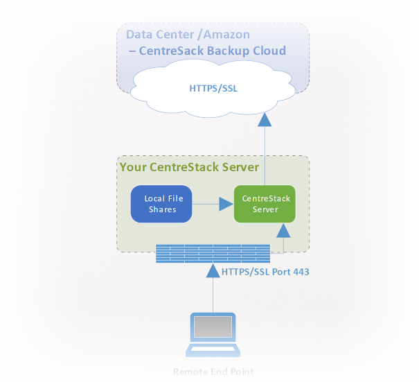

    CLOUD BACKUP ARCHITECTURE

.. note::

    Traditionally, enterprises use backup appliances on-premises to receive backup sources from servers and desktops around the company network. It is a very secure setup because the backup data sits inside the appliance. However, it poses a challenge for remote devices because remote devices are not always inside the company network and the VPN (a virtual private network) from remote devices are not always on to observe certain backup schedules.
    
    On the other hand, cloud backup solutions like Carbonite and CrashPlan can backup remote devices to the cloud directly, solving the problem for remote backup. However, the backup destination is in an opaque location, controlled by a 3rd party. This becomes problematic when there are business policies to prevent data replication to locations controlled by 3rd parties.

CentreStack cloud backup solves both these problems. First of all, the CentreStack server maintains connectivity with remote PCs and file servers via HTTPS/SSL so the connection is always on. This means that remote PCs and file servers can always leverage CentreStack's communication channel and data channel to back up through the CentreStack backup appliance. And since CentreStack's cloud backup is storage agnostic, allowing you to backup to a storage service under your control, you can now provide continuous backups of your file servers and endpoints to a storage service under your control, or the CentreStack defaults.

**************************
7.1 Enabling Cloud Backup
**************************

``CentreStack Partner Portal`` > ``Backup Manager``

Login to the partner portal from centrestack.com. On the dashboard, click 'Backup Manager' and select the CentreStack clusters you want to backup.

.. figure:: _static/image_cb_016.png
    :align: center

    ENABLING CLOUD BACKUP FROM PARTNER PORTAL

Once Cloud Backup has been enabled for the cluster, you can log in to the cluster management portal as the cluster-admin. Click on the 'Cloud Backup and Restore' icon in the top menu.

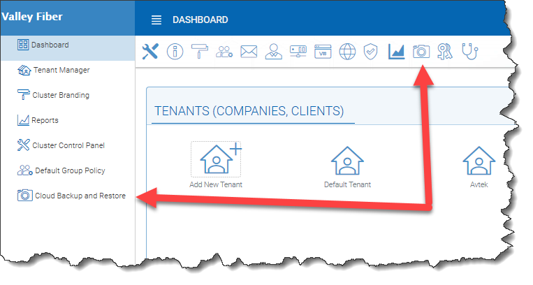

You should see the Cloud Backup Summary page.

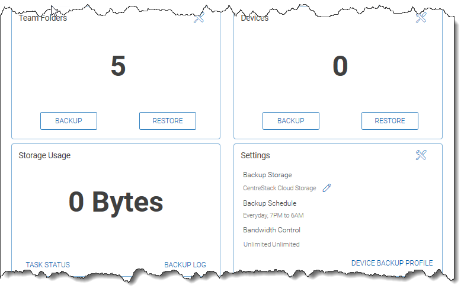

**********************************
7.2 Cloud Backup for Team Folders
**********************************

Cloud Backup works with any type of team folder, regardless of how they were created and can be initiated by the cluster-admin or tenant admin.

7.2.1 Enabling Cloud Backup for Team Folders
^^^^^^^^^^^^^^^^^^^^^^^^^^^^^^^^^^^^^^^^^^^^

As a cluster administrator, go to the Dashboard of the Management Console and select 'Cloud Backup and Restore' from the left panel. Here you will see 'Team Folders' and 'Devices'.

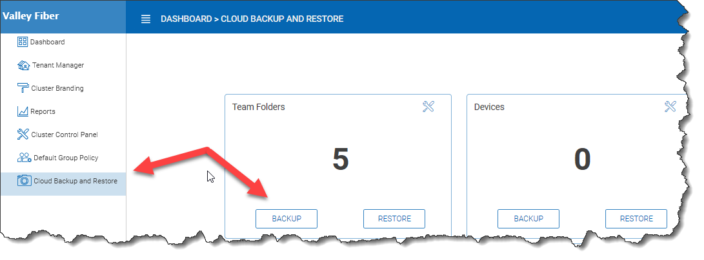

Click on the 'BACKUP' button to see a list of team folders in the tenant which have not been backed up. Select the team folders to backup and then click 'BACKUP SELECTED'.

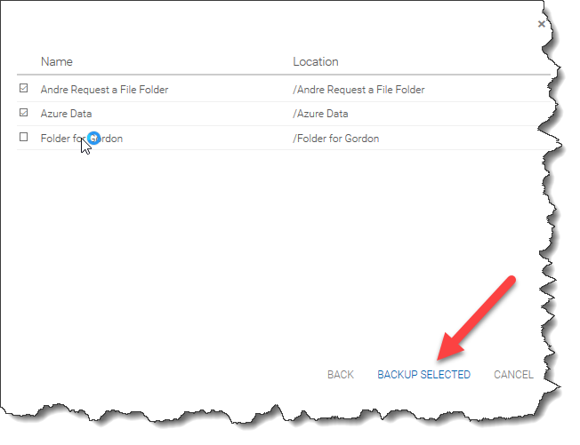

You can also follow this process as a cluster administrator but will first be prompted to select a tenant before seeing the list of team folders that haven't been configured for backup.

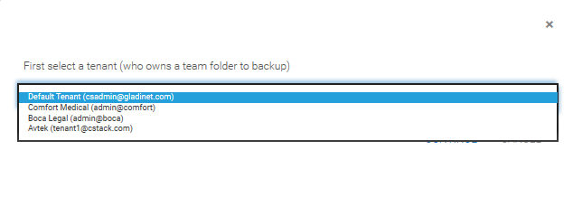

7.2.2 Cloud Backup Snapshots
^^^^^^^^^^^^^^^^^^^^^^^^^^^^
Once enabled, Cloud Backup is stored in Snapshots. The snapshot must be initially seeded and new snapshots will be created to capture updates to the data set. Data can be restored from any snapshot.

**Seeding a Snapshot**    

   Click the 'Details' icon in 'Team Folders', select the team folder you'd like to restore, and click the detail icon. Click 'Force Initial Seeding Now':

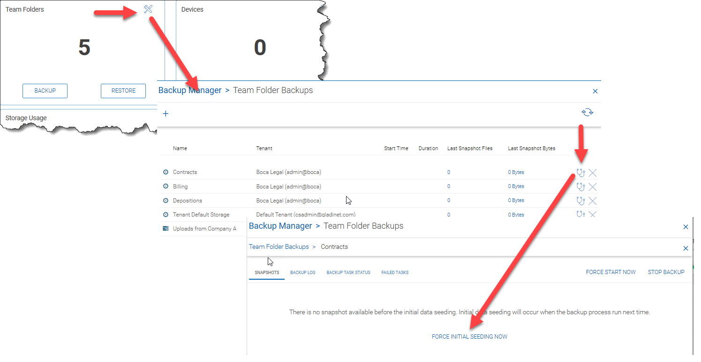

    SEEDING A BACKUP SNAPSHOT

**Browsing a Snapshot**

    To browse a snapshot, click the icon that looks like an eye on the right side of the listed snapshot. You can then navigate through the folder hierarchy in the snapshot to download and restore files and folders using the action icons at the top left of the page. Checkboxes are provided to filter the list of objects that action will be applied to:    

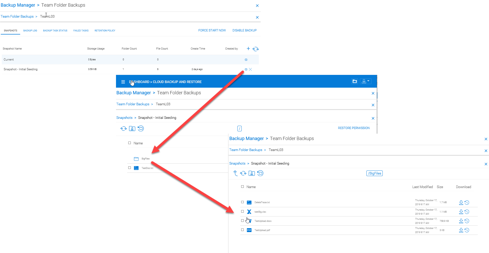

    BROWSING A BACKUP SNAPSHOT

**Downloading and Restoring from a Snapshot**    

   For example, in the image below, you can click the highlighted icon to restore the selected items: 

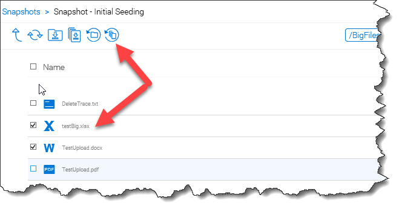

    RESTORING FROM A BACKUP SNAPSHOT

7.2.3 Disabling Cloud Backup for Team Folders
^^^^^^^^^^^^^^^^^^^^^^^^^^^^^^^^^^^^^^^^^^^^^

   To disable Cloud Backup for a team folder, simply click the 'X' beside its backup listing: 

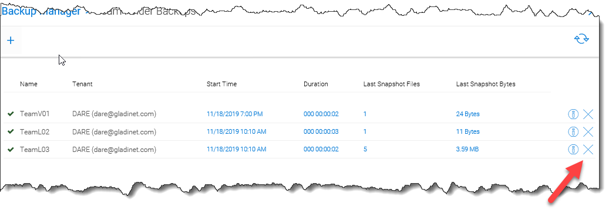

    DISABLING CLOUD BACKUP FOR A TEAM FOLDER

**********************************************
7.3 Cloud Backup for Endpoint Devices
**********************************************

Before an endpoint can be backed up, a backup profile must be created. This profile specifies which folders need to be backed up on each endpoint device. In this section, we'll review how to create backup profiles, assign them to devices and manage the resulting backups and restores.

7.3.1 Create a Device Backup Profile
^^^^^^^^^^^^^^^^^^^^^^^^^^^^^^^^^^^^

``Cluster Management Console`` > ``Cloud Backup and Restore``

As the cluster-admin on the web portal, go to 'Cloud Backup and Restore'. Under 'Settings', click 'Device Backup Profile' and then open the profile list. Click 'Add' to create a new backup profile.

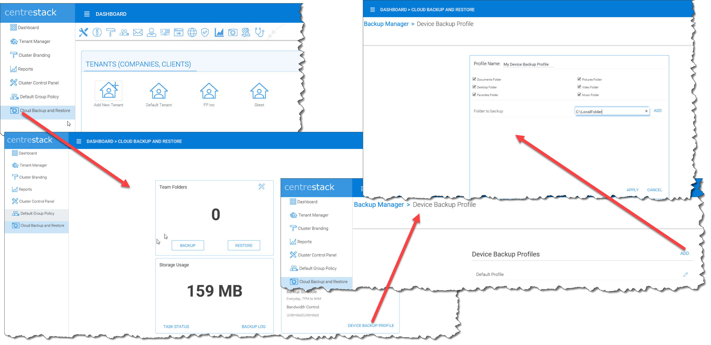

    CREATE BACKUP PROFILE

Use the backup profile to select which of the pre-defined folders need to be backed up on each device. These include Documents, a Desktop, Favorites, and Pictures. Any folder can be added to the profile by entering its path under 'Folder to backup' and clicking 'ADD':

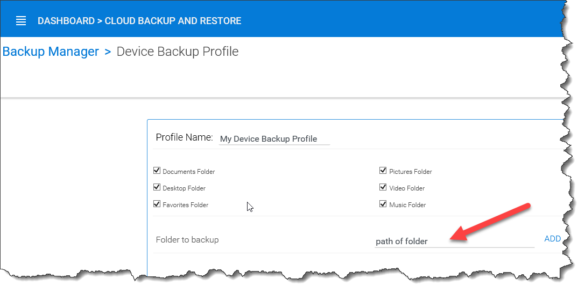

    SELECT FOLDERS FOR BACKUP

7.3.2 Configure Devices for Backup
^^^^^^^^^^^^^^^^^^^^^^^^^^^^^^^^^^

``Cluster Management Console`` > ``Cloud Backup and Restore``

As the cluster-admin on the web portal, go to 'Cloud Backup and Restore'. Click 'Backup' under 'Devices'.

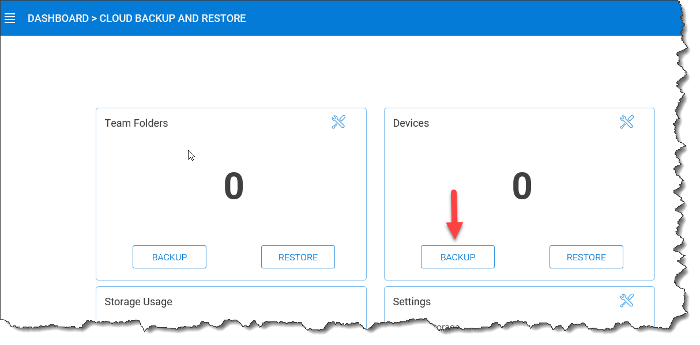

    SELECT BACKUP DEVICES

Click on the 'Search by:' dropdown list to find the device(s) you want to backup:

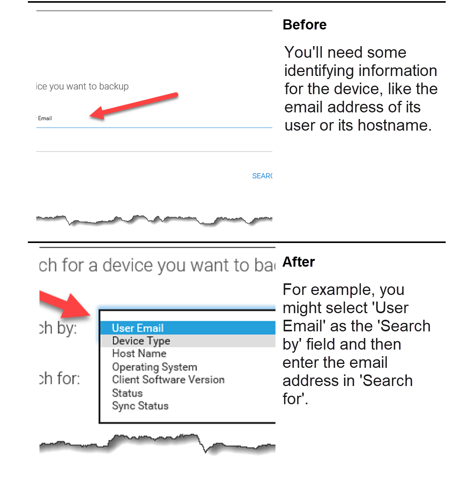

    FIND BACKUP DEVICES

.. note::
    You could alternatively enumerate by devices by selecting 'Status' and searching for all accepted devices.
    
After selecting the backup device, you'll see that the number of device backups has now increased by 1.

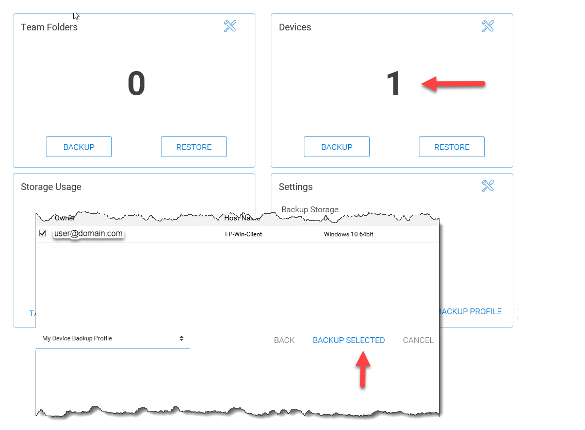

    DEVICES ADDED

7.3.3 Restoring from Device Backups
^^^^^^^^^^^^^^^^^^^^^^^^^^^^^^^^^^^

``Cluster Management Console`` > ``Cloud Backup and Restore``

As the cluster admin on the web portal, go to 'Cloud Backup and Restore'. Click 'Restore' under 'Devices'.

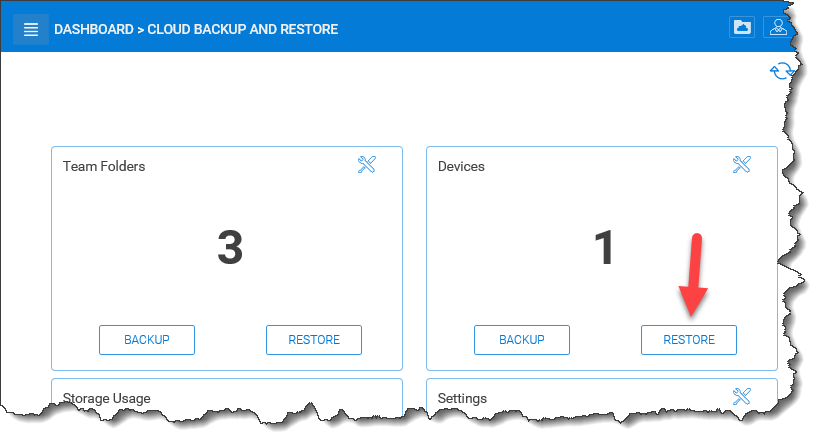

    RESTORE BACKUP DEVICES

Click on the 'Search by:' dropdown list to find the device(s) you want to backup:

    FIND BACKUP DEVICES TO RESTORE

.. note::
    You could alternatively enumerate by devices by selecting 'Status' and searching for all accepted devices.
    
After selecting the backup device, you'll see two options, 'Local' and 'Cloud'.

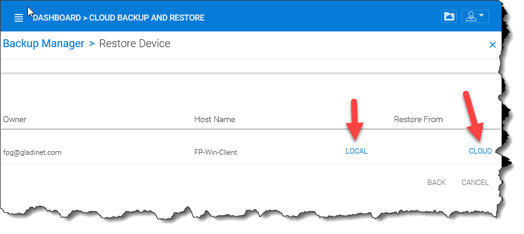

    RESTORE FROM LOCAL OR CLOUD BACKUP

CentreStack implements Cloud Backup for endpoint devices by first syncing the device to a special team folder and then backing up that team folder to the CentreStack backup cloud. So you have the option of restoring the device from the team folder, which is stored locally on the backend storage for the tenant, or from the copy which has been backed up to the backup cloud hosted by CentreStack.

After selecting 'Local', you will be prompted to select a date and time that you'd like to restore to. If you also select "Restore subfolders recursively", the folder will be restored to the last version on or before the specified date and time.

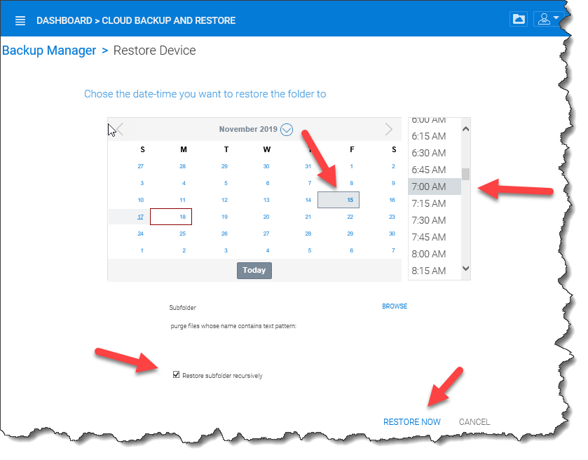

    SELECT DATE AND TIME FOR VERSION BASED LOCAL RESTORE

After selecting 'Cloud', you will be prompted to select a snapshot that you'd like to restore from. 

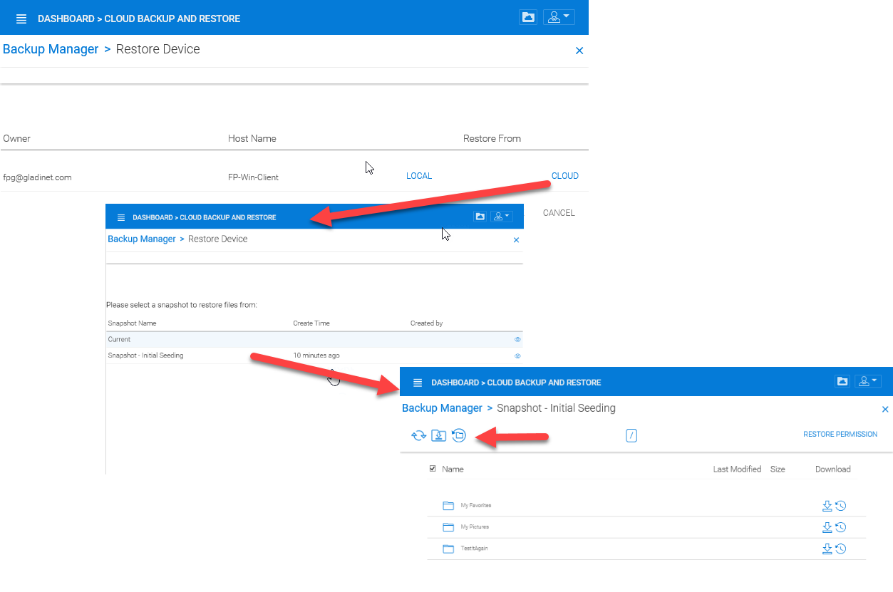

    SELECT CLOUD SNAPSHOT TO RESTORE FROM

.. note::
    The cloud-based restore is approached differently because the cloud backup is based on snapshots whereas the local team folder is just a versioned folder leveraging the standard restore process for any versioned folder in CentreStack.

************************
7.4 Cloud Backup Access
************************

The CentreStack architecture provides the option to store backups in a location of your choosing. When these backups are store in the CentreStack Backup Cloud, as shown below, they can be accessed by logging in to backup.centrestack.com

    CLOUD BACKUP ARCHITECTURE

To access the backup, navigate to https://backup.centrestack.com and login with your normal credentials to access files using CentreStack's standard browser interface:

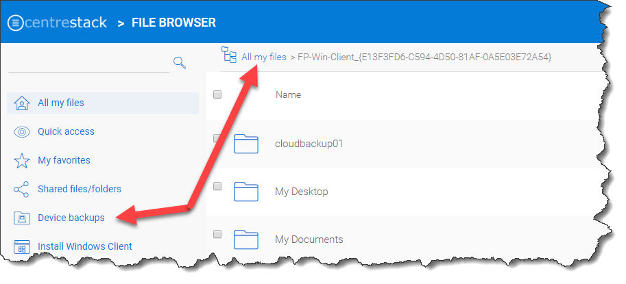

    CLOUD BACKUP ACCESS  

As indicated in the image above, you'll find your team folder backups under 'All My Files' and there's a shortcut to your device backups that can be leveraged.

.. note::
    The device backup is accessed differently from the local CentreStack cluster and CentreStack Cloud Backup. When a user logs into the cluster, the device backup can be accessed from 'Device Backup' as shown in the image above. But when logged into backup.centrestack.com, 'Device Backup' is no longer meaningful and the backup will be found under a folder whose name combines the name of the client machine with a GUID.

**************************
7.5 Cloud Backup Settings
**************************

``Cloud Backup and Restore`` > ``Settings``

CentreStack Cloud Backup is highly configurable, allowing you to determine where the backups will be stored when they will be scheduled, which folders should be backed up by default on the endpoints, and so forth. Most of these settings can be found in the 'Settings' section of the Cloud Backup Dashboard as shown below.

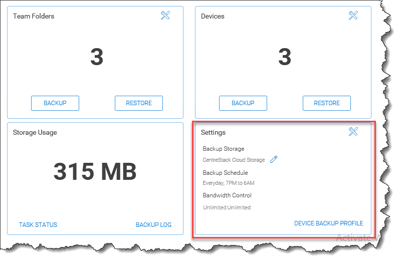

    CLOUD BACKUP SETTINGS

7.5.1 Enable Device Backup for All Users
^^^^^^^^^^^^^^^^^^^^^^^^^^^^^^^^^^^^^^^^

``Cloud Backup and Restore`` > ``Settings`` > ``Detail`` 

As a cluster administrator, go to Cloud Backup and Restore and then navigate to Settings and Details. Go to 'Other Settings' to enable 'Backup all devices with below profile'. Select a profile and then click on 'Save Changes'.

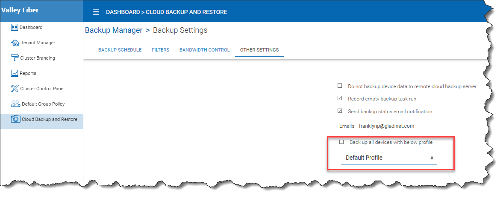

    ENABLE DEVICE BACKUP FOR ALL USERS

.. note::
    You must first create a device backup profile that can be attached to all devices. See below for details.

7.5.2 Change Backup Storage
^^^^^^^^^^^^^^^^^^^^^^^^^^^

``Cloud Backup and Restore`` > ``Settings`` > ``Backup Storage`` 

Endpoint devices are first synchronized to a team folder called $$DeviceBackupRoot. That team folder will then be backed up to one of three locations depending on the selections below.

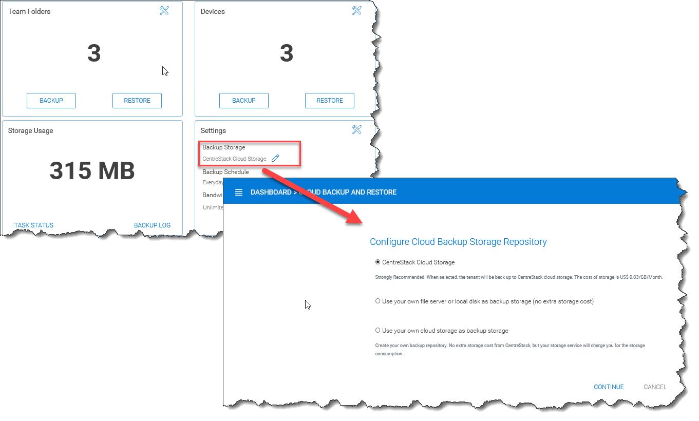

    CHANGE BACKUP STORAGE LOCATION

The preferred location is CentreStack Cloud Storage. When this option is selected, devices in the tenant will get backed up to CentreStack cloud storage. You may also choose to store the backups in your cloud storage account or on a local disk.

.. note::
    CentreStack Cloud is strongly recommended because it is optimized for use with CentreStack endpoint backups. For example, the backups stored in CentreStack's Backup Cloud are also available for access by connecting to https://backup.centrestack.com. With this approach, you can leverage the CentreStack cloud for business continuity and high availability instead of having to manage a more complex CentreStack deployment. In other words, you're getting the benefits of self-hosting without fully assuming the costs of scaling out for reliability, availability, and durability.

7.5.3 Disable Backup to the Remote Backup Server
^^^^^^^^^^^^^^^^^^^^^^^^^^^^^^^^^^^^^^^^^^^^^^^^

``Cloud Backup and Restore`` > ``Backup Settings`` > ``Details``

Click the tool icon to open Settings details and navigate to 'Other Settings'. Click the checkbox labeled, 'Do not backup device data to remote cloud backup server'. After doing this, device backup data will no longer be uploaded to the CentreStack Backup Cloud (currently https://backup.centrestack.com)

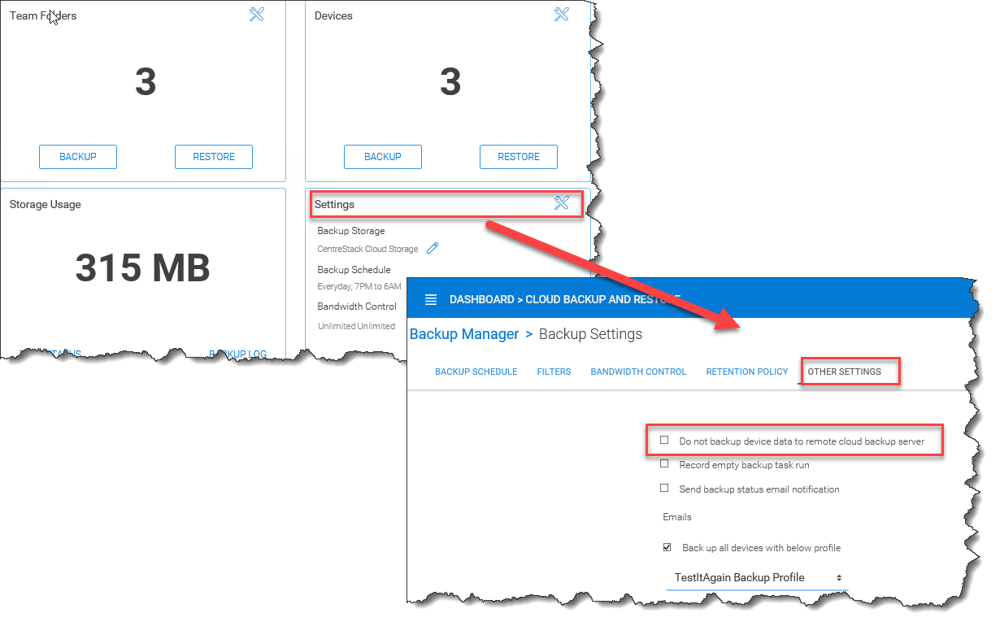

    DISABLE CLOUD REPLICATION FOR DEVICE BACKUP
    

7.5.4 Filters for Files and Folders
^^^^^^^^^^^^^^^^^^^^^^^^^^^^^^^^^^^

``Cloud Backup and Restore`` > ``Backup Settings`` > ``Details``

By default, the device backup snapshots will filter out the file types listed in the 'Filters' section of 'Backup Settings' and must be explicitly enabled. For example, select 'Allow ISO files (.iso)' to have ISO files included in each snapshot.

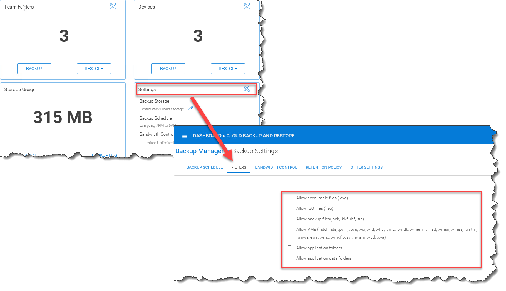

    CONFIGURE FILTERS FOR FILES AND FOLDERS

7.5.5 Cloud Backup Schedules
^^^^^^^^^^^^^^^^^^^^^^^^^^^^

``Cloud Backup and Restore`` > ``Backup Settings`` > ``Details``

The current cloud backup schedule is displayed in the settings section as shown below. 

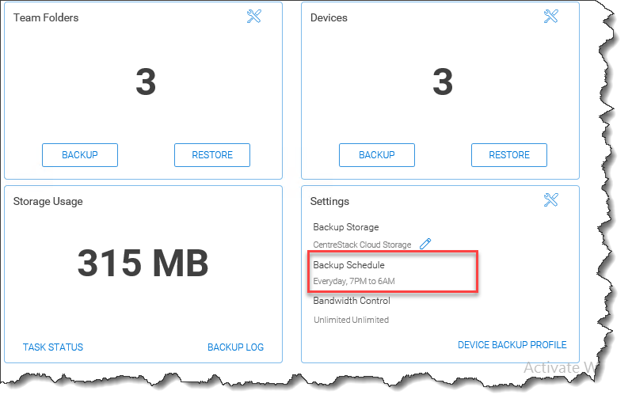

    VIEW CLOUD BACKUP SCHEDULE 

Click the tool icon in the upper right corner of that section to modify the schedule. The backups can be configured to run continuously or on a daily, weekly, or monthly basis. In each case, you will select the desired time frames or intervals of operation. 

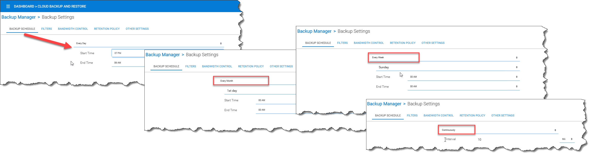

    ADJUST CLOUD BACKUP SCHEDULE 
 

7.5.6 Device Backup Profiles
^^^^^^^^^^^^^^^^^^^^^^^^^^^^

``Cluster Management Console`` > ``Cloud Backup and Restore``

As the cluster-admin on the web portal, go to 'Cloud Backup and Restore'. Under 'Settings', click 'Device Backup Profile' and then open the profile list. Click 'Add' to create a new backup profile.

    CONFIGURE DEVICE BACKUP PROFILES

7.5.7 Cloud Backup Bandwidth Control
^^^^^^^^^^^^^^^^^^^^^^^^^^^^^^^^^^^^

``Cloud Backup and Restore`` > ``Backup Settings`` > ``Details``

The current cloud backup bandwidth limits are displayed in the settings section as shown below. 

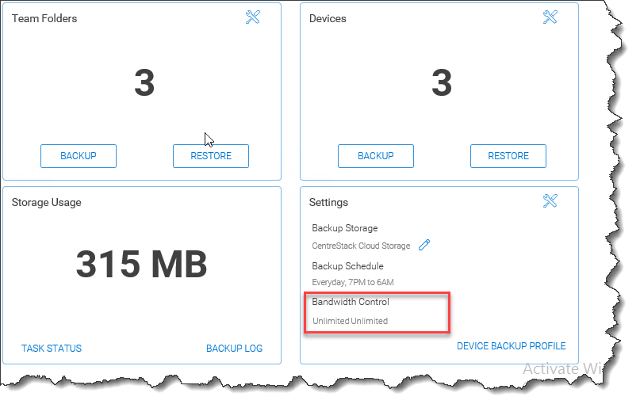

    VIEW CLOUD BANDWIDTH LIMITS  

Click the tool icon in the upper right corner of that section to modify the limits. Specify the maximum bandwidth to be consumed during day and night times.

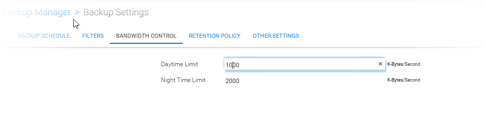

    ADJUST CLOUD BANDWIDTH LIMITS  
 
.. note:: 
    Bandwidth limits are in kilobytes per second (kB/s) and 1kB/s = 0.008 Mbps So a setting of 1000 translates to 8 Mbps.

7.5.8 Cloud Backup Retention Policies
^^^^^^^^^^^^^^^^^^^^^^^^^^^^^^^^^^^^^

``Cloud Backup and Restore`` > ``Backup Settings`` > ``Details``

There are three retention policies. "Keep last n snapshots" defines the maximum snapshots allowed at any given time. However, this setting may be overridden by the value of "Keep snapshots for at least n days" if it is not 0. For example, you may want to only keep the last 2 snapshots available, but if the system is configured to keep a snapshot for at least 30 days, a daily snapshot could result in 30 snapshots being created before any are deleted.

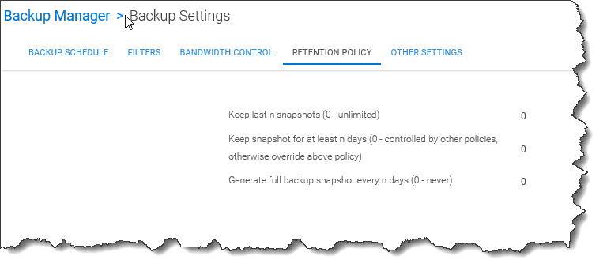

    DEFINE RETENTION POLICIES
