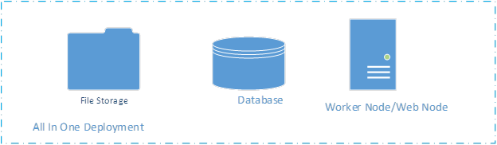
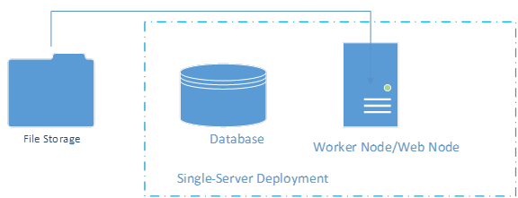
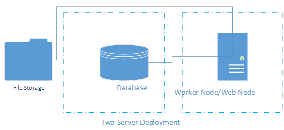
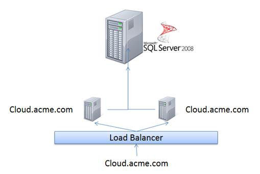
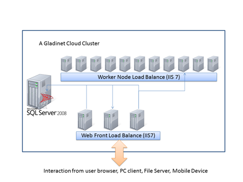
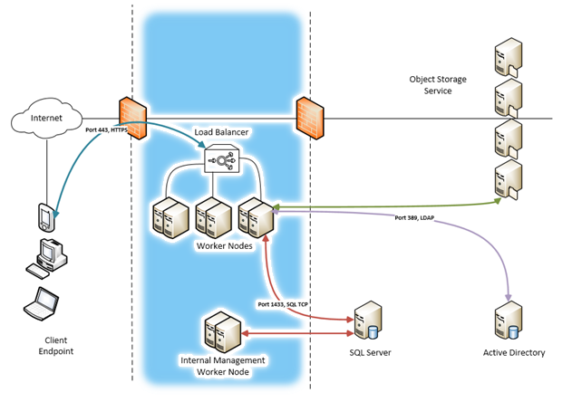
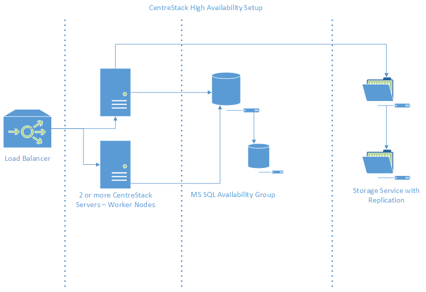

==============================
Deployment
==============================

Deployment Options
-----------------------------

As documented above, CentreStack has four logical components, the database, the web node and the worker node and the storage. This section will go through
different deployment options.

All-In-One Deployment
^^^^^^^^^^^^^^^^^^^^^^^^

This is the simplest deployment. The database , the web node and the worker node are all on the same machine as
the storage.
When you are serving < 1000 users or you are doing Proof-of-Concept (POC), this is the ideal deployment because of its simplicity.
You can have the CentreStack installer install the SQL Express on the same machine before install CentreStack software and then point the database to localhost\\SQLEXPRESS.
In the All-In-One deployment, the storage location is typically set to a folder on local C: drive or local D: drive.

The installer can install SQL EXPRESS so it is a one-click installation for convenience.
No need to do a separate SQL EXPRESS installation.

.. Note::

  If this is the first time you are installing CentreStack, this is the recommended setup because it is the easiest to setup and only takes 15-30 minutes on a clean machine.

In the latest CentreStack installer, the installer is capable of doing the all-in-one installation without asking you to setup SQL Express separately.

Single-Server Deployment
^^^^^^^^^^^^^^^^^^^^^^^^^^

This is another simple deployment. It is very similar to the All-In-One deployment. The only difference is that the file storage is off the machine instead of on the machine.

The external file storage can be file storage on a UNC path or it can also be a private object storage service.

In this deployment, the SQL Server Express and the Worker Node/Web Node are still deployed on the same machine.

Two-Server Deployment
^^^^^^^^^^^^^^^^^^^^^^^

In the two server deployment, the SQL Server database is installed in its own server;
away from the CentreStack worker node.
Usually, this is an intermediate step leading to the “Three-Server Deployment” and a step towards scaling up the server farm.

Three-Server Deployment for Redundancy
^^^^^^^^^^^^^^^^^^^^^^^^^^^^^^^^^^^^^^^^^

The 3-machine deployment is another simple deployment. The database node is installed separately.
Two CentreStack worker nodes are installed. The “External URL” field for each node is the same,
such as “cloud.acme.com”. The load balancer will do a round robin load balancing to either node.
A variation of the deployment is to set “External URL” field differently for the two worker nodes.
When “External URL” field is the same as the load balancer URL, everything is round robin.
When “External URL” is different, such as node1.acme.com and node2.acme.com,
the users will have affinity to one of the node.
For example, if user1 is assigned to node1.acme.com, he will continue to use node1.acme.com.
In this deployment, the size of the cluster is supporting 2000 concurrent-users per node.
The benefit is that if one node is down, there is another node for redundancy.

Multiple-Machine Deployment for Scalability
^^^^^^^^^^^^^^^^^^^^^^^^^^^^^^^^^^^^^^^^^^^^^

In this deployment, you will have clear separation of database ,
the web  node and the worker node. 

The database  is not a CentreStack worker node; it is just a server that runs SQL Server.

The web node and the worker node are all CentreStack nodes which run the same software but functionally work different.
Most of the time, in the multiple-machine deployment, a hardware load balancer is used and web node is not necessary.

The web  nodes are used for user login. After login, the user will be re-directed to the corresponding worker node.
(The web  node can be omitted if you have an existing Load Balancer).

For the load balancing to work, all the worker nodes and web front nodes have to be on the same DNS domain and same level of sub domain
(for example, they can be covered by same SSL wildcard certificate, such a \*.acme.com).  The load balancing requires at least two worker nodes.

*	Install the CentreStack server on the first worker node machine. Reboot and setup the cluster admin account.

*	Install the CentreStack server on all the other work nodes.

  On the database configuration window, use the same database server as the first installation.

.. note::

  We recommend you setup and configure the first node and make sure it runs smoothly first, before you setup and install the second node.

*	From any worker node, login to CentreStack Cluster Manager with the cluster admin account

  (the account you setup during the installation of the first worker node)

  .. image:: _static/image008.jpg

  Cluster manager is web browser based

  .. image:: _static/image009.png

*	From the Cluster Control Panel, Go to Cluster Server Farm item, click on ‘Edit’ and define all worker nodes.

  .. image:: _static/image010.png
  
  After click the "Edit", the Edit Worker Node Dialog shows

  .. image:: _static/image011.png

  **Node Name**
    
        For each worker node, the **node name** has to be the machine’s NETBIOS name (hostname).
        
  **External URL**
    
        The **External URL** is the unique URL to access the node from public internet. For example, http://node1.acme.com, http://node2.acme.com
        
  **Internal URL**
    
        The **internal URL** is the internal DNS name/URL from the internet network. The internal URL 
        in later build is hidden. No need to edit any more.

  Please DO NOT add web nodes to the Cluster Worker Node list. Most of the time when you
  have a multi-worker-node design, you are servicing many users, and most of the time you have your own load balancer.
  In the case when you have your own load balancer, the web node functionality is merged into worker node. So you can have a zero-web-node
  configuration.

*	Setup DNS Load balancing for all worker nodes.

    Most of the time you set up a firewall or a load balancer and point the DNS to the load balancer.
    The load balancer will then forward to the CentreStack worker node. 

.. note::

  If you are using hardware load balancer, you can skip web-nodes and have an all-worker-node cluster.

Typical Deployment in Enterprises
^^^^^^^^^^^^^^^^^^^^^^^^^^^^^^^^^^^

Here is a typical deployment schema in Visio Diagram for very big deployments in large enterprises.
In this deployment, the management functionality can be separated to internal management node (A property of worker node).
When management functionality is separated to internal DNS names, the management web portal is internal only and thus more secure.

High Availability Deployment
^^^^^^^^^^^^^^^^^^^^^^^^^^^^^^^^^^^^^^

For high availability, you can prepare the high availability deployment in three different layers and make sure
it is high availability within each layer.

1. Storage

If you are using Microsoft File Server Share as your storage, you can prepare it to be replicated, for example using DFS.

If you are using Amazon S3 or Windows Azure Blob, by default it is redundant and high availability.

2. Database

You can use the Microsoft SQL Server Availability Group Clustering or Availability Group Fail Over to make database high 
availability.

3. CentreStack Worker Node

You can have multiple centrestack worker nodes in a round robin load balancing setup to provide high availability.

