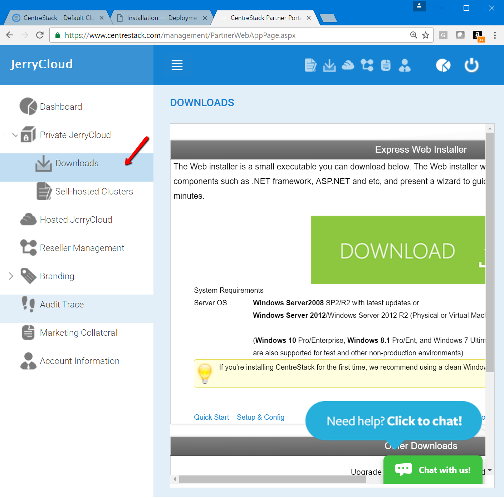
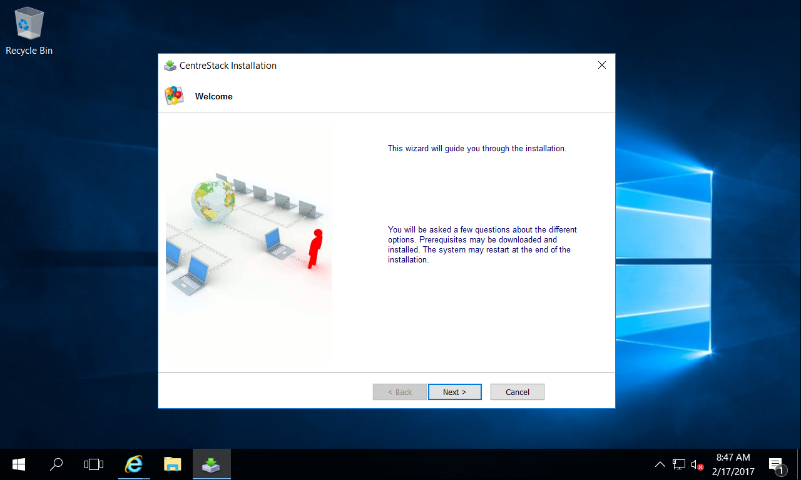
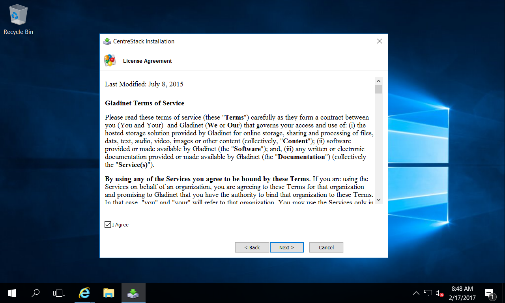
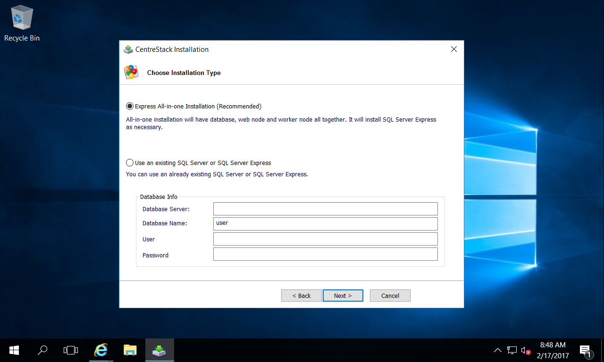
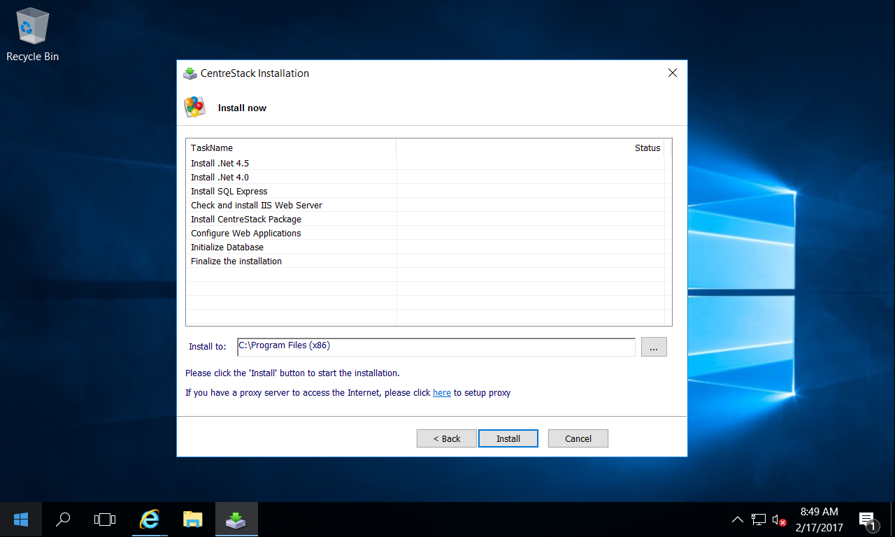
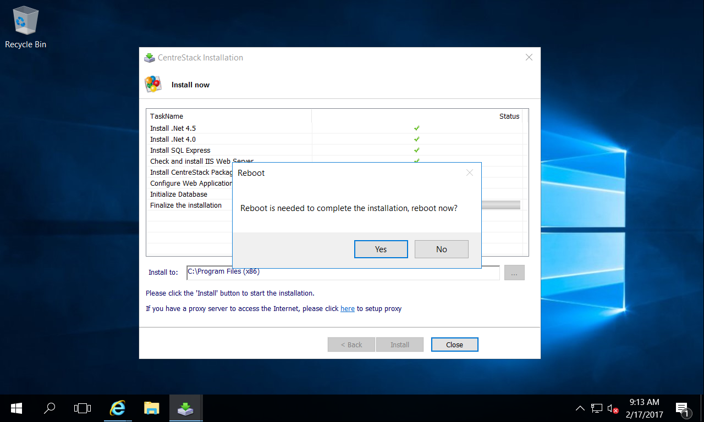
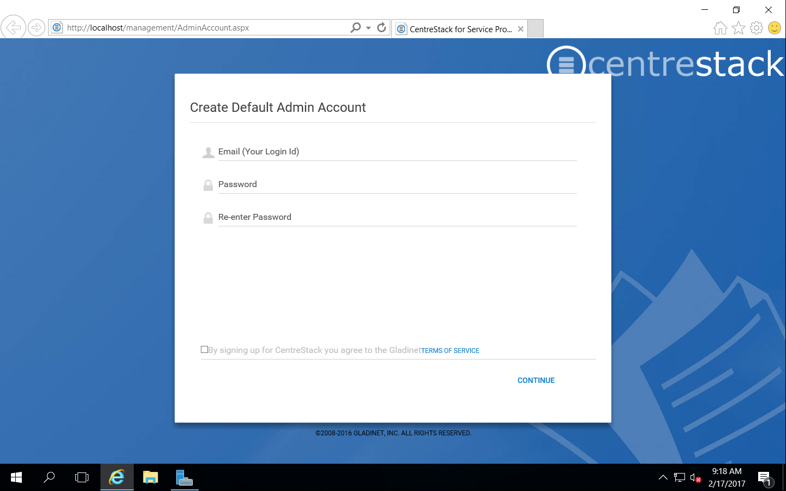
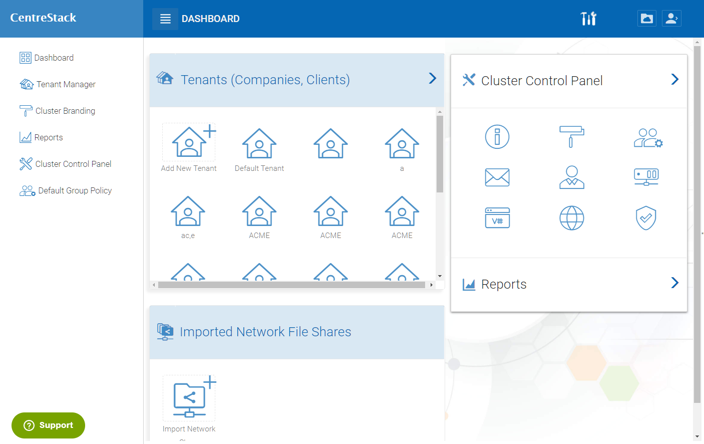

==============================
Installation
==============================

Preparation
-------------

The CentreStack Server software should be installed on a clean physical or virtual machine with just the base operating system.
Our recommendation is to use Windows Server 2019/2012/R2/2016 as the base OS with English locale.
(The server side English Locale will not affect the client side of the locale choice.)

If you are using Windows Server 2012 or Windows Server 2012 R2, Windows 2016 or Windows 2019,  you will get .NET Framework 4.5 and ASP.NET 4.5 (or above)
instead of .NET Framework 4 and ASP.NET 4 on Windows 2008 SP2/R2). We recommend .NET Framework 4.5 and above (such as 
.NET 4.6.2).

.. note::

     .NET 4.7.2 is the latest version as of this writing

When you are using the latest all-in-one installer, the installer will pull in the necessary components
and install them one-by-one automatically. On Windows 2012/R2 and later OS, many 
system components already exist on the system waiting to be turned on by a switch, 
so that it is easier and faster to install. Typical installation time is 15-45 minutes. The installation 
time varies mostly on how fast the machine can download and unzip the installer package.

On Windows 2008 R2, the installer will install .NET 4.5 so the installation time on Windows 2008 R2 servers
will be a little bit longer than the one on Windows 2012 R2 server and later Windows Server Platforms.

.. note::

     Clean Windows Server 2008 with SP2/R2 or Windows Server 2012/R2/2016 Machine will make the installation 
     much easier and smooth. 
     
     The CentreStack server 
     has dependency on the IIS (Web Server) and SQL/MySQL (if
     it is a all-in-one installation). If you have other
     software that are already running that uses the IIS
     or uses a database, it will be harder to make
     both software work so this is why a clean machine is 
     recommended.

Start Installation
--------------------------

The CentreStack Server installer is a standard Microsoft Windows Executable.
By default, it is using a GUI installer. However, the command line installer is also 
available upon request.
To start, you will need to obtain the installer package from http://www.centrestack.com to start the installation. You can login to the centrestack.com partner portal and go to the 
self-hosted CentreStack section for download.

Step 1:
^^^^^^^^^^^^^

Click ‘Next’ on the Welcome screen.

Step 2:
^^^^^^^^^^^^^

Accept the License Agreement and click on ‘Next’

Step 3:
^^^^^^^^^^^^^

.. note::
  
  In the previous version, the installer may ask for either enterprise edition or service provider
  edition. In the latest build, this difference is gone. The CentreStack single installation
  is good for both enterprise and service provider setup. If you need enterprise edition, you 
  just stay with one single tenant, otherwise you go ahead and create multiple tenants.

Step 4:
^^^^^^^^^^^^^

One of the steps during installation is the database configuration.

If the CentreStack is servicing a small number of users, you can use SQL Server Express on the same CentreStack
machine so you can accept the default "Express All-in-one Installation"

.. Note::

  If you decide to use a SQL Server/Express/MySQL from a different machine, the CentreStack will not install the SQL Server
  or Express. You will install the SQL Server or SQL Server Express or MySQL on the other machine and need to make sure it is
  ready.

If you plan to use CentreStack for a bigger user group, we recommend you keep the database on a separate machine with
daily backups.

Database Consideration:

Supported Microsoft SQL Server versions are:

    *	SQL Server 2008 and 2008 R2 with all service packs, Express, Standard, Enterprise, and Datacenter Editions
    *	SQL Server 2012 with all service packs, Express, Standard, and Enterprise Editions.
    *	SQL Server 2014 Standard and Enterprise
    *   SQL Server 2016

The following database features are supported (except SQL Server Express, which supports only standalone mode):

    *	SQL Server Clustered Instances
    *	SQL Mirroring
    *	SQL Server 2012 AlwaysOn Availability Groups
    
MySQL Community Server is also supported.

The minimum set of database rights required are:

    *	The ability to create database and be the owner of that database: ‘dbcreator’ and ‘dbowner’
    *	The ability to write into master, model, msdb, tempdb during install. If you pre-create the database and assigned the dbowner already. These privileges may not be necessary.

Step 5:
^^^^^^^^^^^^^

Let the installation continue. Typically it will take about 15-40 minutes
depending on the hard drive speed when the longest task is download
and expand the installer package.

Step 6:
^^^^^^^^^^^^^

After the CentreStack installation, a reboot is required.

After reboot, login to the same Windows account that installed the CentreStack server. After a while, 
a web page will pop up and you will be configuring
the default cluster administrator account. 

After the default cluster administrator account is created,
the installation and initial configuration of CentreStack
server is done. You will be at the cluster manager dashboard page.

