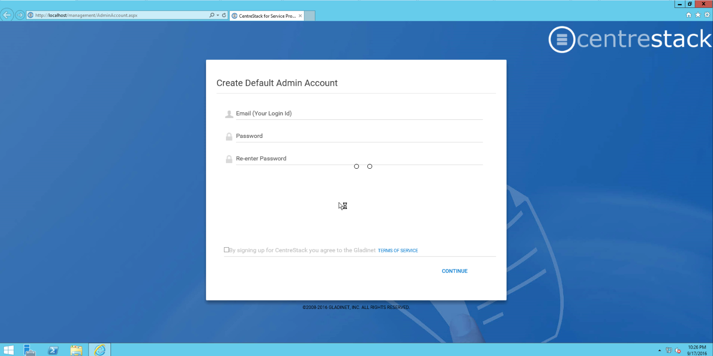
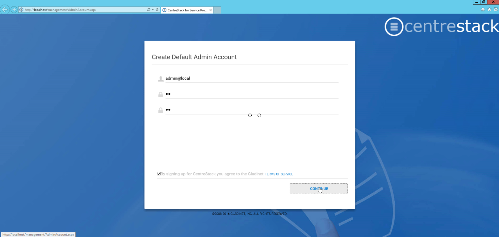

==============================
Initial Configuration
==============================

After you reboot, login to the machine’s Windows Console using the same admin user
used to install the CentreStack software. A web browser page will be displayed, automatically prompting you to create
the default admin account.

.. note::

  If the page does not come up automatically, it may be because the machine and the services on the machine
  are just starting. Give it a few minutes for the services to fully start and then refresh the page.

Configure the Very First Tenant
================================

The default admin will also be the very first tenant user of the CentreStack platform. As a tenant, you will be able
to use the system as other tenants just like your customers would. Thus, you can get familiar with the system
quickly.

For the default admin account, we recommend using an email address not used in the Active Directory.
It can be a real email address or a non-real one (such as admin@local). If it is a non-real email address,
the ‘forgot password’ feature will not work if the master admin forgets their password.

.. note::

    Why don't we recommend using Active Directory email as the default cluster admin login? 
    
    Because
    the active directory configuration is done by the cluster admin themselves. So the cluster
    administrator needs to login to fix Active Directory issues later on if there are issues in the 
    future, such as a password change, Active Directory server DNS name change, etc.
    

This is the only post-installation configuration screen. After that, the solution shall be fully functional.
