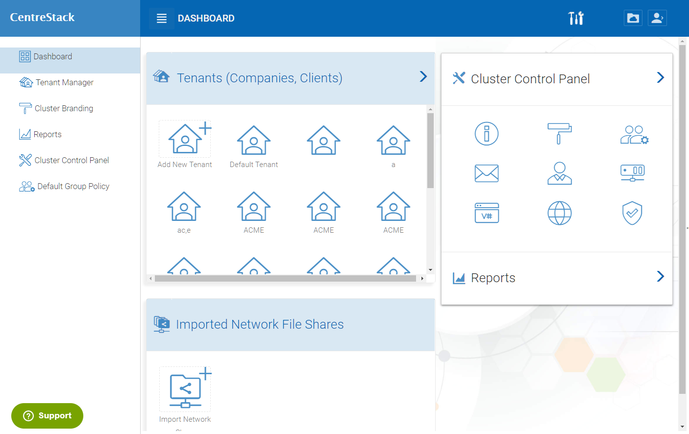

==============================
Cluster Manager
==============================

After the initial configuration after initial installation, The cluster admin will be presented with the 
cluster manager user interface. More specifically, the cluster manager dashboard.

For specific cluster manager and tenant manager administration interface, please reference the
CentreStack Admin Guide.

For the deployment guide, we will only show how to add tenant and what is the entry web page
for a tenant administrator.

Add Tenant
===============

You can add a tenant by clicking the Add Tenant Button in the Tenant Manager

.. image:: _static/image059.png

Tenant Administrator upon first login will see files and folders view.

.. image:: _static/image060.png

