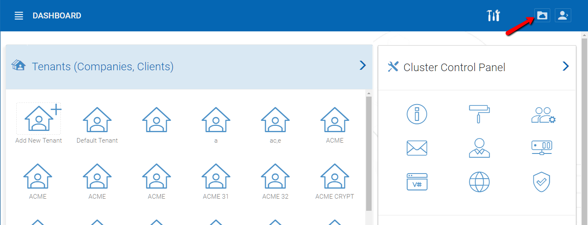

==============================
Overview of Web Portal
==============================

Most of the management tasks related to a single tenant are done in the web browser inside the web portal.
In order to get into the portal view, click on ‘My Files’ button in the dashboard.

The default portal view is the web browser based file manager.

.. image:: _static/image062.png
