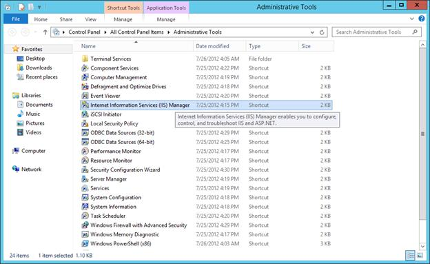
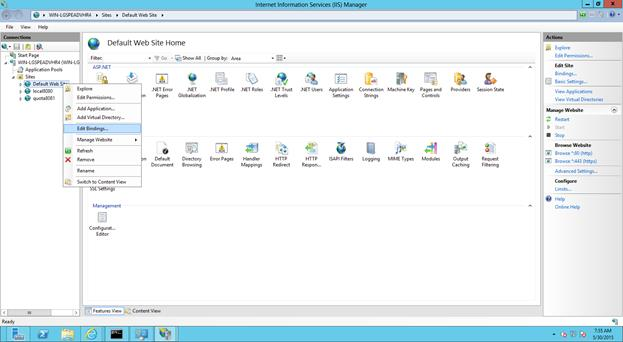
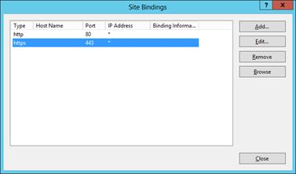
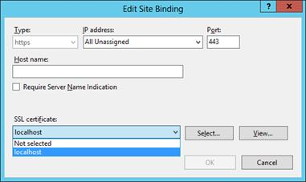
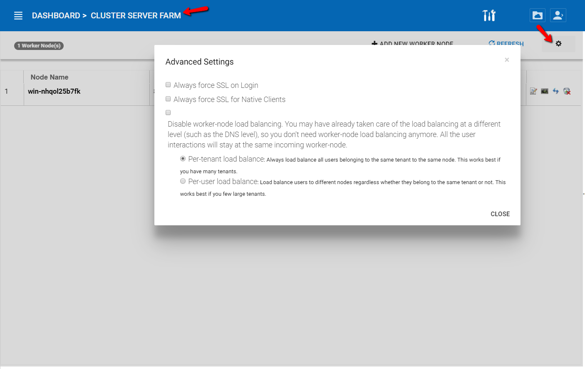
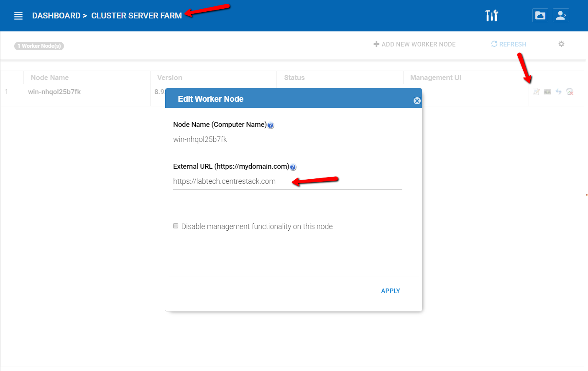

==============================
SSL (HTTPS) Configuration
==============================

We recommend that you turn on SSL for HTTPS before you download any access clients because access clients
need to connect to your CentreStack’s access end point. 

Even though it can connect to CentreStack via plain
HTTP we recommend configuring SSL for HTTPS before the client connects. You can get a SSL certificate
from a commercial SSL vendor and apply the SSL certificate from within the IIS Manager.  

Enabling SSL
for IIS Manager is a very standard IIS procedure. After you import the SSL certificate to the CentreStack
machine, you can go to the Administrative Tools-> Internet Information Services (IIS) Manager.

Once you are in the IIS Manager, navigate to the Default Web Site and click on the “Edit Binding …”

Highlight the https – 443 entry and click Edit.

Select the SSL certificate you have and click “OK”

.. warning::

  Only the web browser portal can accept a self-signed SSL certificate after you give the permission to
  proceed regardless of the SSL warning. 
  
  All other native access clients (Windows, Mac, Mobile clients)
  will all reject the HTTPS connection if the SSL certificate is not a valid certificate from a certificate
  authority. For example, if you try to connect to CentreStack server via https://ip-address
  for the native clients, the connection will fail.
  
  We recommend using https://www.ssllabs.com/ to check your SSL certificate and SSL configuration.

Once the server certificate has been installed on the CentreStack server and bindings applied, go to the
Cluster Server Farm -> Cluster Worker Nodes and make sure the External URL matches the HTTPS format of the DNS name given to the CentreStack server.

You can also lock it down to HTTPS/SSL only for client agents.

At the External URL textbox, enter the public DNS name for the node.

.. note::

    * You can bind the SSL certificate to the Default Web Site so the Default Web Site will have HTTPS binding.

    * Do not turn on “SSL Only” nor “Require Client Certificate”, because the web service depends on
      localhost:80 for inter-process communications over localhost:80

    * If you need “SSL Only” feature, we recommend you un-bind port 80 from the external IP Address on
      the “Default Web Site”. You can leave localhost: 80 binding intact.
      
      
.. warning::

    CentreStack server leverage http://localhost:80 for internal inter-process communication. From outside 
    of the firewall, they can use HTTPS to communication to the CentreStack server. From the inside of 
    the CentreStack server, the port 80 HTTP protocol and the localhost will still need to be 
    available for the "Default Web Site" for internal processes to communicate to each other.
