########################
Group Policy Settings
########################

Common Settings
^^^^^^^^^^^^^^^^^

Location: ``Group Policy Home`` > ``Common Settings``

From the Cluster Management Dashboard or the Tenant Management Dashboard choose the **Group Policy Home** icon.

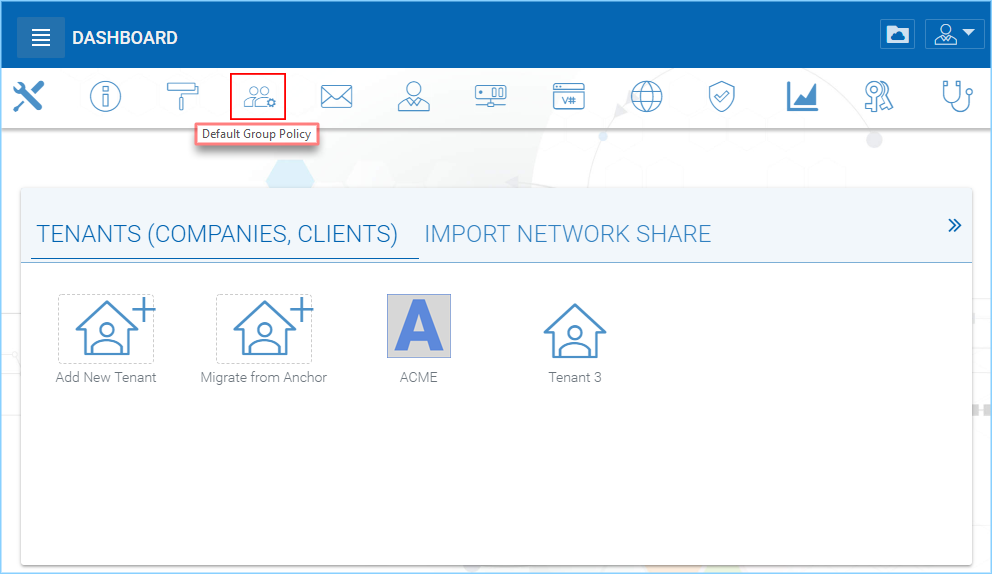

Then select Common Settings to access the following settings categories: Security, Sharing, File Locking Client Setting Manager, Retention Policy and Anti-Virus/Ransomware.

.. image:: ystatic/image_1-1-2.png

Security
============

Location: ``Group Policy Home`` > ``Common Settings`` > ``Security``

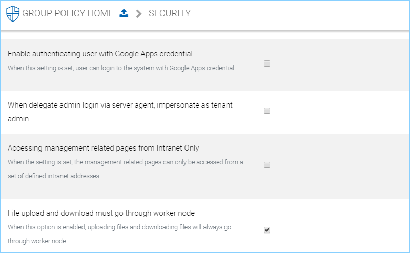

Allow Cluster Admin to manage my tenant
-----------------------------------------
- **Scope =** ``Tenant Management`` 

- Default is **enabled**. Allow Cluster admin to manage my tenant is for the tenant administrator to decide whether to allow cluster administrator (a higher level administrator that can manage this tenant) to gain access to the management console and help manage this tenant.

.. note:: There are two management scopes, one at the cluster level and one at tenant level. This document is generally about the Cluster Management scope of control and operations; however, if a setting isn't visible at this level it will be highlighted in this way, **Scope =** ``Tenant Management``.

Enable authenticating user with Google Apps credential
--------------------------------------------------------

- Default is **disabled**. When this setting is enabled, user can login to the system with Google Apps credential. When the email (user name) is the same as the Google Apps email, the Google Apps credential can be used to login.

When delegate admin login via server agent, impersonate as tenant admin
-------------------------------------------------------------------------

- Default is **disabled**. Server agent typically needs to sync to the default tenant administrator. It is recommended that this is enabled when a delegate administrator is setting up a server agent, so that user can impersonate the default tenant administrator. The end result after this is enabled is that the server sync to the default tenant root storage instead of sync to the specific user's root storage.

Accessing management related pages from Intranet Only
-------------------------------------------------------

- Default is **disabled**. When the setting is set, the management related pages can only be accessed from a set of defined intranet addresses.

- Intranet is defined as 10.x.x.x or 192.168.x.x kind of IP addresses. Usually you can achieve the same functionality by disable the management functionality on external facing worker nodes but enable that for an internal facing worker node. But if your intranet meets certain IP address criteria, you can use this setting to achieve that goal too. It is a security feature to limit the management scope to intranet only. As mentioned above, an alternative way is to go to the cluster manager, then cluster server farm and disable the “management functionality on this node”.

File upload and download must go through worker node
-------------------------------------------------------

- Default is **enabled**. When this option is enabled, uploading files and downloading files will always go through worker node.

- There may be some situations that this setting must be checked. For example, you may be using native object storage such as Amazon S3 for storage. However, your company policy may disable direct access to Amazon S3. So in this case, you will have to route traffic through the worker node.

Sharing
============

Location: ``Group Policy Home`` > ``Common Settings`` > ``Sharing``

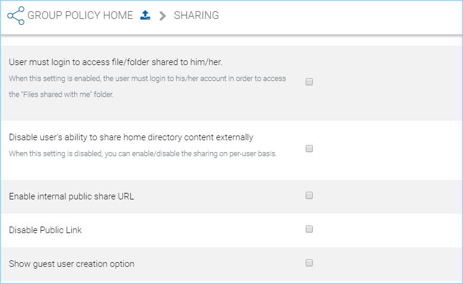

User must login to access file/folder shared to him/her
---------------------------------------------------------

- Default is **disabled**. When this setting is enabled, the user must login to his/her account in order to access the "Files shared with me" folder.

- When sharing files and folders with users, you can force the sharing to create guest accounts for users that are not already in the system. It is more secure when asking the receiver of the share to sign in to receive shared items. This disables the anonymous sharing. If this setting is not enabled, users can share files and folders to outside email address without requiring outside user to create guest user account.

Disable user's ability to share home directory content externally
-------------------------------------------------------------------

- Default is **disabled**. When this setting is disabled, you can enable/disable the sharing on per-user basis. 

Enable internal public share URL
----------------------------------

- Default is **disabled**. If you have an internal public share you can use this setting to enable it. When this is enabled, it will use the Internal URL property to generate the link.

Disable Public Link
---------------------

- Default is **disabled**. This will disable the public link feature in the sharing dialog. 

Show guest user creation option
---------------------------------

- Default is **disabled**. When enabled this shows the guest user creation option which you will see when ‘Sharing’ a file or folder by email. This is how you can provide full edit capability to a guest user, as they must be logged in to modify a file or folder in the CentreStack Server.

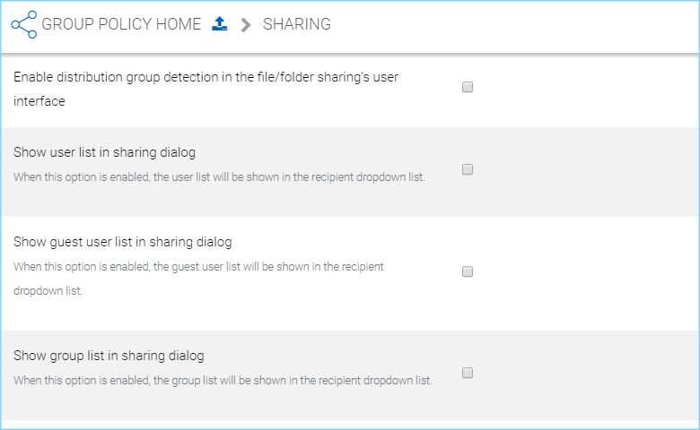

Enable distribution group detection in the file/folder sharing's user interface
---------------------------------------------------------------------------------

- Default is **disabled**. With active directory integration, sometimes you want to share files and folders with a distribution group. This feature allows detection of distribution group and expand the group so the sharing will be done with the users in the group, instead of using the group as a single user.

Show user list in sharing dialog
----------------------------------

- Default is **disabled**. When this option is enabled, the user list will be shown in the recipient dropdown list.

Show guest user list in sharing dialog
----------------------------------------

- Default is **disabled**. When this option is enabled, the guest user list will be shown in the recipient dropdown list. 

Show group list in sharing dialog
-----------------------------------

- Default is **disabled**. When this option is enabled, the group list will be shown in the recipient dropdown list.

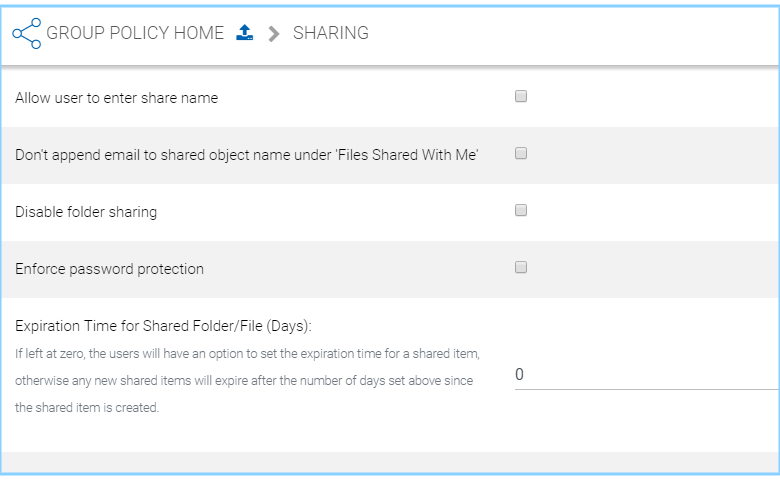

Allow user to enter share name
--------------------------------

- Default is **disabled**. Enable this to allow user to enter a name for the share. By default the file name or folder name is used for the share name. However, if user has many same name folders or files. Sharing them out sometimes many not know which is which. This setting allows user to change share name. For example, when sharing out a “Documents” folder, it can be named “Documents in top level folder”.

Don't append email to shared object name under "Files Shared With Me"
-----------------------------------------------------------------------

- Default is **disabled**. Enable this to remove the "Email" information provided under the shared object details in "Files Shared With Me". 

Disable folder sharing
------------------------

- Default is **disabled**. Enable this to disallow the sharing of folders. When enabled only individual files can be shared.  

Enforce password protection
-----------------------------

- Default is **disabled**. Enable this to force share access to require a password.  

Expiration Time for Shared Folder/File (Days)
-----------------------------------------------

- Using the default setting of **"0"** (zero) allows the users to have an option to set the expiration time for a shared item, otherwise any new shared items will expire after the number of days set above since the shared item is created.  zero means no expiring time set.

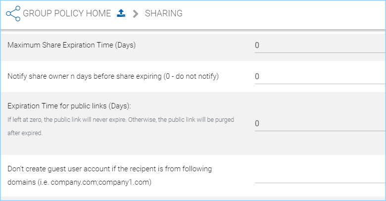

Maximum Share Expiration Time (Days)
--------------------------------------

- Using the default setting of **"0"** (zero) allows shares to exist indefinately. Enter a number here (in Days) to restrict shares to this "maximum" number of days. 

Notify share owner n days before share expiring (0 = do not notify)
---------------------------------------------------------------------

- Using the default setting of **"0"** (zero) means the share owner will not be notified before a share expires. Enter a number here (in days) to alert the share owner prior to expiration. 

Expiration Time for public links (Days)
-----------------------------------------

- Using the default setting of **"0"** (zero) allows public links to exist indefinately. Enter a number (in Days) here to limit how long a public share exists before it is purged.  

Don't create guest user account if the recipent is from following domains
---------------------------------------------------------------------------

- Default is **no entry**. Enter domains in this field to limit the creation of guest accounts to include only the domains listed here (e.g., company.com;company1.com). 

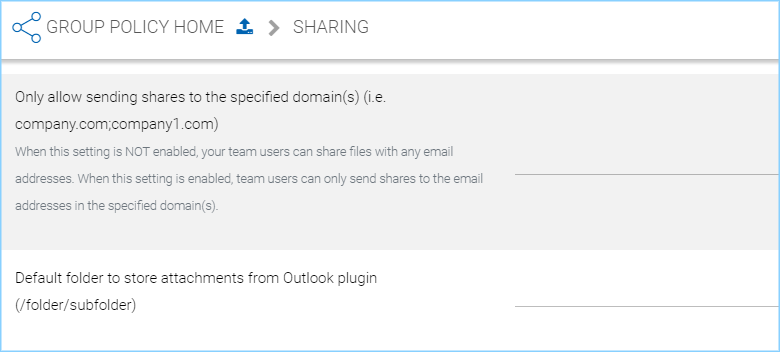

Only allow sending shares to the specified domain(s)
------------------------------------------------------

- Default is **no entry**. When nothing is placed in this field, your team users can share files with any email addresses. You can limit shares to specific domains (e.g., company.com;company1.com).

Default folder to store attachments from Outlook plugin 
---------------------------------------------------------

- Default is **no entry**. Enter a folder name (e.g., /folder/subfolder) to set a specific location. This folder will be used to sync files and folders from outlook plugin before sharing out as links.

File Locking
===============

Location: ``Group Policy Home`` > ``Common Settings`` > ``File Locking``

- Settings under file locking applies to all clients which include desktop clients as well as server agent clients.

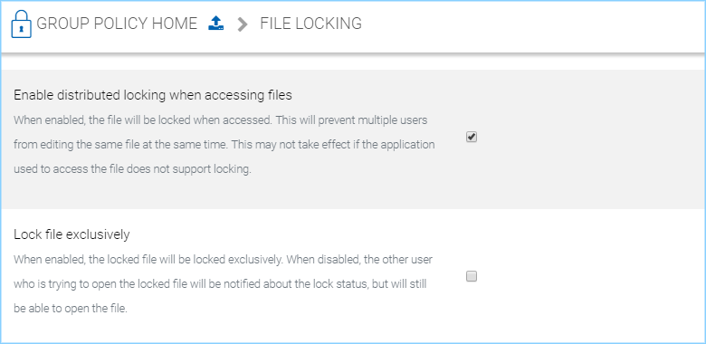

Enable distributed locking when accessing files
--------------------------------------------------

- When enabled, the file will be locked when accessed. This will prevent multiple users from editing the same file at the same time. This may not take effect if the application used to access the file does not support locking. In the Cluster Server, there are two ways to lock files, one is manually by right clicking on a file and select “Check out”. The other way is automatic based on certain binary executables. For example, you can see Microsoft Office executable files like winword.exe and so on.

Lock file exclusively
-----------------------

- When enabled, the locked file will be locked exclusively. When disabled, the other user who is trying to open the locked file will be notified about the lock status, but will still be able to open the file. When a file is locked exclusively, other user will not be able to open the file for any purpose.

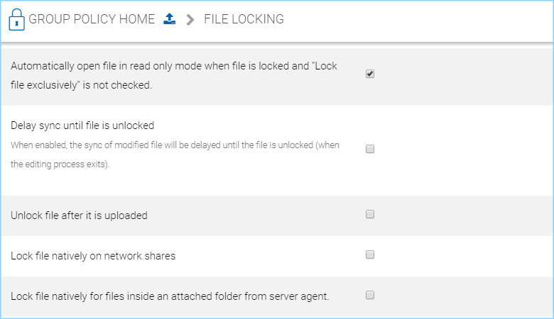

Automatically open file in read only mode when file is locked and "Lock file exclusively" is not checked
----------------------------------------------------------------------------------------------------------

- When this setting is enabled (default), a second attempt to open a locked file will result in the file opening in read-only mode. If “Lock file exclusively” is checked, then second user will not be able to open a locked file.

Delay sync until file is unlocked
-----------------------------------

- When enabled, the sync of modified file will be delayed until the file is unlocked (when the editing process exits). It is recommended to check this setting. Most users have habit to save files in the middle of editing. You don’t want these edit to go every time to the cloud for these intermediate saves. You want to do a save to the cloud at the end like a grand finale. So you can delay sync until file is unlocked.

Unlock file after it is uploaded
----------------------------------

After the file is uploaded, unlock the file.

Lock file natively on network shares
--------------------------------------

- When a file is locked in the CentreStack Server, if the file is from an attached network share, the CentreStack Server lock will be converted into a native file system lock on the network share. This provides locking interoperability between the CentreStack Server and the underlying file system network share.

Lock file natively for files inside an attached folder from server agent
--------------------------------------------------------------------------

- If this is enabled, lock files inside any folder that is attached from the Server Agent. 

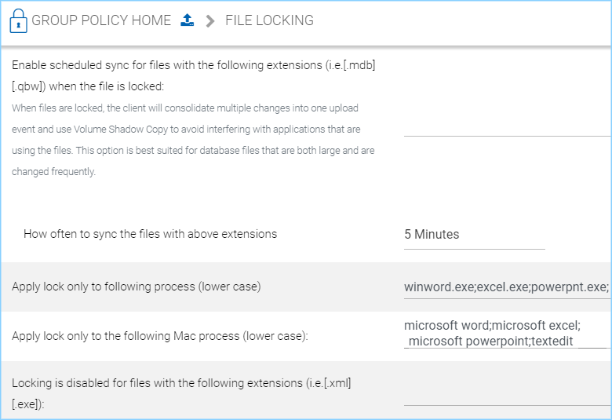

Enable scheduled sync for files with the following extensions
---------------------------------------------------------------

- When files are locked, the client will consolidate multiple changes into one upload event and use Volume Shadow Copy to avoid interfering with applications that are using the files. This option is best suited for database files that are both large and are changed frequently (e.g., [.mdb][.qbw]). 

**How often to sync the files with above extensions**

- This setting allows you to control the interval of synchronization that takes place on the above file extensions.

Apply lock only to following process (lower case)
---------------------------------------------------

- You can specify the processes here for which locking should be applied. By default, locking is enabled for Microsoft Word, Excel, and PowerPoint.

Apply lock only to the following Mac process (lower case)
-----------------------------------------------------------

- You can specify the processes here for which locking should be applied. By default, locking is enabled for Microsoft Word, Excel, PowerPoint and MAC text editor.

Locking is disabled for files with the following extensions
-------------------------------------------------------------

- You can use this setting to specify which file types will be ignored with regard to the file-locking feature. (e.g., [.xml][.exe])

Client Setting Manager
========================

Location: ``Group Policy Home`` > ``Common Settings`` > ``Client Setting Manager``

- The following settings apply to Windows client (Windows Client and Windows Server Agent) and Mac Client, which take precedence over the client-side settings. 
- Expand the following sections in the web portal to see all of the options contained within each section. 

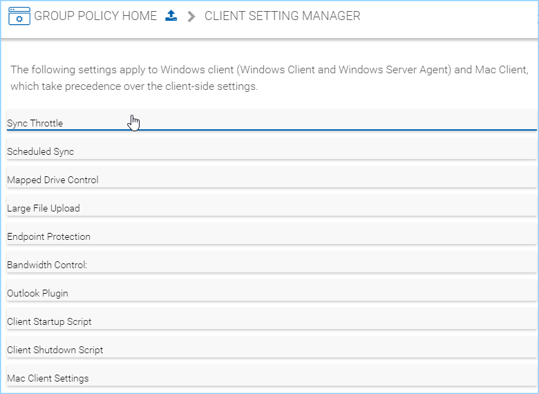

Sync Throttle
---------------

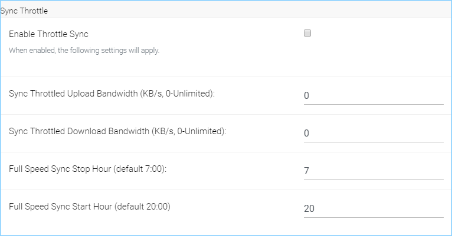

**Enable Throttle Sync** 

- Default is **disabled**. When enabled, the following settings will apply.

**Sync Throttled Upload Bandwidth (KB/s, 0-Unlimited)**

- Default is **"0"**. This setting controls the upload bandwidth from the client machine.

**Sync Throttled Download Bandwidth (KB/s, 0-Unlimited)**

- Default is **"0"**. This setting controls the download bandwidth from the client machine.

**Full Speed Sync Stop Hour (default 7:00)**

- Default is **"7"**. Full speed sync means multiple thread concurrent upload or download. This is typically good for after hour activity. We recommend default setting stop at 7am so when people return to work, the full speed sync stops so to give back more bandwidth to users who may be using the Internet for other purposes.

**Full Speed Sync Start Hour (default 20:00)** 

- Default is **"20"**. Similar to the above setting, we recommend start full speed sync after working hours.

Scheduled Sync
----------------

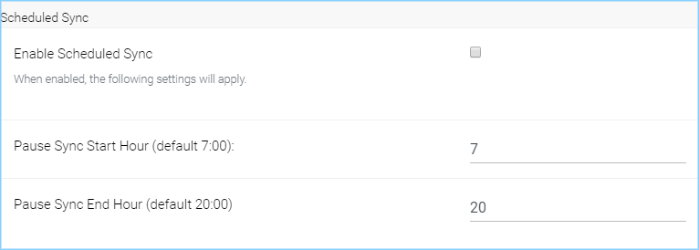

**Enable Scheduled Sync**

- Default is **disabled**. When enabled, the following settings will apply.

**Pause Sync Start Hour (default 7:00)**

- Default is **"7"**. 

**Pause Sync End Hour (default 20:00)**

- Default is **"20"**. 

Mapped Drive Control
----------------------

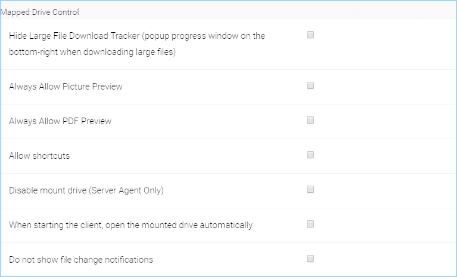

**Hide Large File Download Tracker**

- This is a popup progress window on the bottom-right when downloading large files. This is usually good for usability but people may find it annoying if download is popping up a download progress dialog at the lower right corner.

**Always Allow Picture Preview**

- Windows Explorer may want to download pictures in the background to generate thumbnails. This consumes bandwidth and may slow system down until all the preview thumbnails are generated. By default the client program disables the preview. However you can re-enable it.

**Always Allow PDF Preview**

- Windows Explorer may want to download PDFs in the background to generate thumbnails. This consumes bandwidth and may slow system down until all the preview thumbnails are generated. By default the client program disables the preview. However you can re-enable it.

**Allow shortcuts**

- Allow shortcuts (.lnk) files.

**Disable mount drive (Server Agent Only)**

- Enable this to disable the mount drive in any Server Agent connected systems. 

**When starting the client, open the mounted drive Automatically**

- Enabling this opens the mounted drive in Windows Explorer when the client starts.

**Do not show file change notifications**

- This is another feature that shows file change notification at the lower right hand corner of Windows desktop. People may find it annoying if the change notification comes in quite often.

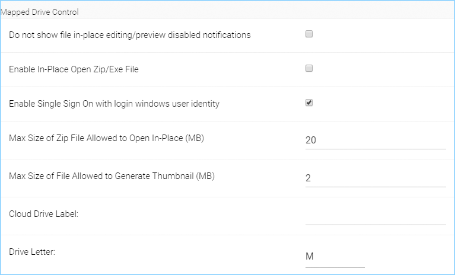

**Do not show file in-place editing/preview disabled notifications**

- This feature also shows file change notification at the lower right hand corner of Windows desktop. People may find it annoying if the change notification comes in quite often.

**Enable In-Place Open Zip/Exe File**

- Windows Explorer has zip built-in extension that can open a zip file when double clicked on. It may be good for local drive but for cloud drive, that means the zip file is unzipped and re-upload back into the cloud. By default client application disables opening zip file directly in the cloud drive.

**Enable Single Sign On with login windows user identity**

- Enable Single Sign On with Login Windows User Identity - For Windows client agent running on a Windows Desktop machine, the login windows’ user’s identity will be used for single sign on to the CentreStack Server account.

**Max Size of Zip File Allowed to Open In-Place (MB)**

- Limits the size of a Zip File that can be opened in-place.

**Max Size of File Allowed to Generate Thumbnail (MB)**

- Limits the size of a File that can be opened in-place.

**Cloud Drive Label**

- What do you want to give the drive letter to the client application.

**Drive Letter**

- 

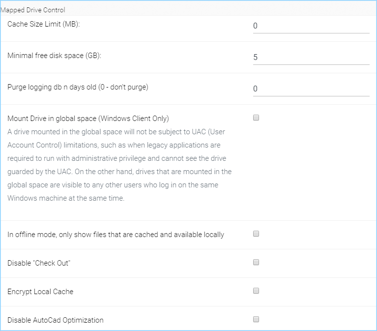

**Cache Size Limit (MB)**

- The Windows client maintains a client-side cache of this size (0 = unlimited)

**Minimal free disk space (GB)**

- This setting is used to establish a minimum amount of disk space used for the windows client drive. when the minimum free space threshold is hit, the windows client agent will be more agressive clear out the files in the cache to free up space.

**Purge logging db n days old**

- (0 = don't purge). This limits how many days of logging are kept in the Windows client cache.

**Mount Drive in global space (Windows Client Only)**

- A drive mounted in the global space will not be subject to UAC (User Account Control) limitations, such as when legacy applications are required to run with administrative privilege and cannot see the drive guarded by the UAC. On the other hand, drives that are mounted in the global space are visible to any other users who log in on the same Windows machine at the same time. The default behavior is that the drive is mounted with the user's regular privilege. 

**In offline mode, only show files that are cached and available locally**

- Typically there will be place-holder files and representative icons created for all of the files in the client drive. If this setting is enabled, only locally stored files will be shown.

**Disable "Check Out"**

- Turn off the “Check Out” feature and remove it from the right-click context menu.

**Encrypt Local Cache**

- Once enabled, when a file is downloaded to cache, it is encrypted in-place. When an authorized user then accesses the file from the (M:) Mapped Cloud Drive, CentreStack automatically decrypts it on the fly and then returns it to the user.

**Disable AutoCad Optimization**

- By default, there is an AutoCad optimization that delays the synchronization of updated .dwg file and schedules it to sync upwards to cloud at a later time. Use this setting to disable this AutoCad optimization and make saving AutoCad .dwg files act the same as saving other regular files and lets .dwg file behavior follow other policy settings.

Large File Upload
-------------------

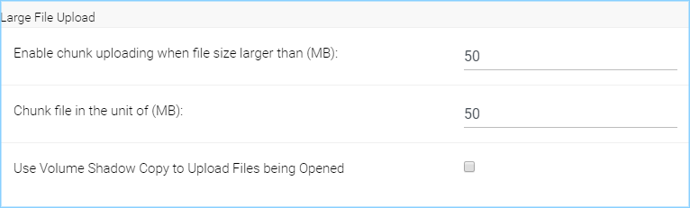

**Enable chunk uploading when file size larger than (MB)**

- Uploading a single large file can be disrupted by an Internet glitch. This setting breaks large files into smaller chunks to increase the success rate.

**Chunk file in the unit of (MB)**

- Works with the above setting to establish what size the chunks will be in as they are transferred.

**Use Volume Shadow Copy to Upload Files being Opened**

- There is pro and con of using this flag. When file is open by other application, the file usually is locked and can’t be uploaded until the file is closed. However using volume shadow copy can still upload the file. The down side is when the volume shadow copy happens, the file is not known to be in a consistent state.

Endpoint Protection
---------------------

.. image:: ystatic/image_1-5-6.png

**Backup "My Documents" folder**

- Forces files in “My Documents” to be backed-up to the cloud.

**Backup to location**

- (Leave empty for default location. e.g., myroot/{email} or {samAccountName} or {upn}/My Pictures). Allows you to set an alternative storage location for the above setting. 

**Leave empty for default location. (e.g., myroot/{email} or {samAccountName} or {upn}/My Documents)**

- 

**Backup "My Pictures" folder**

- (Leave empty for default location. e.g., myroot/{email} or {samAccountName} or {upn}/My Pictures). Forces files in “My Pictures” to be backed-up to the cloud.

**Backup to location**

- Leave empty for default location.(e.g., myroot/{email} or {samAccountName} or {upn}/My Pictures). Allows you to set an alternative storage location for the above setting.

Bandwidth Control
-------------------

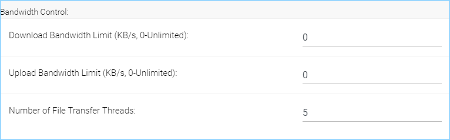

**Download Bandwidth Limit (KB/s, 0-Unlimited)**

- This is download bandwidth control.

**Upload Bandwidth Limit (KB/s, 0-Unlimited)**

- This is upload bandwidth control.

**Number of File Transfer Threads**

- This is the number of concurrent upload/download allowed (default is 5).

Outlook Plugin
----------------

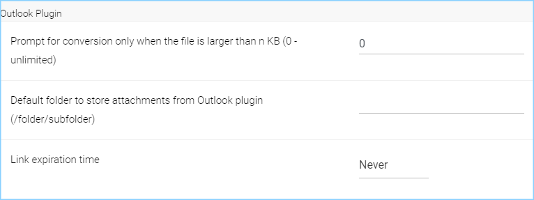

**Prompt for conversion only when the file is larger than n KB (0 = unlimited)**

- For smaller files, it may be as well to just use the native outlook attachment.

**Default folder to store attachments from Outlook plugin (/folder/subfolder)**

- Allows you to set a storage location for the above setting.

**Link expiration time**

- Allows Outlook share link to last indefinately or expire in a specified timeframe (e.g., never, one day, one week, one month, six months, one year).

Client Startup Script
-----------------------

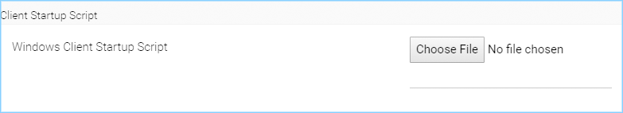

- After the Windows client is completely started and finished loading, a command-line script can be run. You can upload that script here. For example, a script to map an additional drive letter to a specific folder inside the cloud drive.

Client Shutdown Script
------------------------

- Right before the Windows client is completely shutdown and finished running, a command-line script can be run. You can upload that script here. For example, a script to clean up any reference to folders and files inside the cloud drive.

Mac Client Settings
---------------------

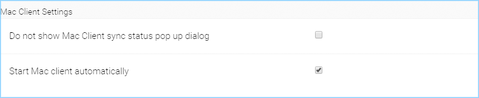

**Do not show Mac Client sync status pop up dialog**

- This is usually good for usability but people may find it annoying if the file status is popping up a progress dialog at the upper right corner.

**Start Mac client automatically**

- Default is **enabled**. If this is disabled, the Mac Client must be started manually.

Retention Policy
===================

Location: ``Group Policy Home`` > ``Common Settings`` > ``Retention Policy``

- The cloud monitoring service on the Cluster Server will be responsible for the retention policy. The settings of the retention policy are described below.

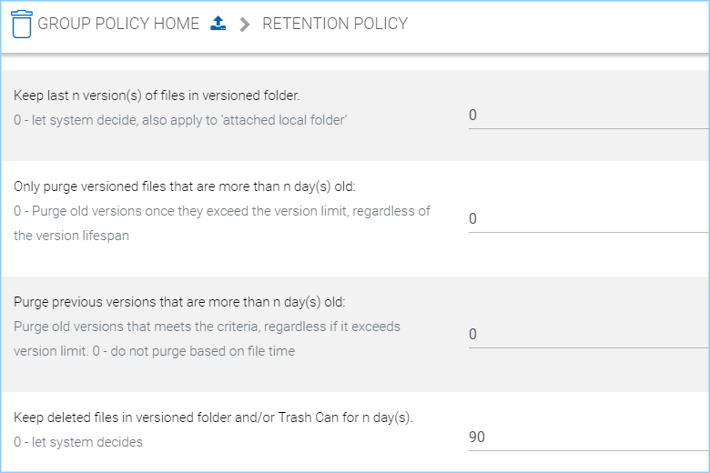

Keep last n version(s) of files in versioned folder
-----------------------------------------------------

- This setting lets you decide how many versions of files to keep in the version folder. (0 = let system decide, also apply to “attached local folder’)

Only purge versioned files that are more than n day(s) old
------------------------------------------------------------

- This is a security feature. For example, there is a virus modified the same file many times so it created many versions causing good old versions to be scheduled for deletion. However, with this set, the good old versions will be kept for at least the amount of days so give enough time to recover (0 = purge old versions once they exceed the version limit, regardless of the version lifespan).

Purge previous versions that are more than n day(s) old
---------------------------------------------------------

- Purge old versions that meets the criteria, regardless if it exceeds version limit (0 = do not purge based on file time).

Keep deleted files in versioned folder and/or Trash Can for n day(s)
----------------------------------------------------------------------

- 0 = don't purge deleted files. When a file is deleted in the version folder, it is not actually deleted. It will be kept for several days defined here.

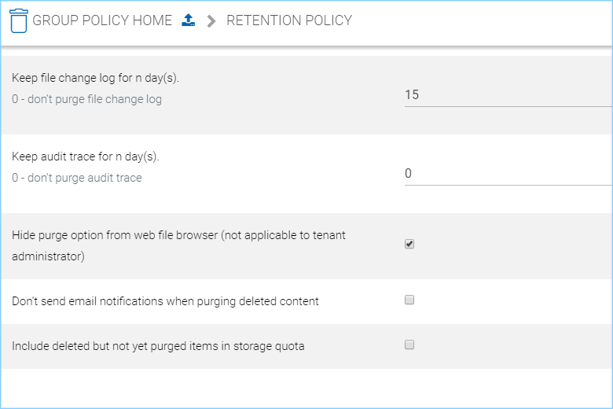

Keep file change log for n day(s)
-----------------------------------

- The file change log is the biggest database table and could be growing without trimming. You can decide how often you want to trim the table (0 = don't purge file change log).

.. Note::

    There is also a cluster setting about the file change log length. The cluster setting overrides the per-tenant setting.

Keep audit trace for n day(s)
-------------------------------

- 0 = don't purge audit trace. Audit trace log is stored in a local device directory and keeps a record of high-level activity from a device (e.g., windows client, server agent). This setting limits the number of days that are stored in the local database file.

Hide purge option from web file browser
------------------------------------------

- Do not show the purge window to users when deleting content (not applicable to tenant administrator).

Don't send email notifications when purging deleted content
-------------------------------------------------------------

- There are times when an admin would not want to send or see delete email notifications for purged contents.

Include deleted but not yet purged items in storage quota
-----------------------------------------------------------

- Allows you to decide if you want to include not visible (purged) files in the storage quota that is used.

Anti Virus/Ransomware
========================

Location: ``Group Policy Home`` > ``Common Settings`` > ``Anti Virus/Ransomware``

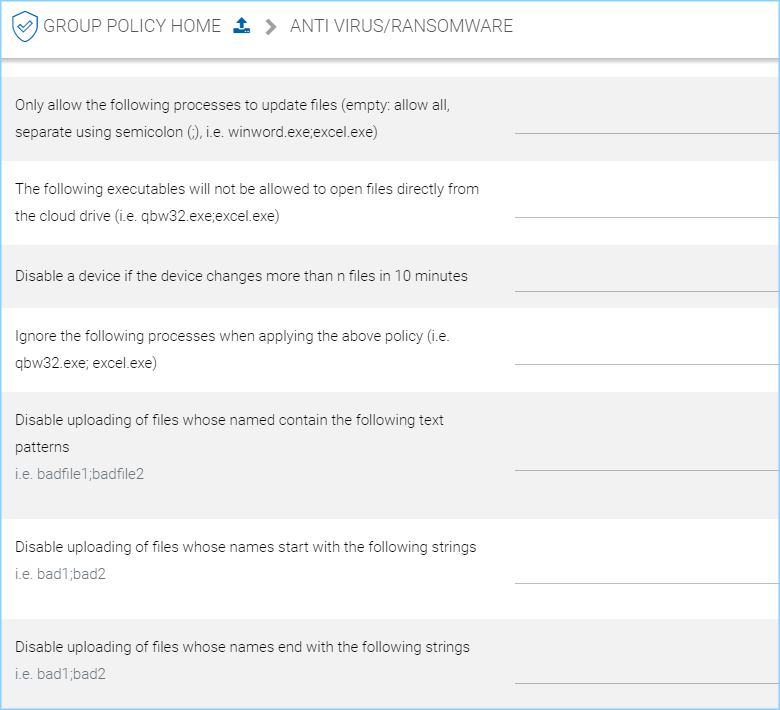

Only allow the following processes to update files
----------------------------------------------------

- Empty = allow all. This is a white list of applications that are allowed to update files. The applications that are not in the list will not be able to upload files. (e.g., winword.exe;excel.exe). 

The following executables will not be allowed to open files directly from the cloud drive
-------------------------------------------------------------------------------------------

- This is the opposite of the above policy. The applications in this list will be denied. (e.g., qbw32.exe;excel.exe)

Disable a device if the device changes more than n files in 10 minutes
------------------------------------------------------------------------

- When users are using the cloud drive in a normal way. Human speed will not be able to generate large amount of file changes to upload. 

Ignore the following processes when applying the above policy
---------------------------------------------------------------

- This is a white list of files that will not be monitored for the activity described above. (e.g., qbw32.exe;excel.exe)

Disable uploading of files whose named contain the following text patterns
----------------------------------------------------------------------------

- When file name text contains the following strings, the files will not be uploaded. (e.g., badfile1;badfile2)

Disable uploading of files whose names start with the following strings
-------------------------------------------------------------------------

- When the starting text of files contain these strings, the files will not be uploaded. (e.g., bad1;bad2)

Disable uploading of files whose names start with the following strings
-------------------------------------------------------------------------

- When the ending text of files contain these strings, the files will not be uploaded. (e.g., bad1;bad2)

Account & Login
^^^^^^^^^^^^^^^^^

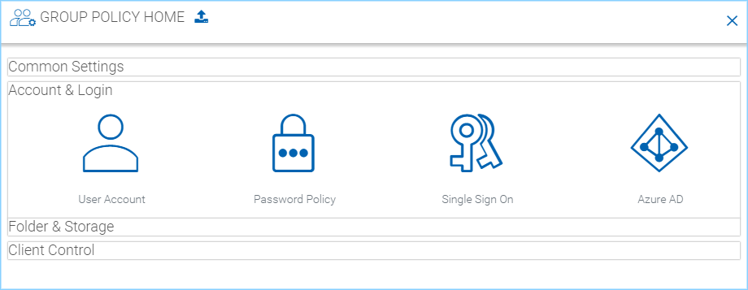

User Account
==============

Location: ``Group Policy Home`` > ``Account & Login`` > ``User Account``

.. image:: ystatic/image_2-2-1.png

Guest User
------------

**Allow creation of guest user**

- Default is **enabled**. You will allow creating of guest user when team user share files or folders with external users. When disabled, the file/folder sharing is limited to regular users only or anonymous users only.

Account Info
--------------

**Allow user to edit account info**

- Default is **enabled**. This setting allows users to edit their account information.

2-Step Verification
---------------------

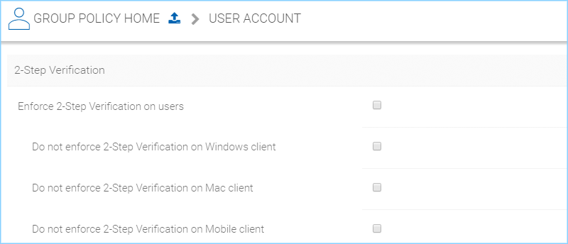

**Enforce 2-Step Verification on users** 

- Default is **disabled**. When 2-Step verification setting above is enabled, enforce the following settings for all tenant users.

    - Do not enforce 2-Step Verification on Windows client
    - Do not enforce 2-Step Verification on Mac client
    - Do not enforce 2-Step Verification on Mobile client

**Disable 2-Step Verification**

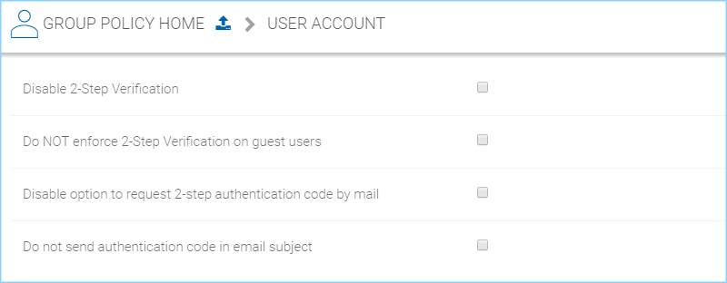

- Default is **disabled**. Enabling this setting will "disable" 2-Step verification if it is enabled. 

**Do NOT enforce 2-Step Verification on guest users**

- Default is **disabled**. Guest users are required to use 2-Step verification if it is enforced above. Enable this option if you want to allow guest users access without 2-Step verification.

**Disable option to request 2-step authentication code by mail**

- Default is **disabled**. Users can request 2-step authentication codes by email. Enable this to remove this option.

**Do not send authentication code in email subject** 

- Default is **disabled**. Users will see the authentication code in the email subject line. Enable this to remove the authentication code from the subject line. 

Login Control
---------------

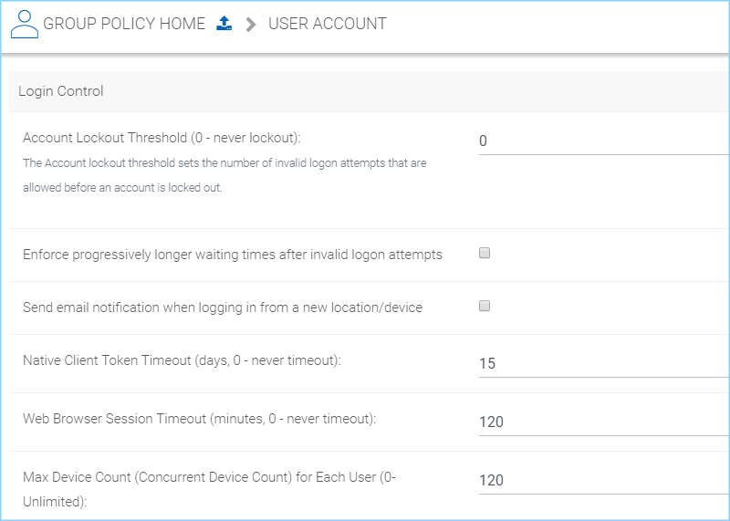

**Account Lockout Threshold**

- Default is **"0"** (never lockout). The Account lockout threshold sets the number of invalid logon attempts that are allowed before an account is locked out.

**Enforce progressively longer waiting times after invalid logon attempts**

- Default is **disabled**. You can also enforce progressively longer waiting times after invalid logon attempts.

**Send email notification when logging in from a new location/device**

- Default is **disabled**. This setting will send an email to users whenever a different device or location is used to login.

**Native Client Token Timeout (days, 0 = never timeout)**

- Default is **"15"** days. Determines if and when the Native Client Token will timeout, in days.

**Web Browser Session Timeout (minutes, 0 = never timeout)**

- Default is **"120"** minutes. Determines if and when the Web Browser Session timeout, in minutes, will occur.

**Max Device Count (Concurrent Device Count) for Each User (0-Unlimited)**

- Default is **"120"**. 

Password Policy
=================

Location: ``Group Policy Home`` > ``Account & Login`` > ``Password Policy``

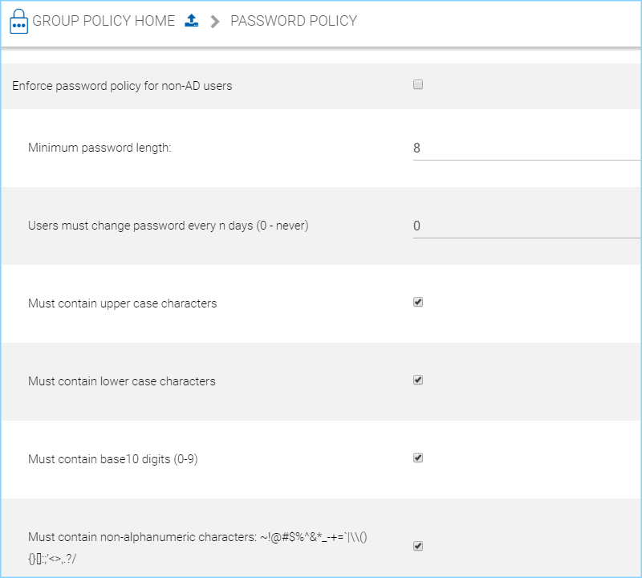

Enforce password policy for non-AD users
------------------------------------------

- Default is **disabled**. By default the following rules are NOT enforced on non-AD users. Enable this setting to enforce the following rules.

**Minimum password length**

- Default is **"8"**. Require the password to contain a certain number of characters as a minimum.

**Users must change password every n days**

- Default is **"0"** (never). Force users to change their passwords every so many days.

**Must contain upper-case characters**

- Default is **enabled**. Enforce the use of upper-case characters in the password.

**Must contain lower-case characters**

- Default is **enabled**. Enforce the use of lower-case characters in the password.

**Must contain base10 digits (0-9)**

- Default is **enabled**. Enforce the use of base10 digits in the password.

**Must contain non-alphanumeric characters: (e.g., ~ ! @ # $ % ^ &)**

- Default is **enabled**. Enforce the use of special non-alphanumeric characters when creating a password.

Single Sign On
================

Location: ``Group Policy Home`` > ``Account & Login`` > ``Single Sign On``

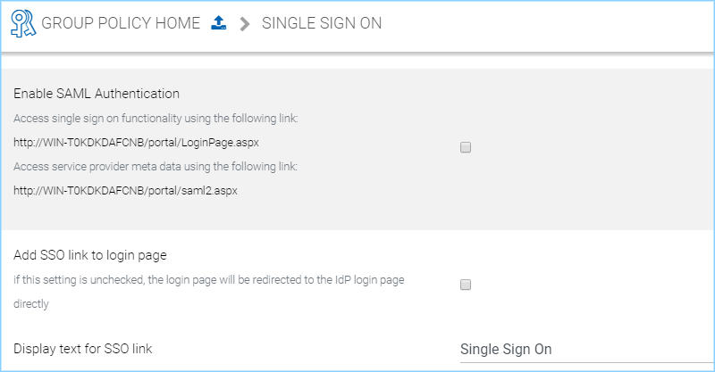

- Single Sign-On is available using SAML authentication.

- When it comes to Single Sign-On support via SAML, there are always two parties.

    - One is the IdP (the identity provider)
    - The other is SP (service provider)

- A user will be registered with the identity provider and use the service from service provider. The setup here is to allow service provider (the Cluster Server) to use an identity provider.

- Here, The IdP will be a public IdP such as AzureAD and the SP will be the Cluster Server. The SSOCircle below is used as an example to set up the IdP; it can work with other IdP as well.

- In a multi-tenant Cluster Server deployment each tenant may want to have its own SSO service. Therefore, the Single Sign On is a per-tenant setting.

**Step 1: Register the Cluster Server at IdP**

- IdP will need to register the Cluster Server as a service provider (SP) by importing the SP’s meta data. You will find the Cluster’s metadata at the following location (per-tenant setting).

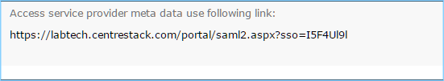

- We can use the following xml to register the Cluster as an SP at SSOCircle:

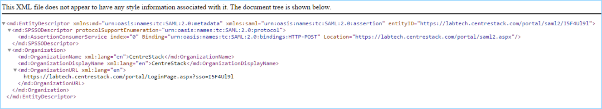

- Now at the SSOCircle, need to add a new service provider:

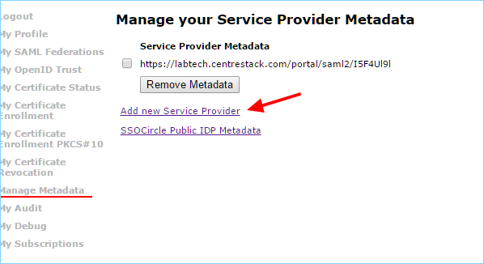

- In the next screen we can paste in the xml from the Cluster side, set the FQDN to the URL contained within the XML, and check the 3 parameters, the FirstName, LastName and Email.

.. image:: ystatic/image_2-4-6.png

**Step 2: Now SSOCircle at the Cluster Server side**

- The IdP registration and SP registration is a two-way I trust you and now you trust me kind of manual setup.

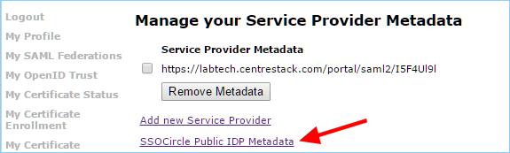

- The meta data from the SSOCircle look like this and it can be imported to the Cluster Server.

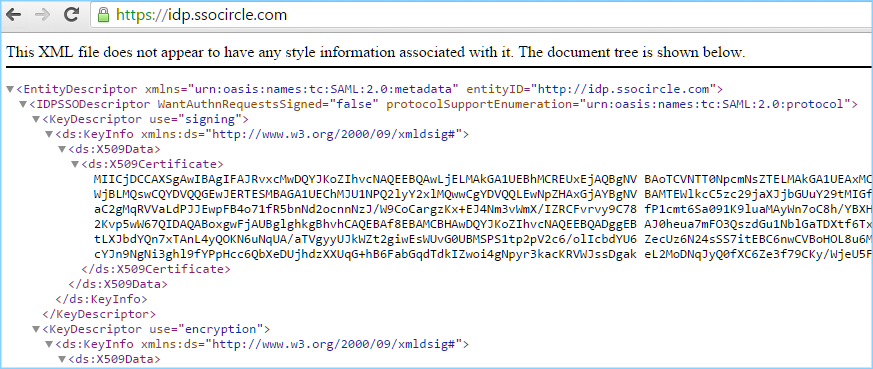

- Inside the meta data from SSOCircle, you will see there is a HTTP-Redirect URL, that will be the URL we use to register the IdP. And also register the 3 paramaters (FirstName, LastName, EmailAddress) from the IdP.

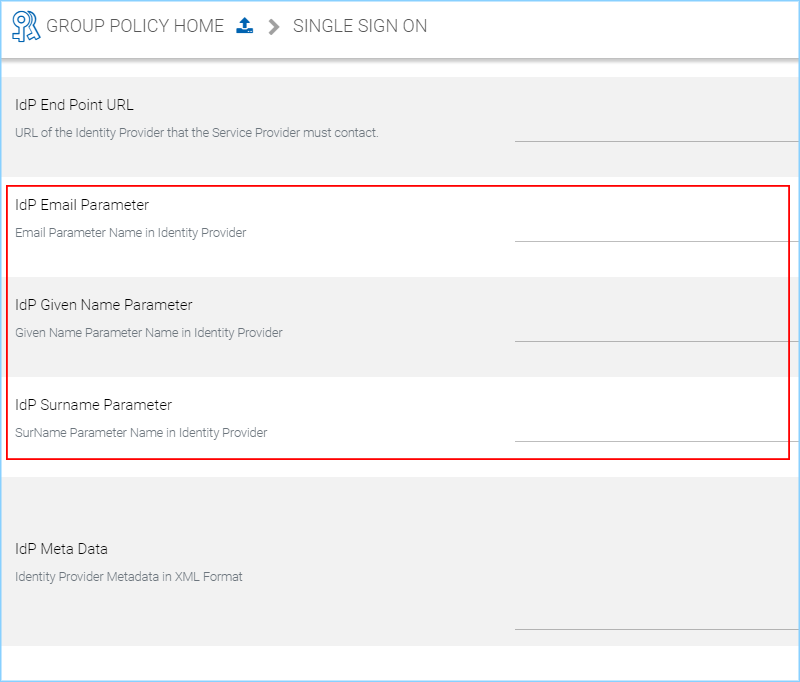

**Step 3: Login at the IdP, but use service at SP**

- As the summary, the IdP and SP register each other’s meta data, register each other’s URL and parameters. After that, it will be single signon at the IdP side. The login will be at the IdP side, and after login, it will redirect back to the SP side.

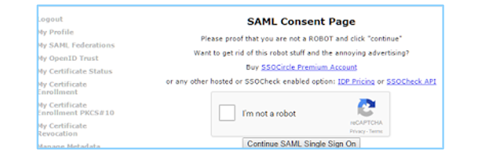

Azure AD
==========

Location: ``Group Policy Home`` > ``Account & Login`` > ``Azure AD``

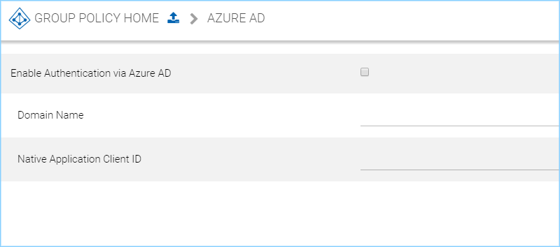

Enable Authentication via Azure AD
------------------------------------

- Azure AD integration allows users to use their Azure AD credentials to login to the Cluster Server, including web portal and native clients.

- You will still need to create Azure AD users as if they were local Cluster users first. After that, you can enable Azure AD integration. When AzureAD integration is enabled, the local user will be using the AzureAD credential to login.

- To enable Azure AD integration, you will need to create an Azure AD native client application.

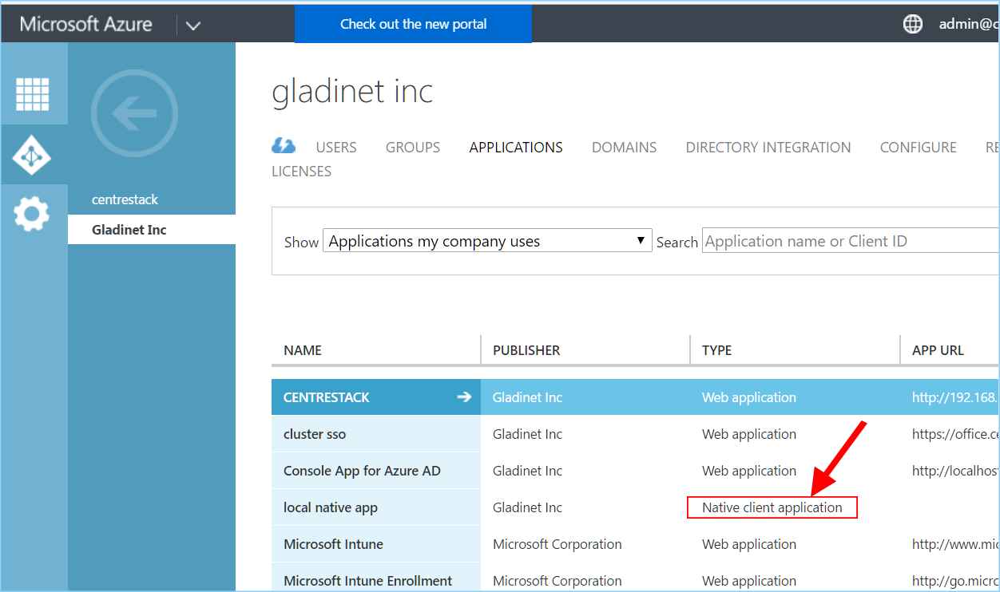

**Domain Name**

- You will also need the domain name

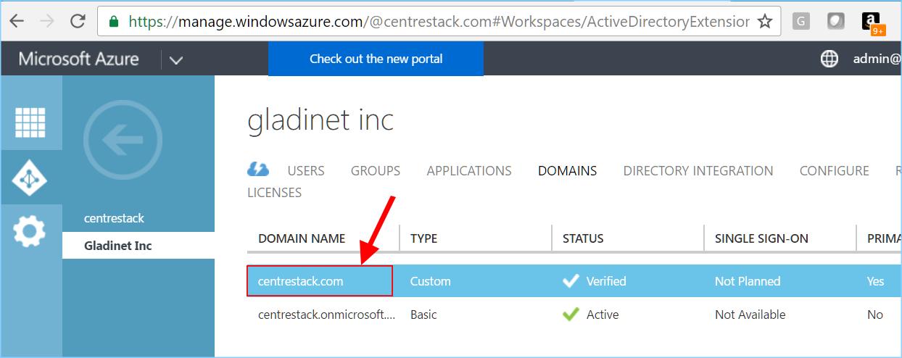

**Native Application Client ID**

- You will need the client id from the Azure Native Client Application

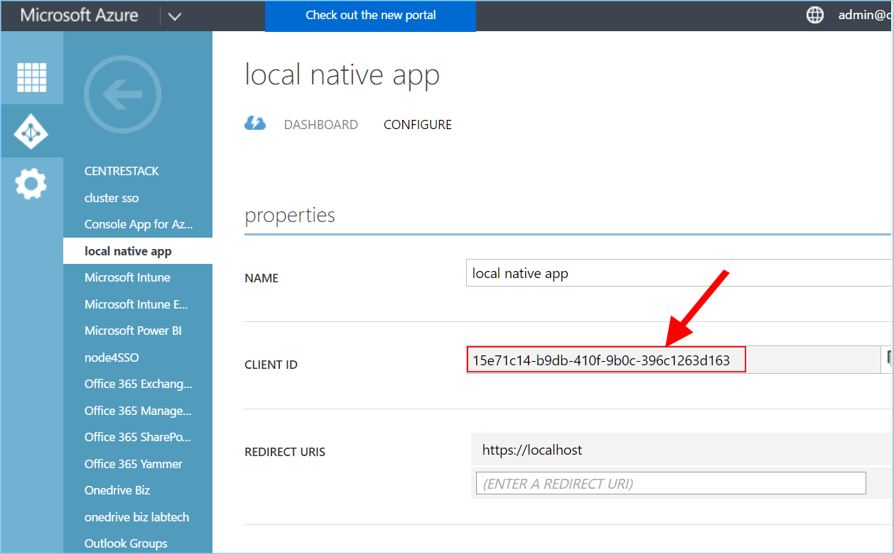

- You will give the Azure Native Client Application full read permission to the following two items

    - Azure Active Directory
    - Microsoft Graph API

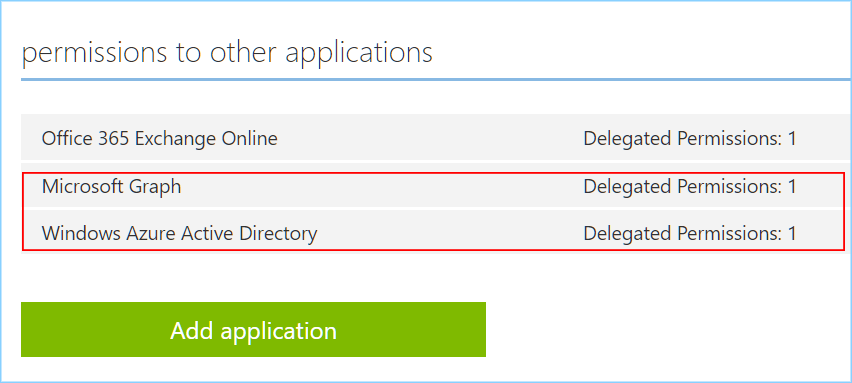

Folder & Storage
^^^^^^^^^^^^^^^^^^

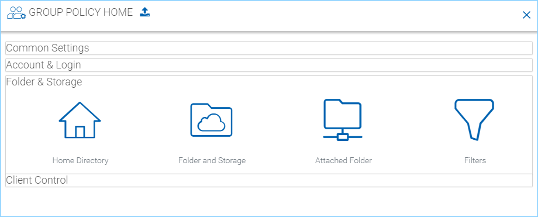

Home Directory
================

Location: ``Group Policy Home`` > ``Folder and Storage`` > ``Home Directory``

.. image:: ystatic/image_3-2-1.png

Default storage quota for new user (GB, 0-unlimited)
-----------------------------------------------------

- This policy will not affect existing user and their quota. It can affect a newly created user for the default storage quota.

Create default folder (Documents, Pictures)
---------------------------------------------

- Default is **enabled**. This option creates the "Documents" and "Pictures" folder in the user's root which makes that folder appear less empty and more user-friendly. This also demonstrates how to organize files and folders in the cloud.
- When the new user account is provisioned, the default root folder is empty.

Use user email to generate home directory name
------------------------------------------------

- The home directory name will be created using user’s email address.

- By default, it is user’s GUID that is used to create user’s home directory.

Use user's samAccountName to generate home directory names for Active Directory users
---------------------------------------------------------------------------------------

- This option supports clients and servers from previous versions of Windows that use Security Account Manager (SAM)type user accounts.

Publish user's home drive
---------------------------

- When unchecked, the user home drive space will be allocated from enterprise storage. When checked, existing user home drives will be automatically published from Active Directory. Make sure the home directory setting in the Active Directory is set for users in the Active Directory first.

**Mount user's home drive as a top level folder**

- Default is **disabled**. Enable this to show the user's home drive in thier top-level folder list. This way if users also have team folders assigned, the team folder will appear next to the home folder. Otherise the team folder looks like a sub folder inside the user's home folder.

**Folder Name**

- "Home Drive" by default. You can edit this folder name using this field.

Folder and Storage
====================

Location: ``Group Policy Home`` > ``Folder and Storage`` > ``Folder and Storage``

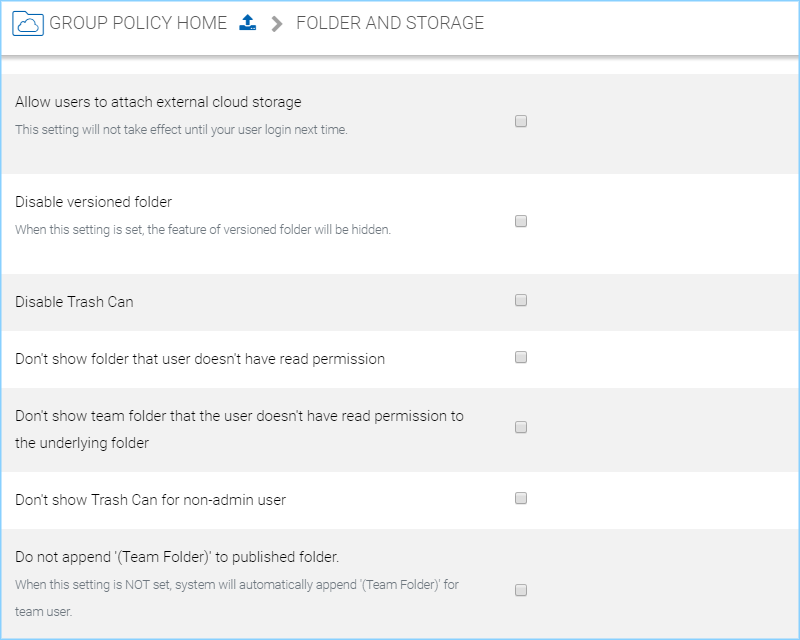

Allow users to attach external cloud storage
----------------------------------------------

- Default is **disabled**. After this is enabled, your user must log out and in again for this feature to take effect. 
- This setting will not take effect until the next time your user logs in.

Disable versioned folder
--------------------------

- Default is **disabled**. When this setting is enabled, the feature of versioned folder will be hidden. This is only effective if the "Inplace versioning" setting was disabled when Tenant Storage was setup (not the default setting). 

Disable Trash Can
-------------------

- Default is **disabled**. When this setting is enabled, the Trash Can feature will be hidden. This is only effective if the "Inplace versioning" setting was disabled when Tenant Storage was setup (not the default setting). 

Don't show folder that user doesn't have read permission
----------------------------------------------------------

- Default is **disabled**. When this setting is enabled, users will not see folder for which they do not have permissions.

Don't show team folder that the user doesn't have read permission to the underlying folder
--------------------------------------------------------------------------------------------

- Usually a team folder is mapped to a network share and the network share has existing folder permission. This setting can hide a team folder if the user doesn't have permission to the folder.

Don't show Trash Can for non-admin user
-----------------------------------------

Do not append '(Team Folder)' to published folder
---------------------------------------------------

- When this setting is NOT set, system will automatically append '(Team Folder)' for team user. When users are already farmiliar with specific team folder, there is no need to append a "Team Folder" suffix to remind the users anymore.

Attached Folder
=================

Location: ``Group Policy Home`` > ``Folder and Storage`` > ``Attached Folder``

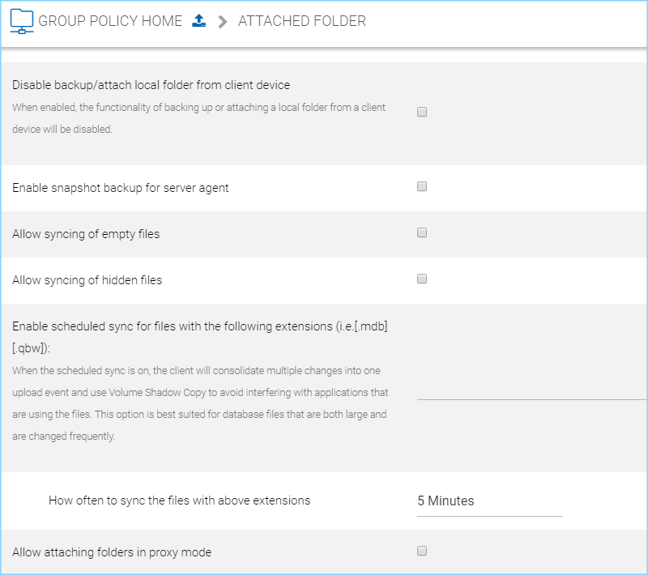

Disable backup/attach local folder from client device
-------------------------------------------------------

- Attached Local Folders are two-way synchronization folders. In order to do version backup and two-way synchronization, there are multiple folder structures created in the backend storage. Some organization doesn’t need this feature and want the users to work exclusively with the cloud drive.

Enable snapshot backup for server agent
-----------------------------------------

- It is a feature related to server agent on Windows 2003-2012 servers.

Allow syncing of empty file
-----------------------------

- By default, empty file (0-byte) will be skipped for syncing in attached folder. when enabled, those files will be synchronized.

Allow syncing of hidden files
-------------------------------

- By default, hidden file (e.g., system files) will be skipped for syncing in attached folder. when enabled, those files will be synchronized.

Enable scheduled sync for files with the following extensions
---------------------------------------------------------------

- (e.g., [.mdb][.qbw])

- When the scheduled sync is on, the client will consolidate multiple changes into one upload event and use Volume Shadow Copy to avoid interfering with applications that are using the files. This option is best suited for database files that are both large and are changed frequently. 
- This is to help sync/upload frequently changed file such as Microsoft access database or QuickBook files. These type of files typically are constantly open (thus prevent other application to hold on to them) and also changed frequently. So you can define the time period to check back on these type of files and use volume shadow copy to upload these files. Adjust that setting below. 

**How often to sync the files with above extensions**

- Default is **"5 Minutes"**

Allow attaching folders in proxy mode
---------------------------------------

- Default is **disabled**. When this is enabled folders can be attached in proxy mode without sync.

Filters
=========

Location: ``Group Policy Home`` > ``Folder and Storage`` > ``Filter``

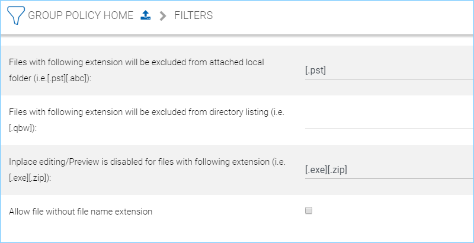

Files with following extension will be excluded from attached local folder
----------------------------------------------------------------------------

- (e.g., [.pst][.abc])

- Default is **"[.pst]"**. You can stop certain file types from being uploaded. For example .pst files. These are local outlook email files, which is not necessary to upload into the cloud storage because usually it is backed up by an exchange server.

Files with following extension will be excluded from directory listing
------------------------------------------------------------------------

- (e.g., [.qbw])
- The default is **no entry**. You can specify the files which should not be listed under a user’s directory. A good use of the feature is that you may have some line-of-business application that create proprietary files that doesn't need to show up in the cloud drive (such as .qbw files)

Inplace editing/Preview is disabled for files with following extension
------------------------------------------------------------------------

- (e.g., [.exe][.zip]) 
- The default is **"[.exe][.zip]"**. Windows Explorer has a habit to peek into large files to generate thumbnail and present other information. It may not be a good fit for cloud drive files because each peek will generate a download from cloud.

Allow file without file name extension
----------------------------------------

- Allow files without extension suffix to synchronize. Usually files without suffix (extension) are temporary files that doesn't need to be synchronized. This setting overrides the default behavior. 

Client Control
^^^^^^^^^^^^^^^^^

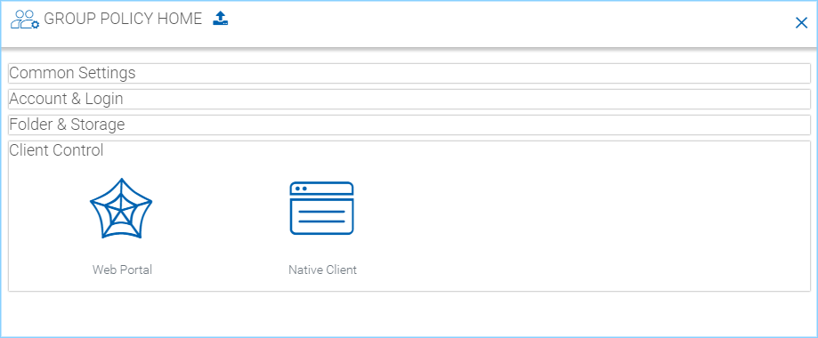

Web Portal
============

Location: ``Group Policy Home`` > ``Client Control`` > ``Web Portal``

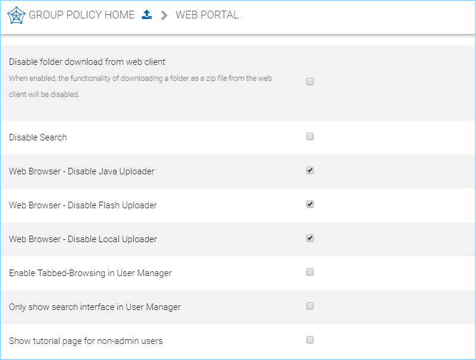

Disable folder download from web client
-----------------------------------------

- Default is **disabled**. The folder download from web client will zip up the folder and download it. It is CPU intensive so if you don’t want it to be consuming too much CPU, you can disable it using this setting.

Disable Search
----------------

- Default is **disabled**. If you don’t need the search by file name feature, you can check this setting to disable it.

Web Browser - Disable Java Uploader
-------------------------------------

- Some organizations have standardized their web browser, for example, all web browsers must be HTML5 compliant. In this case, the Java Uploader is not necessary and could be confusing to support when different users have different Java versions installed.

Web Browser - Disable Flash Uploader
--------------------------------------

- Some organizations have standardized their web browser, for example, all web browsers must be HTML5 compliant. In this case, the Flash Uploader is not necessary and could be confusing to support when different users have different Flash version installed. Different kind of web browsers may also have different levels of Flash support, causing different behavior.

Web Browser - Disable Local Uploader
--------------------------------------

- The Admin can also disable local uploads, in which case the upload will happen using the browser directly.

Enable Tabbed-Browsing in User Manager
-----------------------------------------

- When enabled, the user manager will order users by their last name so if you have many users, you have an easy to access way to find the users.

Only show search interface in User Manager
--------------------------------------------

- When you have even more users, Tabbed-Browsing can’t handle it any more, you can enable search-only interface.

Show tutorial page for non-admin users
----------------------------------------

- Display tutorial page for regular users when they login to the web portal.

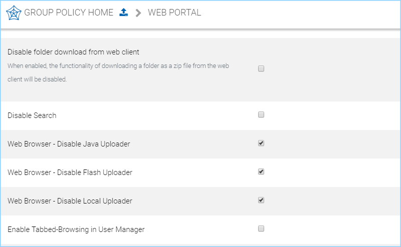

Show team folder level permissions in team folder publishing dialog
---------------------------------------------------------------------

- The advanced setting refers to “Create CIFS Share”, “Disable further sharing”, and “Disable Offline Access” settings.

Disable 'Publish Tenant Home Storage As a Team Folder'
--------------------------------------------------------

- This feature can be hidden in Tenant Management Console > Team Folder > Add New Team Folder.

Confirm before moving via drag-and-drop
-----------------------------------------

- In web portal, sometimes there can be accidental drag and drop, in this case, having a confirmation dialog can help prevent accidental drag and drop.

Show left tree view by default
--------------------------------

- Default is **disabled**. When enabled left-tree is displayed when you log in to the web portal.

Do not show "recent activities"
---------------------------------

- Default is **disabled**. When enabled “recent activities” is not visible in the Show/Hide Info Panel on the right side of the Web Portal File Browser.

Show "link to local" option to non-admin user
-----------------------------------------------

- Default is **disabled**. When enabled, non-admin user will have access to the “Link to Local” option in the Sharing and Collaboration tab under the Show/Hide Info Panel on the right side of the Web Portal File Browser.

Show max count of file/folder items
-------------------------------------

- Default files to show is 1,000. Some customers may have a very flat folder that has more than one thousand files. It is not recommended to have a cloud system have flat folder structure like this. But if customer has many files in a flat folder. This setting can be used to show all files by increasing this number as needed.

Native Client
===============

Location: ``Group Policy Home`` > ``Client Control`` > ``Native Client``

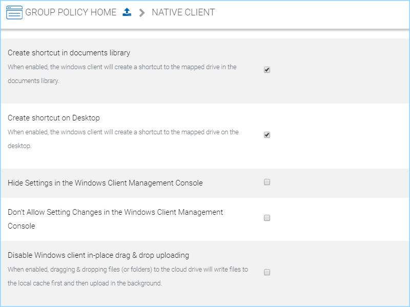

Create shortcut in documents library
--------------------------------------

- Default is **enabled**. This is a convenience feature to add a link to the cloud drive from inside documents library 

Create shortcut on Desktop
----------------------------

- Default is **enabled**. Same as above but the shortcut is on the desktop.

Hide Settings in the Windows Client Management Console
--------------------------------------------------------

- Default is **disabled**. The Settings in the Windows client may be viewed as “too much information for normal user”. If that is the case, enabling this option will hide those settings.

Don't Allow Setting Changes in the Windows Client Management Console
----------------------------------------------------------------------

- Disable Windows client in-place drag & drop uploading When enabled, dragging & dropping files (or folders) to the cloud drive will write files to the local cache first and then upload in the background.

Disable Windows Client In-Place Drag & Drop Uploading
-------------------------------------------------------

- Default is **disabled**. When enabled, dragging and dropping files (or folders) to the cloud drive will write files to the local cache first and then upload in the background. 

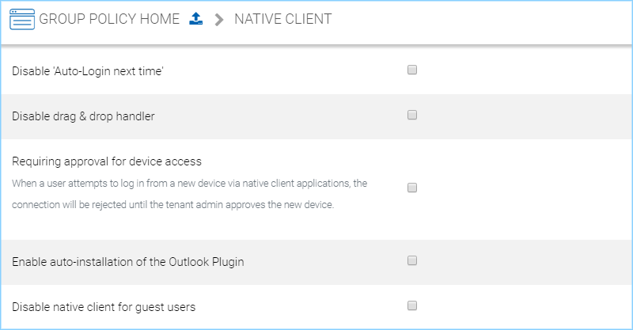

Disable 'Auto-Login next time'
--------------------------------

- Default is **disabled**. When you want the user to type in username/password every time they login to the Windows client, you can check this to disable auto-login.

Disable drag & drop handler
-----------------------------

- Default is **disabled**. When enabled, dragging & dropping files (or folders) to the cloud drive will write files to the local cache first and then upload in the background. When drag and drop handler is effective, it will intercept drag and drop request and decide what is the best way to handle drag and drop files and folders related to cloud drive.

Requiring approval for device access
--------------------------------------

- default is **disabled**. When enabled, when a user attempts to log in from a new device via native client applications, the connection will be rejected until the tenant admin approves the new device.

Enable auto-installation of the Outlook Plugin
------------------------------------------------

- Default is **disabled**. The Windows Desktop client comes with an Outlook plug-in. If this option is enabled, the Outlook plugin will be enabled upon client startup.

Disable native client for guest users
---------------------------------------

- Unchecked by default. For guest users, don’t allow them to use native client, so the guest users can only use web browser files and folder view.
