#######################
Partner Portal
#######################

To start the Hosted-|prodname| version, the first thing to do is to acquire a |prodname| partner account and login to the web portal.

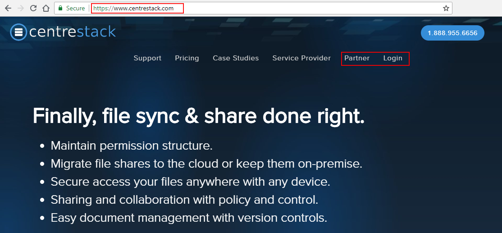

    |prodname| WEBSITE

The Partner Portal is the centralized place to manage the managed service provider's (MSP's) clients. The activities on the partner portal include creating Tenants and managing Tenants. 

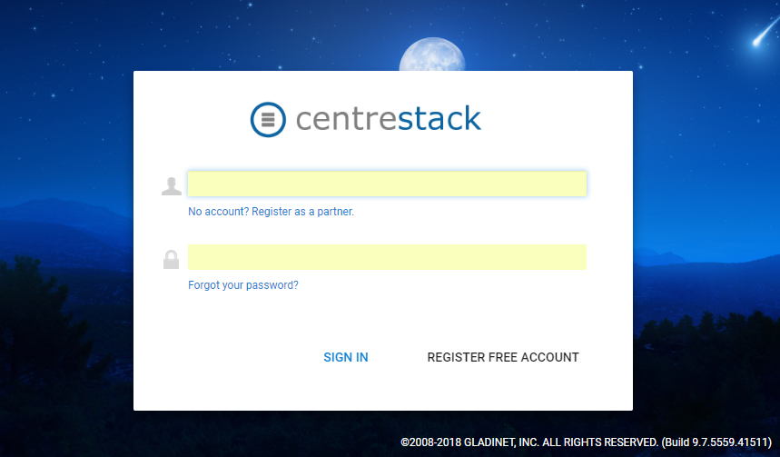

    PARTNER LOGIN

After logging into the Partner Portal, you can see most options by expanding the left-side menu. **(1)** From the collapsable menu, choose one of the two hosting options: "Private |prodname|" **(2)**, which is for the self-hosted |prodname|, or "Hosted |prodname|" **(3)**. In the image below you can see that we have already "Branded" this account with "ACME Cloud Services" **(4)** (see "Branding" section below for more information). You can also access useful information here, such as "Compare self-hosted and hosted options" **(5)**, "Configure ConnectWise Integration" **(6)**, and "Training Videos" **(7)** to help you get started. 

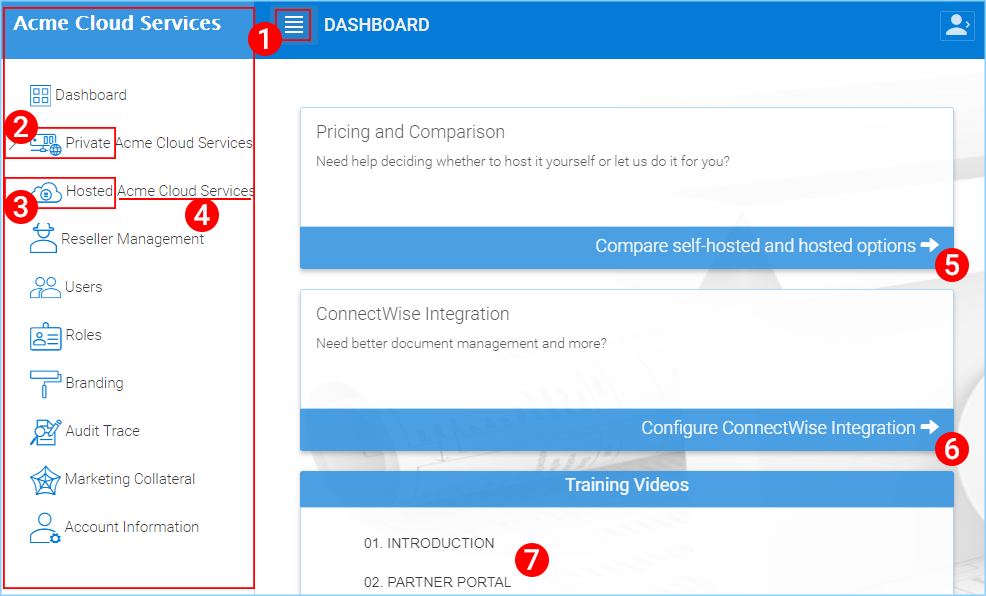

    PARTNER DASHBOARD

Because this guide is focused on our "Hosted" solution, choose the "Hosted |prodname|" option from the left panel.

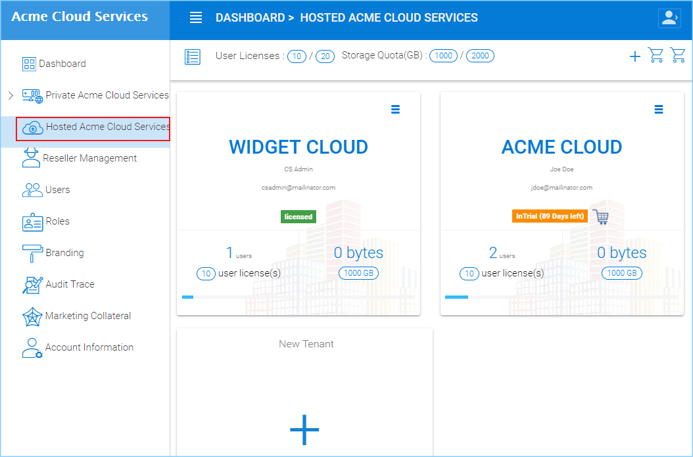

    HOSTED |prodname| TENANT MANAGEMENT

Tenant Management
====================

After you are in the Hosted |prodname| section, you can view the Tenant manager.

.. note::

    A Tenant is usually mapped to a client of yours.

New Tenant
-------------

To start creating the first Tenant, you can use the "New Tenant" button.

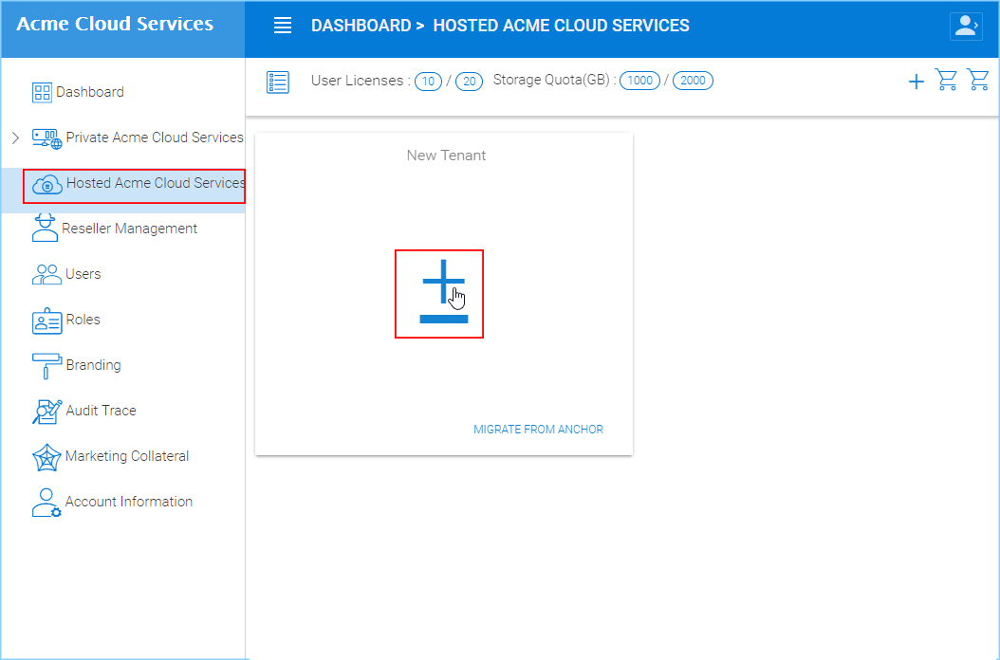

    CREATE A NEW TENANT

During the creation of a Tenant, it asks for basic Tenant-related information such as company name, contact name, email and other information.

If you need to get to the advanced section to further customize the creation of the Tenant, you can click on the "Settings" icon on the top right of the dialog.

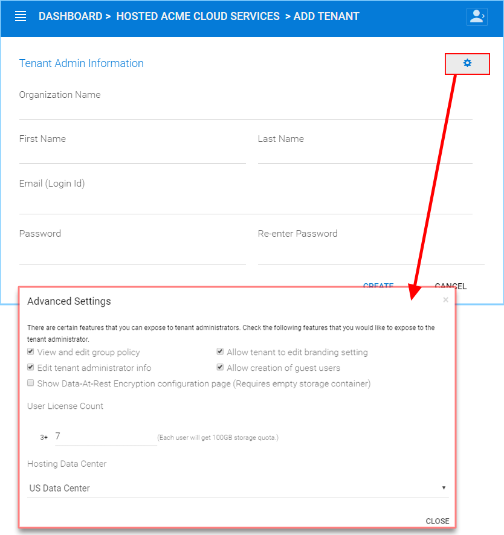

    NEW TENANT SETTINGS

Advanced Settings
--------------------

For MSPs and the Tenant internal IT staff, there is a division of work and responsibility. Sometimes managed service providers do more work and have more responsibility, but other times the Tenant IT staff has more. The Advanced Settings defines how the work is divided between these two entities.

- View and edit group policy

    Whether the Tenant itself (Tenant Administrator) can manage
    group policy.
    
- Allow Tenant to edit branding setting

    Normally the Tenant will pick up the service provider's default branding setting. If this setting is allowed the Tenant can define their own branding.
    

- Edit Tenant Administrator info

    Tenant admin can change the email and the name of the Tenant administrator.
    
- Allow creation of guest users

   The Guest user is related to files and folder sharing. This setting allows Tenant users to create guest users.
    
- Show Data-At-Rest Encryption configuration page (Requires empty storage container)

    This option allows Tenant to set encryption upon the first use. The Tenant will enable the encryption with a pass phrase.
    
- User License Count

    By default, the Tenant user count can be anything above 3 users.
    
- Hosting Data Center

    If a managed service provider has both self-hosted |prodname| environment and Hosted |prodname|, the managed service provider can leverage self-hosted |prodname| to create Tenants.

After a Tenant is created, you can click the top right "Hamburger Menu" to manage the Tenant.

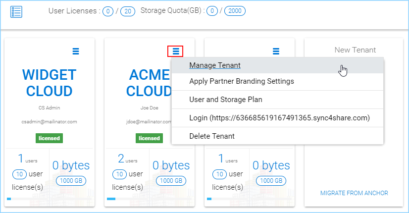

    MANAGING YOUR TENANT

Branding
===========

You can create the branding and then apply the branding information to your Tenants.

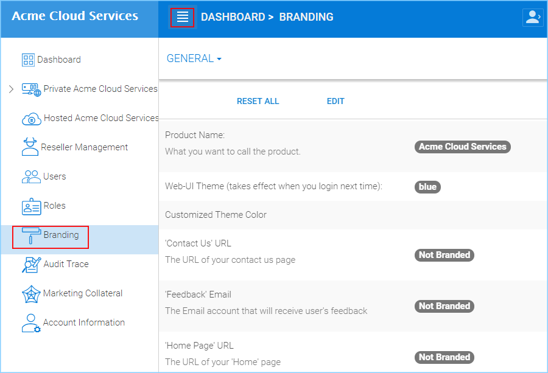

    PARTNER BRANDING SETTINGS

Apply Branding to the Tenant
------------------------------

**Default branding is applied this way:**
Click the hamburger menu on the Tenant, then choose *"Apply Partner Branding Settings"* 

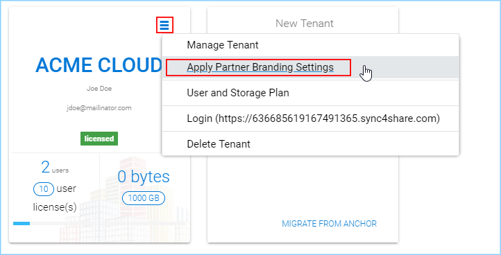

    APPLY PARTNER BRANDING

If the Tenant is allowed to change the branding, this can be done from the Tenant dashboard.

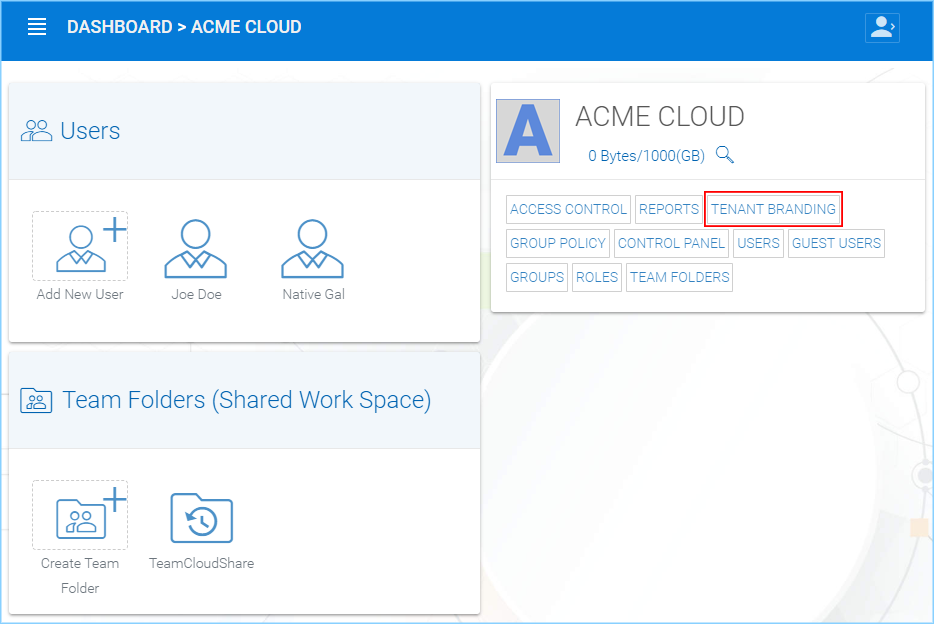

    ACCESS TO TENANT BRANDING

Once you are in the Branding Settings, you can choose a settings group from the top-left menu. The setting categories are: ``General``, ``Web Portal``, ``Client Download``, ``Windows Client``, ``Mac Client``, and ``Emails``. 

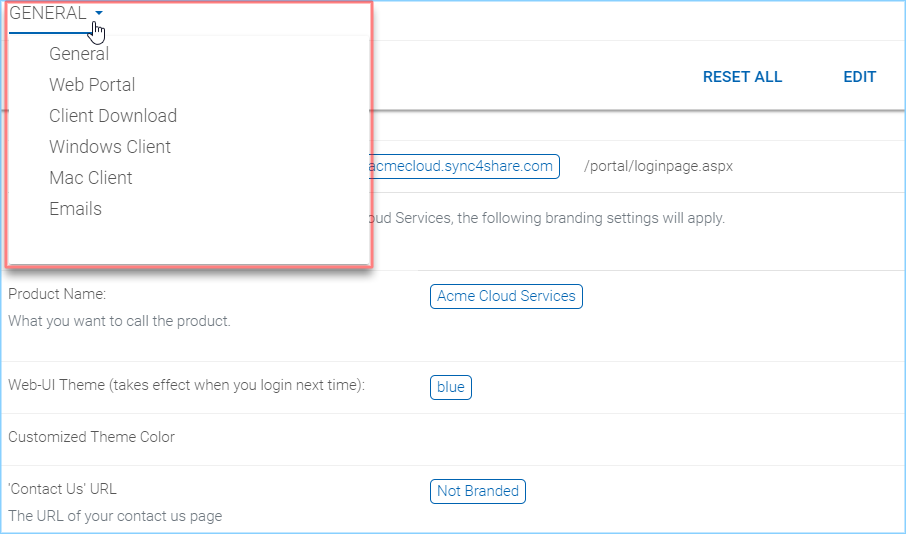

    TENANT BRANDING SETTINGS

After the branding is created, you can apply the branding to a specific Tenant. In this example, we created a new logo and uploaded it to the logo section in the partner portal.

.. figure:: _static/image_s2_1_10.png
    :align: center

    REPLACE THIS

After that, we can apply the branding and you can see the difference before-branding and after-branding.

Before - Default
---------------------------

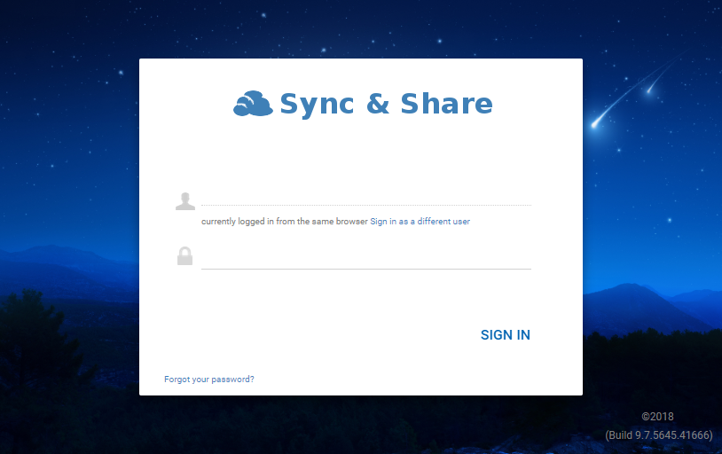

    DEFAULT BRANDING

Now - Your Branding
--------------------------

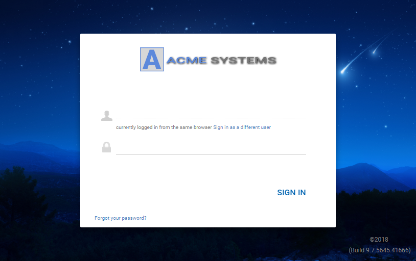

    CUSTOM BRANDING
