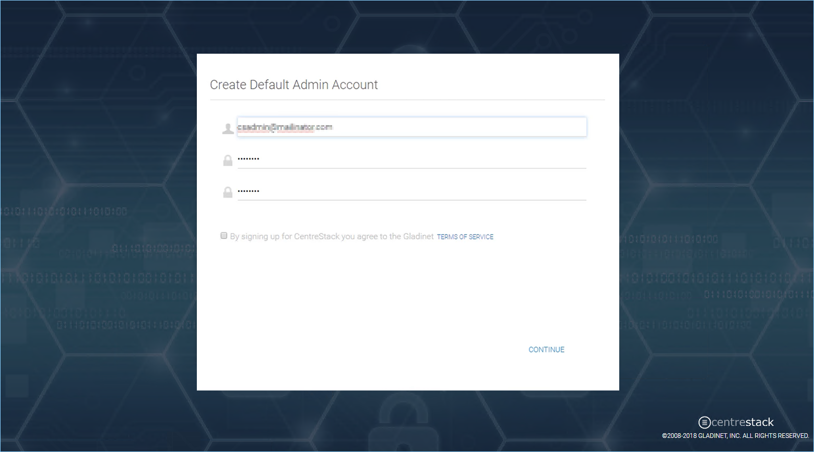
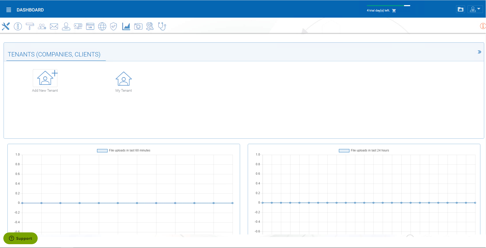

#########################
3 Initial Configuration
#########################

After the reboot the Default administration configuration page will be displayed.

First, you will setup the cluster administrator account.

After it is set up, you will be in the cluster administrator's dashboard.

Once you see the dashboard, the CentreStack side of the setup is finished successfully. We will continue to check the storage configuration and make sure all components are fully functional.

