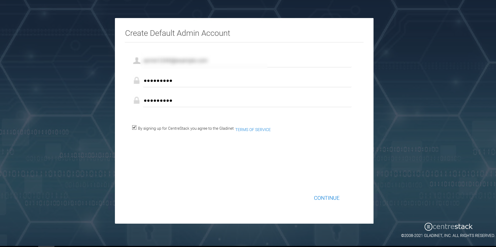

#########################
3 Initial Configuration
#########################

After the machine reboots, the Default administration configuration page will be displayed.

First, setup the cluster administrator account.

The default admin will also be the very first tenant user of the CentreStack platform. As a tenant, you will be able
to use the system as other tenants just like your customers would. Thus, you can get familiar with the system
quickly.

For the default admin account, we recommend using an email address not used in the Active Directory.
It can be a real email address or a non-real one (such as admin@local). If it is a non-real email address,
the 'forgot password' feature will not work if the master admin forgets their password.

.. note::

    Why don't we recommend using Active Directory email as the default cluster admin login? 
    
    Because
    the active directory configuration is done by the cluster admin themselves. So the cluster
    administrator needs to login to fix Active Directory issues later on if there are issues in the 
    future, such as a password change, Active Directory server DNS name change, etc.

After setting up the cluster administrator account, the dashboard will appear by default.

.. image:: _static/image_s3_1_2.png

Once you see the dashboard, the CentreStack side of the setup is finished successfully. We will continue to check the storage configuration and make sure all components are fully functional.

