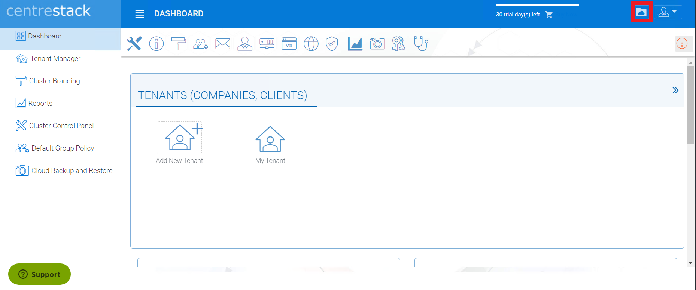
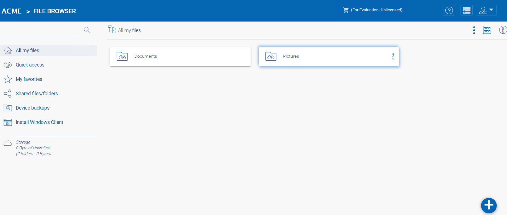

##############
Web Portal
##############

Click the Portal – “My Files” Link for the default master admin to view his files/folders over the web portal:

See below image for the files and folder view:

From here you can test the installation by creating files, migrating, editing, sharing and deleting files to verify the storage setup is working as expected.s