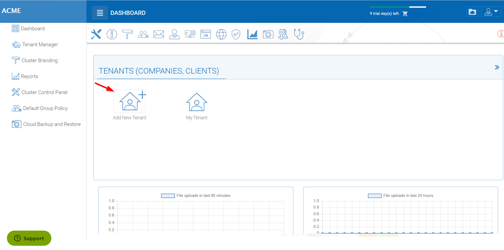
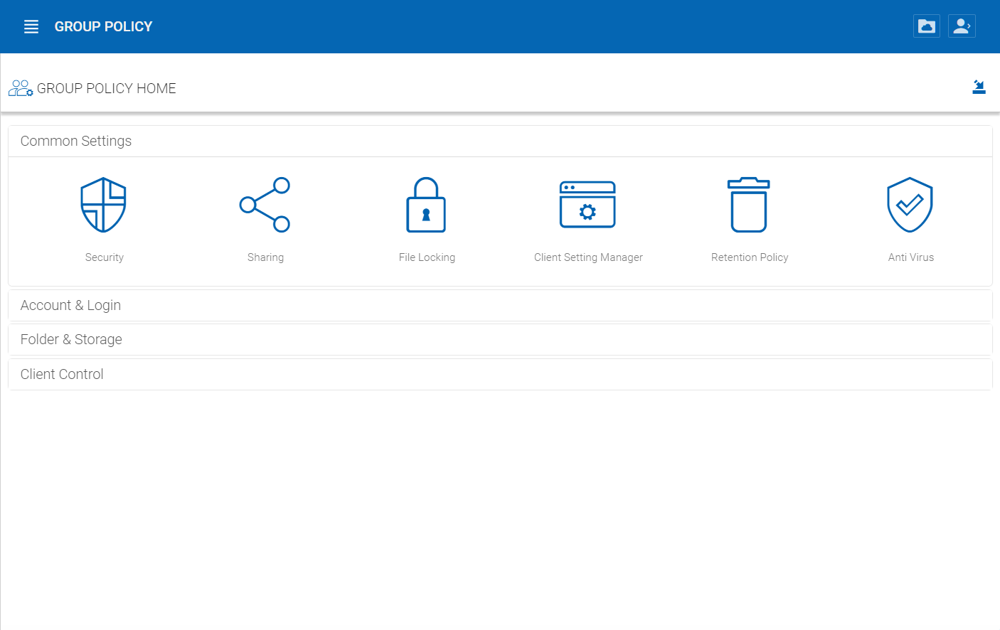

######################
5 Management Console
######################

If you are logged in as the Tenant administrator, access the Management Console by clicking the stack icon on the top right of the **"File Browser"** view.

.. warning::

    If you are the  cluster administrator, you may not see the "Management Console" icon. Instead, you can manage the default tenant from the Cluster Manager -> Tenant Manager and click through to manage the default tenant.

.. image:: _static/image_s5_1_1.png

Add Tenant
===============

You can add a tenant by clicking the 'Add Tenant' Button in the Tenant Manager

The Tenant Administrator will see the files and folders view by default upon initial login.

.. image:: _static/image060.png

Here is the management console.

.. image:: _static/image_s5_1_2.png

Web Based Management Console
===============================

Please reference the "CentreStack Admin Guide" for more details about tenant administration.
Here are a few points that are more important during the deployment phase.

You can enter the web based management console by selecting 'Management Console' under the user's
name in the top right.

.. image:: _static/image044.png

After you click into the "Management Console", you will see the tenant level management 
tasks.

Team Folders
^^^^^^^^^^^^^^

Team Folders are created by the tenant admin. The users that can be assigned to the team folders are the team users
within the tenant. Each team user can be assigned read or write permissions to the team folder. For the team
users that are not assigned with a specific team folder, the team folder will not show up.
Team folders users can also be assigned the "Owner" permission. The owner permission allows the "owner" to
maintain and manage the team folder permissions.

.. image:: _static/image045.png

Storage Manager
^^^^^^^^^^^^^^^^^

The tenant admin can update the default (primary) storage configuration information. For example, if the default
storage is using Amazon S3, the tenant admin can update the S3 bucket, access key and secret key. However,
the tenant admin can not switch the default storage into a different storage service. The cluster
admin can help the tenant admin switch the default storage.

Tenant admin can also add auxiliary storage by using the "Attach Storage"
options. The default storage is the root folder of the tenant. Attached auxiliary storage is top level folders
inside the root folder.

.. image:: _static/image046.png

User Manager
^^^^^^^^^^^^^^^^

In the user manager, you can create users, import users from Active Directory over LDAP or import users from
Active Directory via Server Agent.

.. image:: _static/image047.png

Delegate Administration
^^^^^^^^^^^^^^^^^^^^^^^^^

You can add full delegated admin to the list of "Cloud Administrators".

.. image:: _static/image050.png

Active Directory Integration (Optional)
^^^^^^^^^^^^^^^^^^^^^^^^^^^^^^^^^^^^^^^^^

It is optional to setup the Active Directory Integration. You can get to the integration page from
the Management Console -> Advanced -> Active Directory Settings. The active directory setting
here refers to local Active Directory with LDAP integration. For remote Active Directory, server
agent can be used to connect remote file server folders and remote Active Directory.

.. note::

    If this specific tenant's Active Directory is at a remote location, please
    use the CentreStack Server Agent to connect the Active Directory (No need to use
    LDAP over Internet WAN connection).

Group Policy
^^^^^^^^^^^^^^

Granular group policies can be configured for the entire tenant users from Management Console -> Group Policy.

Please reference "CentreStack Admin Guide" for complete reference for tenant administration.

