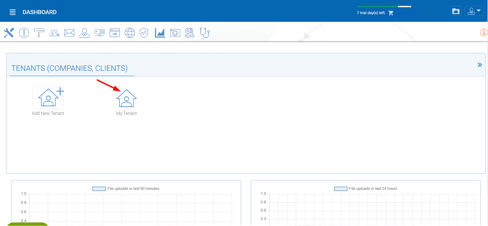
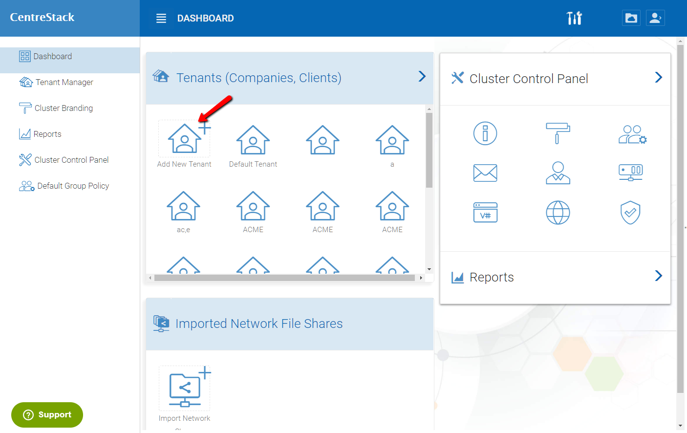
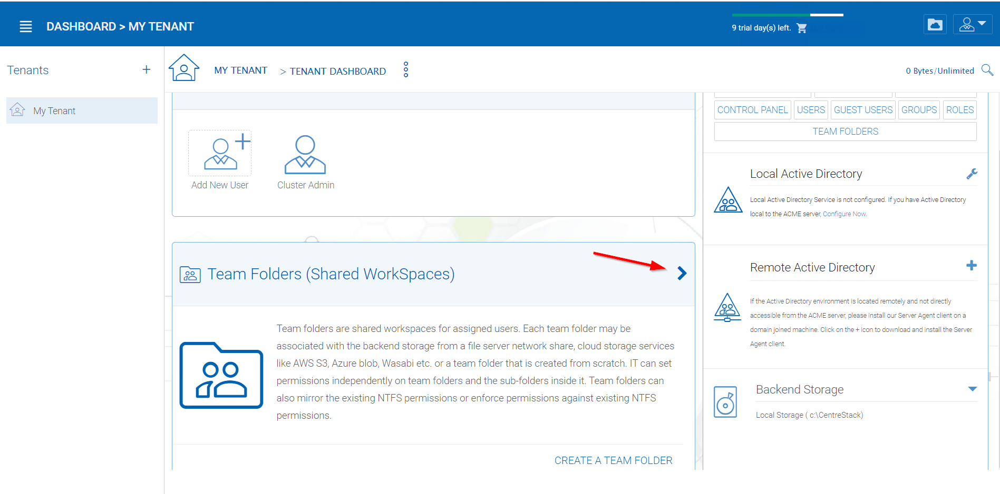
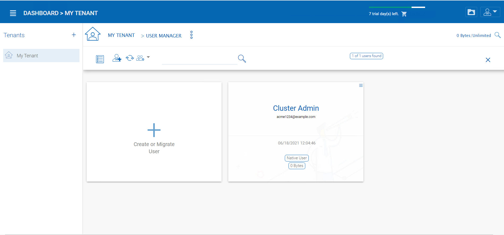
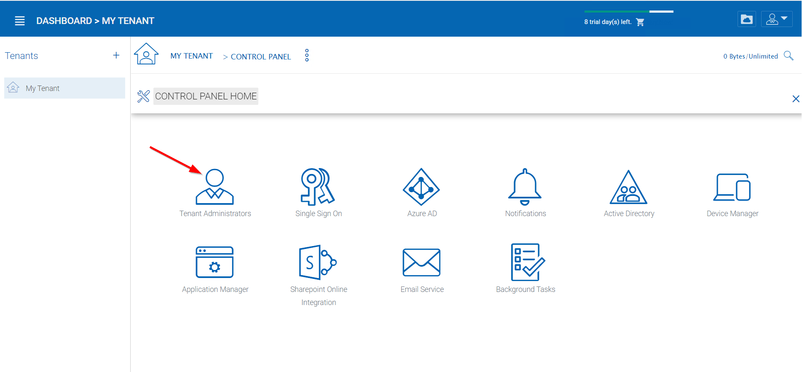

######################
Management Console
######################

If you are logged in as the Tenant administrator, access the Management Console by clicking the stack icon on the top right of the **"File Browser"** view.

The Tenant Administrator will see the files and folders view by default upon initial login.

.. image:: _static/image060.png

.. warning::

    If you are the  cluster administrator, you may not see the "Management Console" icon. Instead, you can manage the default tenant from the Cluster Manager -> Tenant Manager and click through to manage the default tenant.

Here is the Tenant Management Console.

Please reference the `|prodname| Admin Guide`_ for complete details about Tenant administration.

Here are a few points that are more important during the deployment phase.

Add Tenant
^^^^^^^^^^^^^^

You can add a tenant by clicking the 'Add Tenant' Button in the Tenant Manager

Team Folders
^^^^^^^^^^^^^^

Team Folders are created by the tenant admin. The users that can be assigned to the team folders are the team users
within the tenant. Each team user can be assigned read or write permissions to the team folder. For the team
users that are not assigned with a specific team folder, the team folder will not show up.
Team folders users can also be assigned the "Owner" permission. The owner permission allows the "owner" to
maintain and manage the team folder permissions.

You can navigate to the Team Folders by clicking on the arrow in the "Team Folders" tab from the Tenant Manager.

Here is the Team Folders page.

Storage Manager
^^^^^^^^^^^^^^^^^

The tenant admin can update the default (primary) storage configuration information. For example, if the default
storage is using Amazon S3, the tenant admin can update the S3 bucket, access key and secret key. However,
the tenant admin can not switch the default storage into a different storage service. The cluster
admin can help the tenant admin switch the default storage.

First, go to the Cluster Control Panel. Then, click on "Storage Manager"

.. image:: _static/image046.png

This will take you to the Storage Manager page.

The tenant admin can also add auxiliary storage by using the "Attach Storage"
options. The default storage is the root folder of the tenant. Attached auxiliary storage is top level folders
inside the root folder.

User Manager
^^^^^^^^^^^^^^^^

In the user manager, you can create users, import users from Active Directory over LDAP or import users from
Active Directory via Server Agent.
Click on the arrow in the "Users" tab.

Then click on "Create or Manage Users".

This should take you to a menu of options to add a new user to the tenant.

Delegate Administration
^^^^^^^^^^^^^^^^^^^^^^^^^

You can add full delegated admin to the list of "Cloud Administrators".
Once you reach the tenant page, click the drop down menu, and then go to the "Control Panel".

In Control Panel, Click on "Tenant Administrators".

At the bottom of the Tenant Administrators page, you can designate the delegated admin.

Active Directory Integration (Optional)
^^^^^^^^^^^^^^^^^^^^^^^^^^^^^^^^^^^^^^^^^

It is optional to setup the Active Directory Integration. You can get to the integration page from
the Management Console -> Advanced -> Active Directory Settings. The active directory setting
here refers to local Active Directory with LDAP integration. For remote Active Directory, server
agent can be used to connect remote file server folders and remote Active Directory.

Once you reach the tenant page, click the drop down menu, and then go to the "Control Panel".

On the menu that pops up, go to the "Active Directory" option.

.. image:: _static/image072.png

This will take you to the Active Directory Page.

.. note::

    If this specific tenant's Active Directory is at a remote location, please
    use the |prodname| Server Agent to connect the Active Directory (No need to use
    LDAP over Internet WAN connection).

Group Policy
^^^^^^^^^^^^^^

Granular group policies can be configured for the entire tenant users from Management Console -> Group Policy.

Branding
^^^^^^^^^^^^^^

You can brand the web portal, Windows and Mac clients, iOS and Android Applications.

The self-service branding starts with the "Cluster Manager". In order to start the branding, you will login to
the web portal as the Master Administrator.

After you login to the web portal, click to the "Cluster Branding" Pages.

.. image:: _static/image_s10_1_1_v2.png

Please reference the "Cluster Branding" section in the `Admin Guide`_ for the self-hosted |prodname| server.

.. _Admin Guide: https://centrestack.com/Library/AdminGuide/chapter03.html#cluster-branding 

.. _CentreStack Admin Guide: https://centrestack.com/Library/AdminGuide 