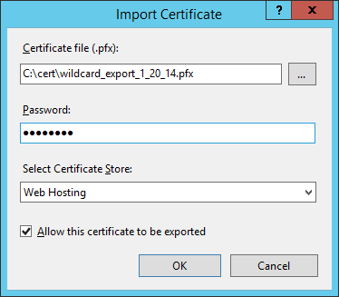
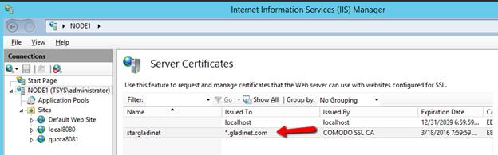
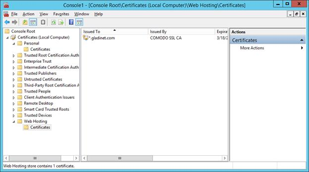
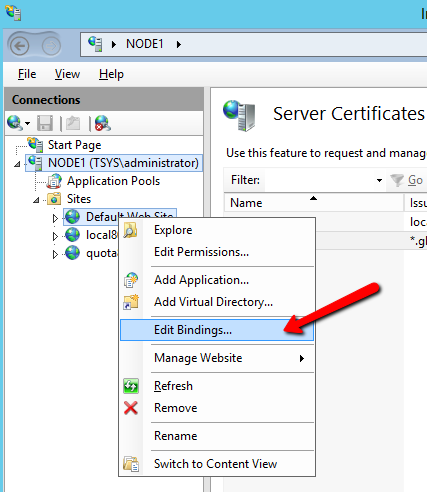

########################################
6 Enable SSL – Install SSL Certificate
########################################

.. note::

    Assuming that you have already setup your DNS to point to a DNS name connected to the CentreStack server and SSL certificate already
   purchased for the DNS name. 
    If not, you can acquire a
    SSL certificate from your SSL vendor.
    
    We recommend using https://www.ssllabs.com/ to test your SSL setup because 
    the SSL Labs site will produce a report on whether the SSL is compatible with all 
    devices such as iOS devices.
    
You will install the SSL certificate by using the IIS Manager. Look for "Server Certificates" and double click on it.

.. image:: _static/image_s6_1_1.png

Click on "Import" to import an existing SSL Certificate. Leave the Certificate Store as "Personal" or "Web Hosting", either
way is fine.

.. image:: _static/image_s6_1_2.png

Verify that the certificate is available:

You can also verify the SSL certificate from the MMC/Certificates snap-in (Local Computer).

Now you can bind the "Default Web Site" to the SSL certificate for HTTPS. Right click on the "Default Web Site"
and select “Edit Binding”.

At the binding dialog, edit the HTTPS binding.

.. image:: _static/image030.png

Now, change the SSL Certificate binding drop-down to the imported SSL certificate.

.. image:: _static/image031.png
