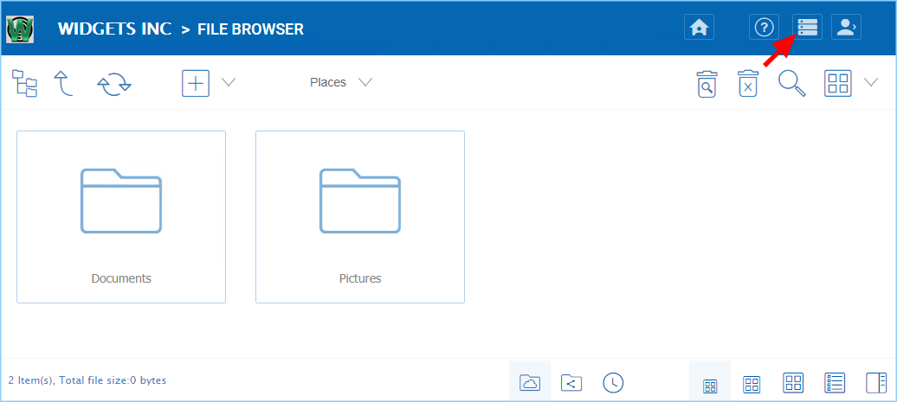
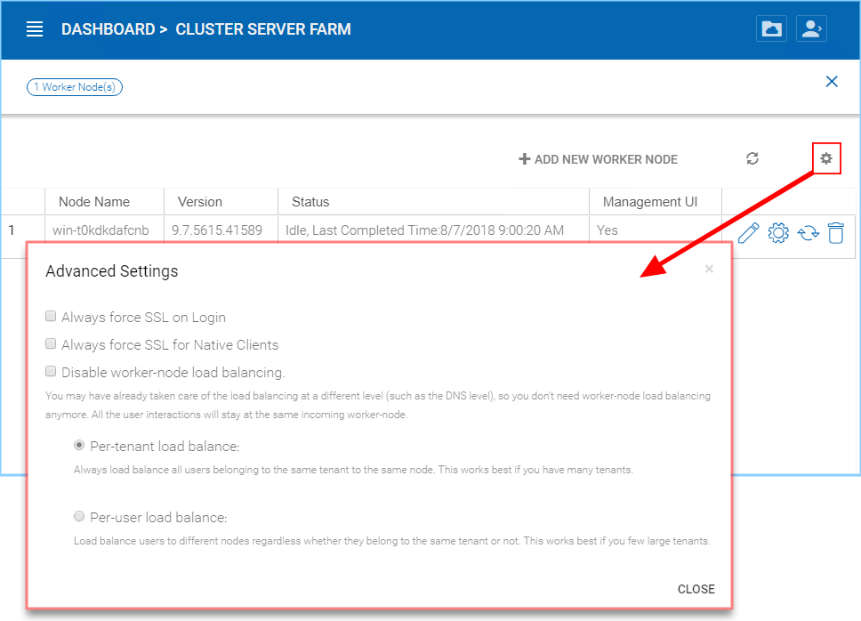
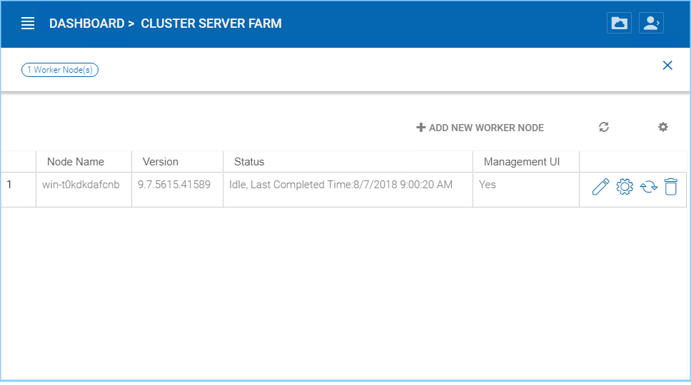
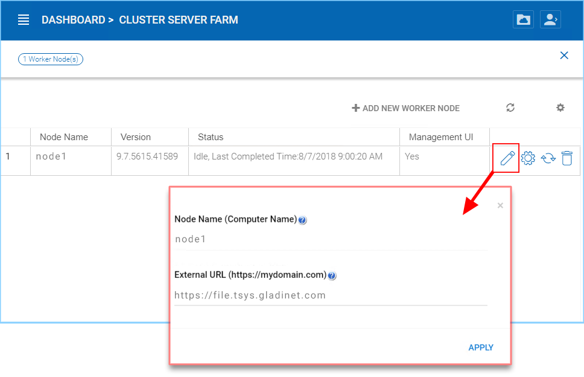

#############################
7 Setup Worker Node for SSL
#############################

Login to the Web Portal as the master administrator and go to the "Cluster Manager" page. 

Click on the "Cluster Server Farm" page to see the "Cluster Worker Nodes".

.. image:: _static/image_s7_1_2.png

There is an "Advanced Setting" icon on the page.

Now, check **"Always force SSL on Login"** and **"Always force SSL for Native Clients"** boxes.

.. warning::

  If you use the self-signed SSL certificate, the web portal is the only client that allows you to login after some SSL certificate warning. All other native clients such as Windows, mobile, and Mac clients will reject the connection.

You will also modify the node property for the node.

The External URL will need to match the node's DNS name and the HTTP or HTTPS protocol.

The Node Name needs to match the hostname of the node.

.. image:: _static/image036.jpg

The external URL shall match the external URL for HTTPS. (If you do not have SSL certificate installed yet, this can be HTTP for now).

.. warning::

    In the current version, the Internal URL is hidden and it will be automatically set to a correct value so no need to manage the Internal URL any more.
    
    In previous version, this was where the Internal URL was set.
    
    The internal URL will be the internal IP address or private DNS name.

    .. image:: _static/image037.jpg
