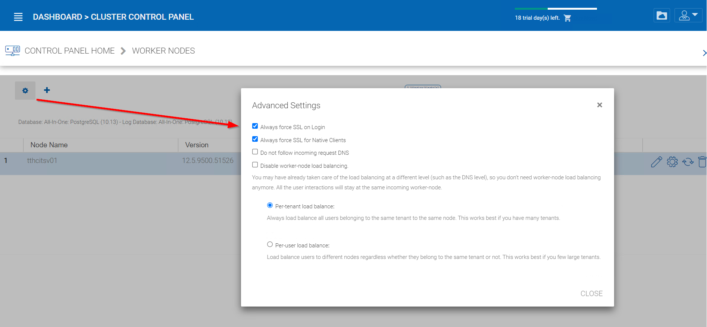
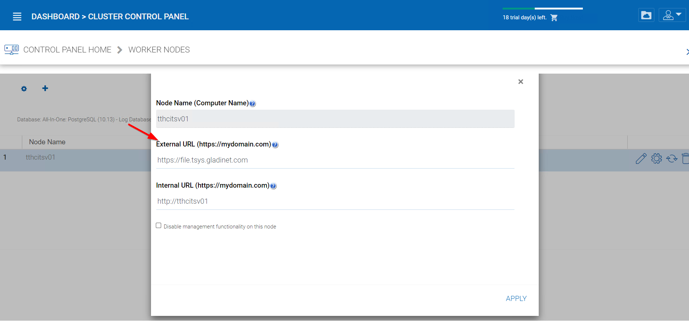
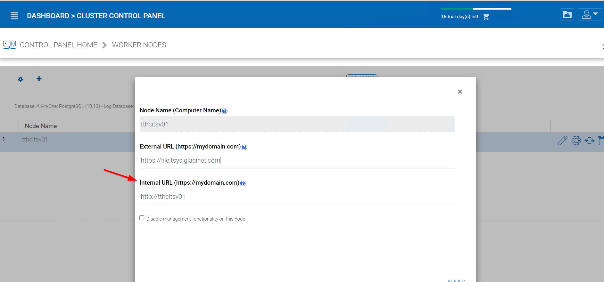

#############################
7 Setup Worker Node for SSL
#############################

Login to the Web Portal as the master administrator, then, under the menu next to dashboard, go to "Cluster Control Panel".

.. image:: _static/image_s7_1_1_v2.png

After this, go to "Worker Nodes".

.. image:: _static/image_s7_1_2_v2.png

There is an "Advanced Setting" icon on the page.

Now, check **"Always force SSL on Login"** and **"Always force SSL for Native Clients"** boxes.

.. warning::

  If you use the self-signed SSL certificate, the web portal is the only client that allows you to login after some SSL certificate warning. All other native clients such as Windows, mobile, and Mac clients will reject the connection.

.. image:: _static/image_s7_1_4_v2.png

You can also modify the node property for the node.

.. image:: _static/image_s7_1_5_v2.png

The Node Name needs to match the hostname of the node. You can get the hostname of the node by going into Command Prompt(Press Windows+R and then type in cmd) and typing in hostname.

.. image:: _static/image_s7_1_6_v2.png

The External URL should match the external URL for HTTPS. (If you do not have a SSL certificate installed yet, this can be HTTP for now).

The Internal URL will need to match the internal IP address or node's private DNS name and the HTTP or HTTPS protocol.

