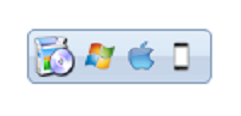
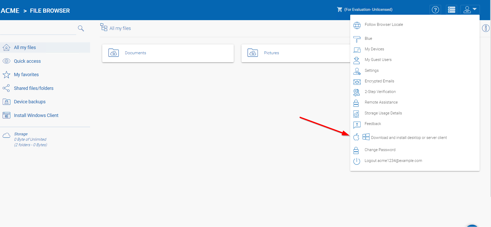
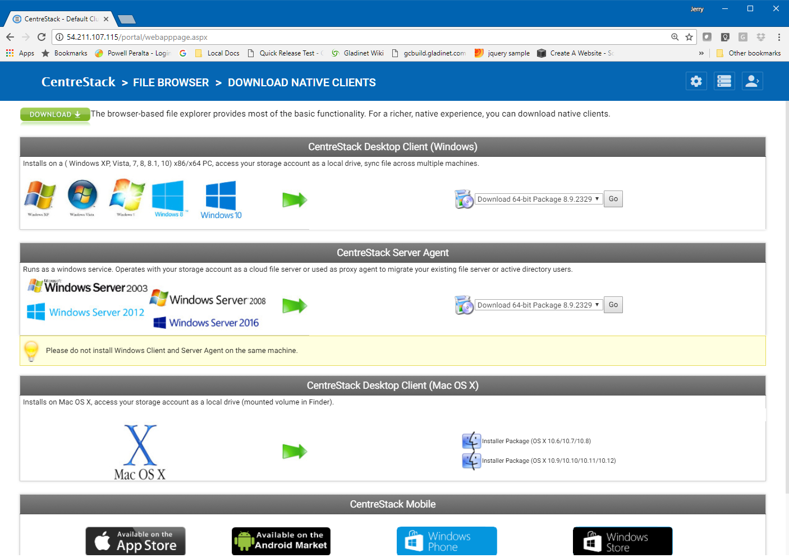
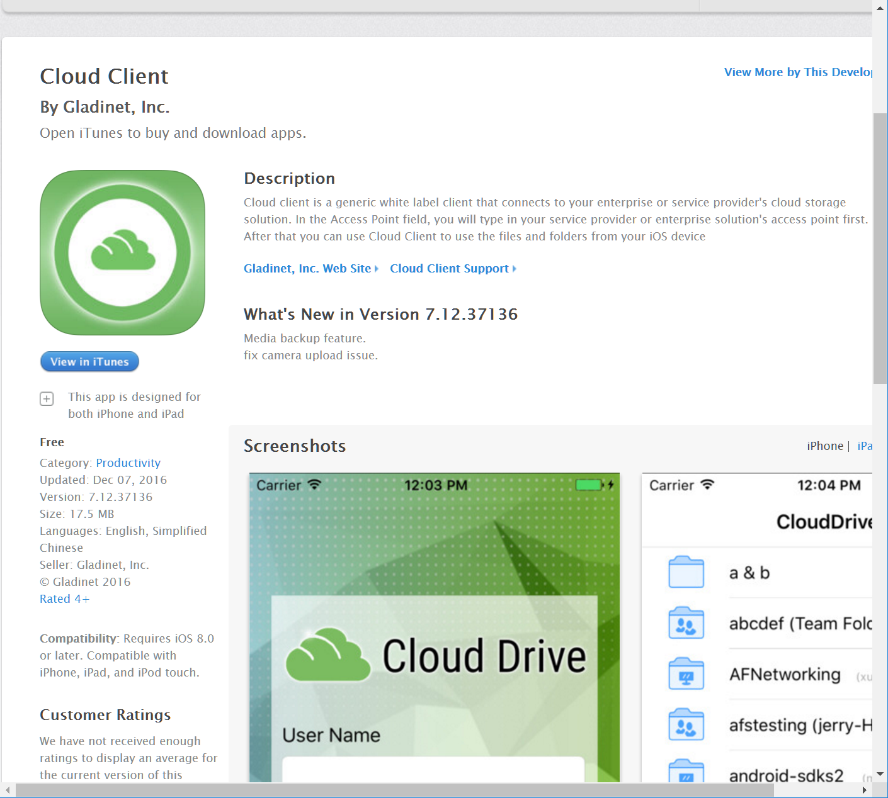

==============================
8 Client Agents
==============================

Windows & Mac Client Agents
---------------------------------

The CentreStack server includes the Windows Client Agent
software and Mac client agent software.

You can download and install desktop, server and MAC clients from the download button in the right pane after a user
logs into the web portal.

First, navigate to the File Browser. 

For mobile clients, depending on the configuration, you may need to download it from Apple AppStore,
Google Play Store or from the enterprise’s own Mobile Device Management (MDM) portal.

You will see the downloads page.

Apple AppStore
-----------------

You can use the White-Label "**Cloud Client**" from the Apple AppStore.

Google Play Store
----------------------

You can use the White-Label "**Cloud Android Client**" 
from the Google Play Store.

License CentreStack
----------------------

When you are ready to license CentreStack, 
the easiest way to do this is to use the "purchase now" link 
from the cluster manager web portal under the self-hosted licenses view.

The "Buy Now" link will take you to your CentreStack
partner portal account and from there, you can 
acquire licenses and give them out to your clusters.
