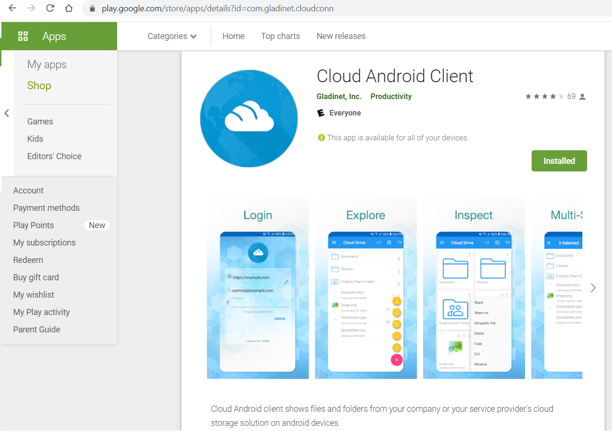

==============================
Client Agents
==============================

Windows & Mac Clients
---------------------------------

The |prodname| server includes the Windows Client Agent software and Mac client agent software.

You can download and install desktop, server and MAC clients from the download button in the right pane after a user
logs into the web portal.

First, navigate to the File Browser. 

.. image:: _static/image041.png

In the menu at the top right, there will be an option to "Download and install desktop or server client".

You will then be taken to the downloads page.

.. image:: _static/image043.png

For mobile clients, depending on the configuration, you may need to download it from Apple AppStore,
Google Play Store or from the enterprise’s own Mobile Device Management (MDM) portal.

Apple AppStore
-----------------

You can use the White-Label "**Cloud Drive Client**" from the Apple App Store.

Google Play Store
----------------------

You can use the White-Label "**Cloud Android Client**" from the Google Play Store.

