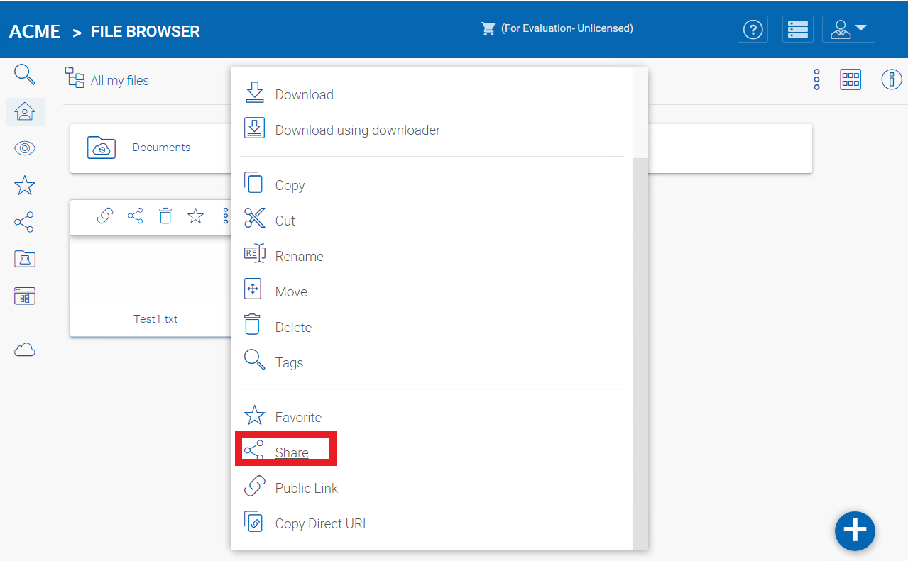

#######################################################
9 Verify External URL, Internal URL and the Node Name
#######################################################

Verify External URL
=====================

It is very straight forward to verify whether or not your external URL is set correctly. You just need to point your web browser to the external URL and verify that the Login Page shows up and there is no SSL warnings.

You can also verify the External URL by doing a file share to your own email address outside of the CentreStack system. A file sharing invitation will be sent to that Email address. After you receive the Email, click on the link included in the Email and make sure the link points to the External URL.

.. note::

    The external URL is used in the email sharing template. So a simple file sharing test will verify whether the External URL is setup correctly.

Verify Internal URL
=====================

For the verification of Internal URL, you can use the Node Performance page to make sure the node performance information shows up. (Reports -> Node Performance).

.. image:: _static/image_s8_1_1_v2.png

Verify Node Name
==================

To verify that the node name is correct, you can right click on a folder and use the **"Share"** option to verify that the email has been received and is correctly pointing to an external URL. 

