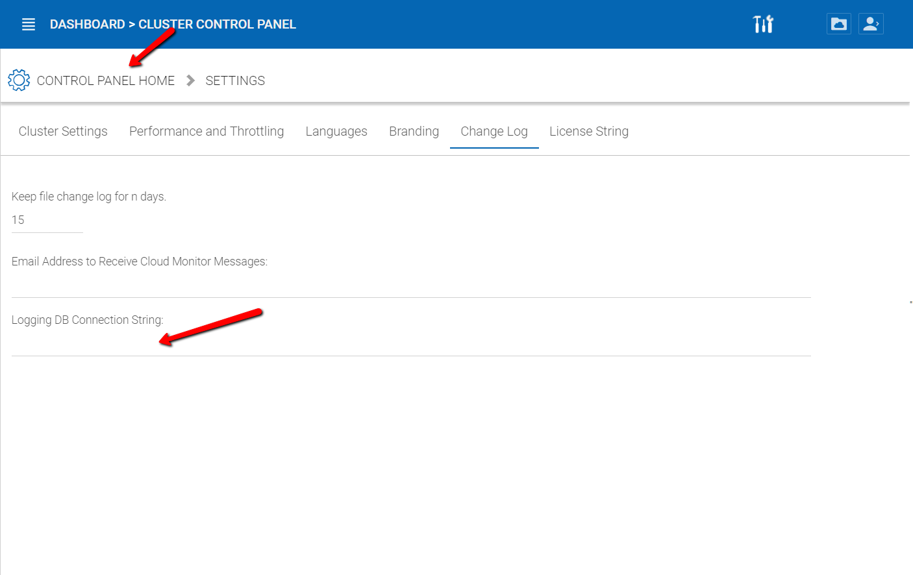
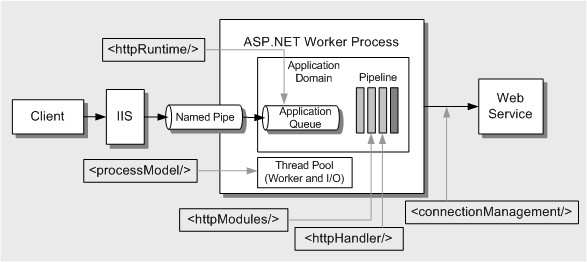
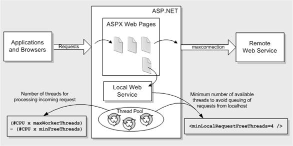

==============================
12 Advanced Topics
==============================

These advanced topics require changes to the web.config file which is critical for the smooth operation of
CentreStack, therefore, it is not recommended that you change the web.config file without first consulting
Gladinet support.

Split Database
----------------------

The database contains two types of information.

The first type of information is the configuration data that is relatively static. For example, user name, user email, user’s published shared files and folder etc. This type of information is relatively small. It can be estimated at 5000 bytes per user.
So if you have 2000 users, it can be estimated at 10 MB.

The second type of information is relatively more volatile. For example, the file change log, the audit trace
and the file list for index. It can be estimated at 100 file changes per user per day and each file change can be estimated
at 1000 bytes for database storage. So for a 15 day (Default change log history), it can be estimated at
100*1000*15 = 1.5MB per user for 15 day period. If you need HIPPA compliance, the default change log history can
be significantly longer so this part of the database will be much bigger.

For performance and regulatory reasons, it is recommended to split the database into two separate databases,
one that contains static information and one that contains relatively more volatile information.

The secondary database (for more volatile data) can be either MySQL Database or Micrsoft SQL Database.

To split the database, first create a new database that will be used to store the volatile information. Create a database user and allow this 
user full access to the database (equivalent to db_owner). Once the database and user are created, sign into the CentreStack management console 
as the cluster admin and navigate to Cluster Control Panel > Settings > Change Log. Update the "Logging DB Connection String" setting using an appropriate connection string:

Connection String Example for MySQL Database
^^^^^^^^^^^^^^^^^^^^^^^^^^^^^^^^^^^^^^^^^^^^

.. code-block:: xml

        Server=localhost;Port=3306;Database=gladinet;Uid=root;Pwd=password;

Connection String Example for Microsoft SQL Database
^^^^^^^^^^^^^^^^^^^^^^^^^^^^^^^^^^^^^^^^^^^^^^^^^^^^

.. code-block:: xml

        Data Source=server_name;Initial Catalog=logging_db_name;User Id=user_id;Password=user_password;
        

Change Authentication Algorithm to Version 2
--------------------------------------------

If you have a new installation of CentreStack without any legacy user, we recommend you hard code the
authentication algorithm to version 2.

You can locate the web.config file in the root folder of the installation directory (same web.config file as
referenced in the previous section) and add a line inside the <appSettings file="branding.config"> section.

.. code-block:: xml

    <add key="sys_access_ver" value="2" />

Change the Synchronized Uploader to Asynchronized Uploader
-----------------------------------------------------------

Under the C:\Program Files (x86)\CentreStack\ (or the installation directory), look into the UploadDownloadProxy
and identify the web.config file. Find the line with the SyncedStorageProxiedPutUploadHandler and change it to
StorageProxiedPutUploadHandler.

This optimization might not work on all systems, therefore, it is recommend you test web portal Drag and Drop
upload after you make the change. If it does not work for your IIS, you can revert the change back or consult
Gladinet support.

.. code-block:: xml

  <add name="storageuploadex" path="proxiedupload.up" verb="PUT"
    type="GladinetStorage.SyncedStorageProxiedPutUploadHandler"
    resourceType="Unspecified" preCondition="integratedMode" />

Zone Support
-------------------

If you have two independent CentreStack clusters, for example, one cluster in US and one cluster in UK, you can
use the zone support to connect the two clusters together. The advantage of using zones is the end user login
request will automatically be redirected to the zone the user belongs to.

Scalability Tuning
----------------------

CentreStack is built on top of ASP.NET and WCF. By default, both ASP.NET and WCF has throttle control parameters
that we can tune and remove. Please reference this MSDN article for performance tuning:

http://msdn.microsoft.com/en-us/library/ff647813.aspx

(image source: http://msdn.microsoft.com/en-us/library/ff647813.aspx)

(image source: http://msdn.microsoft.com/en-us/library/ff647813.aspx)

Tuning #1 – namespace/web.config
^^^^^^^^^^^^^^^^^^^^^^^^^^^^^^^^^^^

There are three parameters about max concurrent calls, concurrent sessions and concurrent instances.

.. code-block:: xml

    <serviceThrottling
        maxConcurrentCalls="100"
        maxConcurrentSessions="100"
        maxConcurrentInstances="1000" />

This is set in the <CENTRESTACKInstallDir>\\namespace\\web.config file

There may be existing blocks of serviceBehaviors and behavior blocks there. You can simply add the serviceThrottling block. 

.. code-block:: xml

    <serviceBehaviors>
        <behavior name="WcfWebService.Service1Behavior">
            <serviceThrottling
                maxConcurrentCalls="100"
                maxConcurrentSessions="100"
                maxConcurrentInstances="1000" />
        </behavior>
    </serviceBehaviors>

Tuning #2 – aspnet.config
^^^^^^^^^^^^^^^^^^^^^^^^^^^

The aspnet.config is under c:\\windows\\Microsoft.NET\\Framework64\\v4.0.30319

system.web is an element of <configuration> so you can add it inside the <configuration> block.

.. code-block:: xml

    <system.web>
        <applicationPool
            maxConcurrentRequestsPerCPU="5000"
            requestQueueLimit="20000"/>
    </system.web>

Tuning #3 – machine.config
^^^^^^^^^^^^^^^^^^^^^^^^^^^^^

Machine.config is at %windir%\\Microsoft.NET\\Framework64\\[version]\\config\\machine.config

(%windir% typically is c:\\windows. [version] is 4.0.30319 for .NET framework 4)

processModel
^^^^^^^^^^^^^^

processModel is under <system.web> and <system.web> is under <configuration>. Most likely 
the processModel block is there alredy but with autoConfig set to true. We can change it
to set to false and with the attributes set below.

.. code-block:: xml

    <processModel
        autoConfig="false"
        maxWorkerThreads="500"
        maxIoThreads="500"
        minWorkerThreads="2"/>

connectionManagement
^^^^^^^^^^^^^^^^^^^^^^

<system.net> is a block below <configuration>. Typically if <system.net> doesn't already exist, the block
can be added to the bottom of the config file, right before the closing tag of <configuration>.

.. code-block:: xml

    <system.net>
        <connectionManagement>
            <add address="*" maxconnection="20000"/>
        </connectionManagement>
    </system.net>

Tuning #4 – appConcurrentRequestLimit
^^^^^^^^^^^^^^^^^^^^^^^^^^^^^^^^^^^^^^^^

.. code-block:: bat

    appcmd.exe set config /section:serverRuntime /appConcurrentRequestLimit:50000

Need More Information?
^^^^^^^^^^^^^^^^^^^^^^^^

Contact Gladinet Support (support@gladinet.com) for more information.
