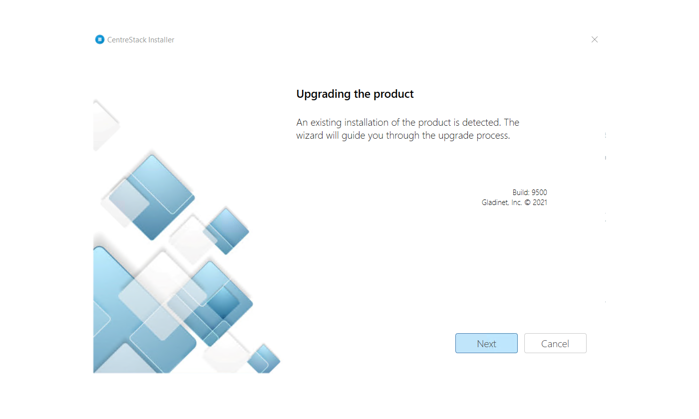
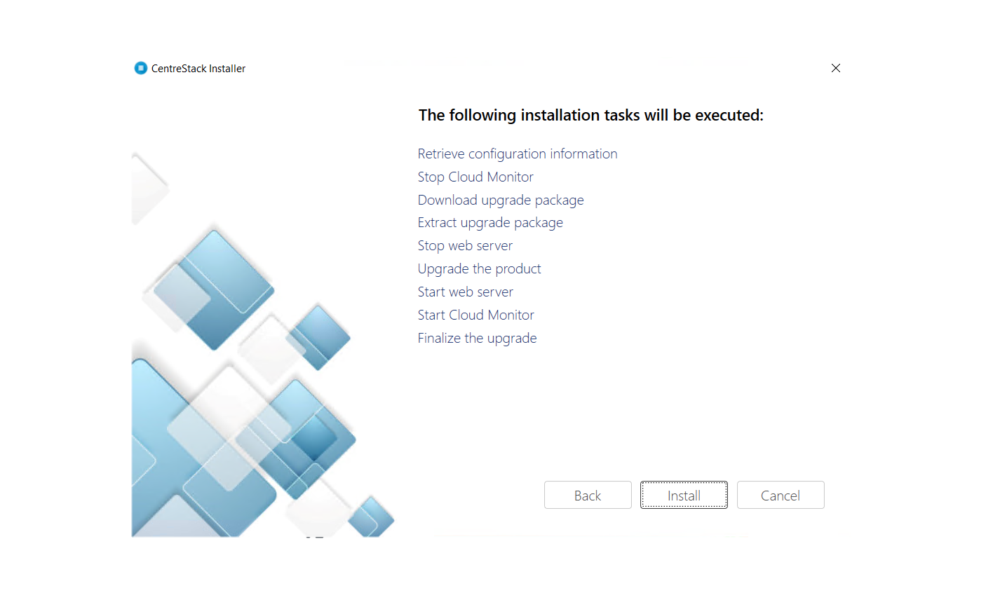

########################
Upgrade CentreStack
########################

We publish updated notes to our public blog forum called `CentreStack Blog`_. It is recommended that you perform an update if your self-hosted CentreStack and clients are three months or older.

Using the GUI Installer to Upgrade
---------------------------------------

To install an update go to your `Partner Portal`_ and download the GUI installer. When you run the GUI installer, it will detect the existing installation and perform an upgrade.

.. _CentreStack Blog: http://blog.centrestack.com/ 
.. _Partner Portal: https://www.centrestack.com/management/partnerloginpage.aspx