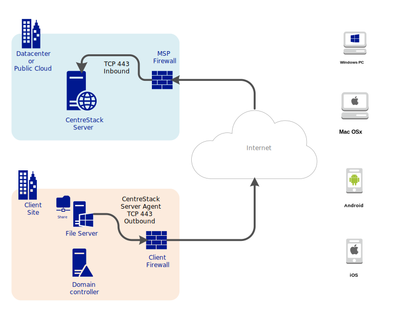
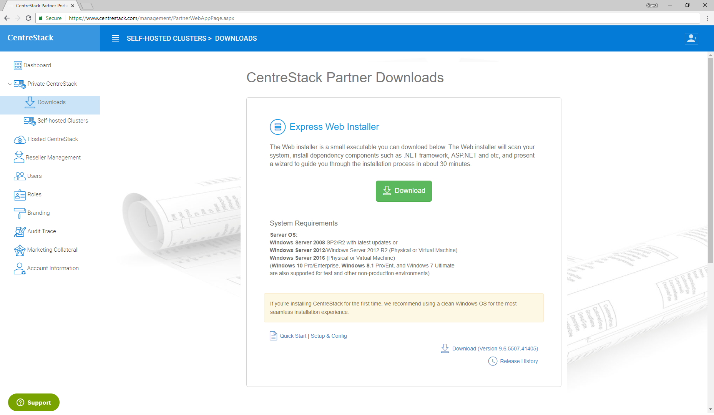

==========================================
"Data-Center MSP-Hosted" Quick Start
==========================================

Introduction
--------------

If you are a managed service provider who manages hundreds or thousands of end points across multiple
clients, it is a good option that you setup CentreStack server in a data center. 

There are a couple advantages of setting the CentreStack server up in a data center:

    1. The data center is closer to the Internet backbone than a business office is, thus it has faster Internet speed.
    2. Setting it up in a central location and in a multi-tenant fashion is easier to manage as compared to a one-centrestack-instance-per-client setup.

Preparation
---------------------

The preparation step is very similar to the On-Premise Self-Hosted version of CentreStack.

When it comes to choosing a data center, you have several options:

    1. a local data center you already use for hosting
    2. Amazon EC2 data center
    3. Azure Compute data center
    4. Any other data center that provides Windows Server
    

The CentreStack server is a web server, passing file and folder access between 
remote client agents to backend file servers. Here are a list of items to prepare ahead of time:

    1. a dedicated Windows Server machine: 
        - Operating System (2019 / 2016 / 2012 R2 / 2012 / 2008 R2)
        - 4G - 8G memory
        - Dual core or more cores (vCPU or CPU)
        - 100G hard drive space.
        
    2. a SSL certificate (for production)
    3. a DNS name (for production)
    
Since you can turn a test (POC) environment directly into a production environment, you can start with requirement #1  for test and POC (proof of concept) environment and later acquire SSL certificate and DNS name.

.. note::

    In Amazon EC2 or Azure Compute, you will need to find the 
    virtual machine images that are similar to the specificication.
    
Download & Install
-------------------------

After you decide and have acquired the Windows Server (Usually a 
virtual machine in a data center) to install the 
CentreStack software, you can go to the partner portal and download
the software. 

The Installer will install everything from begin to end.

Please reference the following two guides for more information:

    1. `Deployment Guide <http://www.centrestack.com/Library/DeploymentGuide/index.html>`_
    2. `Installation Guide <http://www.centrestack.com/Library/InstallGuide/index.html>`_
    
    
    
    
    

