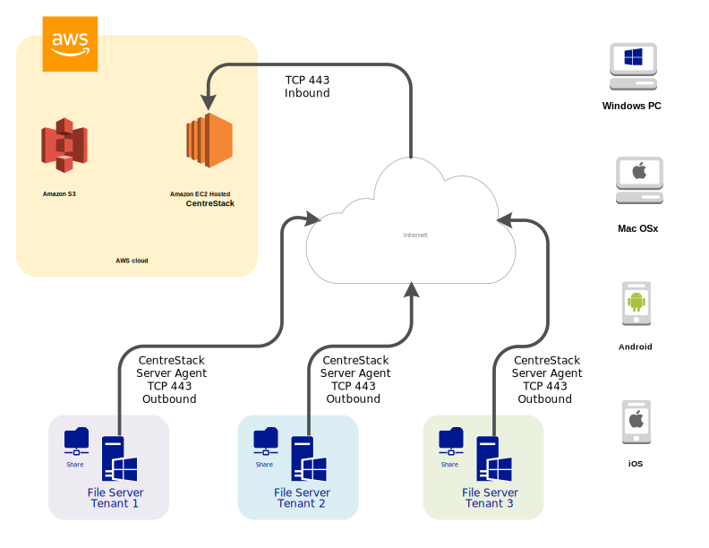
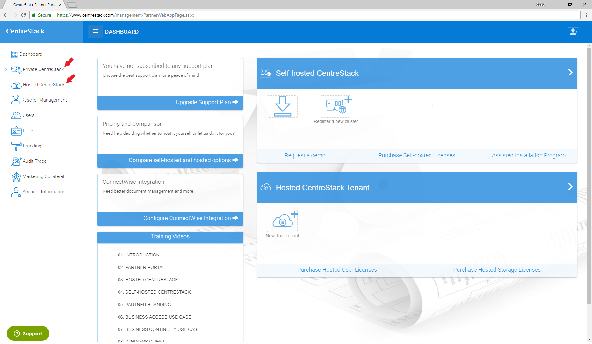

==========================================
Getting Started
==========================================

Introduction
--------------

Welcome to the CentreStack Quick Start Guide. This guide describes
on a high level how you can use CentreStack to provide a
managed file sync and share solution for your internal employees and
customers. 

The goal is to provide your customers and internal employees
an easy-to-use and secure-under-control way to access file servers from remote
locations and mobile devices.

Three Deployment Modes
-------------------------

To get started, the first question is where and how to deploy CentreStack. 
Does CentreStack need to be next to 
the file server, in a data center or just use the Cloud version from CentreStack itself? 

There are three basic ways to deploy the CentreStack solution: 

    1. On-Premise Self-Hosted
    2. Data-Center MSP-Hosted
    3. Cloud SaaS-Hosted

On-Premise Self-Hosted
++++++++++++++++++++++++++

For the on-premise self-hosted Centrestack, the CentreStack server is directly installed in the company network. 
On one-hand, it is facing the Internet with port 443 (HTTPS) like any web server does; and on
the other-hand, it is connecting to company internal network and IT infrastructures such as File Servers
and Active Directory. CentreStack server normally sits in the DMZ or behind a firewall to be protected
against un-authorized outside access.

The business objective is giving mobile and remote access to file servers without the need of a VPN. It is more productive than
traditional VPN  by greatly reducing the number of VPN support tickets for internal enterprise IT department
or for the managed service provider. 

.. image:: _static/SelfHostedCentreStackDirectShare.svg

For this deployment mode, check :doc:`on_premise`

Data-Center MSP-Hosted
+++++++++++++++++++++++++++

If you are a managed service provider that manages hundreds or thousands of end points across multiple
clients, it is a good option that you setup your CentreStack server in a data center. 

There are a couple advantages of setting the CentreStack server up in a data center.

    1. The data center is closer to the Internet backbone than a business office is, thus it has faster Internet speed.
    2. Setting it up in a central location and in a multi-tenant fashion, it is easier to manage as compared to a one-centrestack-instance-per-client setup.

.. image:: _static/SelfHostedCentreStackRemoteShare.svg

For this deployment mode, check :doc:`data_center`

Cloud SaaS-Hosted
+++++++++++++++++++++++++

Similar to Data-Center MSP-Hosted, CentreStack has a Cloud version that is readily hosted. 

This works well for managed service providers who have smaller clients here and there. Because
of the smaller number of total clients, the Data-Center MSP-Hosted overhead is relatively high. MSPs can 
use the Cloud version since it is readily deployed and ready to use. 

For this deployment mode, check :doc:`cloud_host`

What's Next
+++++++++++++++++++

You will need a CentreStack partner account to start with, regardless of which deployment mode(s) you will use. Step #1 will always be going to the centrestack.com and to register. When you are on the CentreStack web site, you can follow any "Free Trial" link to start.

.. image:: _static/image004.png

Once you are done registering, you will be in the partner portal where you can download the software, setup hosted trial and etc.

.. note::
  This quick start guide is written against CentreStack version 9.6.5507.41405
