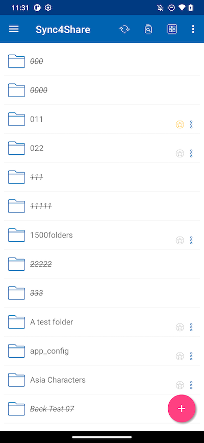
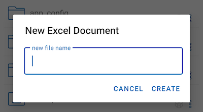

Accessing Folders and Files
==============================

After logging in, users will see the files and folders they have access to, as shown on the following screen.

Tap on a folder to see the files and subfolders it contains. Clicking on the 3 vertical dots icon for a folder will display the edit and collaboration options for that folder.

The editing and collaboration options are **Copy, Cut, Rename, Delete, Share, Share Manager and More Info**. Detailed explanations are given in later sections.

Users can also long press to make a multiple selection, then copy, cut or delete on selected folders and files using the icons in the top menu.

Top Menu Icons
----------------

Here are the icons of the top menu bar.

Refresh
>>>>>>>>>

To refresh a screen, swipe down or click the **Refresh(1)** button in the top menu, and the screen will be refreshed automatically.

Show Deleted Folders and Files
>>>>>>>>>>>>>>>>>>>>>>>>>>>>>>>>>>

Click the icon(2) to switch between **Show Deleted Files** and **Hide Deleted Files**. The default mode is **Hide Deleted Files**.

Change View Mode
>>>>>>>>>>>>>>>>>>>

Click this button(3) to switch view mode between **List View** and **Grid View**. The default view mode is **List View**.

Sort Menu
>>>>>>>>>>>

The **Sort Menu(4)** allows user to change the order in which the files are displayed.

**Z-A** displays the files in reverse alphabetical order.

**A-Z** displays the files in alphabetical order.

**Last Modified** displays the files in the order in which they were last edited.

**Oldest** displays the files that were added first at the top of the file browser.

**Largest** displays the files in the order that the largest files appear first.

**Smallest** displays the files in the order that the smallest files appear first.

**Extension A-Z** displays the files in the alphabetical order of their extension.

**Extension Z-A** displays the files in the reverse order of the alphabet by their extension.

Main operations
-----------------

Tapping the plus (+) icon will give users several options for the folder they are in:
**Upload Files(1)**, **Upload Media(2)**, **Take Photo to Upload or Scan(3)**, **Create New Folder(4)** and **Create New File(5)**.

Upload Files
>>>>>>>>>>>>>>>

By selecting the **Upload Files** icon, user can add existing files from the phone storage. User will be redirected to the phone storage page where can navigate and select a file to upload.

User can also long press files to multi-select files, then press **SELECT** to complete the upload.

Uploading Media
>>>>>>>>>>>>>>>>>

User can directly access media files from the Media apps by selecting the **Upload Media** icon, and add existing media files from the apps.

Take Photo to Upload or Scan
>>>>>>>>>>>>>>>>>>>>>>>>>>>>>>

User will be prompted for media files permission if Centrestack app have not previously been granted this permission.

Take Photo to Upload
:::::::::::::::::::::::

User can take and upload new photo when select the **Camera(1)** icon.

Take Photo to Scan
:::::::::::::::::::::

User can take a new photo and scan to upload it when select the **Scan(2)** icon.

First, user can crop the photo to the ideal shape, and click **NEXT**.

On the second page, user can change the color filter applied to the photo. Click **SAVE** to upload the photo.

.. image:: _static/2023NewImage59.png

Create New Folders
>>>>>>>>>>>>>>>>>>>>

To create new folders, click the plus (+) icon at the bottom right of the screen. Then select the **Add Folder** icon.

After enter the name of the folder and click the **CREATE** button, a new folder will be created.

Create New Files
>>>>>>>>>>>>>>>>>>>

The **New File** icon allows to create a blank new Office file. User can choose between an Excel, Word, PowerPoint or a Text file.

Choose the type of file and enter the name in the text box. Then click **CREATE** to save.

