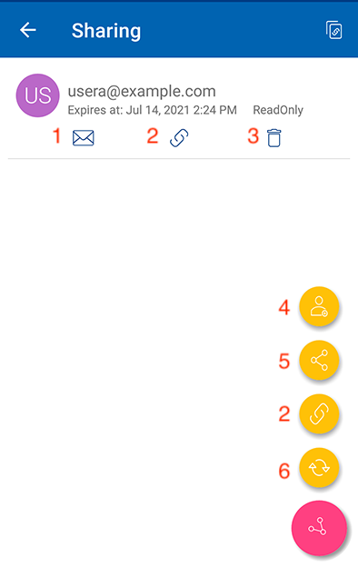

Getting Started
================

Welcome to the CentreStack Android Client User Guide. This guide describes the Android client application for CentreStack, the managed file synchronization, and sharing solution.

Users can access CentreStack cloud files using any device of their choice as CentreStack has clients for Windows, Mac, iPhone, iPad, Android, Windows 8+, and more. We have created a native Android application that you can download from the Google Play Store. This provides access to files and folders in your CentreStack account.

The white-labeled CentreStack Android app called “Cloud Android Client” by Gladinet that can be distributed by service providers and enterprises to their users. 

You can obtain a fully branded CentreStack Android Client with your company name and product logo from the Partner Portal https://www.centrestack.com. The look and feel of the app may be different but the functionality is the same. 

Download & Install
=====================

Search for Gladinet, Inc. as a publisher in ‘Play Store’ to start the download and installation.

.. image:: _static/2021NewImage001.png

After the install open the app from its icon. Login using your credentials.

.. image:: _static/2021NewImage002.png

.. image:: _static/2021NewImage003.png

Enter Access Point (if not filled automatically) and your Username and tap “CONTINUE”. 

.. image:: _static/2021NewImage004.png

On the following screen, enter your Password and tap “SIGN IN”, to log in to your server. 
On the following screen, enter your Password and tap “SIGN IN”, to log in to your server. 

Accessing Folders and Files
==============================

Once logged in users will see the files and folders they have access to like shown in the screen below.

.. image:: _static/2021NewImage009.png

Tap on the folder to see the files and sub-folders inside. 

.. image:: _static/2021NewImage012.png

**Sort Menu**

In the sort menu, you can change the order of which your files are displayed.

.. image:: _static/2021newimage043.png

**(1) Z-A** is when your files are displayed in the opposite order of the alphabet.

**(2) A-Z** lets you display your files in alphabetical order. 

**(3) Last Modified** lets your files be displayed in the order of which files have been worked on last. These files are displayed first. 

**(4) Oldest** displays files that were added first at the top of your file browser. 

**(5) Largest** displays your files in the order of which the largest files are shown first. 

**(6) Smallest** displays your files in the order of which the smallest files are shown first. 

Main operations
======================

If you tap the **+** (plus) icon you are given several options for the folder you are in: Upload **(1)**, capture photo **(2)**, add folder **(3)**. 

.. image:: _static/2021NewImage014.png

Creating New Folders
------------------------

To create new folders, click the **+** (plus) icon (1) on the bottom-right of the screen. Then choose the **Add Folder** icon (2), enter the folder name, and click the **"CREATE"** button to create a new folder. 

.. image:: _static/2021NewImage007.png

Uploading Files and Photos
-----------------------------

Selecting the Upload and Upload Images icons will allow users to add existing files and photos from phone storage. 

Once you have clicked the **Upload** icon it will take you to a screen where you can decide where you want to upload a file from.

.. image:: _static/2021NewImage008.png

Camera
--------------------

The camera icon in this menu allows you to took a picture and upload it.

New Empty Files
--------------------

The last option shown allows you to create an empty new Office file. You can choose between an Excel, Word, or Powerpoint file along with a text file.

Preview
===============

Tap a folder to enter it for browsing, and tap a file to open it in a file previewer. From within the previewer, you have a 3-dot menu on the lower-right side, that allows you to perform other actions on the file. 

.. image:: _static/2021newimage044.png

**(1) Download** allows you to copy the file to a folder on the device.

**(2) Rename** lets you rename the file if you have permission to do so.

**(3) Delete** lets you delete files from the folder if you have permission to do so. 

**(4) Share** lets you send access information to anyone with an email address. 

**(5) Share Via** lets you share the file to a third party application. For example, iMessage or WhatsApp.

**(6) Get Public Link** gives you a link where anyone can access the file through that link. 

**(7) Share manager** gives you access to any shares that exist for the file, where you can modify the share, delete it or add new shares. 

Opening and saving an existing document
===========================================

To edit an existing document, tap on the document in the file list to enter "Preview Mode" and tap the File Type icon (e.g., Word) on the bottom-right to open it in the appropriate application. 

.. image:: _static/2021NewImage018.png

If there is no default application for the document you are previewing (e.g., *.rtf) **(1)**, then you can tap the 3-dot menu button **(2)** to open a menu. There you can choose "Open" **(3)**, which will give you several options for how you can open the file. 

.. image:: _static/2021newimage036.png

You will be taken to the edit and collaboration screen where you will select the ‘Open with’ option. For this example, I choose "Hancom Office Editor" to edit the file; but your options will vary depending on the device configuration and installed applications.

.. image:: _static/image_06_3.png

Edit the file and select save; the blue checkmark in the top left corner of this example. Any changes made will be saved and you can use the back arrow to return and continue editing more files.

.. image:: _static/image_06_4.png

.. image:: _static/image_06_5.png

Working with Office Applications
==================================

If you have office mobile applications installed, you can access these apps from CentreStack Android. For example, if you have Excel for Android installed when previewing an xlsx file, you will see the Excel icon. Tap the Excel icon to open the file in Excel for editing. 

When you open the Excel file, you'll notice that the autosave feature is enabled by default. Once your edits are completed, you can use the Android BACK button to return to CentreStack and your changes will be saved. 

You may need to **Refresh** to see the updated file. If you do not see an updated or current version of a file, you should tap the refresh button. To refresh any screen, select the **Refresh** icon at the top of the screen. 

If you want to open a file from the cloud drive inside of an office application, you can select the open tab and press browse. Once you do that, you can select your drive and choose a file from there. It will then open it directly into the app.

.. image:: _static/2021NewImage054.png

If you need to save an office file into the cloud drive, you can refer to this knowledge based article: https://support.centrestack.com/hc/en-us/articles/360035107053-Save-a-Document-to-Centrestack-from-Another-Android-App (only until step 5) 

Marking As Favorite 
========================

Adding to Favorite
--------------------

You can add a file to favorites by pressing the **Star Icon**. When you add a folder or a file to favorite, it will be marked with a **Green Check** and will become offline-accessible. Near the top right you can see the icon that looks like a list. By clicking this you can change the view from list to grid view.

Removing from Favorite
------------------------

To remove files from your **Offline Favorites** Access them from the top-left hamburger menu, and choose **Favorites**. 

.. image:: _static/2021newimage025.png

In the **Offline Favorites** view you can remove files by pressing the **"X"**. Once removed, the file will not be available offline. 

.. image:: _static/2021newimage026.png

Sharing and Collaborating
============================

You can select the files or folders that you want to share from your Android devices. 

.. image:: _static/2021newimage030.png

Share
------------------------

You will be taken to the "Share/Invite User to share" screen. There you can add user emails and select various options for sharing. 
In the next screen, enter the email(s) of any users you want to add. Press the **">"** icon to add users to the share. 

.. image:: _static/2021newimage031.png

In the next screen, you can click the yellow arrow to **"Continue as it is now"** (read-only access). Or choose **"Add user as a Guest User"** to get access to other settings. 

.. image:: _static/2021newimage028.png

Before sending your email share notification you can control how the user(s) can access the file or folder. 

- Specify share expiration time
- Set access type
    - View/Read-Only Access
    - View Only (download will be disabled)
    - Edit / Full Control Access
- Other Options
    - Send email notification when file is downloaded
    - Send email notification when file is uploaded
    - Notify user when file/folder is changed 

.. image:: _static/2021newimage055.png

.. important::
        Sharing with an email user creates a **Guest User**. Each licensed user can create 3 guest user accounts. If there are 3 licensed users, then a total of 9 guest users can be added for that tenant. If the number of guest users has reached the limit, and the tenant is set up to auto grow the number of licensed users, then one more license will be added to the tenant. 

Share Via
------------------------

You will be allowed to share the file to a third party application such as gmail, or WhatsApp.

.. image:: _static/2021newimage056.png

Get public link
------------------------

A URL will be provided that you can use to paste into an email or other field to share public read-only access to the file.

.. image:: _static/2021newimage058.png

Share manager
------------------------

You will be taken to a view and will see a list of any shares associated with this file. You can add new shares there or delete previous shares to revoke access.

To delete a user share, click the **Trash Can Icon** next to it. This removes the user and prevents access by that user. 

If you click the Share Menu button on the bottom-right of the screen you get other options. **Add more users** to the share list, **copy public (read-only) link** to the clipboard, **refresh the list**. 

Request a file
------------------------

This options is only available for folders. Once you select request a file, it will take you to a screen where you can share a link with a user to allow him to upload files to the specific folder.

.. image:: _static/2021newimage047.png

.. image:: _static/2021newimage048.png

File Operations
=================

Other options are available from the 3-dot menu when you are previewing a file.

Downloading a File
--------------------

A file can be downloaded using the **‘Download’** option. Select **‘Download’** from the context menu to download a file and select the folder of your choice to download the file into.

Deleting a File
-----------------

A file can be deleted using the **‘Delete’** option. Select **‘Delete’** from the context menu to delete a file. Once the file has been deleted it will no longer be visible in the cloud drive.

Renaming a File
-----------------

You can rename a file or a folder using the **‘Rename’** option. Pressing **‘Rename’** will display a field to type in the new name.

Copy and Cut 
-----------------

The 'copy' option allows you to copy a file and paste it into a another folder of your choosing. The 'cut' option allows you to remove a file from a certain folder and paste it into another.

More Info 
-----------------

The 'More Info' option allows you to look at the specifics of the file you are working on or looking at.

Logging Out From CentreStack
==============================

To logout, click the "Hamburger" menu on the top-left of the app and press the **"Logout"** icon at the bottom of the menu.

.. image:: _static/2021NewImage020.png

Conclusion
===============

Gladinet’s vision is to enable access to enterprise data from anywhere using any device including mobile devices like Android, iPhones, and iPads. The Android CentreStack application is feature-rich which allows enterprise users to not only access the data but also sync and collaborate on that data. Users can access, share, edit, and perform other functions on the data when accessing from Android devices just like they do when they access it from Windows or MAC clients.
