Manage and Edit
==================

Managing Files and Folders
------------------------------

User can tap on a folder to open it for browsing and on a file to preview it.

Various operations can be performed in the menus, in the main list of files and folders, and in the preview itself.

Preview
>>>>>>>>>>

In the preview there is a 3-dot menu in the lower right corner that allows to perform some actions for the file.

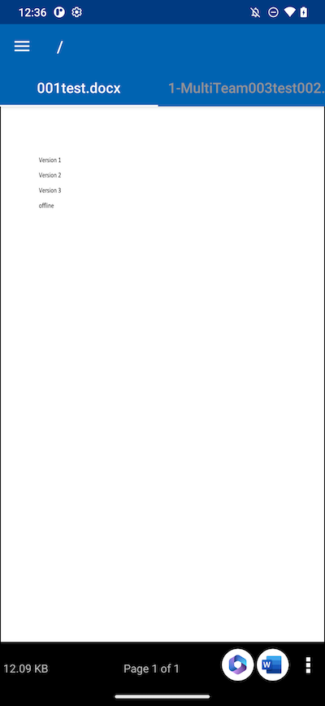

**Open** the file in other applications.

**Download** a copy of the file to a folder on the device.

**Rename** allows to rename the file if user have the permission to do so.

**Delete** files from the folder if user have the permission.

**Share** allows to send access information to people with an email address.

**Share Via** let the user share the file with a third-party application. For example, by email or WhatsApp.

**Get Public Link** gives user a link that anyone can use to access the file.

**Share Manager** gives access to all the shares that exist for the file, where user can modify, delete, or add new shares.

Download
>>>>>>>>>>

A file can be downloaded using the **Download** option.
Select Download from the context menu to download a file and select a folder from the phone storage of user's choice.

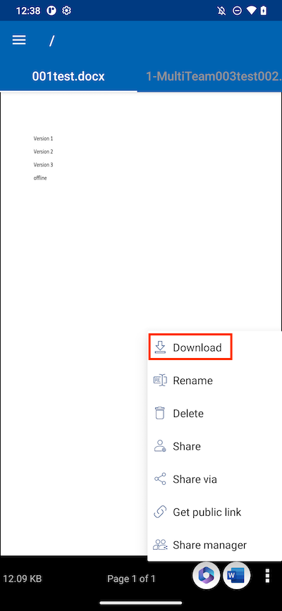

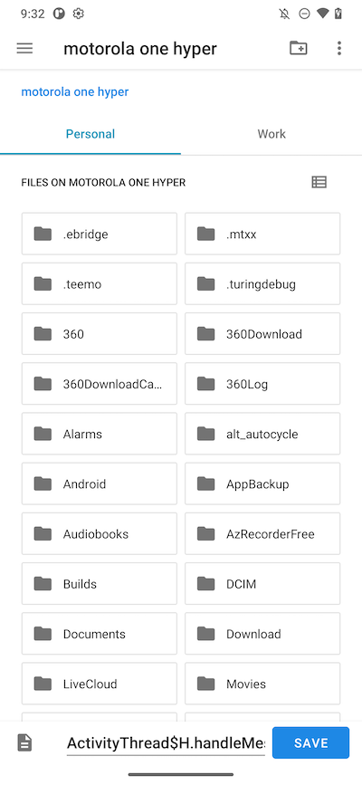

Delete
>>>>>>>>

A file can be deleted using the **Delete** option. Select it from the context menu to delete a file. Once the file is removed, it is no longer visible in the cloud drive.

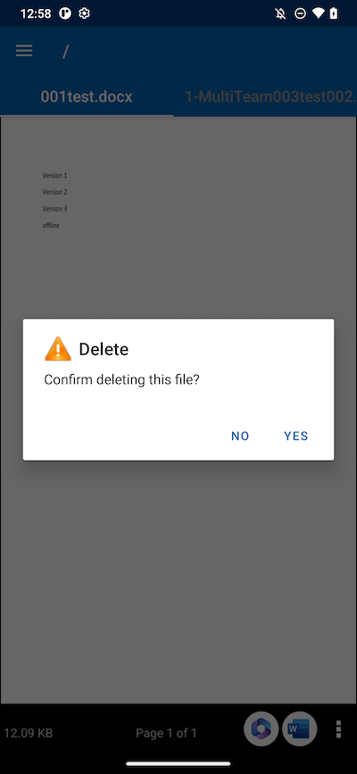

Rename
>>>>>>>>>

User can rename a file or folder using the **Rename** option. When pressing **Rename**, a field appears where user can enter the new name.

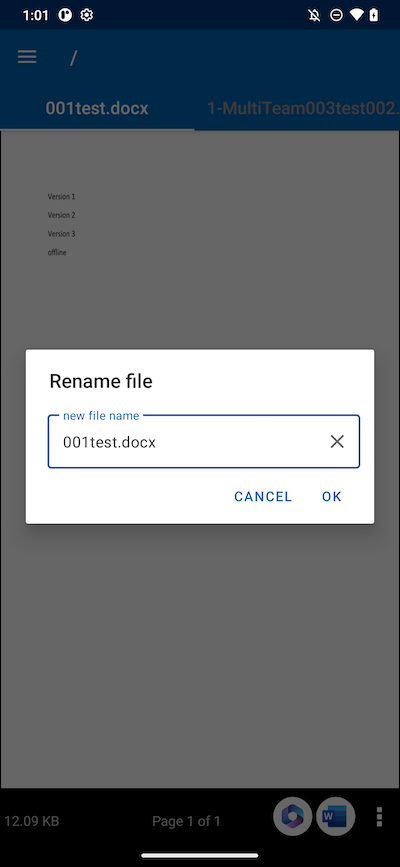

Copy and Cut
>>>>>>>>>>>>>>>

The **Copy** option lets user copy a file and paste it into another folder of choice.
The **Cut** option allows to remove a file from a certain folder and paste it into another.

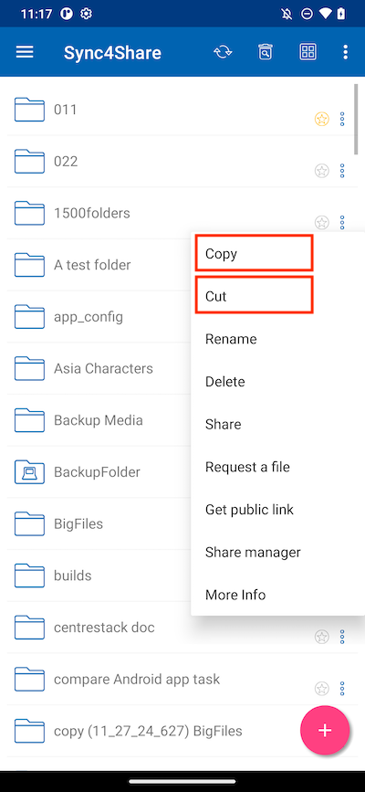

More Info
>>>>>>>>>>>

The **More Info** option allows to view the details of the file which are working on or viewing.

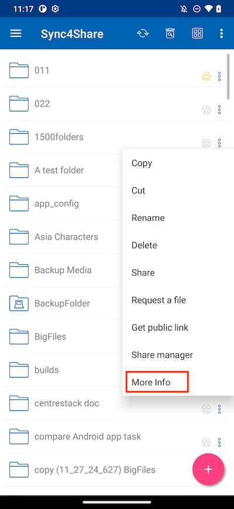

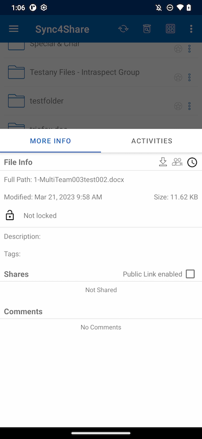

Marking As Favorite 
----------------------

Adding to Favorite
>>>>>>>>>>>>>>>>>>>>>

User can add a file to the Favorites by pressing the **Star** icon.
When adding a folder or a file to the Favorites, it will be marked with a green checkmark and will be accessible offline.

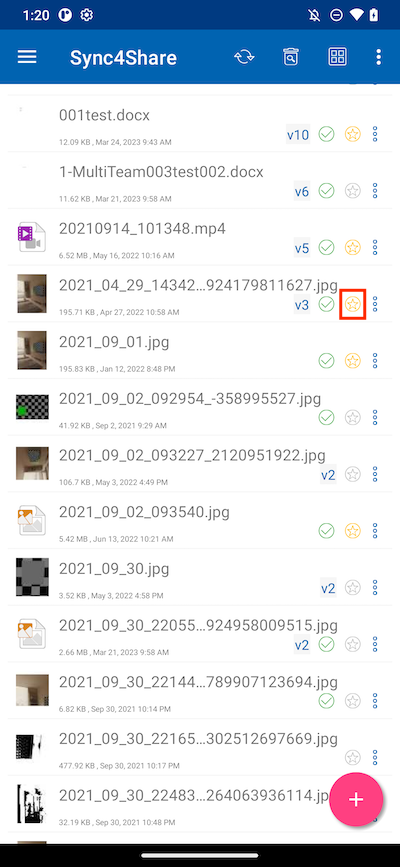

Open Favorite Files
>>>>>>>>>>>>>>>>>>>>>

To open files from offline favorites, tap on the hamburger menu at the top left and select **Favorites**.

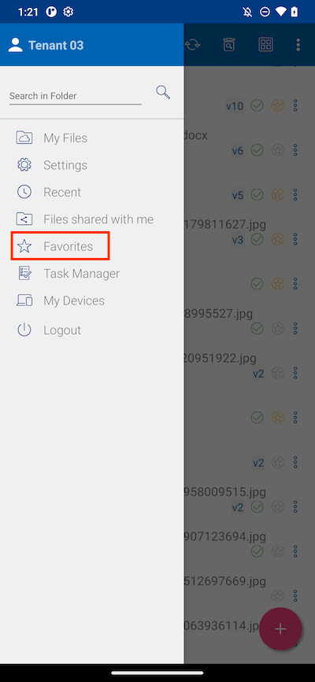

In the **Offline Favorites** view, open a file by pressing the 3-dot button and selecting **Open File Locally**.

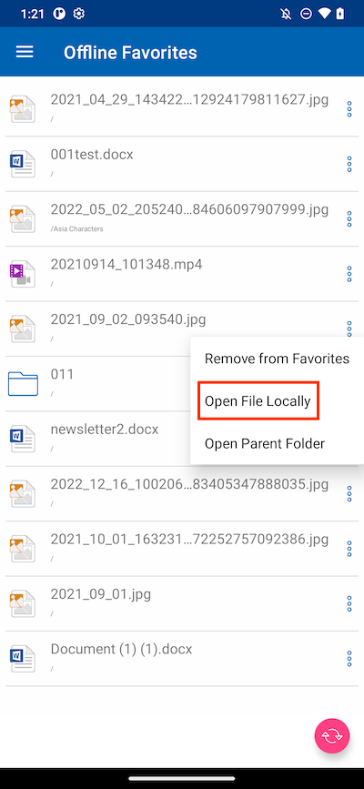

After selecting the option, a list of applications that can open the file will be displayed.

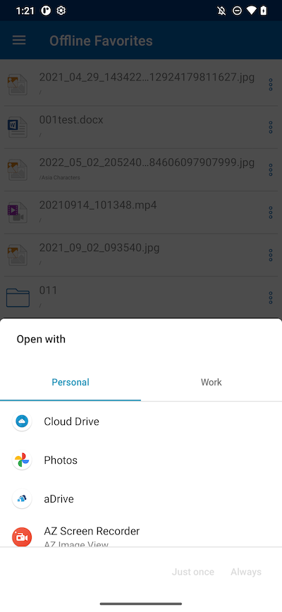

Remove from Favorite
>>>>>>>>>>>>>>>>>>>>>>>

To remove files from offline favorites, user can touch the yellow **Star** icon directly in the folders.

Or press the hamburger menu at the top left and select **Favorites**.

In the **Offline Favorites** view, user can remove files by pressing the 3-dot button. Once the file is removed, it is no longer available offline.

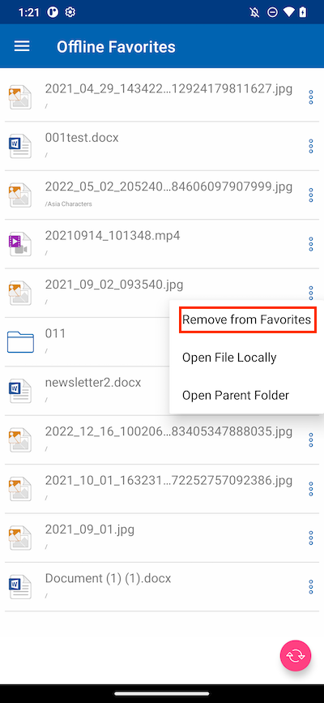

