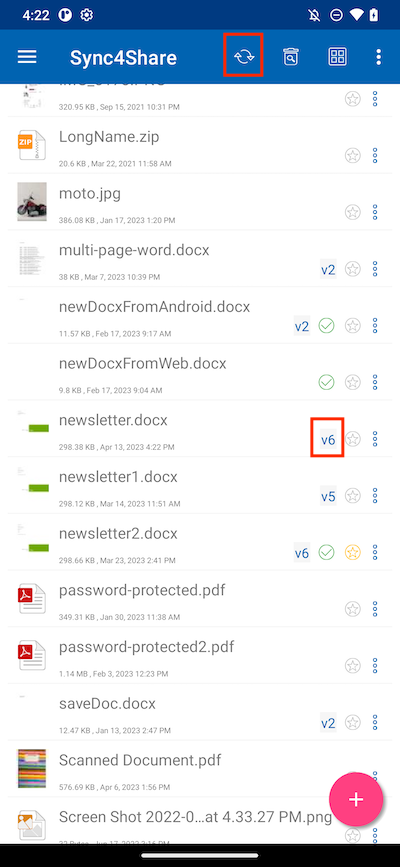

Working with Office Applications
==================================

Opening and Saving an Existing Document
-------------------------------------------

User can access Office mobile applications via CentreStack Android if installed on the phone.

To edit an existing document, tap on the document in the file list to enter "Preview Mode" and tap on the File Type icon (e.g. Word)
in the bottom right corner to open it in the appropriate application.

This will take the user to the editing application where the document is open.

User can edit the file and select "**Save**" if the file is not read-only. All the changes made will be saved and user can use the Back arrow to return and continue editing other files.

If the update or current version of the file is not seen, tap the **Refresh** button at the top of the screen.

From Office Applications
------------------------------

To edit existing files in CentreStack app from an Office application, first open the Office app, then select the **Open** tab and press **Browse**.
After that, select Cloud Android Client and choose a file from there. The file will then be opened, edited, and saved directly in the application.

