Settings
=========

Here users can make changes for the app settings.
If the user have set up a profile photo via the web portal, can see it through the person icon.

Personal Information
----------------------

Under **Personal Information** User basic details will be shown.

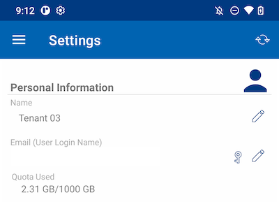

Name
>>>>>>

Displays the username, which can be edited by touching the pencil button. After updated, touch in the green icon to save the change.

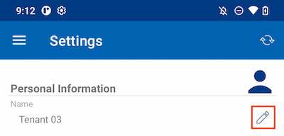

Email
>>>>>>>

Shows the user's email address, which can be edited by touching the pencil button. Then, touch on the green icon to save the change.

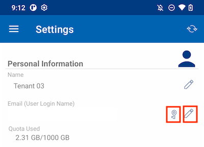

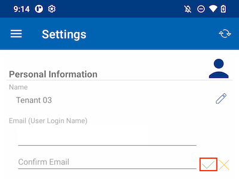

The login password can also be updated by touching on the key button.

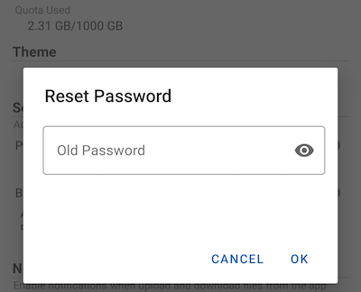

Quota Used
>>>>>>>>>>>>>

Here users can view the information about his used quota.

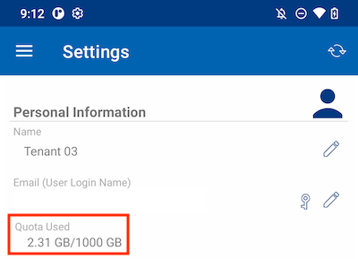

Theme
-------

To change the theme color of the App, choose the preferred one from the list provided. The default color for Cloud Drive app is **Blue**.

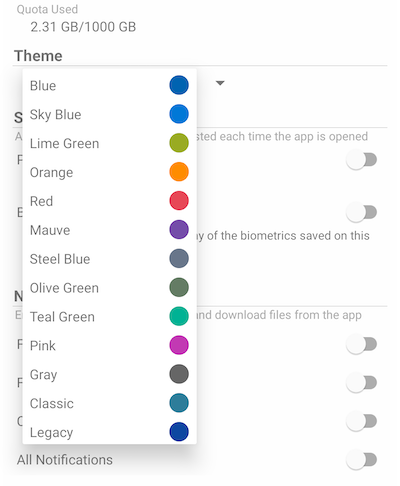

Security
----------

More security can be added to the app. When closing and reopening, a PIN or Biometrics check can be added to prevent accessing the root files.

PIN Code
>>>>>>>>>>

Enable PIN Code
::::::::::::::::::

Enable PIN Code by touching the corresponding switch:

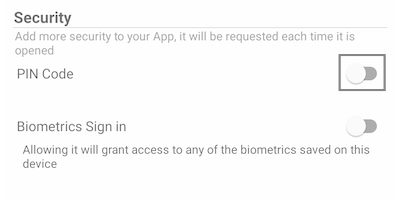

Then, a dialog box will appear where can enter PIN Code. A PIN Code is a 4-digit number.

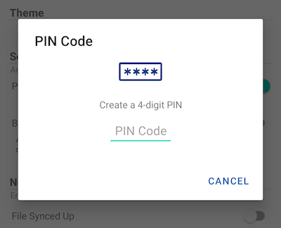

Once confirmed the PIN, will return to the Settings page and see that the PIN Code is enabled.

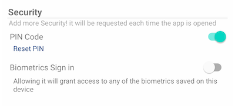

When closing and reopening the app, a dialog box will appear asking for the PIN Code. Users can also close this dialog box and enter the user password instead.

After authenticated, can access all files and folders.

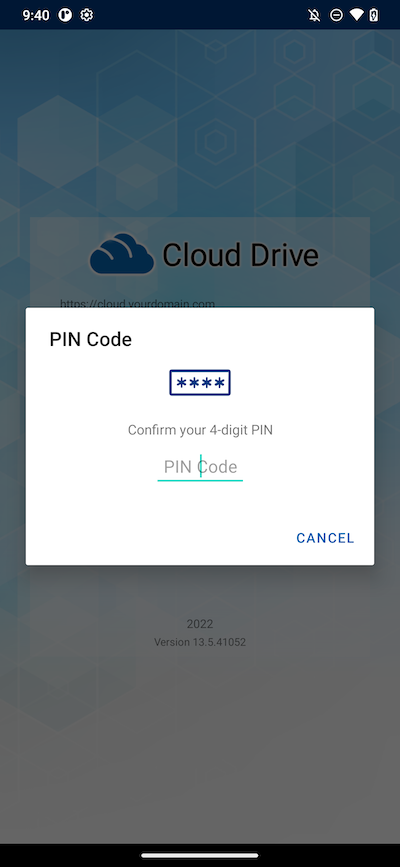

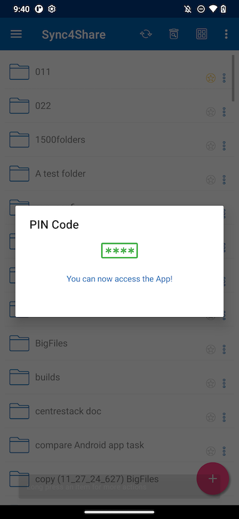

Reset PIN
:::::::::::

Reset the PIN is possible by tapping the **Reset PIN** button:

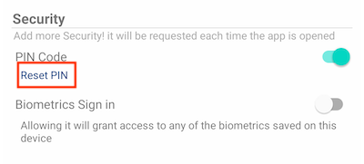

To reset PIN, first enter the old PIN and then enter the new PIN twice to confirm. Once the new PIN is activated, can use the new PIN to access the app.

.. image:: _static/2023NewImage15.png

Remove PIN
::::::::::::

The PIN Code can be removed by touching the switch or by tapping on **Reset PIN** and use **Remove PIN**.

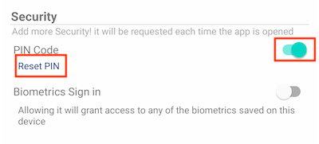

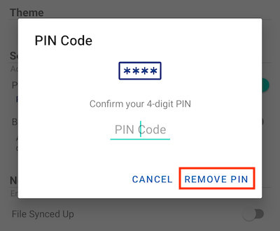

Enter the PIN Code to remove it:

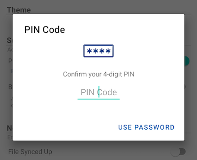

Touch **Use Password** to use the user password to remove the PIN:

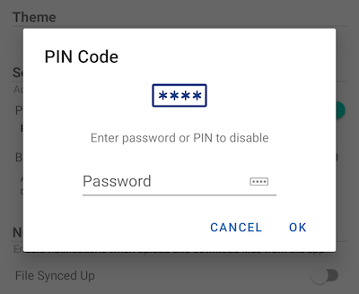

Biometrics Sign in
>>>>>>>>>>>>>>>>>>>>

Enable Biometrics
:::::::::::::::::::

Enable Biometrics by tapping this switch:

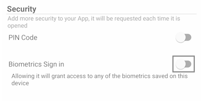

If a yellow warning message is shown, it means the device does not have any biometrics enrolled. Go to the Settings and set this up.

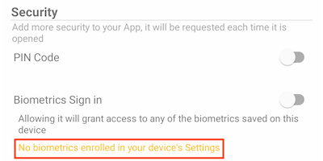

After tapping on the switch, will see a dialog box where can authenticate the biometrics. The biometrics can be a fingerprint or a face ID.

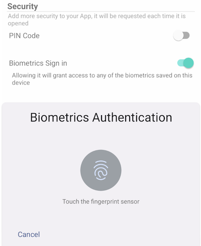

When closing and reopening the app, a dialog box appears asking for Biometrics Authentication. Can also close this dialog and enter the user password instead.

After authentication, user can access the files and folders.

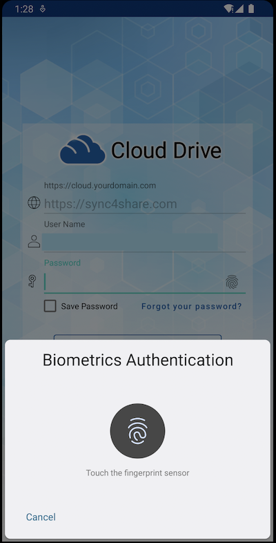

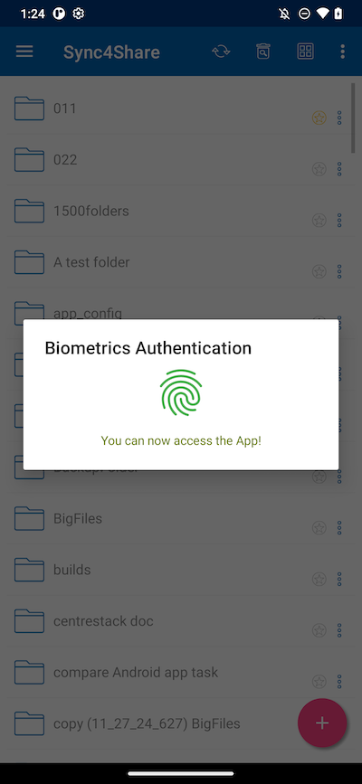

Remove Biometrics
:::::::::::::::::::

Remove Biometrics by touching the switch:

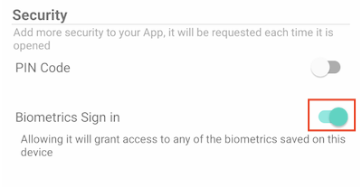

Authenticate to remove biometrics:

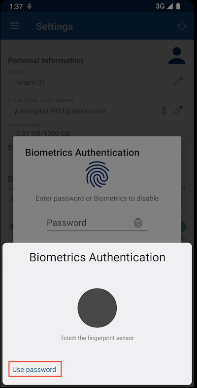

Or tap in **Use Password** to use the user password to remove the biometrics:

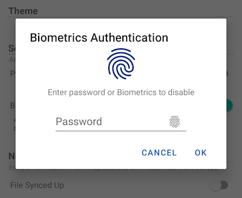

.. Attention::
        Only enable either PIN Code or Biometrics at the same time.

Notification Center
---------------------

In this section, can enable notifications for the app while uploading and downloading.

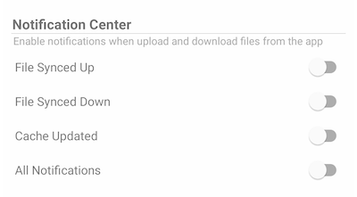

Enable **All Notifications** gives the CentreStack app permission to send all notifications.

Also enable other notifications by selecting **File Synced Up**, **File Synced Down**, and **Cache Updated**.

Media Backup
--------------

Set up a **Media Backup** folder to synchronize media files from the local phone storage.

Set up Backup Folder
>>>>>>>>>>>>>>>>>>>>>>

Touch the pencil button to set a name for the backup folder, and tap the green check mark button to save.

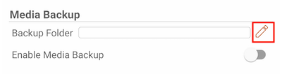

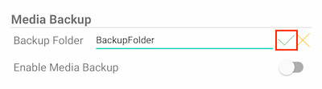

Tap on the switch to enable **Media Backup**. If permission to media files are not granted for the app, a dialog will appear asking to allow the app to access media files.

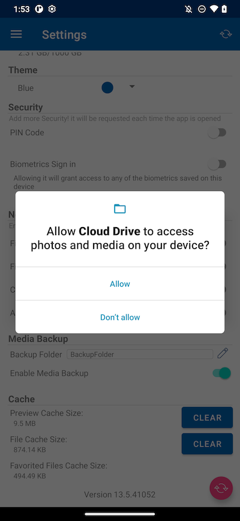

If the name of an existing folder matches the backup folder name, will receive a warning to either change to a different backup folder name or use that folder as the backup folder.

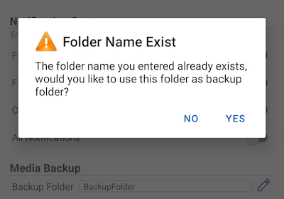

Go back to the root directory and check the media backup folder with an attached folder icon. The backup media files are located in the folder under the device type name.

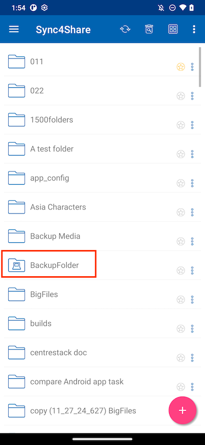

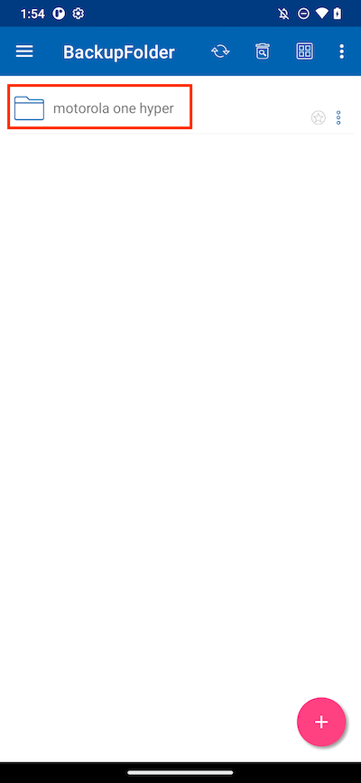

Backup Folder Disconnection
>>>>>>>>>>>>>>>>>>>>>>>>>>>>>>>

To disconnect from the Media Backup folder, just tap on the switch to close it.

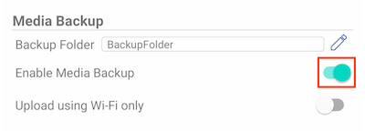

Wi-Fi Only
>>>>>>>>>>>>

If this switch is enabled, media files can only be synchronized under Wi-Fi connection.

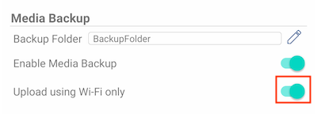

Cache
-------

The Cache size is calculated from temporary files, icons and previews. This can be cleared using the button below.

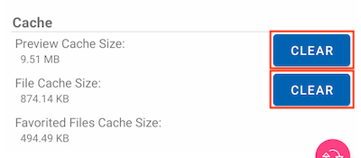

.. image:: _static/2023NewImage38.png

.. Attention::
        Favorite Files cannot be removed when the File Cache is cleared.

