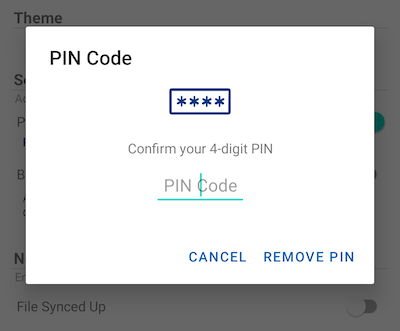
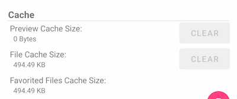

Settings
=========

Here you can make changes for the app settings.

Personal Information
----------------------

Under **Personal Information** you can access basic user information under.

.. image:: _static/2023NewImage01.png

Name
>>>>>>

This displays the username, which you can edit by clicking the pencil button. Finally, click n the green icon to save the change.

.. image:: _static/2023NewImage02.png

.. image:: _static/2023NewImage03.png

If you have set a profile photo via the web portal, you can also see it via the person icon.

Email
>>>>>>>

This will display the user's email address, which you can edit by clicking the pencil button. Then, click on the green icon to save the change.

.. image:: _static/2023NewImage05.png

You can also change your login password by clicking on the key button.

Quota Used
>>>>>>>>>>>>>

Here you can view the information about your used quota.

Theme
-------

You can change your preferred theme color from this list. The default color for Centrestack app is **Blue**.

.. image:: _static/2023NewImage08.png

Security
----------

You can add more security to your app. When you close and reopen the app, a PIN or Biometrics check can be added before you access the root files.

PIN Code
>>>>>>>>>>

Enable PIN Code
::::::::::::::::::

You can enable PIN Code by clicking this switch:

After you click the switch, a dialog box will appear where you can enter your PIN Code. A PIN Code is a 4-digit number.

.. image:: _static/2023NewImage10.png

Once you confirm your PIN, you will return to the Settings page and see that the PIN Code is enabled.

.. image:: _static/2023NewImage11.png

If you close and reopen the app, a dialog box will appear asking for the PIN Code. You can also close this dialog box and enter the user password instead.

After you authenticate, you can access the files.

.. image:: _static/2023NewImage12.png

Reset PIN
:::::::::::

You can reset your PIN by clicking the **Reset PIN** button:

.. image:: _static/2023NewImage14.png

To reset PIN, you should first enter the old PIN and then enter the new PIN twice to confirm. Once the new PIN is activated, you can use the new PIN to access the app.

Remove PIN
::::::::::::

The PIN Code can be removed by clicking the switch or by clicking **Reset PIN** and use **Remove PIN**.

.. image:: _static/2023NewImage16.png

.. image:: _static/2023NewImage17.png

You can enter the PIN Code to remove the PIN:

Or you can click **Use Password** to use the user password to remove the PIN:

.. image:: _static/2023NewImage19.png

Biometrics Sign in
>>>>>>>>>>>>>>>>>>>>

Enable Biometrics
:::::::::::::::::::

You can enable Biometrics by clicking this switch:

.. image:: _static/2023NewImage20.png

If you see this yellow warning message, it means you do not have any biometrics enrolled in your device. You can go to the Settings of your device to set this up.

.. image:: _static/2023NewImage21.png

After you click the switch, you will see a dialog box where you can authenticate your biometrics. The biometrics can be a fingerprint or a face ID.

.. image:: _static/2023NewImage22.png

When you close and reopen the app, a dialog box appears asking for Biometrics Authentication. You can also close this dialog and enter the user password instead.

After authentication, you can access the files.

.. image:: _static/2023NewImage23.png

.. image:: _static/2023NewImage24.png

Remove Biometrics
:::::::::::::::::::

You can remove Biometrics by clicking the switch:

Authenticate to remove biometics:

Or you can click **Use Password** to use the user password to remove the biometrics:

.. image:: _static/2023NewImage27.png

.. Attention::
        You can only enable either PIN Code or Biometrics at the same time.

Notification Center
---------------------

In this section, you can enable notifications for the app while uploading and downloading.

Enable **All Notifications** gives the Triofox app permission to send all notifications.

You can also enable other notifications by selecting **File Synced Up**, **File Synced Down**, and **Cache Updated**.

Media Backup
--------------

You can set up a **Media Backup** folder to synchronize media files from the local phone storage.

Set up Backup Folder
>>>>>>>>>>>>>>>>>>>>>>

Click the pencil button to set a name for the backup folder, and click the green check mark button to save.

.. image:: _static/2023NewImage29.png

.. image:: _static/2023NewImage30.png

Click the switch to enable **Media Backup**. If you have previously given the app permission to media files, a dialog will appear asking you to allow the app to access media files.

If you already have a folder name that matches the backup folder name, you will receive a warning to either change to a different backup folder name or use that folder as the backup folder.

You can go back to the root directory and check the media backup folder with an attached folder icon. The backup media files are located in the folder under your device type.

.. image:: _static/2023NewImage34.png

Backup Folder Disconnection
>>>>>>>>>>>>>>>>>>>>>>>>>>>>>>>

To disconnect from the Media Backup folder, just click the switch to close it.

Wi-Fi Only
>>>>>>>>>>>>

If you enable this switch, media files can only be synchronized under Wi-Fi connection.

Cache
-------

The Cache size is calculated from temporary files, icons and previews. This can be cleared using the button below.

.. Attention::
        Favorite Files cannot be cleared when the File Cache is cleared.

