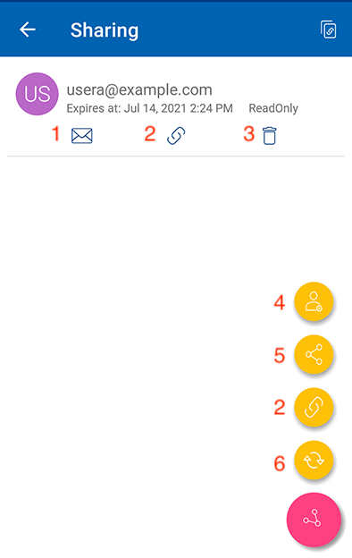

Sharing and Collaborating
============================

User can select the files or folders to share from the Android devices.

.. image:: _static/2023newimage79.png

Share
------------------------

User will be redirected to the **Share/Invite User** screen. There, add the email addresses of the users and select different options for sharing.
Press the ">" icon to add users to the share.

.. image:: _static/2021newimage028.png

On the next screen, touch the yellow arrow to select "**Continue as it is now**" (read-only access). Or select "**Add user as a Guest User**" to get access to other settings.

.. image:: _static/2023newimage80.png

Before sending email share notification, specify how the user(s) can access the file or folder.

- Set the expiration time for the share.
- Select "Read Only" or "Full Control".
- Select "View only (no Download)" if desired.
- Select "Password Protection" and enter a password.
- Disable password protection and allow the user to create their own password from the link in the email they receive.

When selected the sharing options, tap on "Share" at the top right.

.. image:: _static/2023newimage81.png

.. important::
        Sharing with an email user creates a **Guest User**. Each licensed user can create 3 guest user accounts. If there are 3 licensed users, then a total of 9 guest users can be added for that tenant. If the number of guest users has reached the limit, and the tenant is set up to auto grow the number of licensed users, then one more license will be added to the tenant. 

Share Via
------------------------

User can share the file with a third-party application such as Gmail or WhatsApp.

.. image:: _static/2023newimage82.png

Get Public Link
------------------------

A URL will be provided that can be used to paste into an email or other field to share public read-only access to the file.

.. image:: _static/2021newimage058.png

Share Manager
------------------------

User will be taken to a view and will see a list of all shares associated with the item. Tap on on a shared user, to resend the **share email** (1) and **get public link** (2).

To delete a user share, press the **trash can** (3) icon next to the share. This will remove the share and prevent access by that user.

Touching the Share Menu button at the bottom right of the screen will give more options. **Add more users** (4) to the share list, **Share Via** (5) this file,
**copy public (read-only) link** (2) to the clipboard, **refresh the list** (6).

Request a File
------------------------

This option is available only for folders. Selecting **Request a file** will take to a screen where user can share a link with another user so they can upload files to a specific folder.

.. image:: _static/2021newimage047.png

.. image:: _static/2021newimage048.png

Files Shared with Me
---------------------------

User can access files shared by other users from **Files Shared with Me** from the side menu.

.. image:: _static/2023newimage83.png

.. image:: _static/2023newimage84.png

