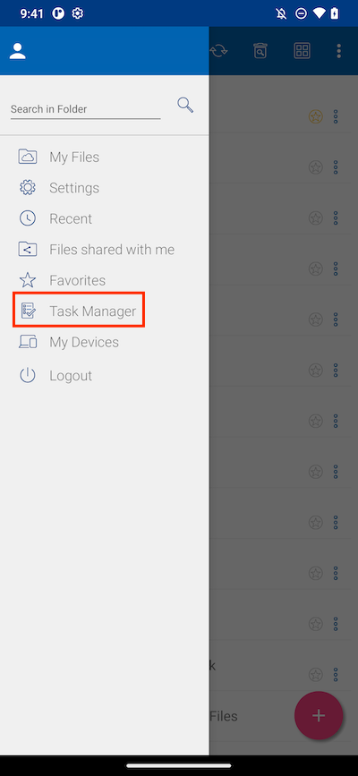
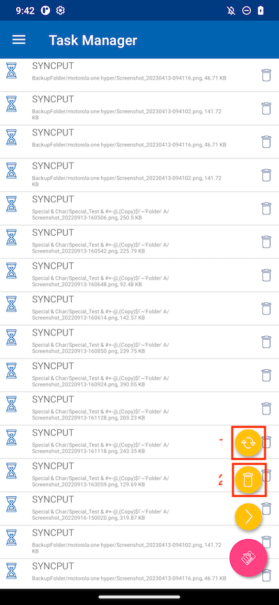
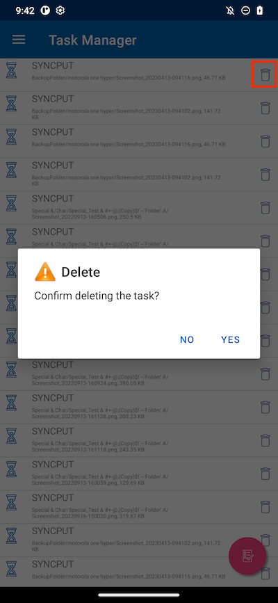
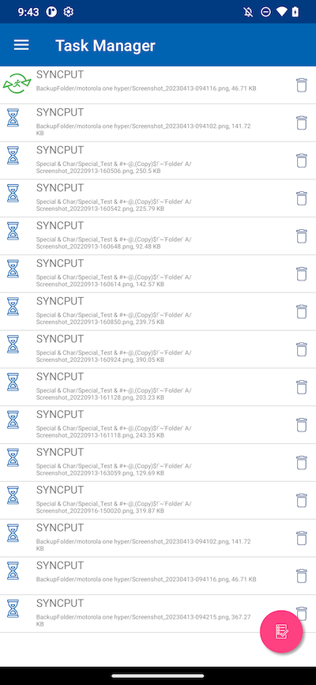
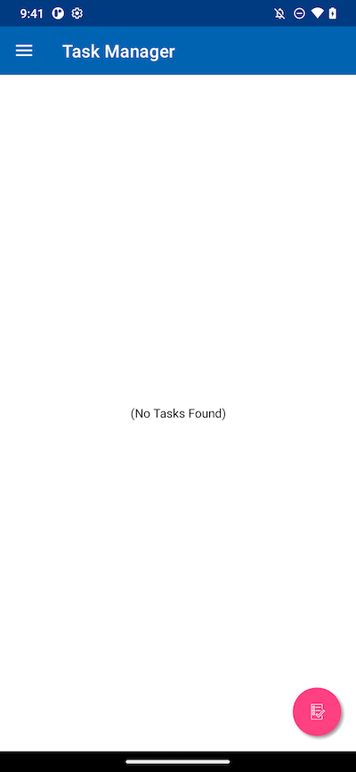

Task Manager
=====================

You can access the **Task Manager** from the side menu.

If you have some pending tasks, you will see a list of tasks in the Task Manager. You can click the **Refresh(1)** button to update the task list and the **Delete(2)** button to delete all tasks.

Any individual task can be deleted if you click the delete button.

A task that is displayed as a green running image means that it is currently being executed.

Once all tasks are completed, the **No Tasks** Found page is displayed.

