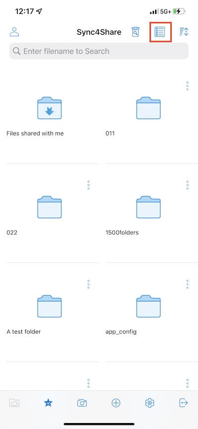
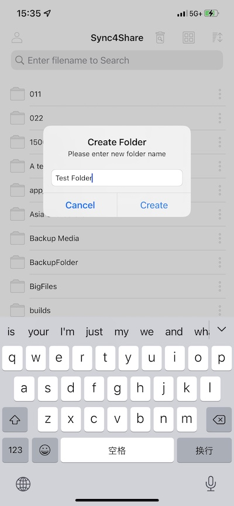

Access, Upload and Create
==============================

Once logged in users will see the files and folders they have access to like shown in the screen below.

Tap on the folder to see the files and sub-folders inside. 

Top Menu
-------------

Refresh
############

To refresh a screen, swipe down and it will automatically refresh.

Sort Menu
#############

The Sort menu allows user to change the order in which files are displayed.

**Name (A to Z)** displays files in the order of the alphabet.

**Name (Z to A)** display files opposite of the alphabetical order. 

**Size (1 to 9)** displays files in the order of which files are the smallest. 

**Size (9 to 1)** displays files in the order of which the largest files are shown first. 

**Date (Old to New)** displays files that were added first at the top of the file browser. 

**Date (New to Old)** displays files in the order of which the most recently worked on files are shown first.

View Mode
#############

In the directory view, switch between the list and grid views by clicking the icon in the upper right corner.

Show Deleted
###############

Click the **Show Deleted** button to switch between show deleted files and hide deleted files.

Main Operations
--------------------

Here are some of the main features user can manage in Centrestack app.

My Files
###########

If user clicks in a subfolder, click this button to return to the root directory.

Offline Access
##################

Files added to "Favorites" are available for offline access. User can access the files by clicking the **Favorites** icon at the bottom left.

The **green check mark** (synchronized for offline access) and the **blue star** (favorite) indicate the status of the file.

Uploading Photos
####################

When user selects the camera icon, he can either upload an existing photo to the library, take a new photo, or record a new video.
Select the camera icon at the bottom of the screen and select "**Take Photo**" or "**Choose Existing**" or "**Video**".

Creating New Folders
#########################

To create new folders, click the "**+**" (plus) icon at the bottom of the screen.

After entering the folder name and clicking the "**Create**" button, a new folder will be created.

Settings
#############

Access the app settings by clicking on the "**gear icon**" at the bottom of the screen.

In the **Settings** user can find the his credentials, color theme, media backup and can log out from there.

Log Out
###########

User can also log out of Centrestack app by clicking on the Logout icon at the bottom right of the screen.

On the next screen, can see a confirmation dialog for logging out. Click the "**Sign Out**" button to complete the process.

