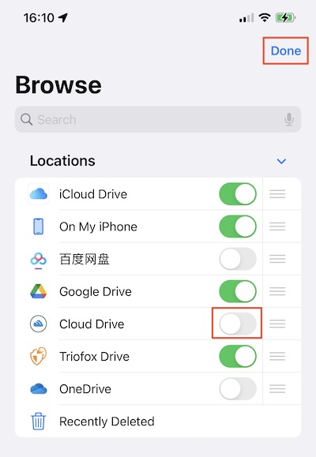

Files App
===============

User can access Cloud Drive from the Files app on the phone.

Setup
---------

Open the Files App, select **Browse**, and see if the Cloud Deive app is listed under **Locations**.

If the Cloud Drive app is not listed under **Locations**, click the 3-dot button in the top right corner and then click **Edit**.

Enable the switch for the Cloud Drive app, and then click **Done**.

The Cloud Drive app is listed under **Locations**.

Main Operations
--------------------

Select Cloud Drive to open Centrestack. Click the 3-dot button on the top right to see the operations in the list.

View
##########

Choose between Icons and List to switch the view.

Select here to change the sorting mode.

If user enable Use Group, can group the items by using Kind, Date or Size.

File Operations
#####################

Long press on a folder or file to enter the operations menu for it.

Long press on an empty space to paste a file, create new folder, initiate scanning document or get info.

Click the 3-dot button at the top right and select **Select**. You can select multiple folders and files and operate them with the icons in the bottom toolbar.

Scan Document
##################

User can start scanning a document by clicking the 3-dot button at the top right and selecting **Scan Documents**.

A photo capture view will appear, a photo will be taken automatically when a document is detected in the image. Click **Save** to upload the scanned document to Cloud Drive.

Then will see a new file named **Scanned Document** uploaded to Cloud Drive.

