#########################################
CentreStack iOS Application User Guide
#########################################

Introduction
================

Welcome to the CentreStack iOS Client User Guide. This guide describes the iOS client application for CentreStack, the managed file synchronization and sharing solution.

Users can access CentreStack cloud files using any device of their choice as CentreStack has clients for Windows, Macs, iPhones, iPads, Android, Windows Phone 8+ and more.

Gladinet Cloud iPhone application is a native iOS application available in App Store that you can use to access Gladinet cloud files and folders. The iOS Gladinet Cloud app requires IOS 6.0 or later and is compatible with iPhone, iPad, and iPod touch.

There is also a white labelled Gladinet Cloud iOS app called "Cloud Client" by Gladinet that can be distributed by service providers and enterprises to their users.

Getting Started
===================

This user guide describes in detail the full functionality of Gladinet Cloud iOS application.

Download & Install
--------------------------

Search for Gladinet Cloud in "App Store" to start the download and installation.

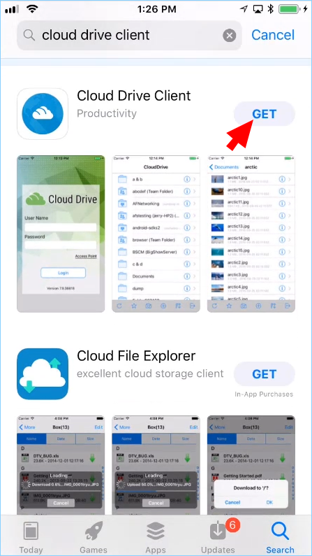

After the install click on **"OPEN"** to access the Gladinet login screen. 

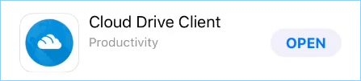

The first time you login, you will need to click the **"Access Point"** text, and enter your access point (e.g., ip address, url). Then enter your login credentials to complete the process. 

.. image:: _static/image_01_02.png

Accessing Folders and Files
==============================

Once logged in users will see the files and folders they have access to like shown in the screen below.

.. image:: _static/image_02_01.png

Tap on the folder to see the files and sub-folders inside. Clicking the **"i"** circle icon for a folder will display editing and collaboration options for that folder.

.. image:: _static/image_02_02.png

The editing and collaboration options are "Favorite", "Share", "Comment", "Open In...", "Delete", "Rename", "Copy", and "Move to...".

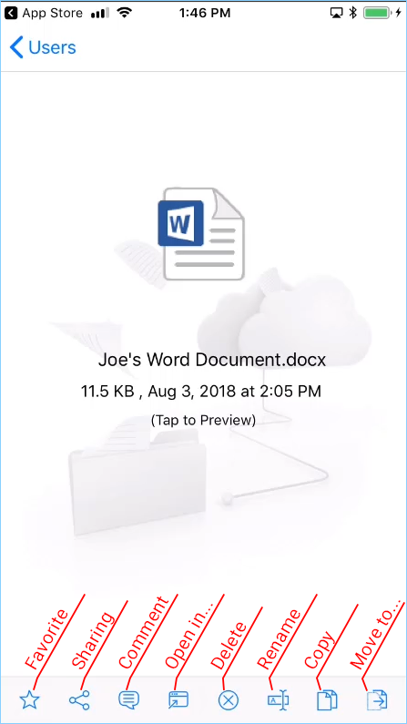

Tapping a file will also display the same editing and collaboration options as show for the folder above. To access a file tap on the file name and you will be able to view the file and the context menu.

Creating New Folders
======================

In order to create new folders a user can click the **"+"** (plus) icon displayed on the bottom of the screen.

.. image:: _static/image_03_01.png

After entering the folder name and clicking the **"OK"** button will create a new folder.

Uploading Photos
====================

Selecting the camera icon will allow users to either upload an existing phone or take a new photo. To take a photo or to choose an existing photo to upload select the camera icon on the bottom of the screen and select **"Take Photo"** or **"Choose Existing"**.

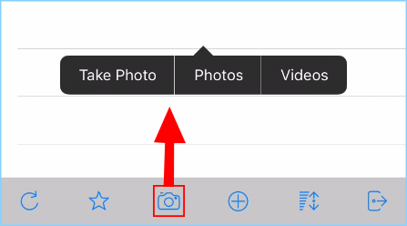

In this example, you can select the pictures you wish to add then click **"Done"** to complete the process. 

.. image:: _static/image_04_02.png

Offline Access
=================

Files that have been added to "Favorite" are available for offline access. You can access the files by clicking the **Favorite Icon** when offline.

.. image:: _static/image_05_01.png

Selecting the **Star (1)** icon at the bottom of the screen (shown below), will open the **"Offline Favorites"** screen shows all the files that are available for offline access. If you click the **"Edit" (2)** button, you can remove items from this list by clicking the **[-] (3)** (minus) icon on the left of the item you with to remove. In this example image you can allso see the **green checkmark** (synced for offline) and the **blue star** (favorited) to show you the status of the file. When you are finished with "Favorite" edits, click **"Done" (4)** to exit this function. 

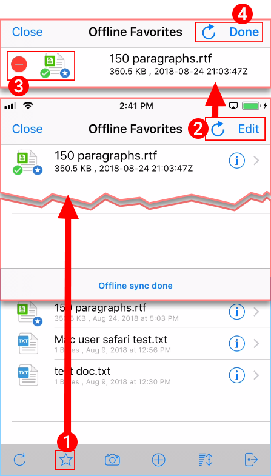

Editing and Saving an existing document
==========================================

To edit an existing document, tap on the document in the file list.

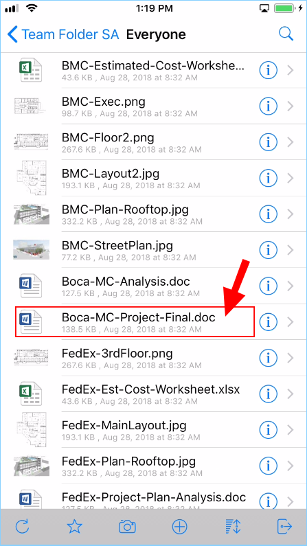
 

You will be taken to the edit and collaboration screen. where you will select **"Open In"** option.

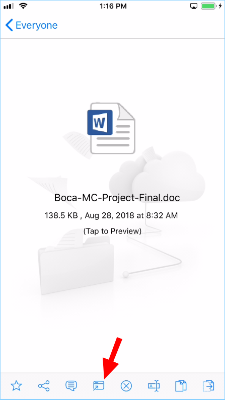
 

Select "Open in screens" to edit the file.

When you select "Open in Pages" you will see a message window, "this document may look different on your IOS device", select "OK" and select the file you want to edit. Edit the file and select "Done "to save. Any changes you have made will be saved and you can tap the document again to return back and continue editing.

.. image:: _static/image053.png

NOTES: iOS applications are sandboxed by default, meaning they don"t have a way to access other application"s data. So when an external application edits the document, the document is saved to that external application"s isolated (sandboxed) storage location. Many external application supports “SHARE” or “OPEN IN” so you can use the Share or Open In to send the document back into Gladinet iOS application.

Select the document you want to edit.

.. image:: _static/image054.png

Edit the document and select 'Done' and then select the 'upload icon'.

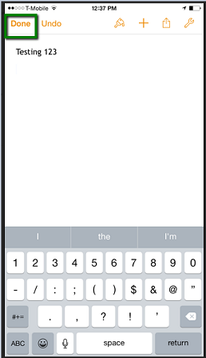

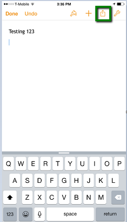

Select 'Open in Another App'

.. image:: _static/image057.png

Choose a the file format.

.. image:: _static/image058.png

Select 'Open in Gladinet Cloud'.

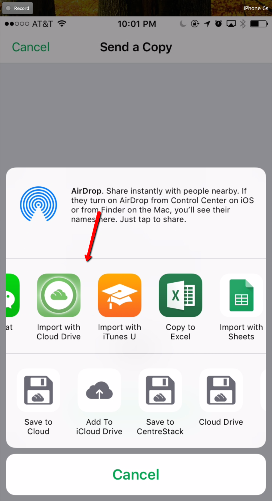

Click on 'Upload to this file'

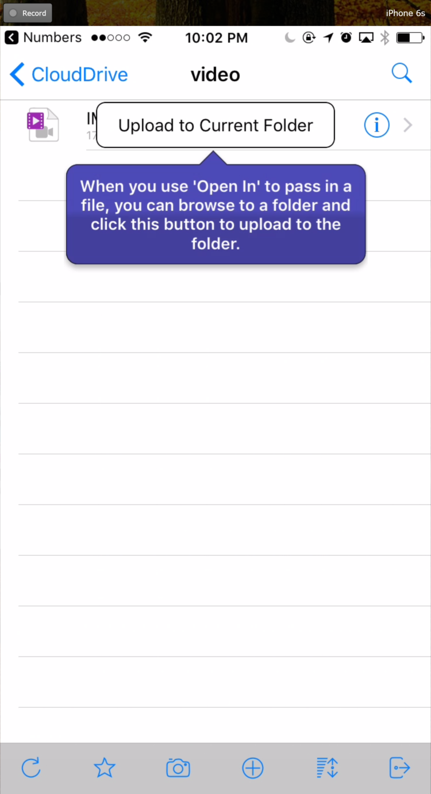

Refresh
=========

To refresh any screen, select the refresh icon on the bottom of the screen.
 
.. image:: _static/image019.png

Preview
=========

In order to preview a file, you can press the **"Tap to Preview"** option listed under the file name.

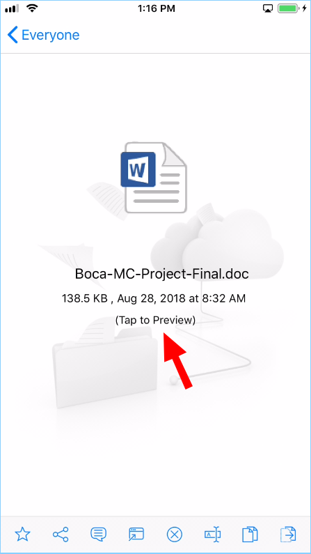

Favorites
=============

Adding to Favorite
--------------------

You can add a file to favorites by tapping the file to open the file properties screen and pressing the **Star Icon**.

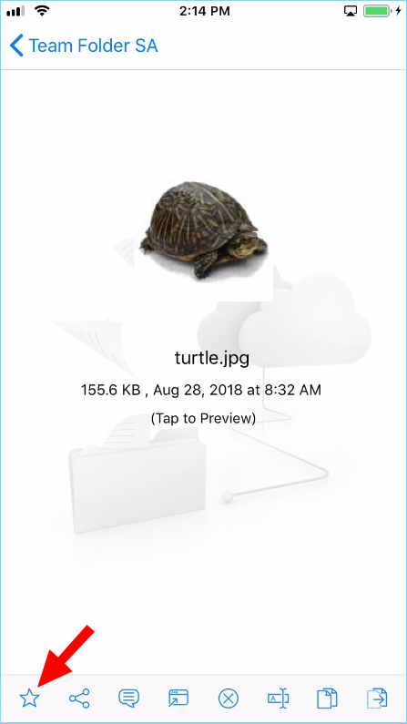
 

When you add files to favorite, they will be marked with a "Star" and you can access them offline.

.. image:: _static/image_09_02.png

Removing from Favorite
------------------------

You can remove files from favorite by pressing the **Star Icon** in the root folder. This will open the **"Offline Favorites"** screen. 

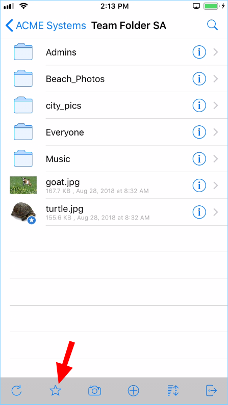

On the **"Offline Favorites"** screen, you can click **"Edit" (1)** and remove any files you wish to unfavorite by clicking the minus, **"-" (2)** next to the file you want to remove. Then click **"Done"** and **"Close"** to complete the process. 

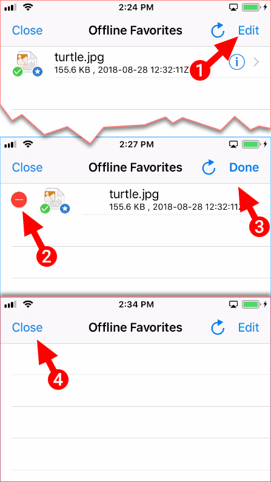

Sharing 
============

Sharing a File
-----------------

First tap a file you want to share. Then in the file properties view, select the **Share Icon** on the bottom of the display. 

.. image:: _static/image_11_01.png

In the Sharing screen, tap the **"+"** icon to add emails for users you want to include in this share. 
 
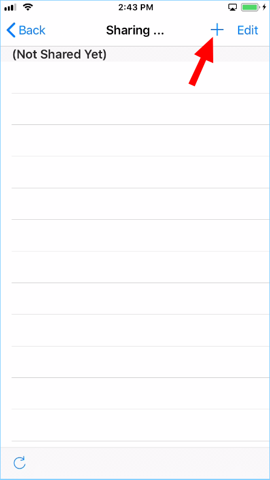

Add users in the **"Specify User"** screen. 

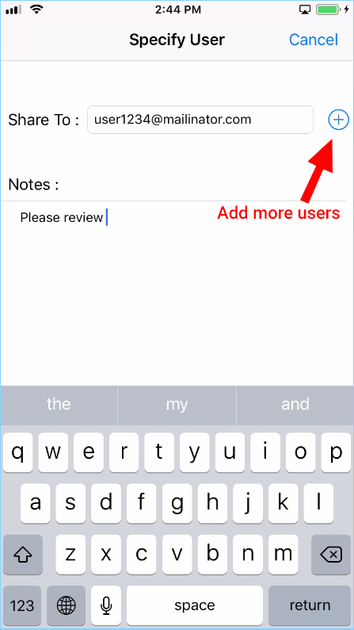

On the **"Create Guest User"** screen, choose how you want to create the user(s). If you turn off **"Create Guest User Account?"** then the user can still receive shared contents over a web browser but can't modify the shared content. You can come back to this screen if you change your mind. Press **"Continue"** on the bottom right of the screen.

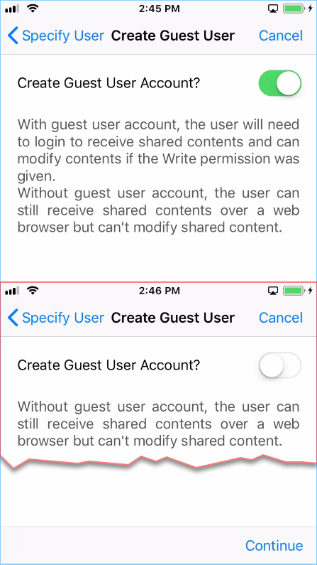

On the next screen you have several options:

1. Specify share expiration time.
2. Choose "Read Only" or "Full Control".
3. Choose "View only (no Download)" if desired.
4. Choose "Password Protection" and enter a password. 
5. Turn off Password Protection and allow user to create their own password from the link in the email they receive.

When the sharing option has been selected press **"Finish"** on the bottom right.

.. image:: _static/image_11_05.png

Modifying a Share 
---------------------

Once the share process is completed, you will see a screen with a list of shares for this file. You can click the greater-than **">"** icon on the right of the share to modify its settings. 

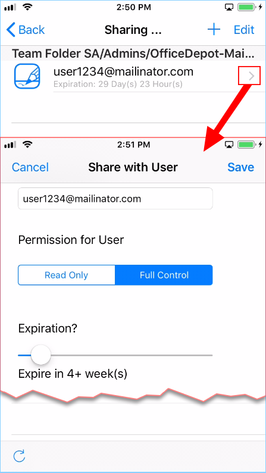

You can also click the **"Edit"** text to delete users from the share. 

.. image:: _static/image_12_02.png
 

Adding Comments
------------------

You can add comments to the shared files. Comments make it easy to track and monitor the shared contents. Press the **Comment Icon** to add comments to your files. 

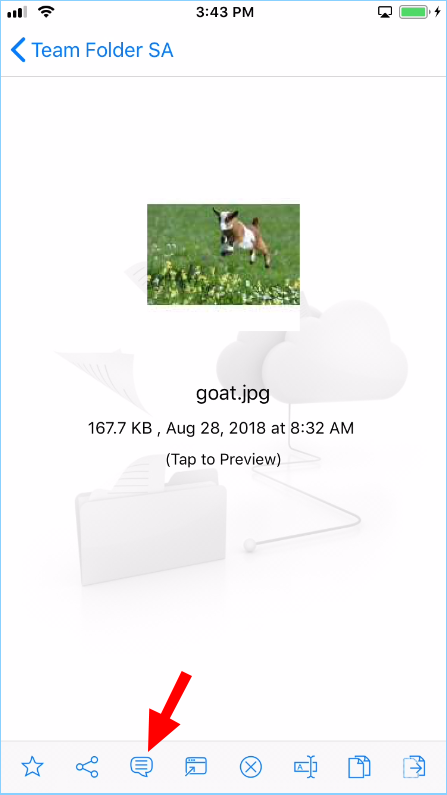

After pressing comment you will be show a field where you can  enter comments. After adding comments pressing **"Send"** will add the comments.

.. image:: _static/image_13_02.png

Editing Files 
============================

Deleting a File
------------------------------

A file can be deleted by clicking the **Delete Icon** at the bottom of the screen. You will be asked to confirm the deletion. Once the file has been deleted it will no longer be visible in the cloud drive.

.. image:: _static/image_14_01.png

Renaming a File
----------------------

You can rename a file by selecting a file you want to rename, then in the file details screen, you click the **Rename Icon** at the bottom of the screen. You will get a pop-up window with a field where you can enter a new name for the file. 
 
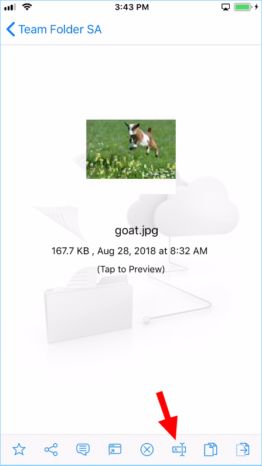

Copying a File
----------------------

You can copy a file by selecting a file you want to copy, then in the file details screen, you click the **Copy Icon** at the bottom of the screen. You can then navigate to the location where you want to place the file copy. 
 
.. image:: _static/image_16_01.png

Moving a File
----------------------

You can move a file by selecting a file you want to move, then in the file details screen, you click the **Move Icon** at the bottom-right of the screen. You can then navigate to the location where you want to place the file. 
 
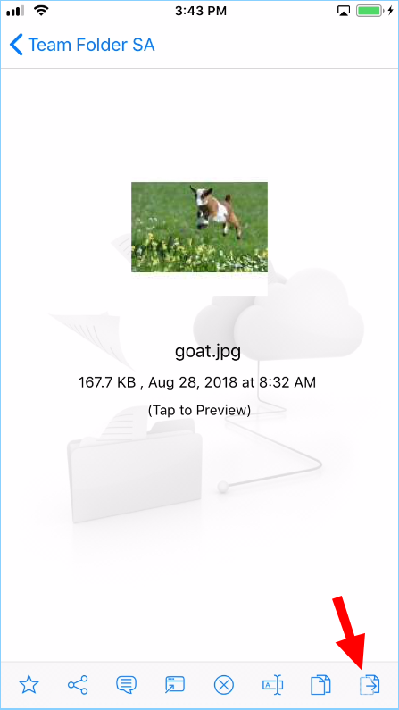

Logging Out From Gladinet Cloud
==================================

You can logout from the Gladinet cloud by clicking the **Logout Icon** at the bottom right of the screen.

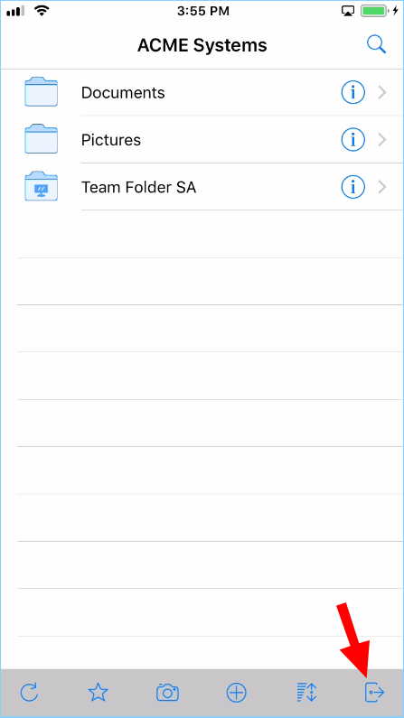

In the next screen you will see important information about the iOS Client and the Server. Click the **"Log Out"** text to complete the logout process. 

.. image:: _static/image_18_02.png

Conclusion
============

Gladinet"s vision is to enable secure access to enterprise data from anywhere using any device including mobile devices like iPhones and iPads. The iOS Gladinet Cloud application is feature rich which allows enterprise users to not only access the data but also sync and collaborate on that data. Users can access, share, edit, and perform other functions on the data when accessing from iOS devices just like they do when they access it from Windows or MAC clients.
