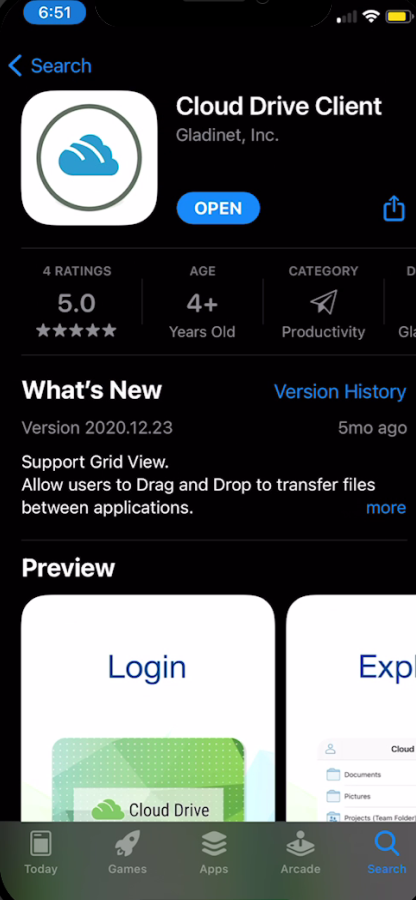
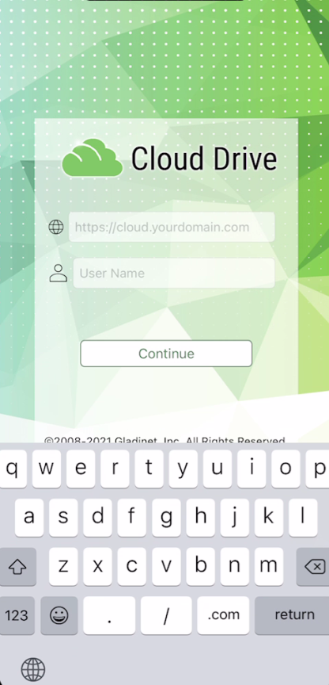
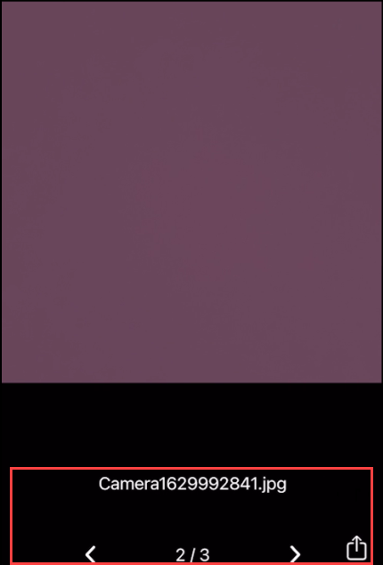
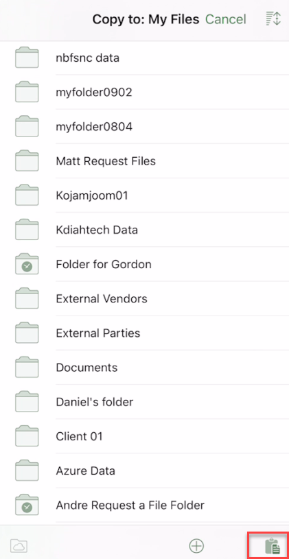

****************************************
CentreStack iOS Client User Guide
****************************************

Getting Started
==================

Welcome to the CentreStack iOS Client User Guide. This guide describes the iOS client application for CentreStack, the managed file synchronization, and sharing solution.

Users can access CentreStack cloud files using any device of their choice as CentreStack has clients for Windows, Mac, iPhone, iPad, Android, Windows 8+, and more. We have created a native IOS application that you can download from the App Store. This provides access to files and folders in your CentreStack account.

The white-labeled CentreStack iOS app called “Cloud Drive” by Gladinet that can be distributed by service providers and enterprises to their users. 

If you have the fully branded CentreStack iOS client, the look and feel of the app may be different but the functionality is the same. You can obtain a fully branded CentreStack IOS Client with your company name and product logo from http://www.centrestack.com (partner portal). 

Download & Install
====================

Search for Gladinet, Inc. as a publisher in ‘App Store’ to start the download and installation.

After the install open the app from its icon. Login using your credentials.

.. image:: _static/NewImage2.png

Enter Access Point (if not filled automatically) and your Username and tap “CONTINUE”. 

On the following screen, enter your Password and tap “SIGN IN”, to log in to your server. 

Access, Upload and Create
==============================

Once logged in users will see the files and folders they have access to like shown in the screen below.

Tap on the folder to see the files and sub-folders inside. 

Sort Menu
-------------

In the sort menu, you can change the order of which your files are displayed.

**Name (A to Z)** is when your files are displayed in the order of the alphabet.

**Name (Z to A)** lets you display your files opposite of the alphabetical order. 

**Size (1 to 9)** lets your files be displayed in the order of which files are the smallest. 

**Size (9 to 1)** displays your files in the order of which the largest files are shown first. 

**Date (Old to New)** displays files that were added first at the top of your file browser. 

**Date (New to Old)** displays your files in the order of which the most recently worked on files are shown first.

Main Operations
--------------------

Camera
#############
The camera icon allows you to insert media from your phone. You can either take a new picture or video or you can insert one from your camera library.

.. image:: _static/NewImage21.png
.. image:: _static/NewImage22.png

Creating New Folders
##########################

To create new folders, click the **plus icon** at the bottom of the screen and it will let you create a name for the folder. Once a name is created the folder is created.

.. image:: _static/NewImage7.png
.. image:: _static/NewImage8.png

Settings
#############
In the settings section you can change a number of options including the theme of the mobile application.

Log Out
#############

To logout, click the icon on the top-left of the app and press the **"Sign Out"** icon at the bottom of the menu.

You can also log out from the navigation pane at the bottom of the screen.

Manage and Edit
======================

You can tap a folder to enter it for browsing, and tap a file to open it in a file previewer.

Multiple operations can be carried out by accessing the menu.

.. image:: _static/NewImage37.png 

Preview
----------

To preview a file, you can simply click on the file you want to see and it will open inside of the Cloud Drive application. For example, you can preview an excel file in Excel or in the Cloud Drive application.

You can also go into a folder and preview a file with multiple images. Once you click into the preview you can scroll through all the pictures in that screen as well as saving the picture to your phone.

.. image:: _static/NewImage26.png

Delete
-----------------

A file can be deleted using the **‘Delete’** option. Select **‘Delete’** from the context menu to delete a file. Once the file has been deleted it will no longer be visible in the cloud drive.

.. image:: _static/NewImage18.png

Rename
-----------------

You can rename a file or a folder using the **‘Rename’** option. Pressing **‘Rename’** will display a field to type in the new name.

Copy and Cut
-----------------

The 'copy' option allows you to copy a file and paste it into a another folder of your choosing. The 'cut' option allows you to remove a file from a certain folder and paste it into another.

.. image:: _static/NewImage31.png

The 'Move' option allows you to move the file you select from one folder to another.

Comments
-----------------

The "Comments' option allows you to see any comments made by people who have access to the file. It also lets you create a comment so others who have access to it can see your comment.

More Info
-----------------

The 'More Info' option allows you to look at the specifics of the file you are working on or looking at.

.. image:: _static/NewImage19.png

Marking As Favorite 
-----------------------

Add to Favorite
##################

You can add a file to favorites by pressing the three vertical ellipses icon to the right of the file. Once you click on that it will drop down a menu where you can then select to favorite this file.

.. image:: _static/NewImage11.png

Remove from Favorite
#######################

To remove files from your **Offline Favorites** Access them from the top-left menu, and choose **Offline Favorites**. Or use the Offline icon (star) at the Bottom Bar.

.. image:: _static/NewImage12.png

In the **Offline Favorites** view you can remove files by clicking the three vertical ellipses icon and selecting **Unfavorite**.

.. image:: _static/newimage13.png

Sharing and Collaborating
=============================

You can select the files or folders that you want to share from your iOS devices.

Share Via
-----------------
You will be allowed to share the file to a third party application such as gmail, or WhatsApp.

.. image:: _static/NewImage27.png 

Share Manager
-----------------
You will be taken to a view and will see a list of any shares associated with this file/folder. You can add new shares there or delete previous shares to revoke access.

To delete a user share, swipe the row to the left. This removes the share and prevents access by that user.

At the bottom can find options to Add new shares, enable/disable and copy Public Link and Request a File. To refresh the list swipe down.

.. image:: _static/NewImage36.png 

Sharing a File
-----------------
You will be taken to the "Specify User" screen. There you can add user emails and next select various options for sharing.

.. image:: _static/NewImage15.png 

Before sending your email share notification, you can control how the guest user(s) can access the file or folder. 

- Specify share expiration time
- Set access type
    - View/Read-Only Access
    - View Only (download will be disabled)
    - Edit / Full Control Access
- Other Options
    - Send email notification when file is downloaded
    - Send email notification when file is uploaded
    - Notify user when file/folder is changed
    

Public Link
----------------
Enable the public link option will display the public URL which can also be sent to the users so they can access the share from the URL or you can copy the share URL in an email. Once the Public Link is enabled, you can click ‘COPY TO CLIPBOARD’ to copy the public link to your clipboard so it can be pasted into a field, email or document.

.. image:: _static/NewImage28.png 

Request a File
----------------------

This option is only available for folders. Once you select request a file at the bottom right, it will take you to a screen where you can share a link with a user to allow him to upload files to the specific folder.

.. image:: _static/NewImage29.png 

Working with Office Applications
==================================

To edit existing files from an office application, open the Office App first, then you can select Open and access Files App. Once you do that, you can select your drive and choose a file from there. It will then open it directly into the app, edit and save.

You can refer to this knowledge based article:
https://support.centrestack.com/hc/en-us/articles/360034712773-Opening-and-Saving-Documents-using-the-iOS-App

Conclusion
===============

Gladinet’s vision is to enable access to enterprise data from anywhere using any device including mobile devices like Android, iPhones, and iPads. The iOS CentreStack application is feature-rich which allows enterprise users to not only access the data but also sync and collaborate on that data. Users can access, share, edit, and perform other functions on the data when accessing from iOS devices just like they do when they access it from Windows or MAC clients.
