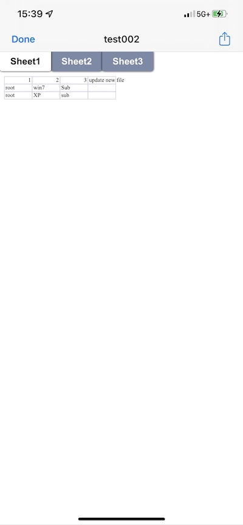
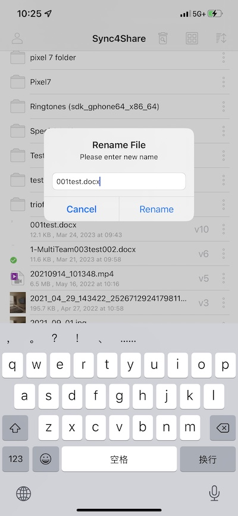

Manage and Edit
======================

Tap a folder to enter it for browsing, and tap a file to open it in a file previewer.

Various operations can be performed from the menus (long press on a file or folder or the 3-dot icon), from the main list of files and folders, and from the preview itself.

Preview
----------

To preview a file, user can simply click on the file to see and it will open inside of the Cloud Drive application.
For example, user can preview an excel file in Excel or in the Cloud Drive application.

User can also go into a folder and preview a file with multiple images.
Once click into the preview, scroll through all the pictures in that screen as well as saving the picture to the phone.

.. image:: _static/NewImage25.png 

Delete
-----------------

A file can be deleted using the **‘Delete’** option. Select **‘Delete’** from the context menu to delete a file. Once the file has been deleted it will no longer be visible in the Cloud Drive.

.. image:: _static/2023NewImage23.png 

Rename
-----------------

User can rename a file by selecting Rename. A pop-up window appears with a field in which can enter a new name for the file.

Copy and Cut
-----------------

User can copy and move a file by selecting the desired file and then tapping **Copy** or **Move** in the menu. Then navigate to the location where the file will be placed.

The 'Move' option allows user to move the file from one folder to another.

Comments
-----------------

The 'Comments' option allows user to see any comments made by people who have access to the file. User can also create a comment so others who have access to it can see the comment.

More Info
-----------------

The 'More Info' option allows user to look at the specifics of the file which is working on or looking at.

Marking As Favorite 
-----------------------

Add to Favorite
##################

User can add a file to favorites by tapping the 3 vertical dots next to the file to open the menu, and then pressing **Favorite** (star icon).

When add files to favorites, they are marked with a "Star" and user can access them offline.

Remove from Favorite
#######################

To remove files from user's **Offline Favorites** Access them from the top-left menu, and choose **Offline Favorites**. Or use the Offline icon (star) at the Bottom Bar.

In the **Offline Favorites** view user can remove files by clicking the three vertical ellipses icon and selecting **Unfavorite**.

