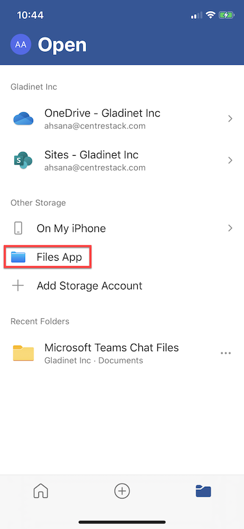
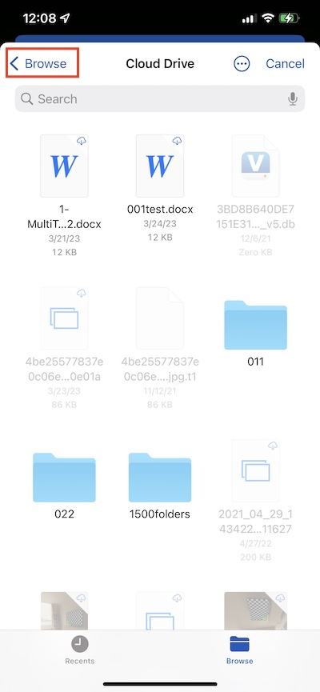
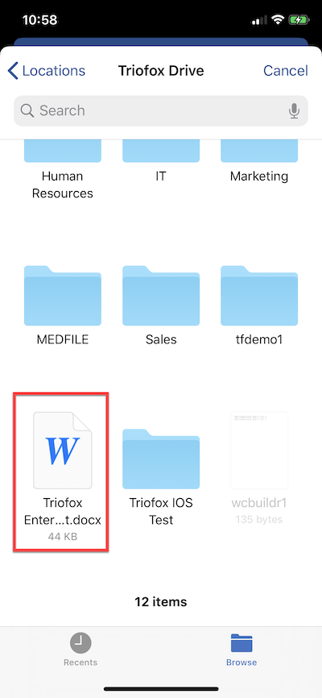
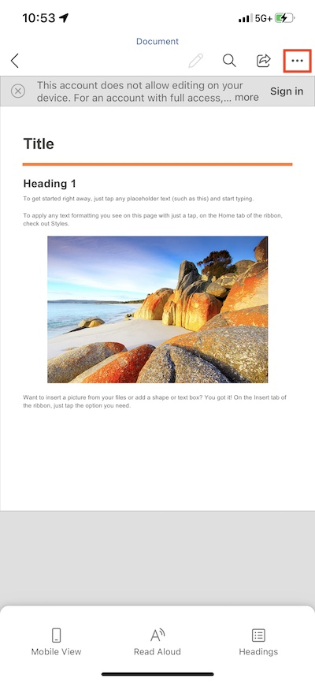
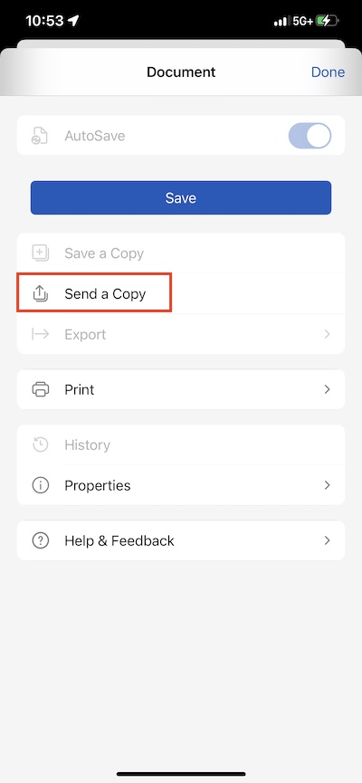
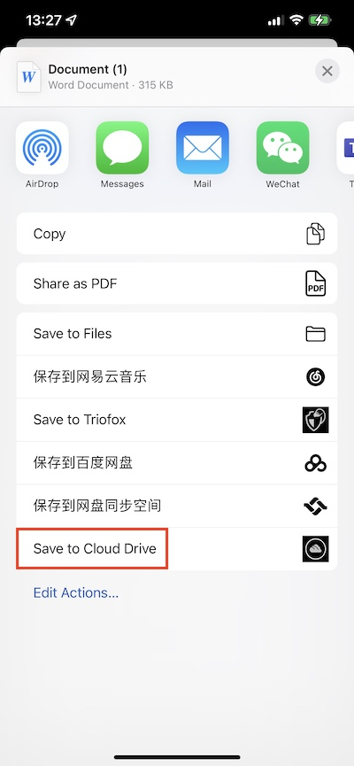
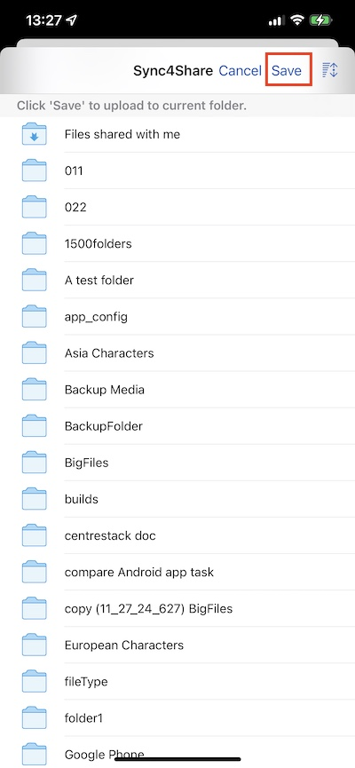

Working with Office Applications
==================================

Open and Save an Existing Document
---------------------------------------

To edit an existing document, first open the editing app, such as Microsoft Word, Office, etc.,
then select Open and go to "Files App", find Cloud Drive in the list and enter the document to edit.

Select "Locations" on the top left to find and select the "Cloud Drive".

Just scroll through the Cloud Drive and select the file to edit.

Once the document has been edited and saved, it will automatically be saved and updated in the Cloud Drive as well.

Save New Documents from Office
------------------------------------

To add new files to Cloud Drive, first create a new file in the editing app. When saving, click on the 3-dot button in the upper right corner.

Select **Send a Copy**.

Select **Save to Cloud Drive**.

Select a folder and save the file to the desired location.

You can refer to this knowledge based article:
https://support.centrestack.com/hc/en-us/articles/360034712773-Opening-and-Saving-Documents-using-the-iOS-App

