Settings
===========

User can access the **Settings** page by clicking the Settings button on the main page or selecting Settings from the side menu.

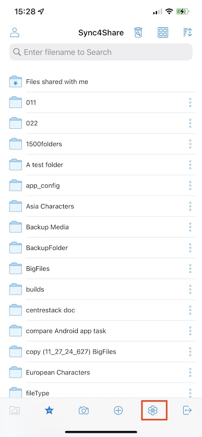

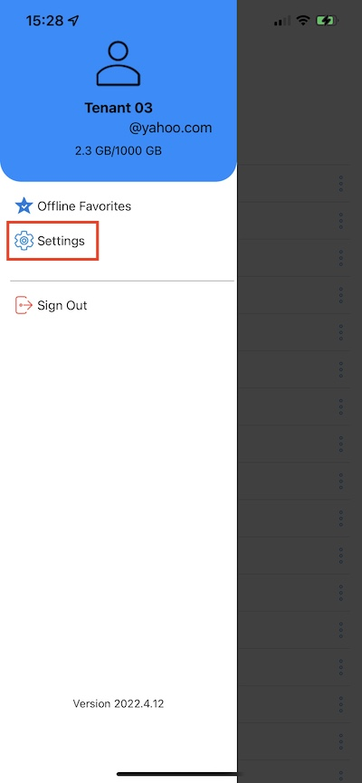

Account
-----------

In the **Account** section there is information about user name, email, server URL and Quata used.

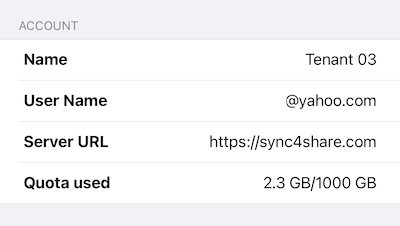

Theme
----------

Here user can select preferred theme color. The default theme color for Cloud Drive app is **Blue**.

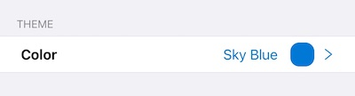

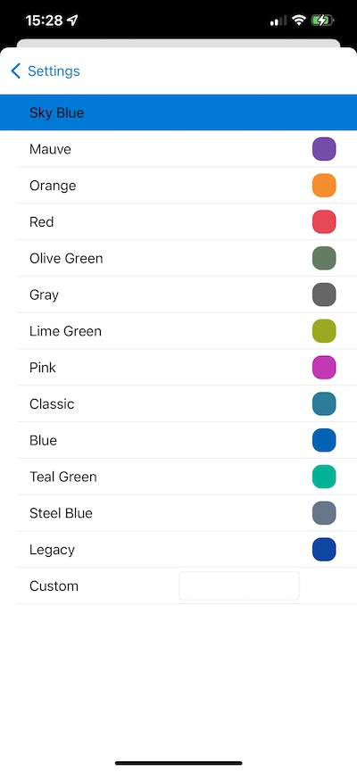

Media Backup
----------------

User can create a media backup folder to synchronize all media files from the phone to Cloud Drive.

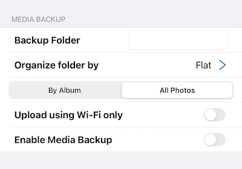

Backup Folder Name
#######################

User can assign a name for the media backup folder here. Then will see this backup folder later in the root files.

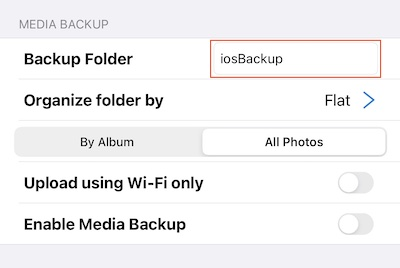

Folder Organize
###################

User can choose the organization for the media backup folder by Flat, Year or YearMonth. And can also choose to backup the media files by Album or All Photos.

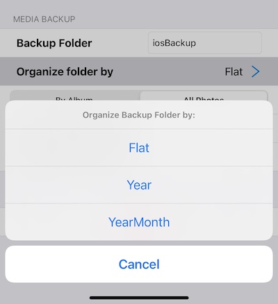

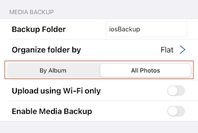

Wi-Fi only
##################

Enable this switch so that the backup can be performed only when there is a Wi-Fi connection.

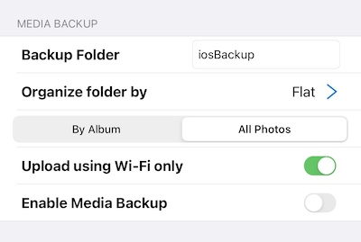

Enable Media Backup
######################

After finishing all the above backup settings, user can enable this switch to enable the media backup.

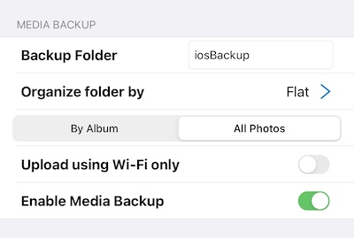

User can go to **My Files** to check the backup folder created in the root directory.
Click on the backup folder and will see that folder with the name of user's device contains backup media files.

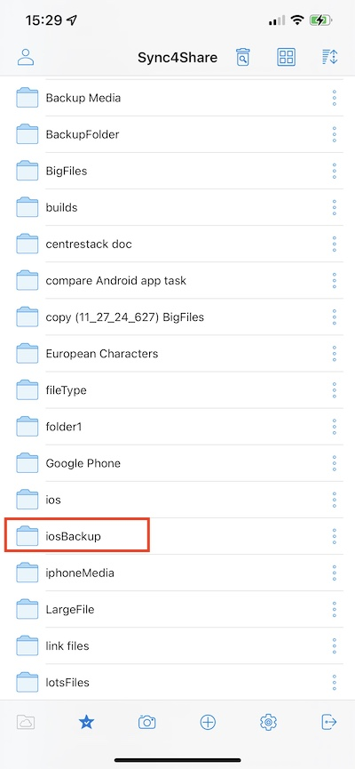

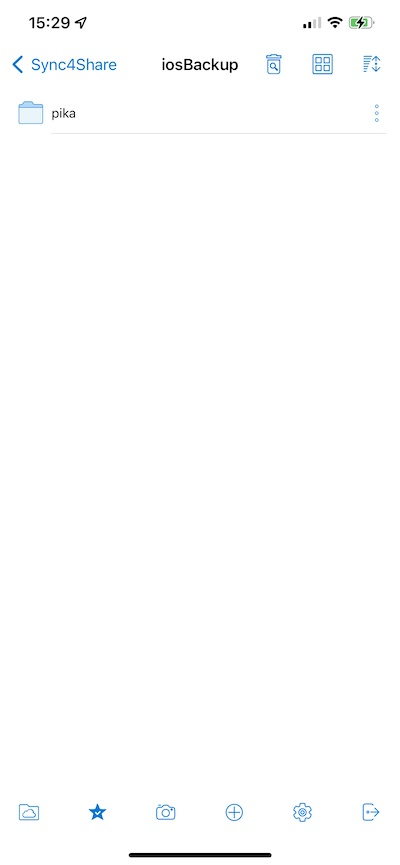

Session
-----------

Click **Sign Out** button to log out this user from the app.

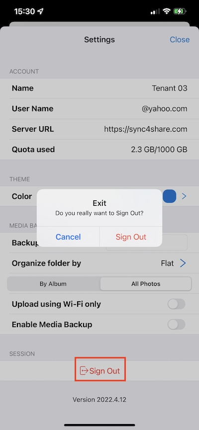

