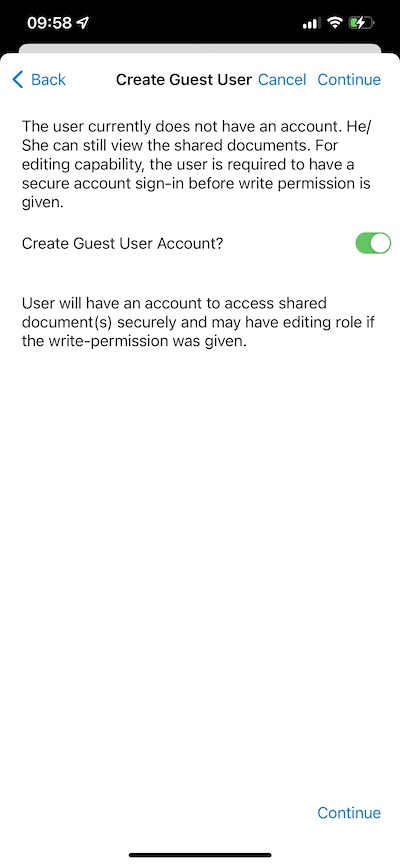

Sharing and Collaborating
=============================

User can select the files or folders that you want to share from your iOS devices.

Share Manager
-----------------

User will be redirected to a view where can see a list of all shares. There they can add new shares or delete existing shares to revoke access.

Using the buttons at the bottom of the screen you can **Add more users** to the share list, **copy public (read-only)** link to the clipboard and **request a file (folders only)**.

To delete a user share, swipe left over the corresponding share to display the Delete action. This removes the share and prevents access by that user.

At the bottom can find options to **Add new shares**, **enable/disable Public Link**, **copy Public Link** and **Request a File**. To refresh the list swipe down.

Sharing a File
##################

User will be redirected to the "Share/Invite User to share" screen. There can add user emails and select different options for sharing.
On the next screen, enter the email address(es) of the users to add. Press "Continue" to add users to share.

On the next screen, select whether to "Create Guest User Account" and continue to access other settings.

Before sending user email share notification, specify how the user(s) can access the file or folder.

- Set the expiration time for the share.
- Select "Read Only" or "Full Control".
- Select "View only (no Download)" if desired.
- Select "Password Protection" and enter a password.
- Disable password protection and allow the user to create their own password using the link in the email they receive.

Once finished the sharing options, press "Share".

Public Link
################

Enable the public link option will display the public URL which can also be sent to the users, so they can access the share from the URL or user can copy the share URL in an email.
Once the Public Link is enabled, click ‘COPY TO CLIPBOARD’ to copy the public link to the clipboard so it can be pasted into a field, email or document.

Request a File
###################

This option is only available for folders. Selecting **Request a File** takes user to a screen where can share a link with a user so that they can upload files to that folder.

Share Via
-----------------

User can share the file using a third-party application such as Gmail or WhatsApp.

Files Shared with Me
-------------------------

If there are some folders and files that have been shared by other users, user will see a folder above root files.

Click this folder to see a list of folders and files shared by other users. User can perform operations based on the sharing permission.

