****************************************
CentreStack IOS Client User Guide
****************************************

Introduction
================

Welcome to the CentreStack IOS Client User Guide. This guide describes the Android client application for CentreStack, the managed file synchronization, and sharing solution.

Users can access CentreStack cloud files using any device of their choice as CentreStack has clients for Windows, Mac, iPhone, iPad, Android, Windows 8+, and more. We have created a native IOS application that you can download from the App Store. This provides access to files and folders in your CentreStack account.

The white-labeled CentreStack IOS app called “Cloud Drive” by Gladinet that can be distributed by service providers and enterprises to their users. 

If you have the fully branded CentreStack IOS client, the look and feel of the app may be different but the functionality is the same. You can obtain a fully branded CentreStack IOS Client with your company name and product logo from http://www.centrestack.com (partner portal). 

Getting Started
------------------

This user guide provides useful information and describes the full functionality of the CentreStack IOS application.

Download & Install
---------------------

Search for Gladinet, Inc. as a publisher in ‘App Store’ to start the download and installation.

.. image:: _static/NewImage1.png

After the install open the app from its icon. Login using your credentials.

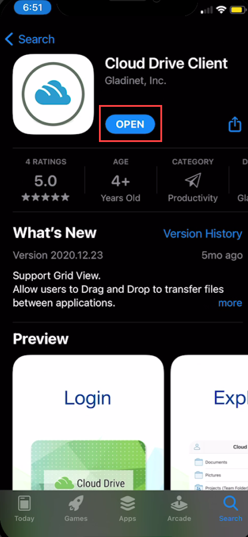

Enter Access Point (if not filled automatically) and your Username and tap “CONTINUE”. 

.. image:: _static/NewImage3.png

On the following screen, enter your Password and tap “SIGN IN”, to log in to your server. 

Accessing Folders and Files
==============================

Once logged in users will see the files and folders they have access to like shown in the screen below.

.. image:: _static/NewImage4.png

Tap on the folder to see the files and sub-folders inside. 

.. image:: _static/NewImage5.png

Sort Menu
----------

In the sort menu, you can change the order of which your files are displayed.

**(1) A-Z** is when your files are displayed in the order of the alphabet.

**(2) Z-A** lets you display your files opposite of the alphabetical order. 

**(3) Size (1-9)** lets your files be displayed in the order of which files are the smallest. 

**(4) Size (9-1)** displays your files in the order of which the largest files are shown first. 

**(5) Oldest** displays files that were added first at the top of your file browser. 

**(6) Largest** displays your files in the order of which the most recently worked on files are shown first.

.. image:: _static/NewImage6.png

Main Operations
======================

Camera
------------------
The camera icon allows you to insert media from your phone. You can either take a new picture or video or you can insert one from your camera library.

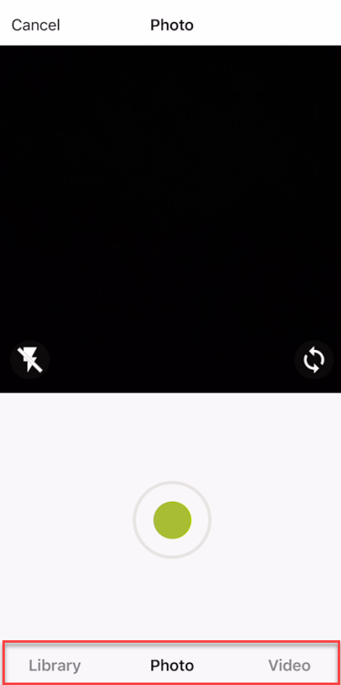

Settings
------------------
In the settings section you can change a number of options including the theme of the mobile application.

.. image:: _static/NewImage23.png
.. image:: _static/NewImage24.png

Creating New Folders
======================

To create new folders, click the **plus icon** at the bottom of the screen and it will let you create a name for the folder. Once a name is created the folder is created.

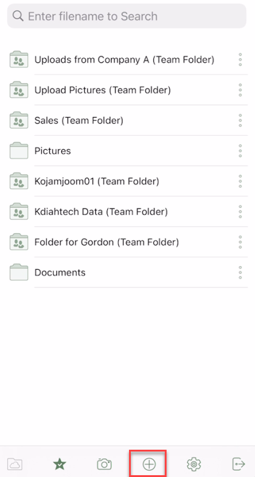
.. image:: _static/NewImage8.png

Preview
----------

To preview a file, you can simply click on the file you want to see and it will open inside of the Cloud Drive application. For example, you can preview an excel file in Excel or in the Cloud Drive application.

.. image:: _static/NewImage9.png

You can also go into a folder and preview a file with multiple images. Once you click into the preview you can scroll through all the pictures in that screen as well as saving the picture to your phone.

.. image:: _static/NewImage25.png
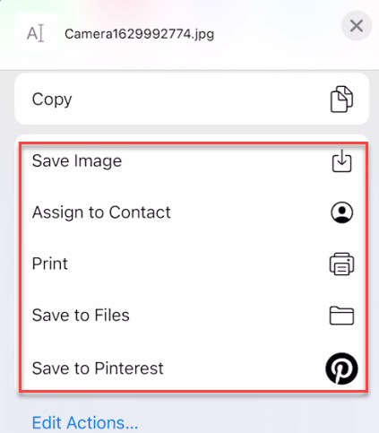

Opening and saving an existing document
===========================================

To save an existing document, tap on the document in the file list to enter "Preview Mode". Then you can click on the icon near the bottom right and save the file to your phone.

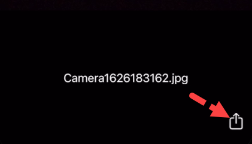

Working with Office Applications
==================================

If you have office mobile applications installed, you can access these apps from CentreStack IOS. For example, if you have Excel for IOS installed when previewing an xlsx file, you will see the Excel icon. Tap the Excel icon to open the file in Excel for editing. 

When you open the Excel file, you'll notice that the autosave feature is enabled by default. Once your edits are completed, you can use the IOS BACK option near the top left to return to CentreStack and your changes will be saved. 

If you need to save an office file into the cloud drive, you can refer to this knowledge based article : https://support.centrestack.com/hc/en-us/articles/360035107053-Save-a-Document-to-Centrestack-from-Another-Android-App (only until step 5) 

Marking As Favorite 
========================

Adding to Favorite
--------------------

You can add a file to favorites by pressing the three vertical ellipses icon to the right of the file. Once you click on that it will drop down a menu where you can then select to favorite this file.

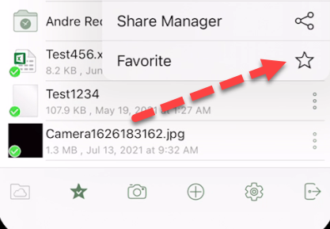

Removing from Favorite
------------------------

To remove files from your **Offline Favorites** Access them from the top-left menu, and choose **Offline Favorites**. 

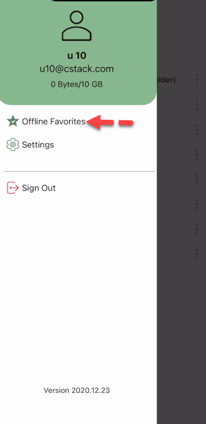

In the **Offline Favorites** view you can remove files by clicking the three vertical ellipses icon and selecting **Unfavorite**.

.. image:: _static/newimage13.png

Sharing Options
================

You can select the files or folders that you want to share from your IOS devices. 

Sharing a File
----------------

From the file view you can click the vertical ellipses near the right and a context menu will appear. In this context menu you can "Share" in several ways: "Share", "Get public link", "Share manager". 

If you press **"Share Manager" (1)**, you will be taken to the "Share/Invite User to share" screen. There you can add user emails and select various options for sharing including getting a public link. 

If you press **"Share Via" (3)**, you will be allowed to share the file to a third party application such as gmail, or WhatsApp.

.. image:: _static/NewImage14.png 
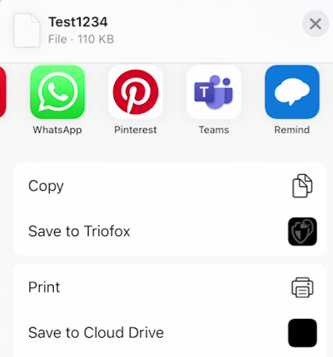

.. important::
        Sharing with an email user creates a **Guest User**. Each licensed user can create 3 guest user accounts. If there are 3 licensed users, then a total of 9 guest users can be added for that tenant. If the number of guest users has reached the limit, and the tenant is set up to auto grow the number of licensed users, then one more license will be added to the tenant. 

If you choose the **"Share Manager" (1)** option (see above), in the next screen, enter the email(s) of any users you want to add. Press the **">"** icon to add users to the share.

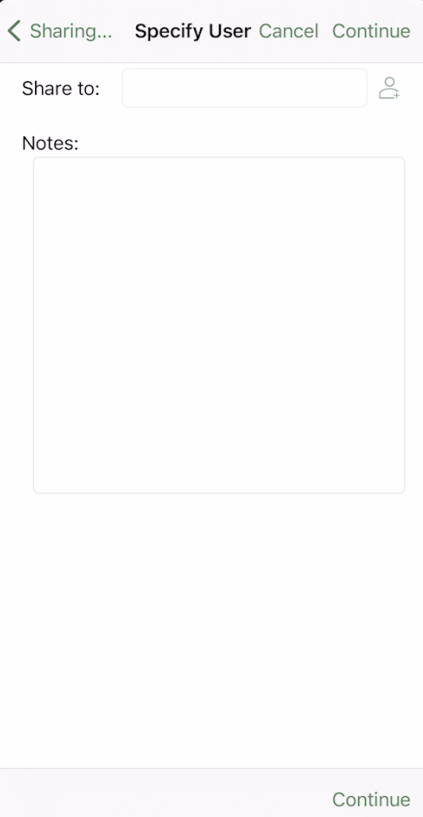

Public Link
----------------
Enable the public link option will display the public URL which can also be sent to the users so they can access the share from the URL or you can copy the share URL in an email. Once the Public Link is enabled, you can click ‘COPY TO CLIPBOARD’ to copy the public link to your clipboard so it can be pasted into a field, email or document.

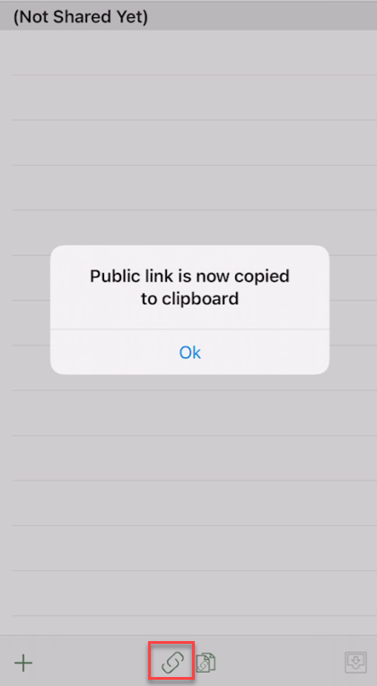

Requesting a File
----------------

You can request a file through the share manager. It is the icon on the bottom right.

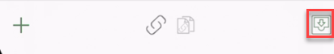
.. image:: _static/NewImage30.png 

Sharing/Protection Options
------------------------------

Before sending your email share notification, you can control how the guest user(s) can access the file or folder. 

- Specify share expiration time
- Set access type
    - View/Read-Only Access
    - View Only (download will be disabled)
    - Edit / Full Control Access
- Other Options
    - Send email notification when file is downloaded
    - Send email notification when file is uploaded
    - Notify user when file/folder is changed
    
.. image:: _static/NewImage16.png

File Operations
=================

Other options are availible from the 3-dot menu when you are previewing a file.

Deleting a File
-----------------

A file can be deleted using the **‘Delete’** option. Select **‘Delete’** from the context menu to delete a file. Once the file has been deleted it will no longer be visible in the cloud drive.

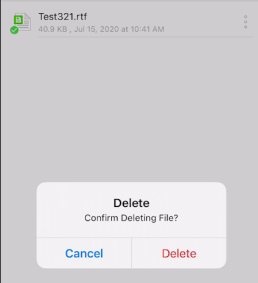

Renaming a File
-----------------

You can rename a file or a folder using the **‘Rename’** option. Pressing **‘Rename’** will display a field to type in the new name.

.. image:: _static/NewImage17.png

More Options 
-----------------

The 'copy' option allows you to copy a file and paste it into a another folder of your choosing. The 'cut' option allows you to remove a file from a certain folder and paste it into another.

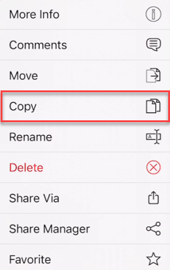
.. image:: _static/NewImage32.png

The 'Move' option allows you to move the file you select from one folder to another.

the "Comments' option allows you to see any comments made by people who have access to the file. It also lets you create a comment so others who have access to it can see your comment.

The 'More Info' option allows you to look at the specifics of the file you are working on or looking at.

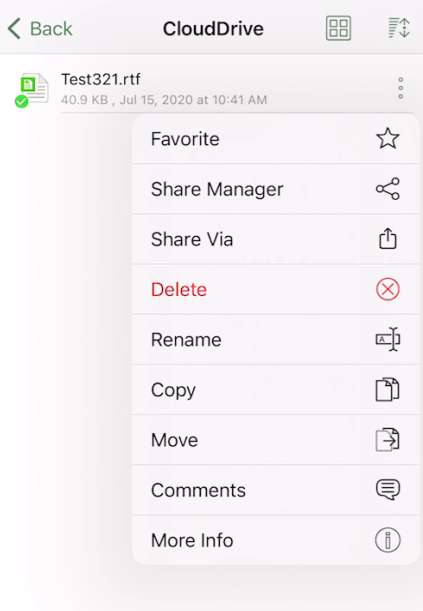

Logging Out From CentreStack
==============================

To logout, click the icon on the top-left of the app and press the **"Sign Out"** icon at the bottom of the menu.

.. image:: _static/NewImage20.png

You can also log out from the navigation pane at the bottom of the screen.

.. image:: _static/NewImage33.png

Conclusion
===============

Gladinet’s vision is to enable access to enterprise data from anywhere using any device including mobile devices like Android, iPhones, and iPads. The IOS CentreStack application is feature-rich which allows enterprise users to not only access the data but also sync and collaborate on that data. Users can access, share, edit, and perform other functions on the data when accessing from IOS devices just like they do when they access it from Windows or MAC clients.
