#########################################
Triofox iOS Application User Guide
#########################################

Introduction
================

Welcome to the Triofox iOS Client User Guide. This guide describes the iOS client application for Triofox, which helps businesses mobilize their file servers.

Users can access Triofox cloud files using any device of their choice as Triofox has clients for Windows, Macs, iPhones, iPads, Android, and more.

Triofox Cloud iPhone application is a native iOS application available in App Store that you can use to access Triofox cloud files and folders. The iOS Triofox Cloud app requires IOS 6.0 or later and is compatible with iPhone, iPad, and iPod touch.

Getting Started
===================

This user guide describes in detail the full functionality of Triofox drive iOS application.

Download & Install

Search for Triofox drive in "App Store" to start the download and installation.

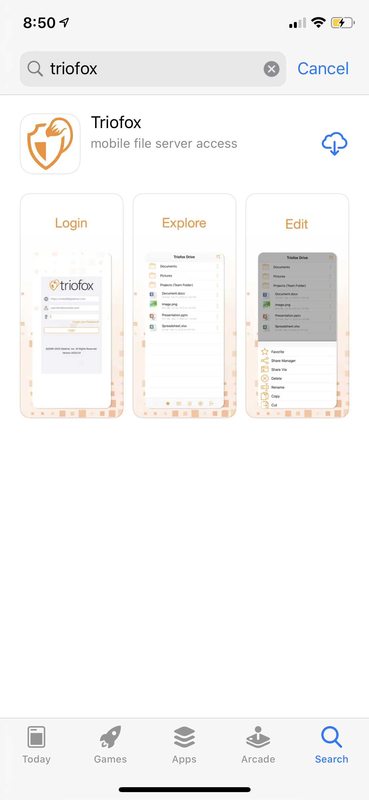

After the install click on **"OPEN"** to access the Triofox login screen.

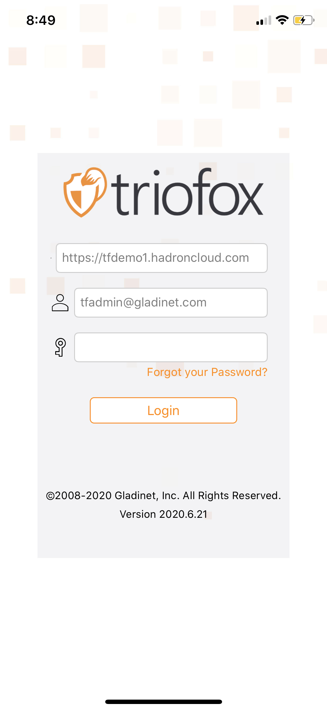

The first time you login, you will need to click the **"Access Point"** text, and enter your access point (e.g., ip address, url). Then enter your login credentials to complete the process.

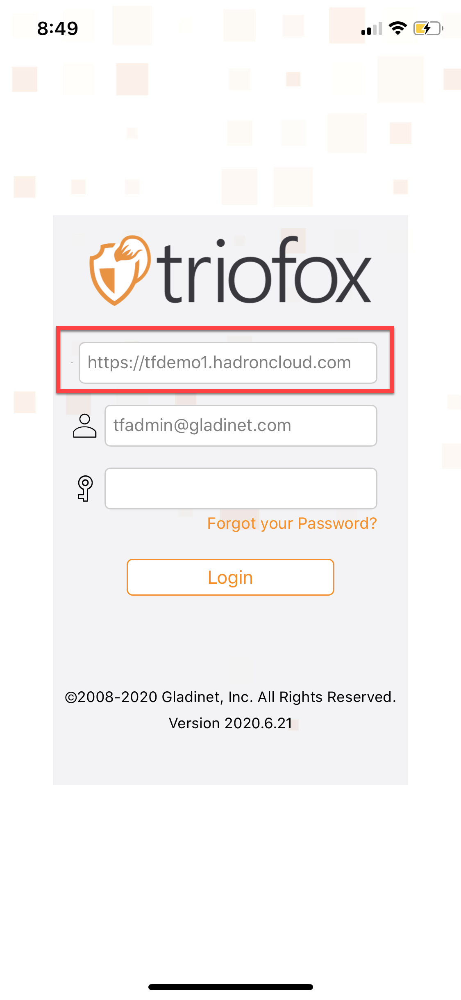

Accessing Folders and Files
==============================

Once logged in users will see the files and folders they have access to like shown in the screen below.

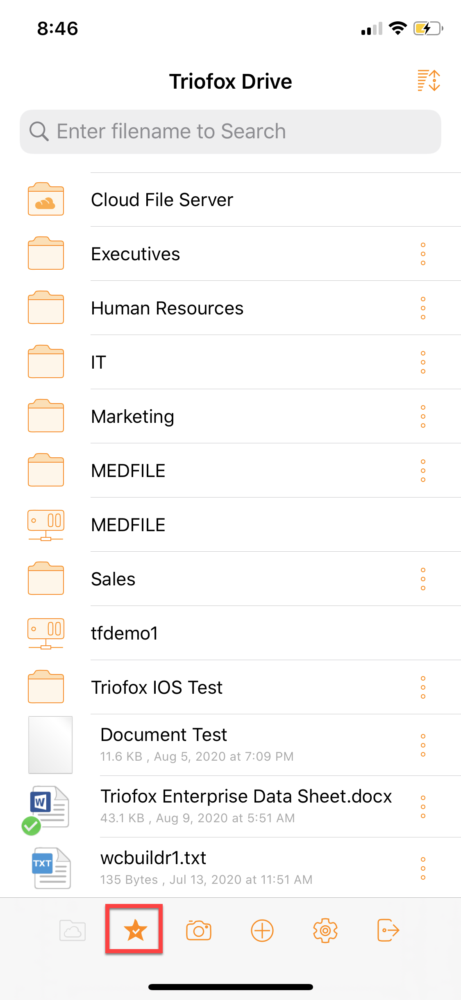

Tap on the folder to see the files and sub-folders inside. Clicking the **"i"** circle icon for a folder will display editing and collaboration options for that folder.

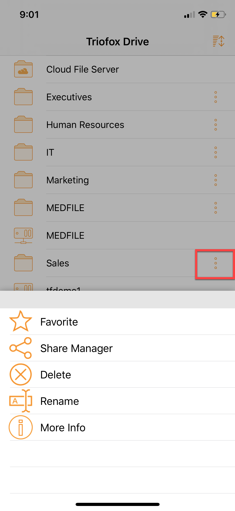

The editing and collaboration options are "Favorite", "Share", "Delete", "Rename", and "More Info".

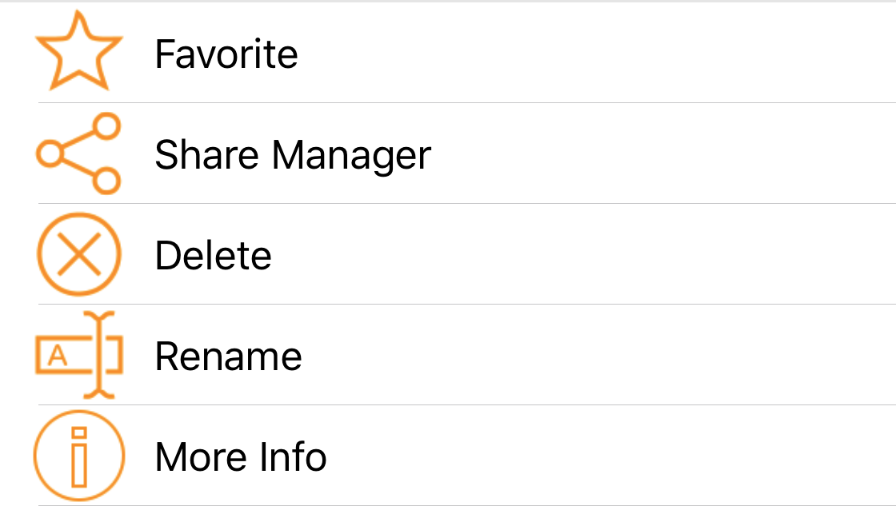

Simply Tapping a file will display that same file and collaboration options can be shown at the top right as the icon shown in the picture below.

_static/TriofoxNew007.png

Creating New Folders
======================

In order to create new folders a user can click the **"+"** (plus) icon displayed on the bottom of the screen.

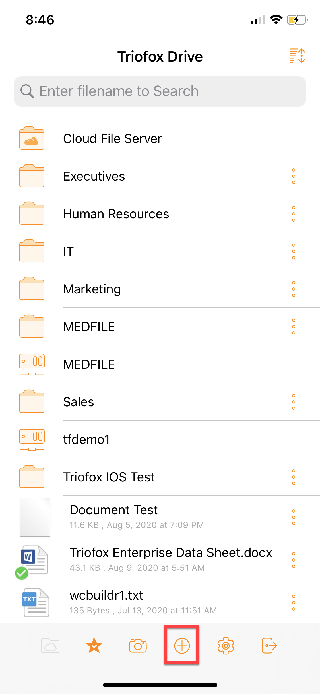

After entering the folder name and clicking the **"OK"** button will create a new folder.

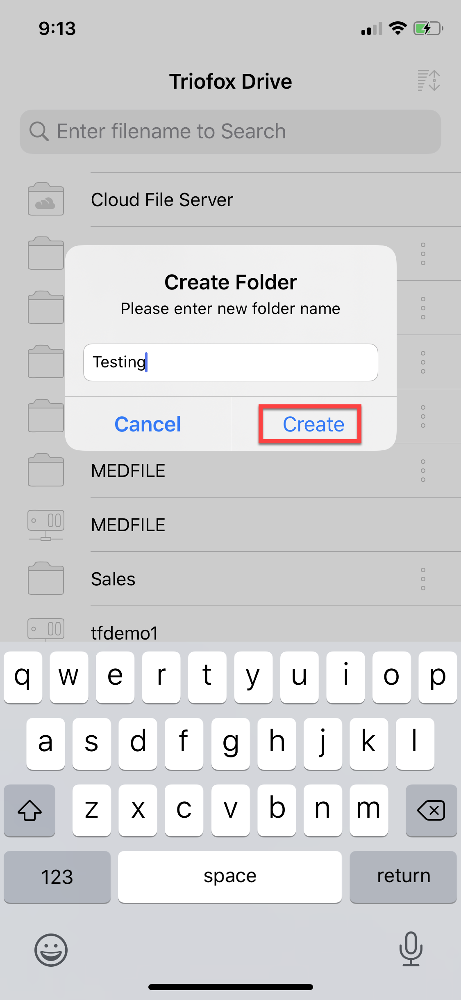

Uploading Photos
====================

Selecting the camera icon will allow users to either upload an existing phone or take a new photo. To take a photo or to choose an existing photo to upload select the camera icon on the bottom of the screen and select **"Take Photo"** or **"Choose Existing"**.

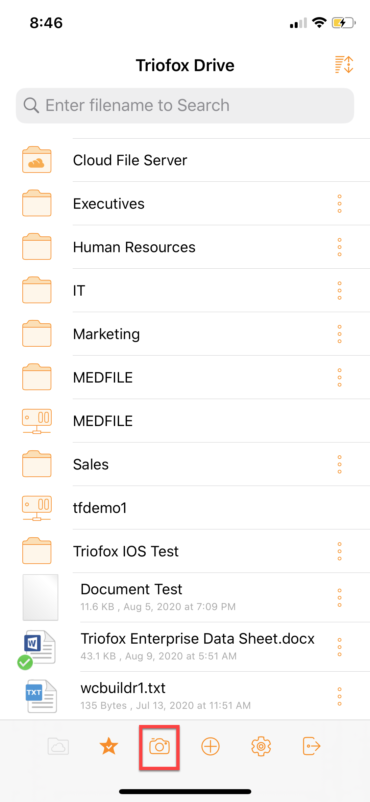

In this example, you can select the pictures you wish to add then click **"Done"** to complete the process.

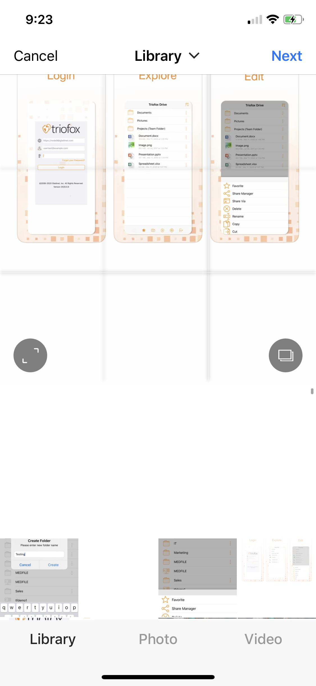

Offline Access
=================

Files that have been added to "Favorites" are available for offline access. You can access the files by clicking the **Favorite Icon** when offline.

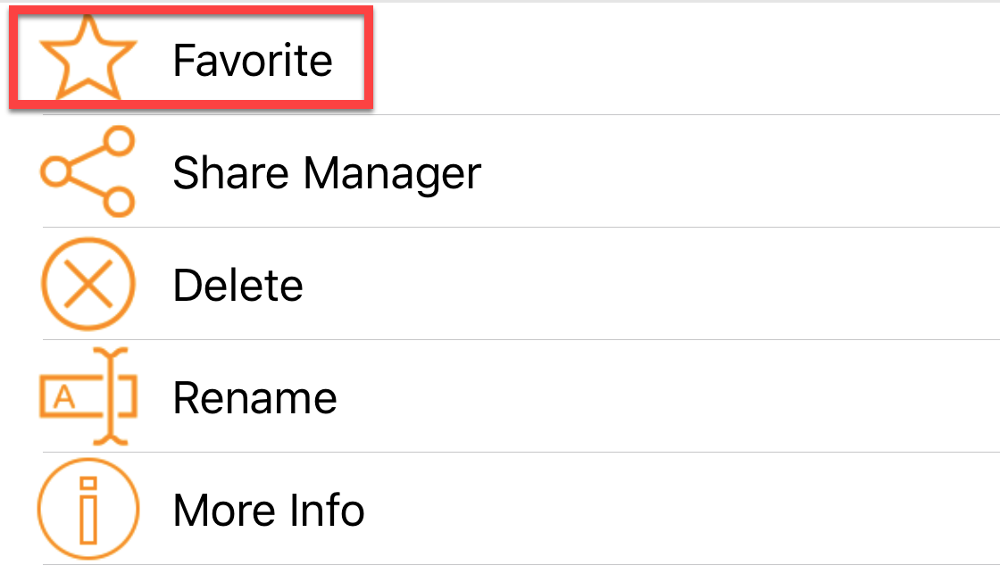

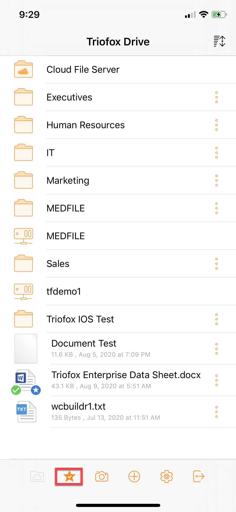

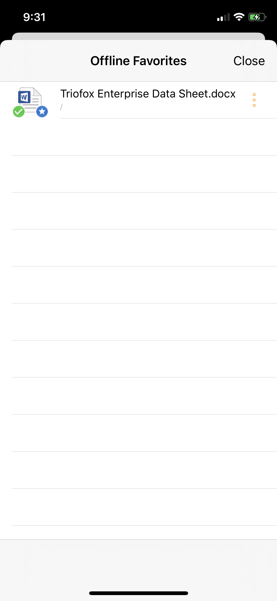

Selecting the **Star (1)** icon at the bottom of the screen (shown below), will open the **"Offline Favorites"** screen shows all the files that are available for offline access. 
If you click the **"Edit" (2)** button, you can remove items from this list by clicking the **3 Vertical Circles (3)** icon on the left of the item you with to remove. 
In this example image you can also see the **green checkmark** (synced for offline) and the **blue star** (favorited) to show you the status of the file. 
When you are finished with "Favorite" edits, click **"Close" (4)** to exit this function.

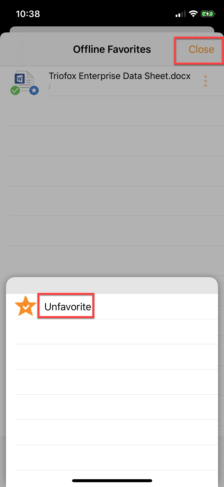

Files App 
==========================================

To edit an existing document through the files app, you can simply open your file in word and select 'Save to Triofox'.

Open an app like Microsoft Word and go to the browse tab at the bottom right. Select Files App

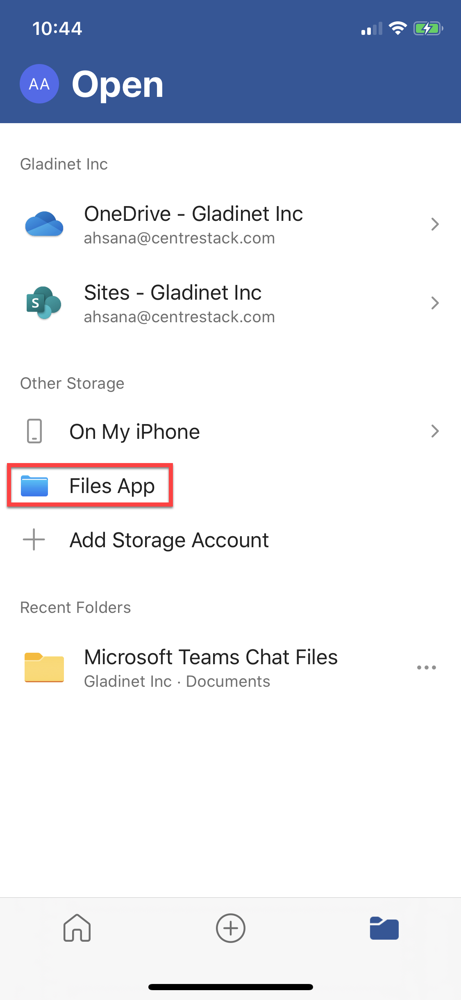

On the top left, select 'Locations' to browse to the 'Triofox Drive' and select it.

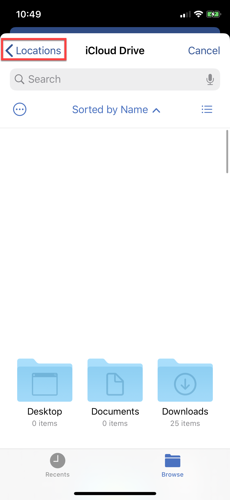

Simply browse through the Triofox Drive and select the File you would like to edit.

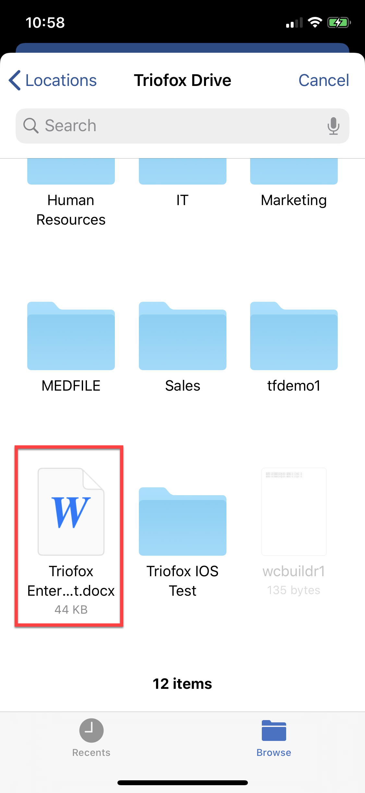

Once the document is edited and saved, it will also be saved and updated into the Triofox App automatically.

Refresh
=========

To refresh any screen, swipe down and it will refresh automatically

Favorites
=============

Adding to Favorite
--------------------

You can add a file to favorites by tapping the 3 'vertical circles' icon next to the file to open the file properties screen and pressing the **Star Icon**.

When you add files to favorite, they will be marked with a "Star" and you can access them offline.

Removing from Favorite
------------------------

On the **"Offline Favorites"** screen, you can click the **"3 Vertical Circles" (1)** and and just select unfavorate

.. image:: _static/.. image:: _static/TriofoxNew020.png

Sharing
============

Sharing a File
-----------------

First tap a file you want to share. Then in the file properties view, select the **Share Icon** on the bottom of the display.

.. image:: _static/.. image:: _static/TriofoxNew022.png

In the Sharing screen, tap the **"+"** icon to add emails for users you want to include in this share.

.. image:: _static/.. image:: _static/TriofoxNew023.png

Add users in the **"Share to"** screen.

.. image:: _static/.. image:: _static/TriofoxNew024.png

On the next screen you have several options:

1. Specify share expiration time.
2. Choose "Read Only" or "Full Control".
3. Choose "View only (no Download)" if desired.
4. Choose "Password Protection" and enter a password.
5. Turn off Password Protection and allow user to create their own password from the link in the email they receive.

When the sharing option has been selected press **"Share"** on the bottom right.

.. image:: _static/.. image:: _static/TriofoxNew025.png

Modifying a Share
---------------------

Once the share process is completed, you will see a screen with a list of shares for this file. 

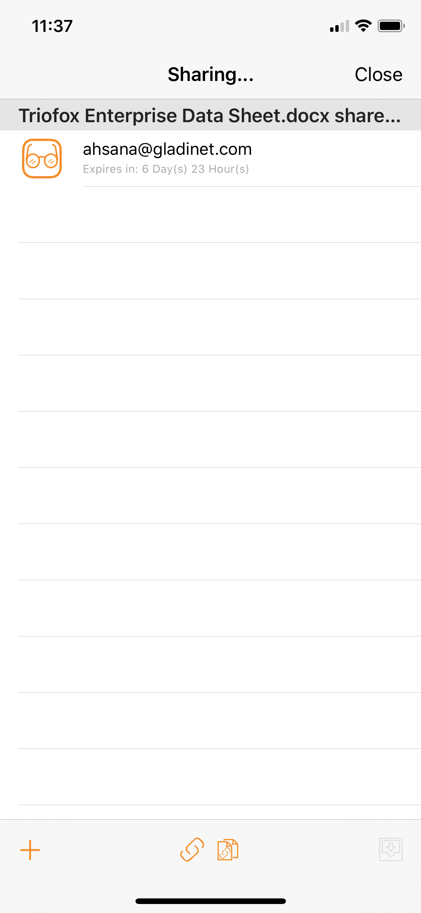

You can also swipe right to delete this user from the shared list.

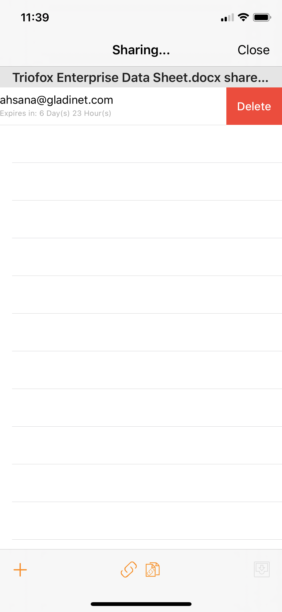

Deleting a File
------------------------------

A file can be deleted by clicking the **Delete Icon** at the bottom of the screen. You will be asked to confirm the deletion. Once the file has been deleted it will no longer be 
visible in the cloud drive.

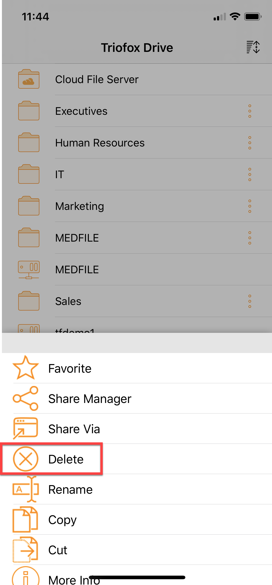

Renaming a File
----------------------

You can rename a file by selecting a file you want to rename, then in the file details screen, you can click the **Rename Icon** at the bottom of the screen. 
You will get a pop-up window with a field where you can enter a new name for the file.

.. image:: _static/TriofoxNew029.png

Copying a File
----------------------

You can copy a file by selecting a file you want to copy, then in the file details screen, you click the **Copy Icon** at the bottom of the screen. You can then navigate to 
the location where you want to place the file copy.

.. image:: _static/Triofoxnew030.png

Moving a File
----------------------

You can move a file by selecting a file you want to move, then in the file details screen, you click the **Cut** at the bottom-right of the screen. You can then navigate 
to the location where you want to place the file.

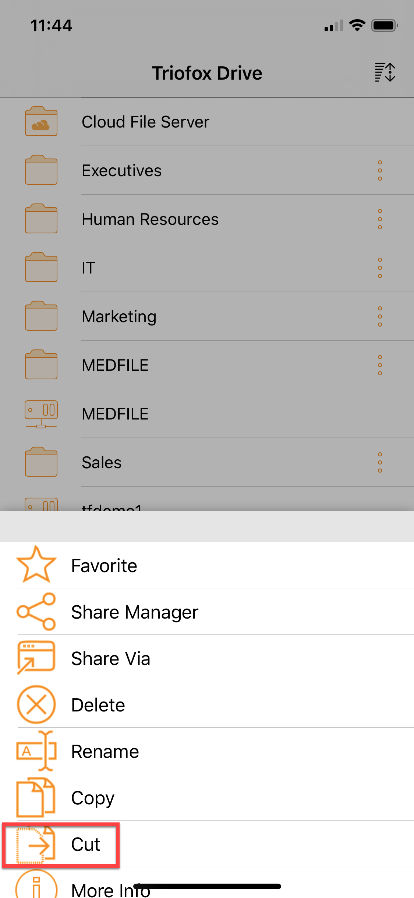

Logging Out From Triofox Drive
==================================

You can logout from the Triofox Drive by clicking the **Logout Icon** at the bottom right of the screen.

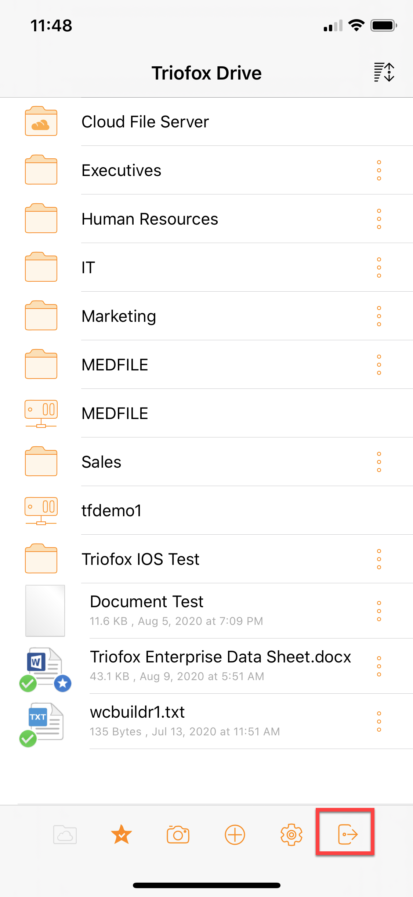

In the next screen you will see important information about the iOS Client and the Server. Click the **"Sign Out"** text to complete the logout process.

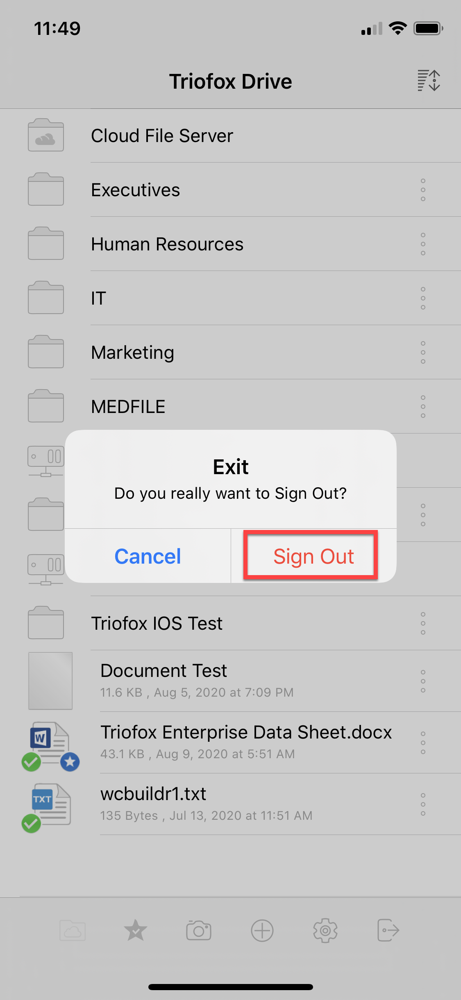

Conclusion
============

Gladinet"s vision is to enable secure access to enterprise data from anywhere using any device including mobile devices like iPhones and iPads. The iOS Triofox application is feature rich which allows enterprise users to not only access the data but 
also sync and collaborate on that data. Users can access, share, edit, and perform other functions on the data when accessing from iOS devices just like they do when they access 
it from Windows or MAC clients.
