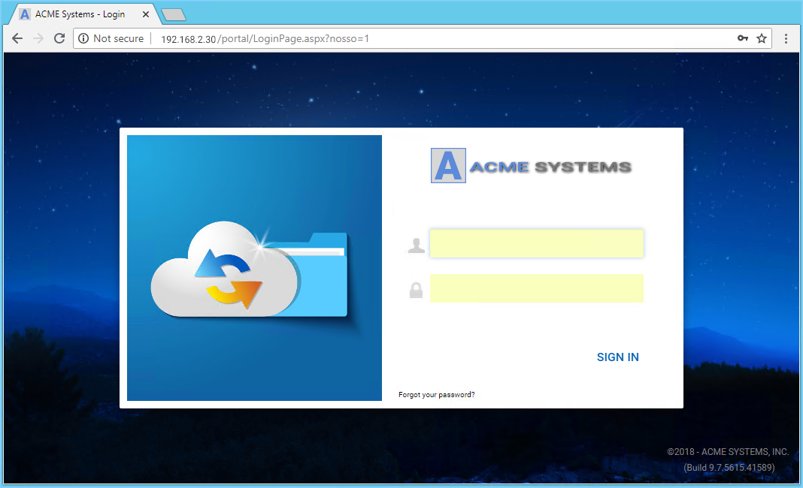
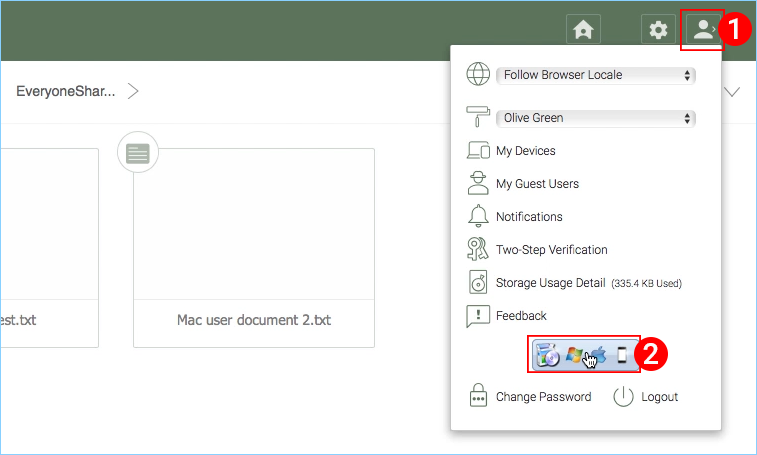
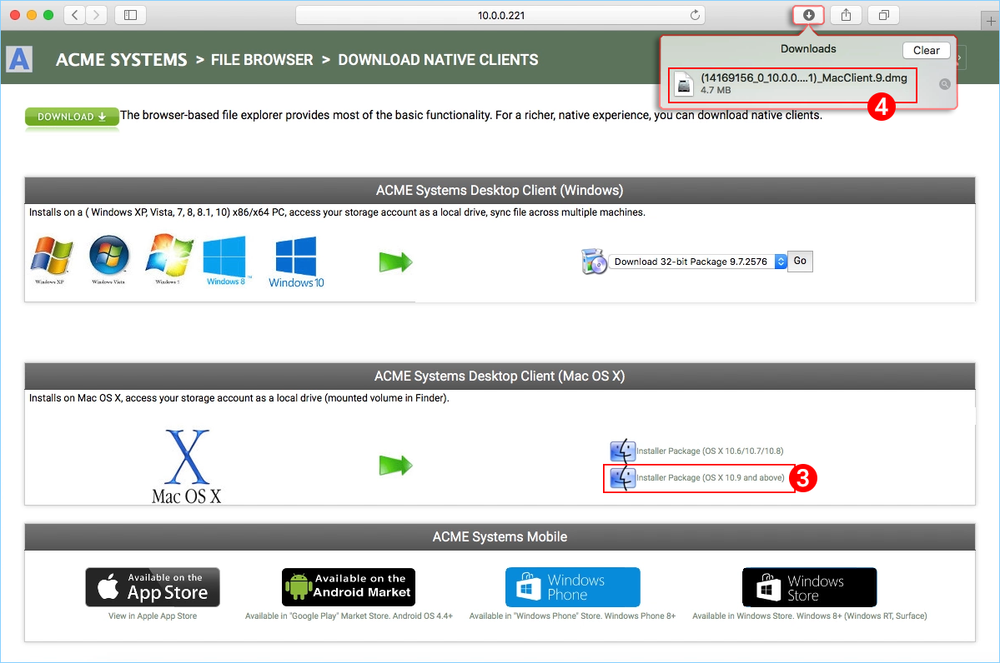
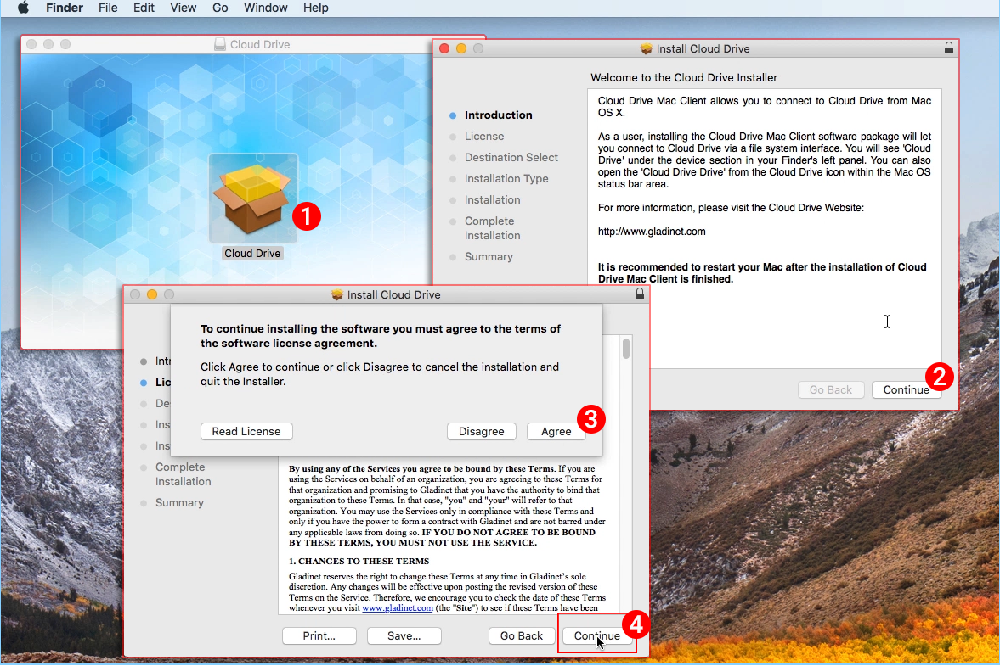
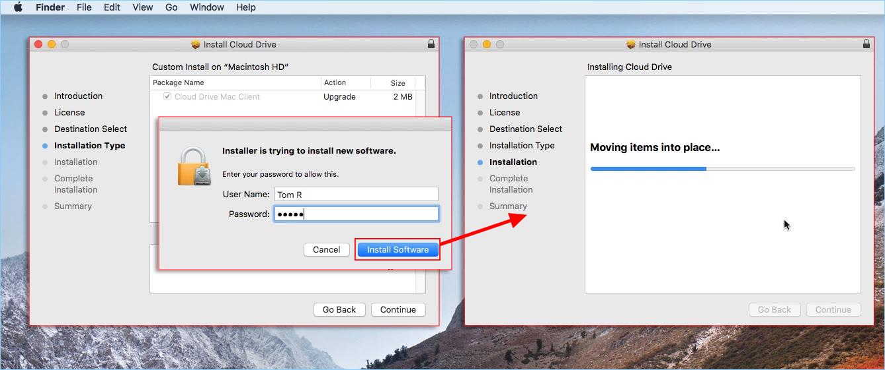
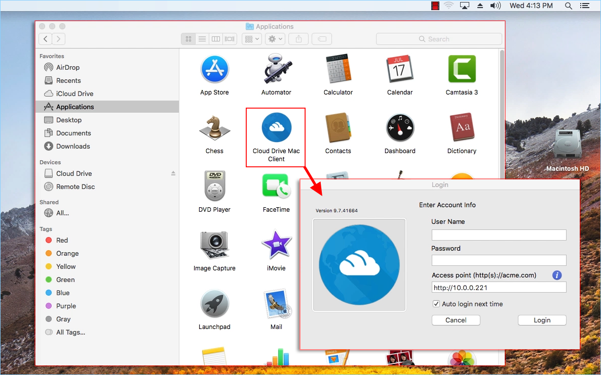

****************
2 Installation
****************

Login to your |prodname| web portal .

Click the **User Icon (1)** then select the **Download Client (2)** button. 

You will then see the **"Download Native Clients"** page. Choose the **Installer Package (3)** for your system. Click the Downloads link on the top-right of the window and double-click on the **Mac Client .dmg file (4)** to start the Cloud Drive Installer. 

Double click on the **"Cloud Drive" volume (1)**. Click **"Continue" (2)**, then **"Agree" (3)** to the License Agreement to continue. 

Select **"Continue" (4)**.

Enter username and password for the MAC machine and select **"Install Software"**.

Select 'Continue'.

Once the software is installed, on the MAC machine go to ``Finder`` > ``Applications`` and double click on the **"Cloud Drive Mac Client"** icon.

Login to the Cloud Drive using your |prodname| "User Name" and "Password". Ensure that the Access point is set to the proper domain or IP address. and click **"Login"**. These credentials will authorize your Cloud Drive Client and connect it to your |prodname| user account. 

Once you have logged in, you can see the Cloud drive as a mounted Volume in the Finder.

.. image:: _static/image_s2_4_4.png

The cloud drive icon  will appear on the MAC machine's  main screen. You can also double click on the icon to access the cloud drive.

.. image:: _static/image_s2_4_5.png

Primary Use Cases
===================

1. Collaborative access to the Cloud Drive

The Drive based random access is one of the primary way of accessing files and folders in the cloud drive.

2. Syncing local folders to the Cloud Drive for remote access

Another primary use case is users want to continue to work in a local folder, and then attach that folder to the |prodname| account so the content of the folder (or folders) will be synchronized in a 2-way fashion between the local Mac folder and the remote |prodname| folder.

After the installation is completed, a system tray icon will appear that allows you to open your |prodname| Drive.

you can access the managemnt console for |prodname| Drive and you can also perform a quick check of your system status.
