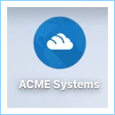
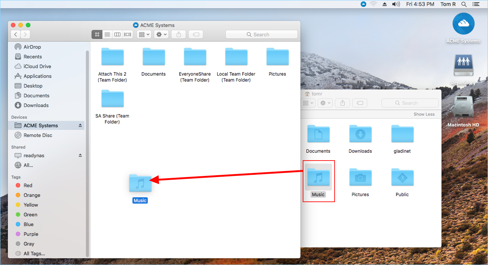
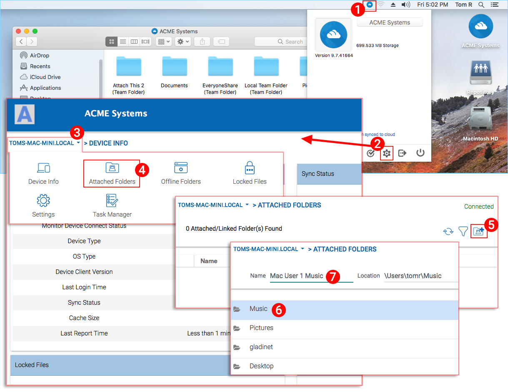
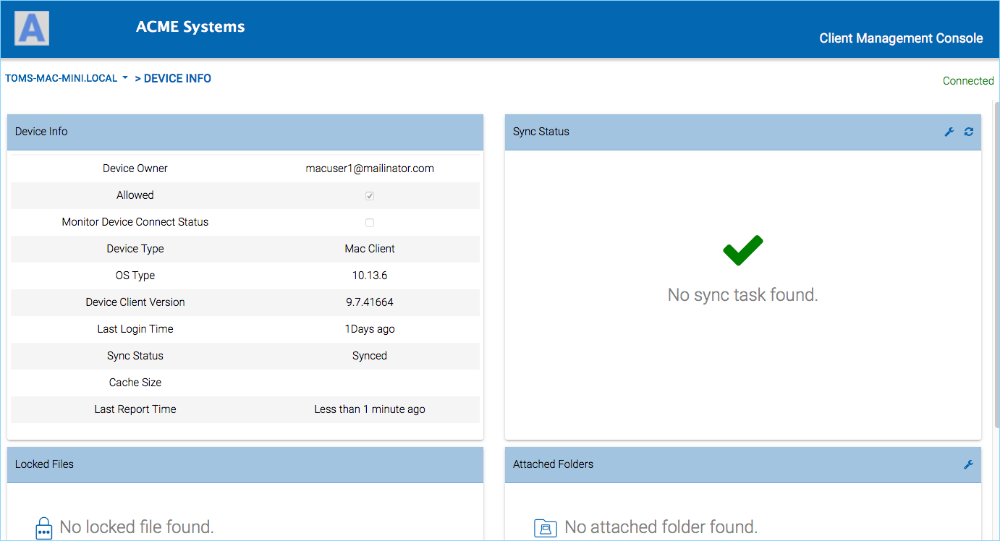
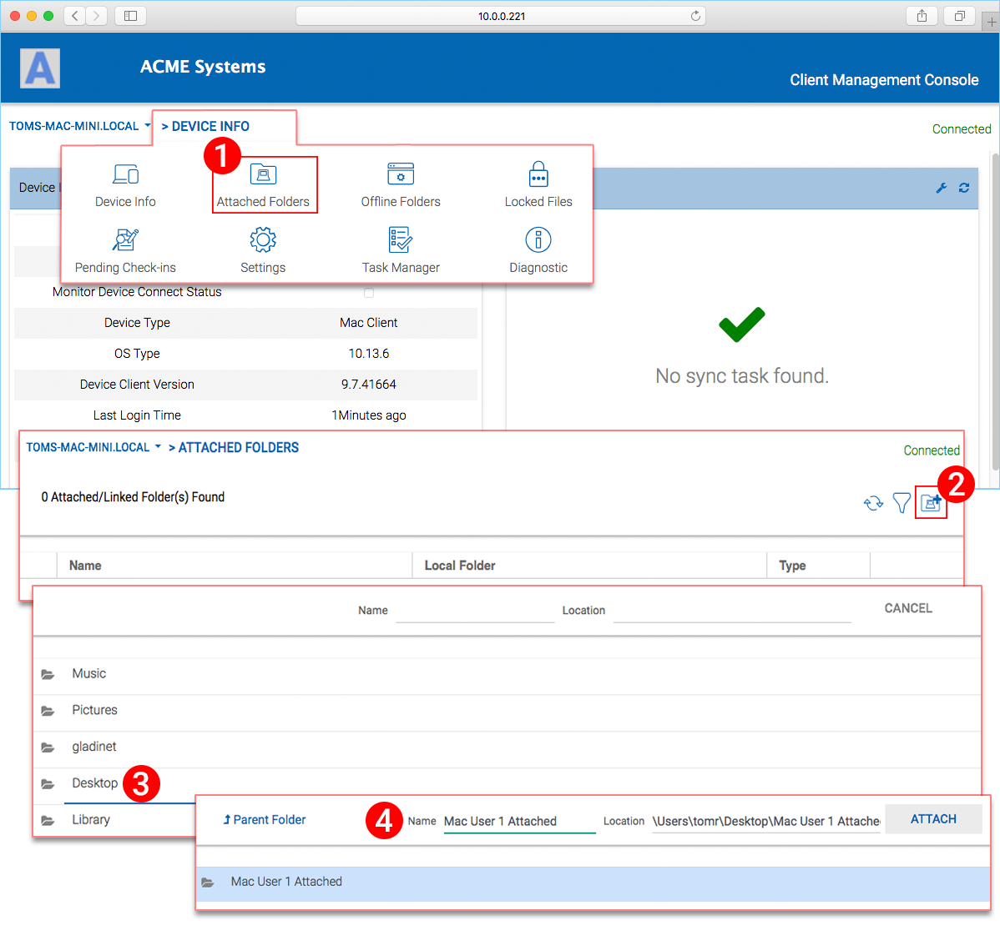
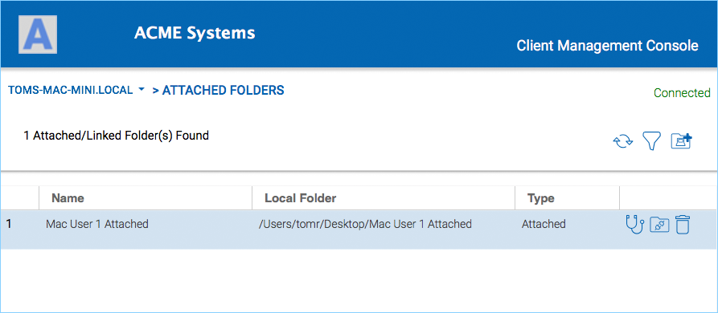
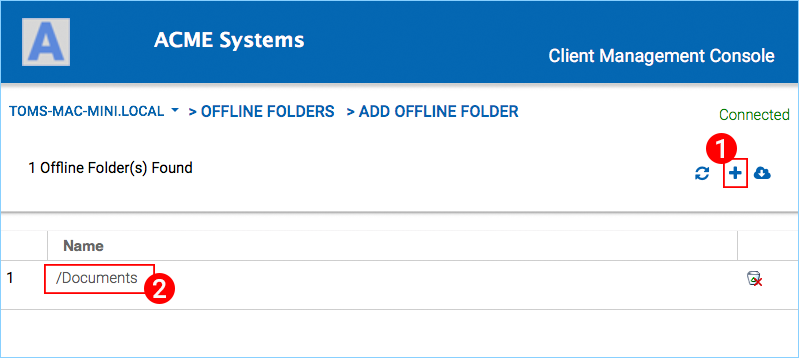
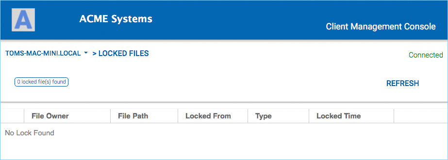
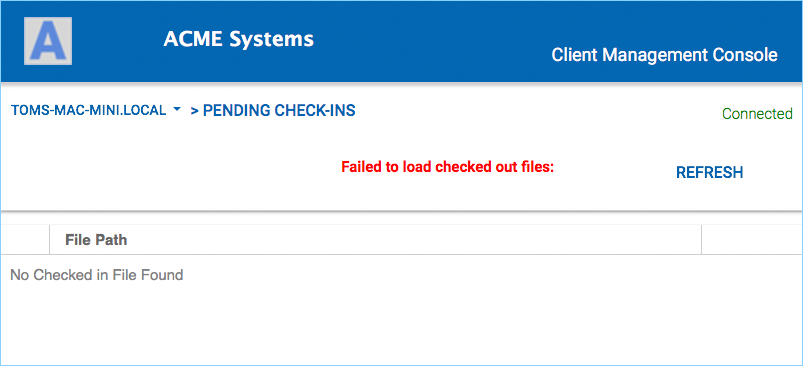

***************************
3 Connecting To The Cloud
***************************

You can access the cloud drive  from the main screen of your Mac by clicking on the Cloud Drive icon.

.. image:: _static/image_s3_1_2.png

You can access the cloud drive menu from the top panel by clicking on the |prodname| Cloud Drive icon.

.. image:: _static/image_s3_1_3.png

Transferring Files
====================

Now you can use the Cloud Storage as if it were a real drive on the Mac system. Simply drag-and-drop to copy local documents to the Cloud Storage.

|prodname| Cloud Drive makes it very easy to move data into cloud storage or extract data from cloud storage.

Attaching Local Folders
=========================

The virtual drive provides on-demand access to files and folders from the |prodname| Cloud storage account.

Sometimes it is also desirable to work inside a local folder, and have the local folder synchronize with the |prodname| Cloud storage account.

To attach a folder click the Cloud Drive icon **(1)** then click the Console Settings gear icon **(2)**. A browser window will open showing the Device Info for your Mac. The menu button **(3)** gives you access to the Attached Folders button **(4)**. When you click that, you can add a folder from your hard drive by clicking the Add Folder button **(5)**, then explore to the folder you want to attach **(6)** and set the "Name" **(7)** you want to use for that folder when accessing it from the Web Portal. 

Settings Web Page
===================

You can get access to the settings web page from the settings button.

.. image:: _static/image_s3_4_1.png

After it is clicked, a web page will lauch into your default web browser.

Device Information
--------------------

The first section in the settings page is the "Device Info" section.

In the device info section, you can see the device name, logged in user, Device Type, OS Type and other information.

Attached Folders
------------------

Attach Folder means attach a local folder to cloud (|prodname| account). The end result is to setup a bi-directional synchronization between the local folder and the cloud so the changes from within the local folder will synchronize to cloud and changes from cloud in that specific folder will sync back to local folder.

To set this up from the Console, you click the pulldown menu and choose **"Attached Folders" (1)**. In the new view you click the **Add (2)** button and then explore by double-clicking (drill down) to the folder you wish to attach **(3)**. Once you have selected the folder, enter the **"Name" (4)** you want to use for that folder and click **"ATTACH"** to complete the process. In this example, the folder is on the Desktop of the Mac computer. 

Once it is attached, you can see it in a list.

You can also verify that the local folder is attached by logging into the web portal where you will see it listed in your ``FILE BROWSER`` view.

.. image:: _static/image_s3_5_3.png

As shown in the example here, the local folder named "Mac User 1 Attached" is now synchronized with cloud.

Offline Folders
-----------------

You can mark certain folders as offline. The folders that are marked as offline will pre-fetch the content of the folder and cache it locally. To accomplish this you first click the **"+" plus (1)** icon. Then choose a folder that you would like to have access to while offline. Once a folder has been marked as offline, it will show in this list **(2)**. 

Locked Files
--------------

If any of the files are currently in **"Locked"** status, you will see it in this view. 

Pending Check-Ins
-------------------

If any of the files are currently **Checked Out** you will see them listed in this view.

