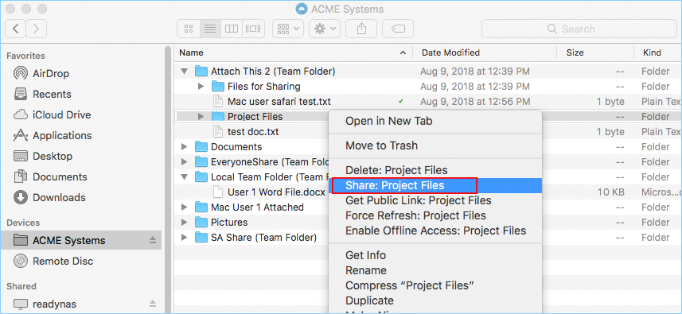
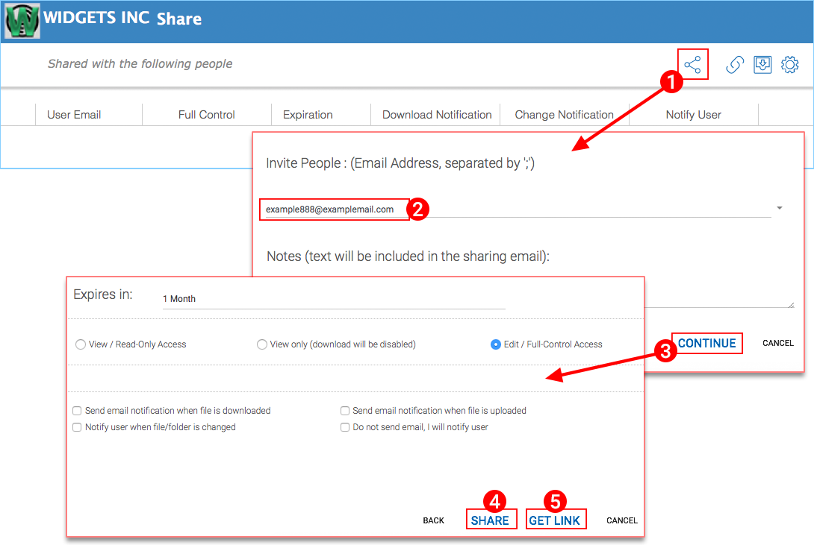
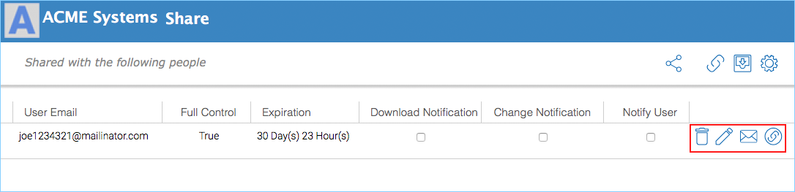
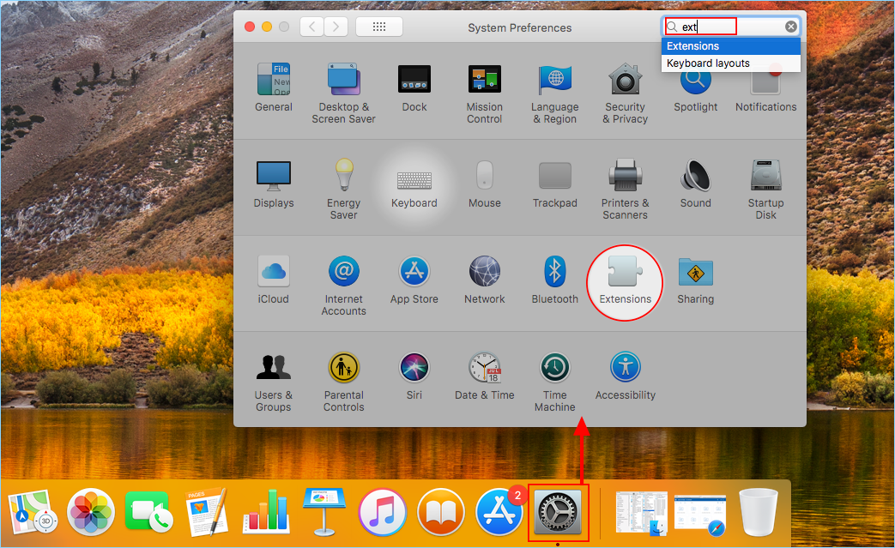
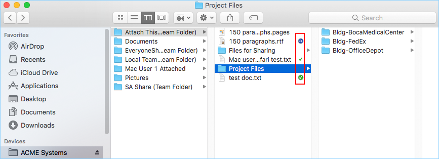
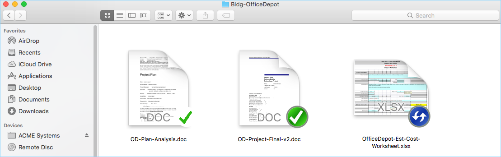

****************************
4 Folder and File Features
****************************

When you Right click on a folder or a file you can access the context menu, which allows you to Share, Get share link, enable offline Access, Open in web browser, and Force Refresh.

Folder and File Sharing
=========================

To share a file or folder, simply right click on it and select **"Share"** from the menu item:

A wizard will be launched to allow you to "Invite People". To set this up, click the **Share Icon (1)**. In the new window enter the email(s) **(2)** of anyone you wish to share this with seperated by semicolons (;). Click **"CONTINUE" (3)**.

In the next window you can choose how you want to share: expiration time, access rights (read only, view only, full control). After making your option selections, choose **"SHARE" (4)** or **"GET LINK" (5)**. "SHARE" sends emails to your guest users and "GET LINK" opens a window with the URL you can use to create a custom email or use some other method to communicate with your guest users. 

Edit Share
============
If a file or a folder is already shared, you can right click on the shared file or folder and select 'Share' to access the edit share menu. Here you can delete the share, edit the share, resend the notification email, show share link and enable and disable public link.

Troubleshooting
=================

To verify that the Cloud Drive Mac Client "Finder" extension is active, you can check the setting by clicking the System Preferences button and choosing **"Extensions"** from the preferences options.

This will open the Extensions window. You will find the setting under the "All" category.

.. image:: _static/image_s4_3_2.png

Icon Overlays
===============

There are three icon overlays on files to represent different states.

**Thin Green Check Mark**

This icon overlay means files are in the cloud but the file content is not local.

**Solid Circle Green Check Mark**

This icon overlay means files are in the cloud and are also available from local.

**Blue Uploading Icon**

This icon shows the file is being uploaded and not completely done yet.

