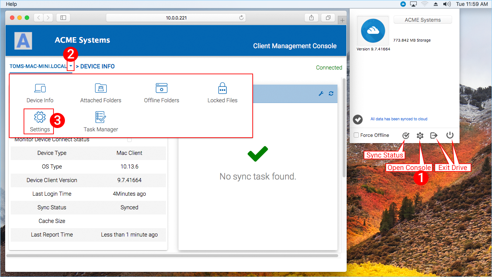
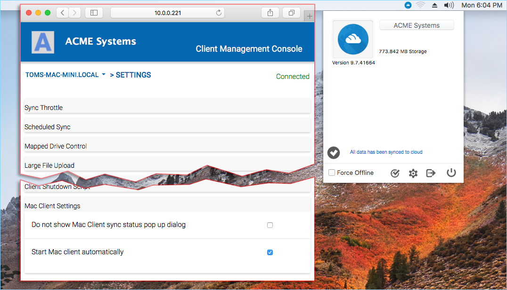

************
5 Settings
************

To access the Client Settings, click the Client Icon on the top-right of your Mac Desktop. This will open the Cloud Settings Panel. Clicking the **Console (1)** icon will open the "Client Management Console" window where the user can configure additional settings. In the Console window, click the drop-down menu **(2)** and choose **"Settings" (3)**.

There are many settings in this panel. Here are some specifically for the Mac Client.

**Start Mac client automatically** - When this option is checked the user will be automatically authenticated to the cloud volume upon system restarts.

**Do not show Mac Client sync status pop up dialog** - There will be times when users do not want to see the sync progress windows which can be suppressed by selecting this opt ion.

